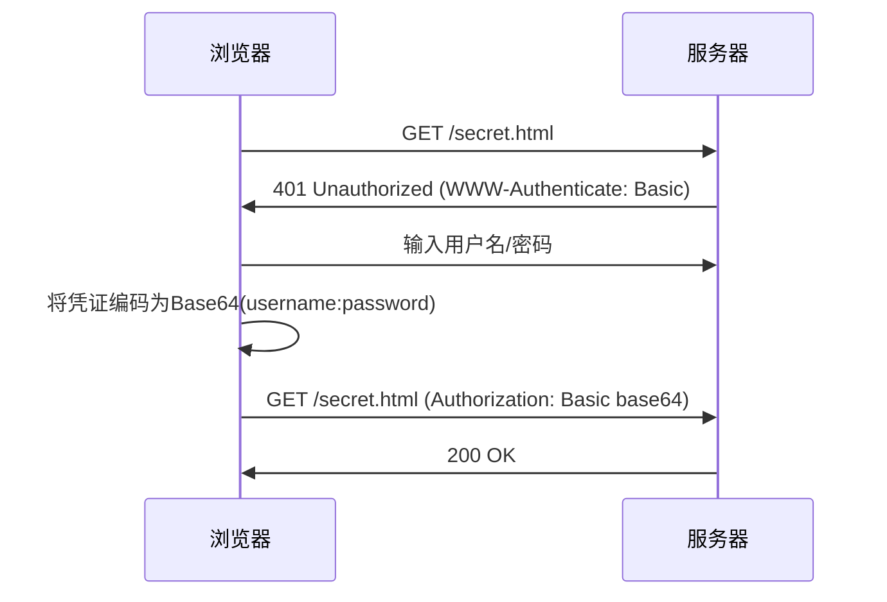
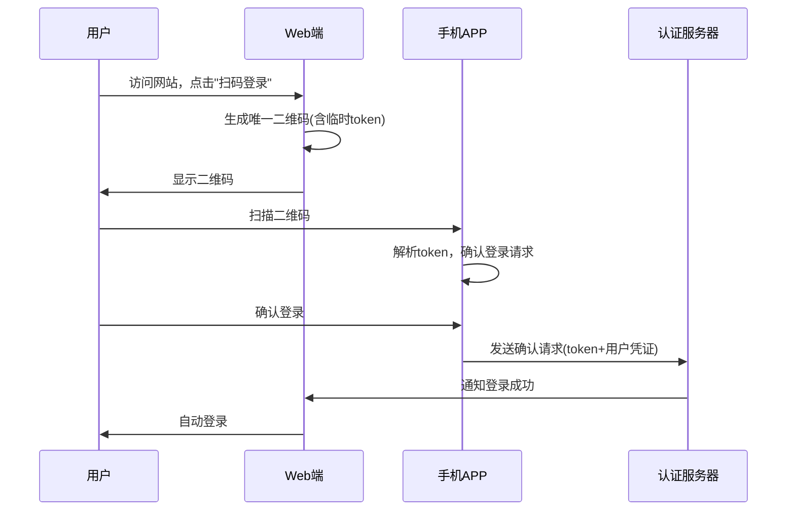
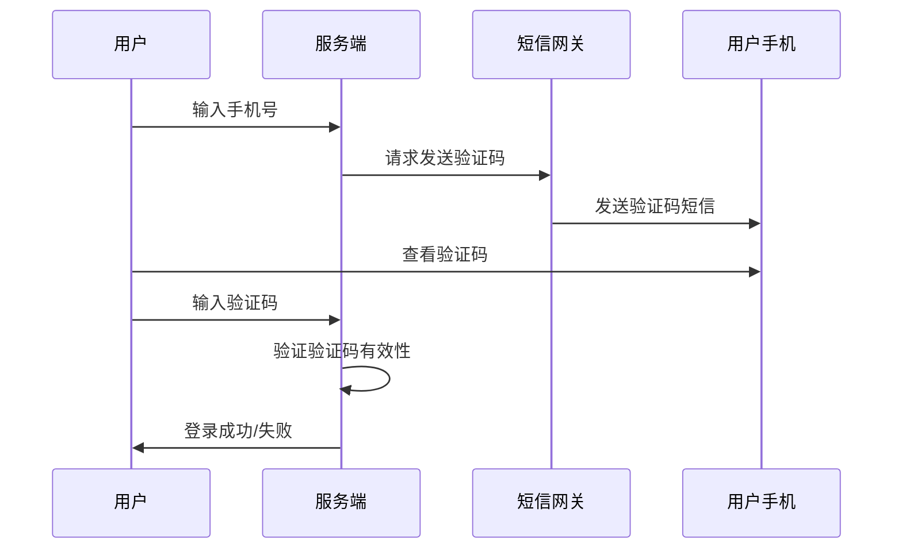
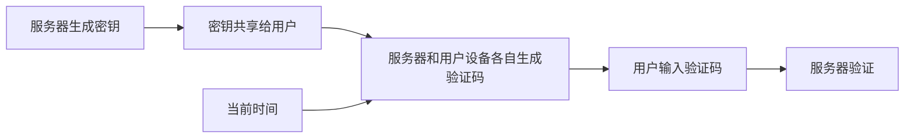

@[TOC]

本文将带您系统梳理Web服务认证技术的发展历程。从早期互联网的简单认证机制，到现代微服务架构下的复杂认证体系，理解这些技术的演进逻辑，有助于我们在实际项目中选择最适合的认证方案。让我们一起探索这段技术发展史，了解每种技术的诞生背景、工作原理、优缺点及适用场景。

## 1. 基础认证：互联网的"婴儿期"（1990s）

### 1.1 为什么需要认证？

随着互联网从学术研究走向商业应用，保护敏感资源的需求应运而生。早期的HTTP协议是无状态的，如何在开放网络中区分合法用户成为首要问题。

> 💡 **核心挑战**：如何在无状态协议上实现基础身份验证？

### 1.2 HTTP Basic Authentication：最原始的解决方案

**历史背景**：
1996年，HTTP/1.0规范（RFC 1945）首次引入认证机制。当时互联网安全需求简单——只需区分"内部人"和"外部人"。

**技术原理**：



**关键说明**：
1. **Base64不是加密**：仅用于编码避免特殊字符问题，Base64字符串可轻易解码
2. **严重安全缺陷**：凭证如同明文传输（Base64可逆）
3. **现实应用**：仅限HTTPS环境下的内部系统（如Kubernetes Dashboard）

**技术评价**：
- ✅ 优势：实现极其简单（浏览器自动处理）
- ❌ 劣势：无安全保障，易受中间人攻击
- 🌐 适用场景：HTTPS保护下的临时内部系统（已基本淘汰）

> 💡 **最佳实践**：若必须使用Basic认证，务必配合HTTPS + 短有效期令牌 + IP白名单

### 1.3 HTTP Digest Authentication：改进的安全机制

**演进动机**：
Basic认证暴露问题后，1999年RFC 2617推出Digest认证，核心目标：**避免密码在网络传输**。

**工作原理**：

1. 服务器生成随机数 `nonce="dcd98b7102dd2f0e8b11d0f600bfb0c093"
2. 客户端计算：`HA1 = MD5(username:realm:password)`
3. 再计算：`HA2 = MD5(method:uri)`
4. 最终响应：`response = MD5(HA1:nonce:HA2)`

**技术要点**：
- 服务器存储的是HA1值而非明文密码
- 每次请求使用不同nonce防止重放攻击
- MD5算法选择受当时技术限制（SHA-1尚未普及）

**技术评价**：
- ✅ 优势：密码不直接传输，比Basic安全
- ❌ 劣势：仍易受中间人攻击；MD5已不安全；无法防御重放攻击
- 🌐 适用场景：遗留系统迁移过渡期（现代系统已淘汰）

> 💡 **历史启示**：安全机制需考虑全面威胁模型，Digest解决传输问题却引入新漏洞——这正是技术持续演进的驱动力

## 2. 会话管理时代：Web应用的"青春期"（2000s）

### 2.1 为什么需要会话管理？

随着动态网站兴起（论坛、电商），应用需要保持用户状态（如购物车），而HTTP的无状态特性与之矛盾。

> 💡 **核心矛盾**：无状态协议 vs 有状态应用需求

### 2.2 Session/Cookie认证：状态管理的革命

**技术原理**：
```
┌─────────────┐     ┌──────────────────┐     ┌─────────────┐
│   浏览器     │     │  应用服务器      │     │   数据库存储  │
│  (Cookie)   │◀───▶│  (Session内存)   │◀───▶│  (用户信息)  │
└─────────────┘     └──────────────────┘     └─────────────┘
```

**关键演进**：
1. **登录流程**：验证成功 → 生成唯一Session ID → 通过Cookie自动携带
2. **存储演进**：
   - 初期：Session存服务器内存 → 单点故障
   - 进阶：Redis集中存储 → 支撑高并发场景
   - 现代：加密Cookie + HttpOnly属性 → 防XSS攻击
3. **安全增强**：会话超时（15分钟无操作失效）

**技术评价**：
- ✅ 优势：用户体验好（一次登录全程有效）；服务器完全控制会话
- ❌ 劣势：分布式系统需共享存储；易受CSRF攻击；扩展性受限
- 🌐 适用场景：传统单体Web应用（如银行网银、ERP系统）

> 💡 **最佳实践**：
> - 设置Cookie的`Secure`和`HttpOnly`属性
> - 实现CSRF令牌机制
> - 会话ID使用高强度随机数生成

## 3. 企业级单点登录：互联网的"成年礼"（2000s末-2010s初）

### 3.1 为什么需要单点登录？

企业应用激增导致：
- 用户需记忆多套密码
- IT部门维护多套用户库
- 安全风险分散

> 💡 **核心需求**：统一身份管理 + 跨系统无缝访问

### 3.2 SAML：企业级认证的标准化协议

**核心思想**：
> 委托权威身份提供商（IdP）统一管理身份，服务提供商（SP）信任IdP的认证结果

**认证流程**：
1. 用户访问CRM系统（SP）
2. SP重定向到IdP（如Active Directory）
3. 用户输入唯一密码登录IdP
4. IdP生成SAML断言（XML格式）
5. SP验证断言 → 授予访问权限

**技术要点**：
- **XML选择原因**：企业系统当时偏好XML（JSON尚未普及）
- **防篡改机制**：IdP用私钥签名，SP用公钥验证
- **断言内容**：包含用户身份、属性及授权信息

**技术评价**：
- ✅ 优势：真正的单点登录；企业级安全；支持复杂身份映射
- ❌ 劣势：XML解析开销大；移动端适配差；实施复杂度高
- 🌐 适用场景：企业应用集成（如Office 365 + Salesforce）

> 💡 **历史转折**：2010年智能手机爆发，SAML因移动端适配问题逐渐被更轻量的协议取代

## 4. 授权框架革命：移动互联网的"引擎"（2010s）

### 4.1 为什么需要OAuth？

新场景：用户希望用社交媒体账号登录第三方应用，但不愿共享密码。

> 💡 **核心需求**：有限授权（不是给密码，而是给"访问令牌"）

### 4.2 OAuth 2.0：授权的"瑞士军刀"

**设计哲学**：
> 分离认证与授权！
> - **认证**（你是谁）：由身份提供商处理
> - **授权**（你能做什么）：由OAuth管理

**主流授权模式对比**：
| 模式 | 适用场景 | 安全特点 | 现实案例 |
|------|----------|----------|----------|
| **Authorization Code** | 服务器应用 | 最安全，强制PKCE | 网站用Google登录 |
| **Authorization Code PKCE** | 移动/SPA应用 | 防止授权码截获 | 微信小程序登录 |
| **Client Credentials** | 服务间通信 | 无用户上下文 | 微服务API调用 |

**关键演进**：
- **PKCE的重要性**：移动应用必须使用，防止授权码在重定向过程中被截获
- **废弃模式**：Implicit模式因安全风险已不推荐使用（RFC 8252）
- **令牌管理**：短期访问令牌 + 长期刷新令牌机制

**技术评价**：
- ✅ 优势：解耦认证授权；生态系统完善；适合开放平台
- ❌ 劣势：依赖HTTPS；令牌泄露风险；配置复杂
- 🌐 适用场景：第三方登录、API授权、微服务安全通信

> 💡 **深度思考**：当你用微信登录知乎时，微信通过`scope`参数精确控制知乎可获取的数据范围（如仅头像和昵称）

## 5. 无状态认证时代：微服务的"心脏"（2010s中期至今）

### 5.1 为什么需要无状态认证？

微服务架构带来新挑战：
- Session集中存储成为瓶颈
- 服务间调用需传递认证信息
- 需要跨服务边界的身份传递

> 💡 **核心需求**：自包含、可验证、无状态的认证机制

### 5.2 JWT：认证领域的"标准化令牌"

**核心创新**：
> 将认证信息打包成自包含令牌，像集装箱一样在服务间传递

**令牌结构**：
```
header.payload.signature
```
- **Header**：`{ "alg": "HS256", "typ": "JWT" }`
- **Payload**：`{ "sub": "123", "name": "John", "exp": 1516239022 }`
- **Signature**：`HMACSHA256(base64UrlEncode(header)+'.'+base64UrlEncode(payload), secret)`

**安全实践**：
- **短期有效期**：典型15-30分钟，降低泄露风险
- **刷新令牌**：独立于访问令牌的长期凭证（需安全存储）
- **密钥管理**：HS256适合服务间，RS256适合开放场景
- **敏感数据**：避免在payload存储密码等敏感信息

**技术评价**：
- ✅ 优势：无状态；天然支持分布式；扩展性强
- ❌ 劣势：无法主动失效；令牌泄露风险；需谨慎管理密钥
- 🌐 适用场景：RESTful API、单页应用、微服务架构

## 5.3 Redis+Token：中国互联网实践中的JWT优化方案

**为什么需要这种方案？**
标准JWT的"无法主动失效"特性在实际业务中带来挑战：

- 用户退出登录后令牌仍有效（直到过期）
- 无法强制使特定用户会话失效（如账号被盗）
- 长期令牌增加泄露风险

**技术原理**：
```
┌─────────────┐     ┌──────────────────┐     ┌─────────────┐
│   客户端      │     │  应用服务器      │     │   Redis存储  │
│  (Token)    │◀───▶│  (验证令牌)      │◀───▶│  (jti:用户ID)│
└─────────────┘     └──────────────────┘     └─────────────┘
```

**关键实现步骤**：
1. **令牌生成**：
   ```shell
   # 生成标准JWT，但payload中仅包含jti（令牌ID）
   SETEX auth:jti:abc123 1800 user:123  # 30分钟有效期
   ```
2. **请求验证**：
   - 验证JWT签名有效性
   - 查询Redis确认`auth:jti:abc123`是否存在
3. **主动失效**：
   ```shell
   DEL auth:jti:abc123  # 立即使令牌失效
   ```

**技术优势**：
- ✅ 保留JWT无状态优势，适合分布式系统
- ✅ 解决标准JWT无法主动失效的核心缺陷
- ✅ 比Session方案更适合API场景（移动端友好）
- ✅ Redis高性能支撑高并发验证请求

**典型应用场景**：
- 金融类APP的敏感操作认证（需即时登出）
- 社交平台的多端登录管理
- 企业级SaaS系统的租户会话控制

> 💡 **最佳实践**：
> - 使用Redis的`SETEX`命令设置与令牌匹配的TTL
> - 令牌ID(jti)建议采用UUIDv4格式
> - 退出登录时执行`DEL`而非仅设置短TTL
> - 高并发场景使用Redis集群分片存储会话

## 5.4 现代便捷登录方式：扫码与短信验证

**为什么需要这些方式？**
移动互联网的普及带来新的用户场景：
- 用户拥有多个设备（手机、平板、电脑）
- 传统密码记忆困难，输入不便
- 需要更快速、更便捷的登录体验

> 💡 **核心需求**：跨设备无缝登录 + 用户体验优化

**技术原理**：

### 扫码登录


### 短信验证码登录


**关键实现**：
- **扫码登录**：
  1. Web端生成临时token并创建二维码
  2. 手机APP扫描后，通过长连接或轮询确认用户操作
  3. 确认后，服务端建立用户会话

- **短信验证码登录**：
  1. 服务端生成随机验证码(通常4-6位)
  2. 通过短信网关发送验证码
  3. 服务端存储验证码(通常使用Redis，设置短TTL)
  4. 验证用户输入的验证码
  ```shell
  # 使用Redis存储短信验证码示例
  SETEX auth:sms:13800138000 300 123456  # 5分钟有效期
  ```

**技术评价**：
- ✅ 优势：用户体验好（无需记忆密码）；适合移动端场景；降低密码泄露风险
- ❌ 劣势：依赖手机网络；短信验证存在被拦截风险；扫码登录需要用户有手机
- 🌐 适用场景：消费级APP、社交平台、电商网站

> 💡 **最佳实践**：
> - 短信验证码设置短有效期（通常5-10分钟）
> - 限制短信发送频率（如1分钟内只能发送1次）
> - 扫码登录的token应设置短有效期并一次性使用
> - 实现备用登录方式（如密码登录）以防主要方式失效

## 5.5 多因素认证：安全与便利的平衡

**为什么需要MFA？**
随着网络攻击日益复杂：
- 单一密码安全性不足（易猜测、易泄露）
- 数据泄露事件频发
- 高价值账户需要更强保护

> 💡 **核心需求**：提升账户安全性，同时保持合理用户体验

**认证因素分类**：
1. **知识因素**：用户知道的内容（密码、PIN码）
2. **拥有因素**：用户拥有的物品（手机、安全令牌）
3. **固有因素**：用户固有的特征（指纹、面部识别）

**主流MFA实现方式**：
| 方式 | 说明 | 安全性 | 用户体验 |
|------|------|--------|----------|
| **短信验证码** | 通过手机短信发送一次性验证码 | 中 | 良好 |
| **认证器应用** | Google Authenticator等生成TOTP码 | 高 | 良好 |
| **生物识别** | 指纹、面部识别等 | 高 | 优秀 |
| **安全密钥** | 物理安全密钥（如YubiKey） | 极高 | 一般 |

**技术原理**：

### TOTP（基于时间的一次性密码）工作流程


**关键实现**：
- **服务端**：
  1. 为用户生成唯一密钥（通常使用Base32编码）
  2. 存储密钥（加密存储）
  3. 验证用户提供的OTP

- **客户端**：
  1. 使用密钥和当前时间生成OTP
  2. 每30秒更新一次验证码

**技术评价**：
- ✅ 优势：大幅提高账户安全性；防止密码泄露导致的账户被盗
- ❌ 劣势：增加登录步骤；依赖额外设备；可能影响用户体验
- 🌐 适用场景：金融系统、企业管理系统、高价值账户

> 💡 **最佳实践**：
> - 实施分级认证：高风险操作要求MFA，低风险操作可简化
> - 提供多种MFA选项，适应不同用户需求
> - 实现恢复机制（备用码、客服验证等）
> - 对于企业应用，考虑使用FIDO2/WebAuthn标准

## 5.3 OpenID Connect：认证的"标准化实现"

**为什么需要它？**
OAuth 2.0仅解决授权，但应用还需确认用户身份。

**核心组件**：
- **ID Token**：JWT格式的身份声明（谁登录了）
- **UserInfo Endpoint**：`GET /userinfo` 获取标准化用户信息
- **标准化Claims**：预定义字段（email, name, picture...）

**协议栈**：
```
+---------------------+
|  OpenID Connect     | ← 提供ID Token（用户身份）
+---------------------+
|  OAuth 2.0          | ← 提供Access Token（资源访问）
+---------------------+
|  HTTP/HTTPS         |
+---------------------+
```

**技术评价**：
- ✅ 优势：统一认证标准；兼容OAuth生态；支持多种客户端
- ❌ 劣势：实现复杂度高；需理解OAuth基础
- 🌐 适用场景：现代应用统一认证中心（如Auth0、Keycloak）

> 💡 **关键区别**：ID Token用于**认证**（确认用户身份），Access Token用于**授权**（访问资源）

## 6. 技术演进全景图：理解发展的逻辑

### 6.1 发展驱动力

| 阶段 | 核心问题 | 技术方案 | 成功原因 |
|------|----------|----------|--------------|
| **基础认证** | 原始身份验证 | HTTP Basic/Digest | 解决"0到1"问题 |
| **会话管理** | 保持用户状态 | Session/Cookie | 匹配Web 1.0需求 |
| **企业集成** | 跨系统单点登录 | SAML | 满足企业级安全 |
| **开放授权** | 第三方有限授权 | OAuth 2.0 | 适应开放平台生态 |
| **无状态化** | 微服务认证瓶颈 | JWT/OIDC | 匹配云原生架构 |

### 6.2 技术选型指南

**三步决策法**：

1. **安全需求评估**：
   - 低风险内部系统 → Session/Cookie
   - 高安全要求 → SAML/OIDC
   - 开放平台 → OAuth 2.0 + PKCE

2. **架构类型匹配**：
   - 单体应用 → Session/Cookie
   - 微服务 → JWT/OIDC
   - 企业集成 → SAML
   - 第三方登录 → OAuth 2.0

3. **用户场景适配**：
   - 企业内网 → SAML
   - 消费级APP → OAuth 2.0 + PKCE
   - API网关 → JWT

### 6.3 未来趋势

**前沿方向**：

- **零信任架构**：永不信任，持续验证（Google BeyondCorp）
- **无密码认证**：FIDO2/WebAuthn（生物识别替代密码）
- **去中心化身份**：区块链+DID（用户掌控身份数据）

> 🌟 **结语**：
> Web认证技术的演进史，本质上是安全与便利的平衡史。理解技术发展的历史脉络，才能在实际项目中做出明智选择。没有"最好"的方案，只有"最合适"的方案——这正是技术选型的核心智慧.