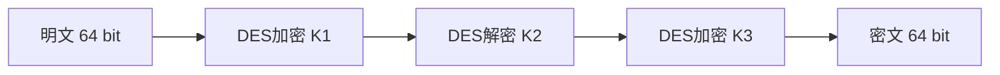

# 3DES对称加解密算法

## 1. 算法概述

**3DES**（Triple DES，三重数据加密算法），也称为 **TDEA**（Triple Data Encryption Algorithm），是一种对称密钥加密块密码，相当于对每个数据块应用三次DES算法。
> 由于计算机运算能力的增强，原版DES算法因为密钥长度过低容易被暴力破解。3DES通过增加DES密钥长度来避免类似的攻击，它并不是一种全新的块密码算法。

3DES 于 1998 年被纳入 ANSI X9.52 标准，后由 NIST 在 SP 800-67 中正式规范。它作为 DES 到 AES 的过渡算法，在金融领域仍有广泛使用。

### 1.1 基本参数

| 参数 | 值 |
|------|-----|
| 算法类型 | 对称分组加密 |
| 明文分组长度 | 64 位（8 字节） |
| 密钥长度 | 112 位或 168 位（有效位） |
| 密文分组长度 | 64 位（8 字节） |
| 加密轮数 | 48 轮（3 × 16 轮 DES） |
| 结构 | Feistel 结构（三重应用） |

### 1.2 设计动机

- DES 的 56 位密钥已无法抵御暴力破解
- 需要一种向后兼容 DES 的增强方案
- 在 AES 标准确定之前提供过渡性安全保障
- 充分利用现有 DES 硬件设施

## 2. 算法原理

### 2.1 加密-解密-加密（EDE）模式
3DES使用“密钥包”，其中包含3个DES密钥，K1、K2、K3，均为56位（有效位数）。

3DES 采用 **EDE**（Encrypt-Decrypt-Encrypt）的三步操作：
加密算法为：
```
    密文 = Ek3( Dk2( Ek1(明文) ) )
```
也就是说，先使用K1为密钥对明文进行DES加密，再使用K2为密钥进行DES“解密”，最后使用K3为密钥进行DES加密。

解密则为其反过程：
```
    明文 = Dk1( Ek2( Dk3(密文) ) )
```

流程：


### 2.2 为什么使用 EDE 而非 EEE？

采用"加密-解密-加密"顺序而非"加密-加密-加密"的原因：

1. **向后兼容性**：当 K1 = K2 = K3 时，EDE 等价于单次 DES 加密
2. **互操作性**：便于与只支持 DES 的系统通信
3. **安全性等价**：EDE 与 EEE 在密码学安全性上没有差异

### 2.3 密钥选项

3DES 定义了三种密钥选项：

| 选项 | 密钥关系 | 有效密钥长度 | 安全强度 |
|------|----------|-------------|----------|
| Keying Option 1 | K1 ≠ K2 ≠ K3（三个独立密钥） | 168 位 | 112 位 |
| Keying Option 2 | K1 ≠ K2，K3 = K1（两个独立密钥） | 112 位 | 80 位 |
| Keying Option 3 | K1 = K2 = K3（退化为 DES） | 56 位 | 56 位 |

> **注意**：由于中间相遇攻击（Meet-in-the-Middle Attack），Option 1 的实际安全强度为 112 位而非 168 位。

### 2.4 中间相遇攻击原理

```
P ──E_K1──> X ──D_K2──> Y ──E_K3──> C

攻击者可以：
1. 对所有可能的 K1，计算 E_K1(P) 并存储
2. 对所有可能的 (K2, K3)，计算 D_K3(D_K2(C))（即 E 的逆）
3. 寻找碰撞点

实际复杂度：约 2^112 而非 2^168
```

## 3. 安全性分析

### 3.1 安全强度评估

| 密钥选项 | 暴力攻击复杂度 | 实际安全强度 | NIST 评级 |
|----------|---------------|-------------|-----------|
| Option 1 | 2¹⁶⁸ | ~2¹¹² | 已弃用（2023年后） |
| Option 2 | 2¹¹² | ~2⁸⁰ | 不推荐 |
| Option 3 | 2⁵⁶ | 2⁵⁶ | 禁止使用 |

### 3.2 已知攻击

| 攻击方法 | 复杂度 | 备注 |
|----------|--------|------|
| 中间相遇攻击 | 2¹¹² | 将 168 位安全性降至 112 位 |
| Sweet32 攻击 | 2³² 块数据 | 利用 64 位块的生日碰撞 |
| 相关密钥攻击 | 实用性有限 | 需特定条件 |

### 3.3 Sweet32 攻击（Birthday Attack on Block Size）

由于 3DES 的分组大小仅为 64 位，在 CBC 模式下：

- 加密约 2³² 个块（约 32 GB 数据）后，发生块碰撞的概率超过 50%
- 攻击者可利用碰撞恢复明文信息
- 2016 年由 Bhargavan 和 Leurent 提出

> **🚨 Sweet32 影响**
>
> 对于长连接或大量数据加密场景，3DES-CBC 存在实际安全风险。建议在同一密钥下加密的数据量不超过 2²⁰ 个块（约 8 MB）。

### 3.4 退役时间线

- **2017年**：NIST SP 800-131A Rev.2 将 3DES 标记为"已弃用"
- **2023年**：NIST 建议在所有新应用中禁止使用 3DES
- **2024年后**：逐步从所有系统中移除

## 4. Go 语言实现

```go
package main

import (
	"crypto/cipher"
	"crypto/des"
	"crypto/rand"
	"encoding/hex"
	"fmt"
	"io"
)

// PKCS5Padding 填充
func PKCS5Padding(data []byte, blockSize int) []byte {
	padding := blockSize - len(data)%blockSize
	padText := make([]byte, padding)
	for i := range padText {
		padText[i] = byte(padding)
	}
	return append(data, padText...)
}

// PKCS5Unpadding 去除填充
func PKCS5Unpadding(data []byte) []byte {
	padding := int(data[len(data)-1])
	return data[:len(data)-padding]
}

// 3DES-CBC 加密
func TripleDesEncrypt(plaintext, key []byte) ([]byte, error) {
	// 3DES 密钥长度必须为 24 字节
	block, err := des.NewTripleDESCipher(key)
	if err != nil {
		return nil, err
	}

	plaintext = PKCS5Padding(plaintext, block.BlockSize())

	// 生成随机 IV
	ciphertext := make([]byte, des.BlockSize+len(plaintext))
	iv := ciphertext[:des.BlockSize]
	if _, err := io.ReadFull(rand.Reader, iv); err != nil {
		return nil, err
	}

	mode := cipher.NewCBCEncrypter(block, iv)
	mode.CryptBlocks(ciphertext[des.BlockSize:], plaintext)

	return ciphertext, nil
}

// 3DES-CBC 解密
func TripleDesDecrypt(ciphertext, key []byte) ([]byte, error) {
	block, err := des.NewTripleDESCipher(key)
	if err != nil {
		return nil, err
	}

	iv := ciphertext[:des.BlockSize]
	ciphertext = ciphertext[des.BlockSize:]

	mode := cipher.NewCBCDecrypter(block, iv)
	mode.CryptBlocks(ciphertext, ciphertext)

	return PKCS5Unpadding(ciphertext), nil
}

func main() {
	// 3DES 密钥为 24 字节（Keying Option 1：三个独立 8 字节密钥）
	key := []byte("123456781234567812345678")
	plaintext := []byte("Hello, 3DES Encryption!")

	fmt.Printf("明文: %s\n", plaintext)

	encrypted, err := TripleDesEncrypt(plaintext, key)
	if err != nil {
		panic(err)
	}
	fmt.Printf("密文(hex): %s\n", hex.EncodeToString(encrypted))

	decrypted, err := TripleDesDecrypt(encrypted, key)
	if err != nil {
		panic(err)
	}
	fmt.Printf("解密: %s\n", decrypted)
}
```

## 5. 与 DES 和 AES 的对比

| 特性 | DES | 3DES | AES |
|------|-----|------|-----|
| 密钥长度 | 56 位 | 112/168 位 | 128/192/256 位 |
| 分组大小 | 64 位 | 64 位 | 128 位 |
| 加密速度 | 快 | 慢（DES 的 1/3） | 快 |
| 安全性 | 已破解 | 逐步淘汰中 | 当前安全 |
| 标准状态 | 已撤销 | 已弃用 | 现行标准 |
| 硬件支持 | 广泛 | 广泛 | 原生指令集（AES-NI） |

## 6. 实际应用与现状

### 6.1 仍在使用的场景

- **金融支付**：EMV 芯片卡（逐步迁移至 AES）
- **银行系统**：ATM 通信和 PIN 加密（遗留系统）
- **PCI DSS**：部分合规系统仍允许 3DES（但推荐迁移）

### 6.2 迁移建议

> **⚠️ 迁移提醒**
>
> NIST 已明确要求在 2023 年后不再使用 3DES。所有新系统应直接采用 AES-128 或更高版本。

**迁移策略**：

1. **评估现有系统**：盘点使用 3DES 的所有组件
2. **制定迁移计划**：按风险等级排序迁移优先级
3. **选择替代算法**：通常为 AES-256-GCM
4. **兼容过渡期**：支持新旧算法并行
5. **完全切换**：移除所有 3DES 依赖

## 7. 总结

| 维度 | 评价 |
|------|------|
| 历史意义 | ⭐⭐⭐⭐ DES 到 AES 的重要过渡方案 |
| 安全性 | ⚠️ 仍有一定安全性，但已不满足现代需求 |
| 性能 | ⭐⭐ 速度仅为 DES 的 1/3，远不如 AES |
| 现代适用性 | ⚠️ 仅用于维护遗留系统，新系统禁止使用 |

3DES 是密码学史上重要的过渡性方案——它在 DES 密钥长度不足的问题暴露后，以最小的改动成本提供了可接受的安全增强。但在 AES 已经广泛部署的今天，3DES 应逐步退出历史舞台。
