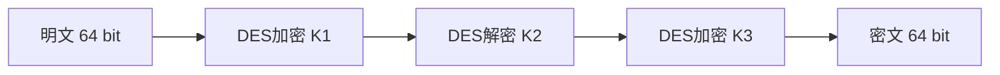

# 3DES对称加解密算法

## 1. 算法概述

**3DES**（Triple DES，三重数据加密算法），也称为 **TDEA**（Triple Data Encryption Algorithm），是一种对称密钥加密块密码，相当于对每个数据块应用三次DES算法。

> 由于计算机运算能力的增强，原版DES算法因为密钥长度过低容易被暴力破解。3DES通过增加DES密钥长度来避免类似的攻击，它并不是一种全新的块密码算法。

3DES 于 1998 年被纳入 ANSI X9.52 标准，后由 NIST 在 SP 800-67 中正式规范。它作为 DES 到 AES 的过渡算法，在金融领域仍有部分使用。

> **⚠️ 安全警告：NIST 已于 2023 年明确要求在所有新应用中禁止使用 3DES。** 如果你的系统仍在使用 3DES，应尽快迁移到 AES。

### 1.1 基本参数

| 参数 | 值 |
|------|-----|
| 算法类型 | 对称分组加密 |
| 明文分组长度 | 64 位（8 字节） |
| 密钥长度 | 112 位或 168 位（有效位） |
| 密文分组长度 | 64 位（8 字节） |
| 加密轮数 | 48 轮（3 × 16 轮 DES） |
| 安全状态 | ⚠️ **已弃用，仅维护遗留系统** |

## 2. 算法原理（简述）

### 2.1 加密-解密-加密（EDE）模式

3DES使用"密钥包"，其中包含3个DES密钥（K1、K2、K3），采用 **EDE**（Encrypt-Decrypt-Encrypt）三步操作：

```
加密：密文 = E_K3( D_K2( E_K1(明文) ) )
解密：明文 = D_K1( E_K2( D_K3(密文) ) )
```



**为什么是 EDE 而非 EEE？**

采用"加密-解密-加密"顺序是为了**向后兼容**：当 K1 = K2 = K3 时，EDE 等价于单次 DES 加密，便于与只支持 DES 的旧系统互通。安全性上 EDE 与 EEE 没有差异。

### 2.2 密钥选项

| 选项 | 密钥关系 | 有效密钥长度 | 实际安全强度 | 开发建议 |
|------|----------|-------------|-------------|----------|
| Keying Option 1 | K1 ≠ K2 ≠ K3 | 168 位 | 112 位 | 如必须使用，选此项 |
| Keying Option 2 | K1 ≠ K2，K3 = K1 | 112 位 | 80 位 | 不推荐 |
| Keying Option 3 | K1 = K2 = K3 | 56 位 | 56 位 | ❌ 禁止（退化为 DES） |

> **注意**：由于中间相遇攻击（Meet-in-the-Middle Attack），Option 1 的实际安全强度为 112 位而非 168 位。

## 3. 安全性分析

### 3.1 已知攻击

| 攻击方法 | 复杂度 | 影响 |
|----------|--------|------|
| 中间相遇攻击 | 2¹¹² | 将 168 位安全性降至 112 位 |
| Sweet32 攻击 | 2³² 块数据（~32GB） | 64 位块的生日碰撞，可恢复明文 |
| 暴力攻击 | 2¹¹² | 当前不可行，但安全余量不足 |

### 3.2 Sweet32 攻击（最实际的威胁）

由于 3DES 的分组大小仅为 64 位，在 CBC 模式下加密约 32 GB 数据后，就会发生块碰撞，攻击者可利用碰撞恢复明文。

**对开发者的影响**：

- 同一密钥下加密数据不应超过 **8 MB**（保守值）
- 长连接场景（如 TLS）需要频繁更换密钥
- 这是推动 3DES 退役的直接原因之一

### 3.3 退役时间线

| 时间 | 事件 |
|------|------|
| 2017年 | NIST SP 800-131A Rev.2 将 3DES 标记为"已弃用" |
| 2023年 | NIST 建议所有新应用禁止使用 3DES |
| 2024年后 | 逐步从所有系统中移除 |

## 4. 开发者注意事项

### 4.1 何时会遇到 3DES

| 场景 | 说明 |
|------|------|
| 金融支付系统 | EMV 芯片卡、ATM 通信、PIN 加密（遗留） |
| PCI DSS 合规 | 部分旧系统仍允许但推荐迁移 |
| 银行接口对接 | 部分银行接口仍要求 3DES |
| 遗留数据库 | 旧数据可能用 3DES 加密存储 |

### 4.2 使用要点（维护遗留系统时）

| 要点 | 说明 |
|------|------|
| 密钥长度 | 必须 24 字节（3 × 8 字节），使用 Keying Option 1 |
| 工作模式 | 通常为 CBC，必须使用随机 IV |
| 填充方式 | PKCS5Padding（块大小为 8 字节） |
| 数据量限制 | 同一密钥下加密数据不超过 8 MB |
| 密钥轮换 | 频繁轮换密钥以降低 Sweet32 风险 |

### 4.3 迁移方案

```
推荐迁移路径：3DES → AES-256-GCM

迁移策略：
1. 评估现有系统：盘点使用 3DES 的所有组件
2. 制定迁移计划：按风险等级排序迁移优先级
3. 选择替代算法：通常为 AES-256-GCM
4. 兼容过渡期：支持新旧算法并行（通过数据头标识区分）
5. 完全切换：确认所有数据迁移完成后移除 3DES 代码
```

### 4.4 与 DES 和 AES 的对比

| 特性 | DES | 3DES | AES-256 |
|------|-----|------|---------|
| 密钥长度 | 56 位 | 112/168 位 | 256 位 |
| 分组大小 | 64 位 | 64 位 | 128 位 |
| 加密速度 | 快 | 慢（DES 的 1/3） | 快（有 AES-NI） |
| 安全性 | ❌ 已破解 | ⚠️ 逐步淘汰中 | ✅ 当前安全 |
| Sweet32 风险 | 有 | 有 | 无（128位块） |
| 标准状态 | 已撤销 | 已弃用 | 现行标准 |

## 5. Go 语言实现（仅供遗留系统参考）

> ⚠️ 以下代码仅用于处理遗留系统数据，新项目请直接使用 AES-GCM。

```go
package main

import (
	"crypto/cipher"
	"crypto/des"
	"crypto/rand"
	"encoding/hex"
	"fmt"
	"io"
)

// PKCS5Padding 填充
func PKCS5Padding(data []byte, blockSize int) []byte {
	padding := blockSize - len(data)%blockSize
	padText := make([]byte, padding)
	for i := range padText {
		padText[i] = byte(padding)
	}
	return append(data, padText...)
}

// PKCS5Unpadding 去除填充
func PKCS5Unpadding(data []byte) []byte {
	padding := int(data[len(data)-1])
	return data[:len(data)-padding]
}

// 3DES-CBC 加密
func TripleDesEncrypt(plaintext, key []byte) ([]byte, error) {
	// 3DES 密钥长度必须为 24 字节
	block, err := des.NewTripleDESCipher(key)
	if err != nil {
		return nil, err
	}

	plaintext = PKCS5Padding(plaintext, block.BlockSize())

	// 生成随机 IV
	ciphertext := make([]byte, des.BlockSize+len(plaintext))
	iv := ciphertext[:des.BlockSize]
	if _, err := io.ReadFull(rand.Reader, iv); err != nil {
		return nil, err
	}

	mode := cipher.NewCBCEncrypter(block, iv)
	mode.CryptBlocks(ciphertext[des.BlockSize:], plaintext)

	return ciphertext, nil
}

// 3DES-CBC 解密
func TripleDesDecrypt(ciphertext, key []byte) ([]byte, error) {
	block, err := des.NewTripleDESCipher(key)
	if err != nil {
		return nil, err
	}

	iv := ciphertext[:des.BlockSize]
	ciphertext = ciphertext[des.BlockSize:]

	mode := cipher.NewCBCDecrypter(block, iv)
	mode.CryptBlocks(ciphertext, ciphertext)

	return PKCS5Unpadding(ciphertext), nil
}

func main() {
	// 3DES 密钥为 24 字节（Keying Option 1：三个独立 8 字节密钥）
	key := []byte("123456781234567812345678")
	plaintext := []byte("Hello, 3DES Encryption!")

	fmt.Printf("明文: %s\n", plaintext)

	encrypted, err := TripleDesEncrypt(plaintext, key)
	if err != nil {
		panic(err)
	}
	fmt.Printf("密文(hex): %s\n", hex.EncodeToString(encrypted))

	decrypted, err := TripleDesDecrypt(encrypted, key)
	if err != nil {
		panic(err)
	}
	fmt.Printf("解密: %s\n", decrypted)
}
```

## 6. 总结

| 维度 | 评价 |
|------|------|
| 安全性 | ⚠️ 仍有一定安全性，但已不满足现代需求 |
| 性能 | ⭐⭐ 速度仅为 DES 的 1/3，远不如 AES |
| 现代适用性 | ⚠️ 仅用于维护遗留系统，新系统禁止使用 |
| 开发者建议 | 遇到就迁移到 AES-256-GCM |

3DES 是密码学史上的过渡性方案。在 AES 已经广泛部署的今天，没有任何理由在新项目中使用 3DES。如果你正在维护使用 3DES 的遗留系统，迁移到 AES 应该是高优先级事项。
