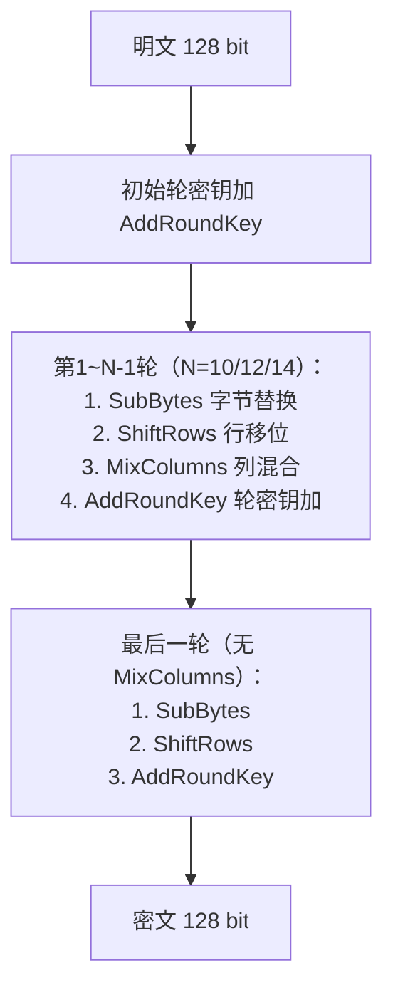

# AES对称加解密算法

## 1. 算法概述

**AES**（Advanced Encryption Standard，高级加密标准）是当今使用最广泛的对称加密算法。

它由比利时密码学家 Joan Daemen 和 Vincent Rijmen 设计，原名 **Rijndael**，于 2001 年被 NIST 选为新的加密标准（FIPS PUB 197），取代已不安全的 DES。

> AES 具备高安全性、高性能、实现灵活等特点，已成为全球范围内政府、金融、通信等领域的首选对称加密算法。对于开发者来说，**AES-256-GCM 是对称加密的默认选择**。

### 1.1 基本参数

| 参数 | 值 |
|------|-----|
| 算法类型 | 对称分组加密 |
| 明文分组长度 | 128 位（16 字节） |
| 密钥长度 | 128 / 192 / 256 位 |
| 密文分组长度 | 128 位（16 字节） |
| 加密轮数 | 10 / 12 / 14 轮（对应密钥长度） |
| 结构 | 代换-置换网络（SPN） |
| 安全状态 | ✅ **当前标准，推荐使用** |

### 1.2 标准化历程

- **1997年**：NIST 发起 AES 征集计划，要求取代 DES
- **2000年**：从 15 个候选算法中，Rijndael 最终胜出
- **2001年**：正式发布为 FIPS PUB 197
- **至今**：仍是最主流的对称加密标准，无实际可行的攻击

## 2. 算法原理（简述）

AES 基于**代换-置换网络（SPN）**结构，不同于 DES 的 Feistel 结构。

### 2.1 加密流程



### 2.2 核心操作

AES 将 128 位数据组织为 4×4 字节矩阵，每轮执行四种操作：

| 操作 | 作用 | 密码学意义 |
|------|------|-----------|
| **SubBytes** | 通过 S-盒对每字节做非线性替换 | 提供混淆（Confusion） |
| **ShiftRows** | 对矩阵每行做不同位移的循环左移 | 跨列扩散数据 |
| **MixColumns** | 对每列做 GF(2⁸) 上的矩阵乘法 | 提供扩散（Diffusion） |
| **AddRoundKey** | 与轮密钥做 XOR | 引入密钥材料 |

解密是加密的逆过程，使用对应的逆操作（InvSubBytes、InvShiftRows、InvMixColumns）。

> **开发者不需要关心这些细节**——所有主流语言的标准库都提供了 AES 实现。理解这些有助于明白为什么 AES 安全，但实际使用时调用标准 API 即可。

## 3. 安全性分析

### 3.1 安全强度

| 密钥长度 | 暴力破解复杂度 | 安全评级 | 推荐场景 |
|----------|---------------|----------|----------|
| AES-128 | 2¹²⁸ | 商用安全 | 通用场景 |
| AES-192 | 2¹⁹² | 高安全 | 较少使用 |
| AES-256 | 2²⁵⁶ | 抗量子（Grover 后仍有 2¹²⁸） | **推荐** |

### 3.2 当前攻击状态

| 攻击方法 | 适用版本 | 实用性 |
|----------|----------|--------|
| Biclique 攻击 | AES-128 → 2¹²⁶·¹ | ❌ 理论攻击，不实用 |
| 相关密钥攻击 | AES-192/256 | ❌ 需特殊条件，不实用 |
| 侧信道攻击 | 所有版本 | ⚠️ **实际威胁，但可防护** |

**结论**：AES 在数学层面无已知可行攻击。实际威胁来自**实现层面**（侧信道），而非算法本身。

### 3.3 AES 与量子计算

- Grover 算法将暴力搜索复杂度开平方
- AES-128 量子安全性降至 2⁶⁴（不够安全）
- AES-256 量子安全性仍有 2¹²⁸（足够安全）
- **建议**：新项目直接使用 AES-256

## 4. 开发者实践指南

### 4.1 工作模式选择

| 模式 | 推荐度 | 说明 |
|------|--------|------|
| **GCM** | ✅ 首选 | AEAD 模式，同时提供加密+认证，支持并行 |
| **CBC + HMAC** | ⚠️ 可用 | 需要额外做 MAC，注意先验证再解密 |
| **CTR** | ⚠️ 需搭配 MAC | 不提供完整性保护 |
| **ECB** | ❌ 禁止 | 相同明文块产生相同密文块，泄露模式信息 |

> **一条规则**：如果不确定选什么，就用 **AES-256-GCM**。

### 4.2 关键注意事项

| 事项 | 说明 |
|------|------|
| **Nonce/IV 不能重复** | GCM 模式下 nonce 重复会导致密钥流重复，安全性崩溃。每次加密必须使用唯一 nonce |
| **密钥生成** | 使用密码学安全随机数生成器（`crypto/rand`），不要用 `math/rand` |
| **密钥存储** | 不要硬编码在代码中，使用 KMS、Vault 或环境变量 |
| **密钥长度** | AES-128 = 16 字节，AES-192 = 24 字节，AES-256 = 32 字节 |
| **GCM nonce 长度** | 标准为 12 字节（96 位），不要自行修改 |
| **GCM 数据量限制** | 单个 nonce 下加密数据不超过 64 GB |
| **不要自己实现** | 使用语言标准库或经过审计的密码库 |

### 4.3 常见错误

```go
// ❌ 错误：使用固定 IV
iv := []byte("1234567890ab")

// ✅ 正确：使用随机 nonce
nonce := make([]byte, 12)
io.ReadFull(rand.Reader, nonce)

// ❌ 错误：使用 math/rand 生成密钥
key := make([]byte, 32)
mathRand.Read(key)

// ✅ 正确：使用 crypto/rand
key := make([]byte, 32)
crypto_rand.Read(key)

// ❌ 错误：ECB 模式
// Go 标准库不直接提供 ECB，如果你发现自己在手动逐块加密，可能在做 ECB

// ✅ 正确：GCM 模式（见下方完整示例）
```

### 4.4 硬件加速（AES-NI）

现代 CPU 提供 AES 专用指令集（Intel AES-NI / ARM AES Extension），无需开发者手动启用：

| 实现方式 | 吞吐量 |
|----------|--------|
| 纯软件实现 | ~300 MB/s |
| AES-NI 硬件加速 | ~4000+ MB/s |

Go 标准库的 `crypto/aes` 会自动检测并使用硬件加速，无需额外配置。

### 4.5 各语言 AES-GCM 使用要点

| 语言 | 标准库/推荐库 | 注意事项 |
|------|-------------|----------|
| Go | `crypto/aes` + `crypto/cipher` | 自动硬件加速 |
| Java | `javax.crypto` (Cipher) | 指定 `AES/GCM/NoPadding` |
| Python | `cryptography` 库 | 不要用 `pycrypto`（已废弃） |
| Node.js | `crypto` 模块 | `createCipheriv('aes-256-gcm', ...)` |
| Rust | `aes-gcm` crate | 编译时自动检测硬件加速 |
| C/C++ | OpenSSL / libsodium | libsodium 接口更安全易用 |

## 5. Go 语言实现（AES-GCM，推荐）

```go
package main

import (
	"crypto/aes"
	"crypto/cipher"
	"crypto/rand"
	"encoding/hex"
	"fmt"
	"io"
)

// AES-GCM 加密
func AesGcmEncrypt(plaintext, key []byte) ([]byte, error) {
	block, err := aes.NewCipher(key)
	if err != nil {
		return nil, err
	}

	aesGCM, err := cipher.NewGCM(block)
	if err != nil {
		return nil, err
	}

	// 生成随机 nonce（12 字节）
	nonce := make([]byte, aesGCM.NonceSize())
	if _, err := io.ReadFull(rand.Reader, nonce); err != nil {
		return nil, err
	}

	// 加密并附加认证标签，nonce 放在密文前面
	ciphertext := aesGCM.Seal(nonce, nonce, plaintext, nil)
	return ciphertext, nil
}

// AES-GCM 解密
func AesGcmDecrypt(ciphertext, key []byte) ([]byte, error) {
	block, err := aes.NewCipher(key)
	if err != nil {
		return nil, err
	}

	aesGCM, err := cipher.NewGCM(block)
	if err != nil {
		return nil, err
	}

	nonceSize := aesGCM.NonceSize()
	if len(ciphertext) < nonceSize {
		return nil, fmt.Errorf("ciphertext too short")
	}

	nonce, ciphertext := ciphertext[:nonceSize], ciphertext[nonceSize:]

	plaintext, err := aesGCM.Open(nil, nonce, ciphertext, nil)
	if err != nil {
		return nil, err // 认证失败（数据被篡改）
	}

	return plaintext, nil
}

func main() {
	// AES-256 密钥为 32 字节
	key := make([]byte, 32)
	if _, err := rand.Read(key); err != nil {
		panic(err)
	}

	plaintext := []byte("Hello, AES-GCM Encryption!")
	fmt.Printf("明文: %s\n", plaintext)
	fmt.Printf("密钥(hex): %s\n", hex.EncodeToString(key))

	// 加密
	encrypted, err := AesGcmEncrypt(plaintext, key)
	if err != nil {
		panic(err)
	}
	fmt.Printf("密文(hex): %s\n", hex.EncodeToString(encrypted))

	// 解密
	decrypted, err := AesGcmDecrypt(encrypted, key)
	if err != nil {
		panic(err)
	}
	fmt.Printf("解密: %s\n", decrypted)
}
```

## 6. 实际应用场景

| 场景 | 推荐配置 | 说明 |
|------|----------|------|
| API 数据加密 | AES-256-GCM | 请求/响应体加密 |
| 数据库字段加密 | AES-256-GCM | 敏感字段落盘加密 |
| 文件加密 | AES-256-GCM / AES-256-CTR+HMAC | 大文件可用流式处理 |
| 磁盘加密 | AES-256-XTS | LUKS、BitLocker 使用此模式 |
| TLS 通信 | AES-256-GCM / ChaCha20-Poly1305 | 由 TLS 库自动处理 |
| 配置/密钥加密 | AES-256-GCM | 配合 KMS 密钥管理 |

## 7. 总结

| 维度 | 评价 |
|------|------|
| 安全性 | ⭐⭐⭐⭐⭐ 目前无实际可行的攻击 |
| 性能 | ⭐⭐⭐⭐⭐ 有硬件加速支持（AES-NI） |
| 生态 | ⭐⭐⭐⭐⭐ 全平台全语言支持 |
| 未来性 | ⭐⭐⭐⭐ AES-256 可抗量子计算 |
| 开发者建议 | 对称加密默认选 AES-256-GCM |

**一句话总结**：除非有国密合规要求（用 SM4）或无 AES 硬件加速的场景（考虑 ChaCha20），否则 **AES-256-GCM** 就是你的答案。
