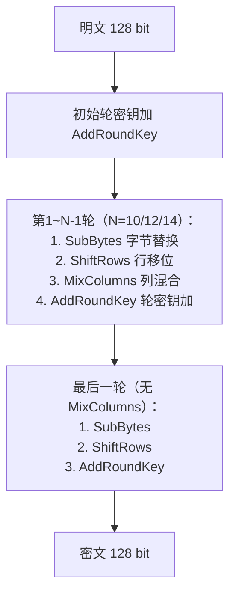

# AES对称加解密算法

## 1. 算法概述

**AES**（Advanced Encryption Standard，高级加密标准）是当今使用最广泛的对称加密算法之一。

它由比利时密码学家 Joan Daemen 和 Vincent Rijmen 设计，原名 **Rijndael**，于 2001 年被 NIST 选为新的加密标准（FIPS PUB 197），取代已不安全的 DES。

> AES 具备高安全性、高性能、实现灵活等特点，已成为全球范围内政府、金融、通信等领域的首选对称加密算法。

### 1.1 基本参数

| 参数 | 值 |
|------|-----|
| 算法类型 | 对称分组加密 |
| 明文分组长度 | 128 位（16 字节） |
| 密钥长度 | 128 / 192 / 256 位 |
| 密文分组长度 | 128 位（16 字节） |
| 加密轮数 | 10 / 12 / 14 轮（对应密钥长度） |
| 结构 | 代换-置换网络（SPN） |

### 1.2 标准化历程

- **1997年**：NIST 发起 AES 征集计划，要求取代 DES
- **1998年**：第一轮筛选，15 个候选算法入围
- **1999年**：第二轮筛选，5 个算法进入决赛
- **2000年**：Rijndael 算法胜出
- **2001年**：正式发布为 FIPS PUB 197
- **至今**：仍是最主流的对称加密标准

### 1.3 AES 胜出原因

| 评价维度 | Rijndael 的优势 |
|----------|----------------|
| 安全性 | 抗已知所有攻击 |
| 性能 | 软硬件实现均高效 |
| 灵活性 | 支持多种密钥/分组长度 |
| 简洁性 | 设计优雅，易于分析 |
| 资源需求 | 内存占用少，适合嵌入式 |

## 2. 算法原理

### 2.1 状态矩阵

AES 将 128 位输入组织为 4×4 字节矩阵（State），所有操作在此矩阵上进行：

```
┌────┬────┬────┬────┐
│ s00 │ s01 │ s02 │ s03 │
├────┼────┼────┼────┤
│ s10 │ s11 │ s12 │ s13 │
├────┼────┼────┼────┤
│ s20 │ s21 │ s22 │ s23 │
├────┼────┼────┼────┤
│ s30 │ s31 │ s32 │ s33 │
└────┴────┴────┴────┘
```

输入字节按列填充：第一列为 s00, s10, s20, s30。

### 2.2 加密流程



### 2.3 四种基本操作

#### 2.3.1 SubBytes（字节替换）

通过 S-盒对每个字节进行非线性替换，提供**混淆（Confusion）**特性。

S-盒基于 GF(2⁸) 上的乘法逆元和仿射变换构造：

1. 计算字节在 GF(2⁸) 中的乘法逆元（0 映射为 0）
2. 对结果应用固定的仿射变换

S-盒具有以下数学特性：
- 无不动点（没有 S(x) = x）
- 无反不动点（没有 S(x) = x̄）
- 良好的非线性度
- 差分均匀性为 4

#### 2.3.2 ShiftRows（行移位）

对状态矩阵的每一行进行循环左移：

```
第0行：不移位
第1行：左移1字节
第2行：左移2字节
第3行：左移3字节
```

作用：在列间扩散数据，确保一列中的字节散布到不同列。

#### 2.3.3 MixColumns（列混合）

对状态矩阵的每一列在 GF(2⁸) 上进行矩阵乘法：

```
┌   ┐   ┌            ┐   ┌   ┐
│ r0│   │ 2  3  1  1 │   │ s0│
│ r1│ = │ 1  2  3  1 │ × │ s1│
│ r2│   │ 1  1  2  3 │   │ s2│
│ r3│   │ 3  1  1  2 │   │ s3│
└   ┘   └            ┘   └   ┘
```

作用：提供**扩散（Diffusion）**特性，使每个输入字节影响输出列的所有字节。

#### 2.3.4 AddRoundKey（轮密钥加）

将轮密钥与状态矩阵进行逐字节 XOR：

```
State = State ⊕ RoundKey
```

这是唯一引入密钥的步骤，也是 AES 安全性的基础。

### 2.4 密钥扩展（Key Expansion）

将初始密钥扩展为 (Nr+1) × 4 个 32 位字，每轮使用 4 个字作为轮密钥。

#### AES-128 密钥扩展过程：

1. 初始 4 个字直接来自原始密钥
2. 后续每个字 `W[i]` 的生成规则：
   - 若 `i mod 4 ≠ 0`：`W[i] = W[i-1] ⊕ W[i-4]`
   - 若 `i mod 4 = 0`：`W[i] = W[i-4] ⊕ T(W[i-1])`

其中变换 T 包括：
- RotWord：循环左移一字节
- SubWord：每字节通过 S-盒替换
- 异或轮常量 Rcon

### 2.5 解密过程

AES 解密是加密的逆过程，各操作使用对应的逆操作：

| 加密操作 | 对应解密操作 |
|----------|-------------|
| SubBytes | InvSubBytes（逆 S-盒） |
| ShiftRows | InvShiftRows（右移） |
| MixColumns | InvMixColumns（逆矩阵） |
| AddRoundKey | AddRoundKey（XOR 自身为逆） |

## 3. 安全性分析

### 3.1 安全强度

| 密钥长度 | 暴力破解复杂度 | 安全评级 |
|----------|---------------|----------|
| AES-128 | 2¹²⁸ | 商用安全 |
| AES-192 | 2¹⁹² | 高安全 |
| AES-256 | 2²⁵⁶ | 抗量子计算（Grover 后仍有 2¹²⁸） |

### 3.2 已知分析攻击

| 攻击方法 | 适用版本 | 复杂度 | 实用性 |
|----------|----------|--------|--------|
| Biclique 攻击 | AES-128 | 2¹²⁶·¹ | 理论攻击，不实用 |
| 相关密钥攻击 | AES-192/256 | 2¹⁷⁶/2⁹⁹·⁵ | 需特殊条件，不实用 |
| 侧信道攻击 | 所有版本 | 取决于实现 | **实际威胁** |

### 3.3 侧信道攻击防护

侧信道攻击是 AES 面临的**最实际的威胁**：

| 攻击类型 | 原理 | 防护措施 |
|----------|------|----------|
| 时序攻击 | 不同输入执行时间不同 | 常数时间实现 |
| 缓存攻击 | 查表操作留下缓存痕迹 | 比特切片实现或 AES-NI |
| 功耗分析 | 不同操作功耗不同 | 掩码技术 |
| 电磁辐射 | 监测电磁波 | 物理屏蔽 |

### 3.4 AES 与量子计算

- Grover 算法可将暴力搜索复杂度开平方
- AES-128 在量子计算下安全性降至 2⁶⁴（不安全）
- AES-256 在量子计算下仍有 2¹²⁸ 安全性（足够安全）
- **建议**：对长期保密数据使用 AES-256

## 4. 硬件加速（AES-NI）

现代 CPU 提供 AES 专用指令集（Intel AES-NI / ARM AES Extension）：

| 指令 | 功能 |
|------|------|
| AESENC | 执行一轮 AES 加密 |
| AESENCLAST | 执行最后一轮 AES 加密 |
| AESDEC | 执行一轮 AES 解密 |
| AESDECLAST | 执行最后一轮 AES 解密 |
| AESKEYGENASSIST | 辅助密钥扩展 |

性能对比（大致数据）：

| 实现方式 | 吞吐量 |
|----------|--------|
| 纯软件实现 | ~300 MB/s |
| AES-NI | ~4000+ MB/s |
| 加速比 | 10~15x |

## 5. Go 语言实现（AES-GCM，推荐）

```go
package main

import (
	"crypto/aes"
	"crypto/cipher"
	"crypto/rand"
	"encoding/hex"
	"fmt"
	"io"
)

// AES-GCM 加密
func AesGcmEncrypt(plaintext, key []byte) ([]byte, error) {
	block, err := aes.NewCipher(key)
	if err != nil {
		return nil, err
	}

	aesGCM, err := cipher.NewGCM(block)
	if err != nil {
		return nil, err
	}

	// 生成随机 nonce
	nonce := make([]byte, aesGCM.NonceSize())
	if _, err := io.ReadFull(rand.Reader, nonce); err != nil {
		return nil, err
	}

	// 加密并附加认证标签，nonce 放在密文前面
	ciphertext := aesGCM.Seal(nonce, nonce, plaintext, nil)
	return ciphertext, nil
}

// AES-GCM 解密
func AesGcmDecrypt(ciphertext, key []byte) ([]byte, error) {
	block, err := aes.NewCipher(key)
	if err != nil {
		return nil, err
	}

	aesGCM, err := cipher.NewGCM(block)
	if err != nil {
		return nil, err
	}

	nonceSize := aesGCM.NonceSize()
	nonce, ciphertext := ciphertext[:nonceSize], ciphertext[nonceSize:]

	plaintext, err := aesGCM.Open(nil, nonce, ciphertext, nil)
	if err != nil {
		return nil, err
	}

	return plaintext, nil
}

func main() {
	// AES-256 密钥为 32 字节
	key := make([]byte, 32)
	if _, err := rand.Read(key); err != nil {
		panic(err)
	}

	plaintext := []byte("Hello, AES-GCM Encryption!")
	fmt.Printf("明文: %s\n", plaintext)
	fmt.Printf("密钥(hex): %s\n", hex.EncodeToString(key))

	// 加密
	encrypted, err := AesGcmEncrypt(plaintext, key)
	if err != nil {
		panic(err)
	}
	fmt.Printf("密文(hex): %s\n", hex.EncodeToString(encrypted))

	// 解密
	decrypted, err := AesGcmDecrypt(encrypted, key)
	if err != nil {
		panic(err)
	}
	fmt.Printf("解密: %s\n", decrypted)
}
```

## 6. 总结

| 维度 | 评价 |
|------|------|
| 安全性 | ⭐⭐⭐⭐⭐ 目前无实际可行的攻击 |
| 性能 | ⭐⭐⭐⭐⭐ 有硬件加速支持 |
| 生态 | ⭐⭐⭐⭐⭐ 全平台全语言支持 |
| 未来性 | ⭐⭐⭐⭐ AES-256 可抗量子计算 |
| 推荐度 | ⭐⭐⭐⭐⭐ 对称加密的首选标准 |

AES 是当前对称加密的**黄金标准**。对于绝大多数应用场景，**AES-256-GCM** 是最佳选择——它同时提供高强度加密和数据完整性认证，且有硬件加速支持，性能优异。
