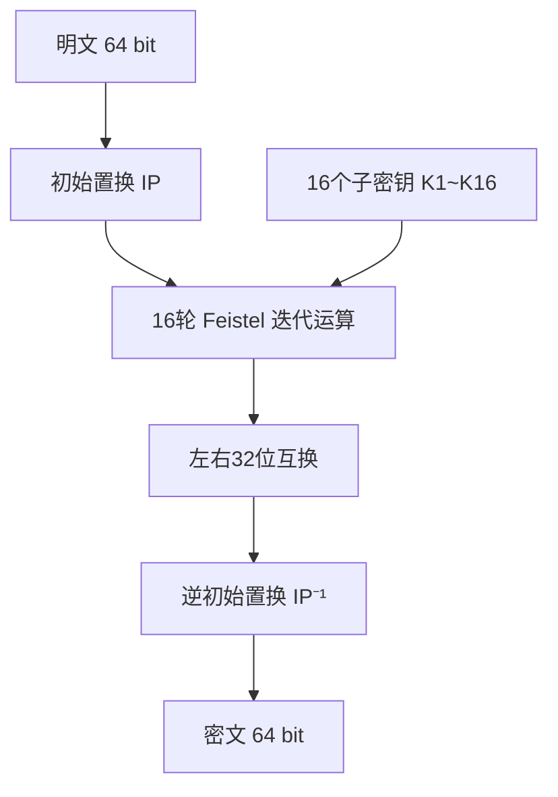

# DES对称加解密算法

## 1. 算法概述

**DES**（Data Encryption Standard，数据加密标准）是一种对称密钥加密块密码算法，基于使用56位密钥的对称算法。

由 IBM 在 1970 年代初期研发，后经美国国家标准局（NBS，即现在的 NIST）于 1977 年正式发布为联邦信息处理标准（FIPS PUB 46）。DES 是历史上第一个被广泛采用的商用加密标准，对密码学的发展具有里程碑意义。

> **⚠️ 安全警告：DES 已于 2005 年被 NIST 正式撤销，不应再用于任何新系统。56 位密钥长度在当今算力下可在数小时内被暴力破解。如果你在维护遗留系统中遇到 DES，应立即规划迁移到 AES。

### 1.1 基本参数

| 参数 | 值 |
|------|-----|
| 算法类型 | 对称分组加密 |
| 明文分组长度 | 64 位（8 字节） |
| 密钥长度 | 64 位（有效 56 位 + 8 位奇偶校验位） |
| 密文分组长度 | 64 位（8 字节） |
| 加密轮数 | 16 轮 Feistel 网络 |
| 安全状态 | ❌ **已破解，禁止使用** |

### 1.2 历史时间线

- **1977年**：正式发布为 FIPS PUB 46 标准
- **1999年**：DES 被 EFF 的 Deep Crack 在不到一天时间内暴力破解
- **2005年**：NIST 正式撤销 DES 标准

## 2. 算法原理（简述）

DES 基于 **Feistel 网络**结构，将 64 位明文经过初始置换、16 轮迭代加密和最终逆置换后，输出 64 位密文。



**核心思路**：

1. **初始置换**：将 64 位输入按固定表重新排列位顺序
2. **16 轮 Feistel 迭代**：每轮将数据分为左右各 32 位，右半部分通过轮函数 F 与子密钥混合后，与左半部分异或
3. **轮函数 F**：包含扩展置换（32→48位）、密钥异或、S-盒非线性替换（48→32位）、P-盒置换
4. **密钥调度**：从 56 位主密钥派生出 16 个 48 位子密钥
5. **解密**：使用相同算法，只需将子密钥顺序逆序（K16→K1）

> S-盒是 DES 安全性的核心，提供了算法的非线性特性。但无论 S-盒设计多好，56 位密钥长度使得暴力破解成为可能。

## 3. 安全性分析

### 3.1 为什么 DES 不再安全？

| 攻击方法 | 复杂度 | 说明 |
|----------|--------|------|
| 暴力攻击 | 2⁵⁶ | 现代硬件数小时内可完成 |
| 差分密码分析 | 2⁴⁷ 选择明文 | Biham & Shamir, 1990 |
| 线性密码分析 | 2⁴³ 已知明文 | Matsui, 1993 |

**关键事实**：

- 1997 年：DESCHALL 项目历时 96 天暴力破解 DES
- 1998 年：EFF 的 Deep Crack 仅用 56 小时破解
- 1999 年：结合分布式计算，22 小时内完成破解
- 如今使用 GPU 集群，破解时间以分钟计

### 3.2 弱密钥

DES 存在 4 个弱密钥和 12 个半弱密钥：

- **弱密钥**：加密两次等于不加密（E(E(m)) = m）
- **半弱密钥**：两个密钥互为加密/解密关系

实际开发中如果（不推荐地）使用 DES，应验证密钥不在弱密钥列表中。

## 4. 开发者注意事项

### 4.1 不要使用 DES

这是最重要的一条。无论什么场景，DES 都不应该出现在新代码中。如果你在以下场景中遇到 DES：

| 场景 | 处理方式 |
|------|----------|
| 新系统开发 | 直接使用 AES-256-GCM |
| 维护遗留系统 | 制定迁移计划，尽快替换 |
| 与旧系统对接 | 在边界层做转换，内部使用 AES |
| 合规审计 | DES 会导致审计不通过 |

### 4.2 如果必须处理 DES（遗留系统）

在维护遗留系统时，可能需要暂时处理 DES 加密的数据：

- **密钥长度**：必须为 8 字节（64 位，其中 56 位有效）
- **工作模式**：遗留系统常用 CBC 模式，注意 IV 不能重复
- **填充方式**：通常使用 PKCS5Padding（等同于 PKCS7，块大小为 8）
- **数据解密**：确保能解密旧数据后，立即用新算法重新加密存储

### 4.3 迁移方案

```
推荐迁移路径：DES → AES-256-GCM

步骤：
1. 新增 AES 加解密能力
2. 对新写入的数据使用 AES 加密
3. 读取时根据标识判断使用 DES 还是 AES 解密
4. 后台任务批量将旧数据迁移到 AES
5. 确认所有数据迁移完成后，移除 DES 代码
```

## 5. Go 语言实现（仅供遗留系统参考）

> ⚠️ 以下代码仅用于处理遗留系统数据，新项目请直接使用 AES-GCM。

```go
package main

import (
	"crypto/cipher"
	"crypto/des"
	"crypto/rand"
	"encoding/hex"
	"fmt"
	"io"
)

// PKCS5Padding 填充
func PKCS5Padding(data []byte, blockSize int) []byte {
	padding := blockSize - len(data)%blockSize
	padText := make([]byte, padding)
	for i := range padText {
		padText[i] = byte(padding)
	}
	return append(data, padText...)
}

// PKCS5Unpadding 去除填充
func PKCS5Unpadding(data []byte) []byte {
	padding := int(data[len(data)-1])
	return data[:len(data)-padding]
}

// DES-CBC 加密
func DesEncrypt(plaintext, key []byte) ([]byte, error) {
	block, err := des.NewCipher(key)
	if err != nil {
		return nil, err
	}

	plaintext = PKCS5Padding(plaintext, block.BlockSize())

	// 生成随机 IV
	ciphertext := make([]byte, des.BlockSize+len(plaintext))
	iv := ciphertext[:des.BlockSize]
	if _, err := io.ReadFull(rand.Reader, iv); err != nil {
		return nil, err
	}

	mode := cipher.NewCBCEncrypter(block, iv)
	mode.CryptBlocks(ciphertext[des.BlockSize:], plaintext)

	return ciphertext, nil
}

// DES-CBC 解密
func DesDecrypt(ciphertext, key []byte) ([]byte, error) {
	block, err := des.NewCipher(key)
	if err != nil {
		return nil, err
	}

	iv := ciphertext[:des.BlockSize]
	ciphertext = ciphertext[des.BlockSize:]

	mode := cipher.NewCBCDecrypter(block, iv)
	mode.CryptBlocks(ciphertext, ciphertext)

	return PKCS5Unpadding(ciphertext), nil
}

func main() {
	// DES 密钥必须为 8 字节
	key := []byte("12345678")
	plaintext := []byte("Hello, DES Encryption!")

	fmt.Printf("明文: %s\n", plaintext)

	// 加密
	encrypted, err := DesEncrypt(plaintext, key)
	if err != nil {
		panic(err)
	}
	fmt.Printf("密文(hex): %s\n", hex.EncodeToString(encrypted))

	// 解密
	decrypted, err := DesDecrypt(encrypted, key)
	if err != nil {
		panic(err)
	}
	fmt.Printf("解密: %s\n", decrypted)
}
```

## 6. 替代方案

| 场景 | 推荐算法 | 说明 |
|------|----------|------|
| 通用对称加密 | AES-256-GCM | 当前黄金标准，有硬件加速 |
| 兼容旧系统过渡 | 3DES（也已逐步淘汰） | 仅作短期过渡 |
| 高性能场景 | ChaCha20-Poly1305 | 无 AES 硬件加速时的优选 |
| 国密要求 | SM4-GCM | 国密标准 |

## 7. 总结

| 维度 | 评价 |
|------|------|
| 历史意义 | ⭐⭐⭐⭐⭐ 开创了现代密码学标准化时代 |
| 安全性 | ❌ 密钥过短，已被彻底破解 |
| 现代适用性 | ❌ 不应用于任何生产环境 |
| 开发者建议 | 遇到就迁移，新项目用 AES-256-GCM |

DES 的主要价值在于其**历史地位**和**教育意义**。作为开发者，你需要知道 DES 是什么（因为遗留系统中可能遇到），但永远不要在新代码中使用它。
