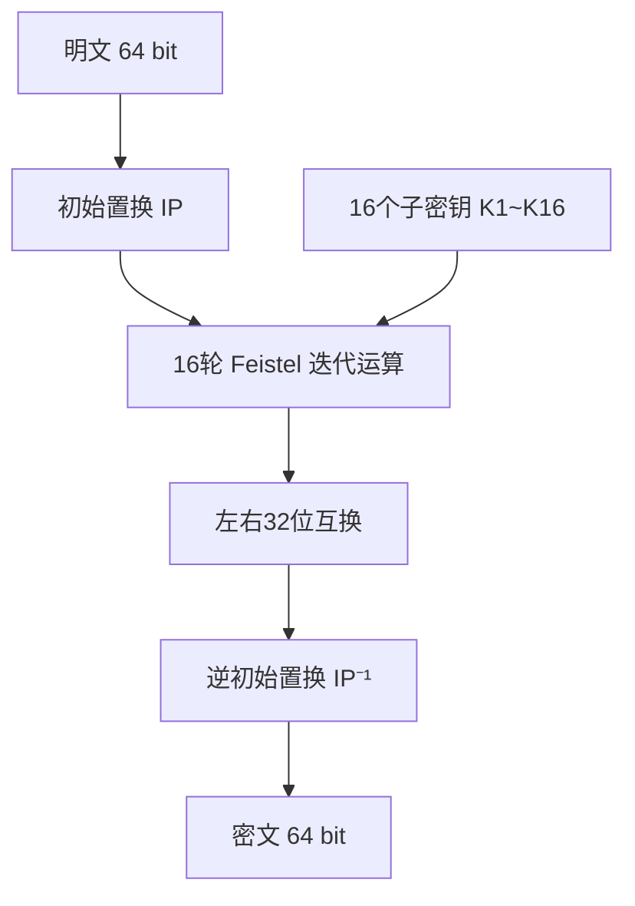

# DES对称加解密算法

## 1. 算法概述

**DES**（Data Encryption Standard，数据加密标准）是一种对称密钥加密块密码算法，基于使用56位密钥的对称算法。
> **对称密钥加密（Symmetric-key algorithm）：** 又称共享密钥加密、对称加密、私钥加密，是密码学中的一类加密算法。这类算法在加密和解密时使用相同的密钥，或者使用两个可以简单地相互推算的密钥。

> **块密码（Block cipher）：** 又称分组加密、分块加密，是一种对称密钥算法。它将明文分成多个等长的模块（block），使用确定的算法和对称密钥对每组分别加密解密。

由 IBM 在 1970 年代初期研发，后经美国国家标准局（NBS，即现在的 NIST）于 1977 年正式发布为联邦信息处理标准（FIPS PUB 46）。

DES 是历史上第一个被广泛采用的商用加密标准，对密码学的发展具有里程碑意义。
> 由于DES算法使用固定的56位密钥（有效位数），已经不能满足现今的安全要求，所以现在基本不会再使用。

### 1.1 基本参数

| 参数 | 值 |
|------|-----|
| 算法类型 | 对称分组加密 |
| 明文分组长度 | 64 位（8 字节） |
| 密钥长度 | 64 位（有效 56 位 + 8 位奇偶校验位） |
| 密文分组长度 | 64 位（8 字节） |
| 加密轮数 | 16 轮 Feistel 网络 |
| 结构 | Feistel 结构 |

### 1.2 设计背景

- **1972年**：美国国家标准局（NBS）公开征集加密标准
- **1974年**：IBM 提交了基于 Lucifer 密码改进的算法
- **1975年**：NBS 公开该算法供公众评审
- **1977年**：正式发布为 FIPS PUB 46 标准
- **1999年**：DES 被 EFF 的 Deep Crack 在不到一天时间内暴力破解
- **2005年**：NIST 正式撤销 DES 标准

## 2. 算法原理
DES是一种典型的块密码（一种将固定长度的明文通过一系列复杂的操作变成同样长度的密文的算法）。
对于DES而言，块长度为64位。密钥表面是64位的，但只有其中的56位用于算法，其余8位用于奇偶校验，并在算法中被丢弃，因此DES的有效密钥长度为56位。

DES 基于 **Feistel 网络**结构，将 64 位明文经过初始置换、16 轮迭代加密和最终逆置换后，输出 64 位密文。

### 2.1 整体流程



### 2.2 初始置换（IP）

初始置换将 64 位输入按照固定的置换表重新排列位的顺序。IP 置换表如下：

```
58 50 42 34 26 18 10  2
60 52 44 36 28 20 12  4
62 54 46 38 30 22 14  6
64 56 48 40 32 24 16  8
57 49 41 33 25 17  9  1
59 51 43 35 27 19 11  3
61 53 45 37 29 21 13  5
63 55 47 39 31 23 15  7
```

### 2.3 Feistel 轮函数

每一轮的核心操作如下：

```
L(i) = R(i-1)
R(i) = L(i-1) ⊕ F(R(i-1), K(i))
```

其中 F 函数包含以下步骤：

#### 2.3.1 扩展置换（E-盒）

将 32 位的 R 半块扩展为 48 位：

```
32  1  2  3  4  5
 4  5  6  7  8  9
 8  9 10 11 12 13
12 13 14 15 16 17
16 17 18 19 20 21
20 21 22 23 24 25
24 25 26 27 28 29
28 29 30 31 32  1
```

#### 2.3.2 密钥混合

将扩展后的 48 位数据与 48 位子密钥进行异或（XOR）运算。

#### 2.3.3 S-盒替换

将 48 位数据分成 8 组（每组 6 位），通过 8 个 S-盒分别进行非线性替换，每个 S-盒将 6 位输入映射为 4 位输出，最终得到 32 位结果。

S-盒是 DES 安全性的核心，它提供了算法的**非线性特性**。

#### 2.3.4 P-盒置换

对 S-盒输出的 32 位数据进行固定置换，增加扩散效果。

### 2.4 密钥调度算法

#### 2.4.1 子密钥生成过程

1. **PC-1 置换**：将 64 位密钥去除 8 个奇偶校验位，剩余 56 位重排
2. **分组**：将 56 位分为 C₀ 和 D₀ 各 28 位
3. **循环左移**：每轮对 C 和 D 分别进行 1 位或 2 位循环左移
4. **PC-2 置换**：从 56 位中选出 48 位作为该轮子密钥

每轮移位位数如下：

| 轮次 | 1 | 2 | 3 | 4 | 5 | 6 | 7 | 8 | 9 | 10 | 11 | 12 | 13 | 14 | 15 | 16 |
|------|---|---|---|---|---|---|---|---|---|----|----|----|----|----|----|-----|
| 移位 | 1 | 1 | 2 | 2 | 2 | 2 | 2 | 2 | 1 | 2  | 2  | 2  | 2  | 2  | 2  | 1  |

### 2.5 解密过程

DES 的 Feistel 结构使得解密与加密使用**相同的算法**，只需将 16 个子密钥的使用顺序**逆序**（K16 → K1）即可。

## 3. 安全性分析

### 3.1 已知攻击

| 攻击方法 | 复杂度 | 说明 |
|----------|--------|------|
| 暴力攻击 | 2⁵⁶ | 对现代计算机可行 |
| 差分密码分析 | 2⁴⁷ 选择明文 | Biham & Shamir, 1990 |
| 线性密码分析 | 2⁴³ 已知明文 | Matsui, 1993 |

### 3.2 密钥长度问题

56 位有效密钥长度是 DES 最大的弱点：

- 1997 年：DESCHALL 项目历时 96 天暴力破解 DES
- 1998 年：EFF 的 Deep Crack 仅用 56 小时破解
- 1999 年：结合分布式计算，22 小时内完成破解

### 3.3 弱密钥与半弱密钥

DES 存在 4 个弱密钥和 12 个半弱密钥，使用时应避免：

- **弱密钥**：加密两次等于不加密（E(E(m)) = m）
- **半弱密钥**：两个密钥互为加密/解密关系

## 4. Go 语言实现

```go
package main

import (
	"crypto/cipher"
	"crypto/des"
	"crypto/rand"
	"encoding/hex"
	"fmt"
	"io"
)

// PKCS5Padding 填充
func PKCS5Padding(data []byte, blockSize int) []byte {
	padding := blockSize - len(data)%blockSize
	padText := make([]byte, padding)
	for i := range padText {
		padText[i] = byte(padding)
	}
	return append(data, padText...)
}

// PKCS5Unpadding 去除填充
func PKCS5Unpadding(data []byte) []byte {
	padding := int(data[len(data)-1])
	return data[:len(data)-padding]
}

// DES-CBC 加密
func DesEncrypt(plaintext, key []byte) ([]byte, error) {
	block, err := des.NewCipher(key)
	if err != nil {
		return nil, err
	}

	plaintext = PKCS5Padding(plaintext, block.BlockSize())

	// 生成随机 IV
	ciphertext := make([]byte, des.BlockSize+len(plaintext))
	iv := ciphertext[:des.BlockSize]
	if _, err := io.ReadFull(rand.Reader, iv); err != nil {
		return nil, err
	}

	mode := cipher.NewCBCEncrypter(block, iv)
	mode.CryptBlocks(ciphertext[des.BlockSize:], plaintext)

	return ciphertext, nil
}

// DES-CBC 解密
func DesDecrypt(ciphertext, key []byte) ([]byte, error) {
	block, err := des.NewCipher(key)
	if err != nil {
		return nil, err
	}

	iv := ciphertext[:des.BlockSize]
	ciphertext = ciphertext[des.BlockSize:]

	mode := cipher.NewCBCDecrypter(block, iv)
	mode.CryptBlocks(ciphertext, ciphertext)

	return PKCS5Unpadding(ciphertext), nil
}

func main() {
	// DES 密钥必须为 8 字节
	key := []byte("12345678")
	plaintext := []byte("Hello, DES Encryption!")

	fmt.Printf("明文: %s\n", plaintext)

	// 加密
	encrypted, err := DesEncrypt(plaintext, key)
	if err != nil {
		panic(err)
	}
	fmt.Printf("密文(hex): %s\n", hex.EncodeToString(encrypted))

	// 解密
	decrypted, err := DesDecrypt(encrypted, key)
	if err != nil {
		panic(err)
	}
	fmt.Printf("解密: %s\n", decrypted)
}
```

## 5. 实际应用与现状

### 5.1 历史应用场景

- 金融行业（银行卡 PIN 加密、ATM 通信）
- 电子政务系统
- 早期 VPN 和 SSL/TLS 协议
- Unix/Linux 密码存储（crypt 函数）

### 5.2 当前状态

> **⚠️ 安全警告**
>
> **DES 已于 2005 年被 NIST 正式撤销，不应再用于任何新系统。** 56 位密钥长度在当今算力下可在数小时内被暴力破解。

### 5.3 替代方案

| 场景 | 推荐算法 |
|------|----------|
| 通用对称加密 | AES-256 |
| 兼容旧系统过渡 | 3DES（也已逐步淘汰） |
| 高性能场景 | ChaCha20 |
| 国密要求 | SM4 |

## 6. 总结

| 维度 | 评价 |
|------|------|
| 历史意义 | ⭐⭐⭐⭐⭐ 开创了现代密码学标准化时代 |
| 安全性 | ❌ 密钥过短，已被彻底破解 |
| 性能 | ⭐⭐⭐ 结构简单，硬件实现高效 |
| 现代适用性 | ❌ 不应用于生产环境 |

DES 的主要价值在于其**历史地位**和**教育意义**——它验证了 Feistel 结构的有效性，推动了公开密码学研究的发展，并为后续的 AES 等现代算法奠定了理论基础。
