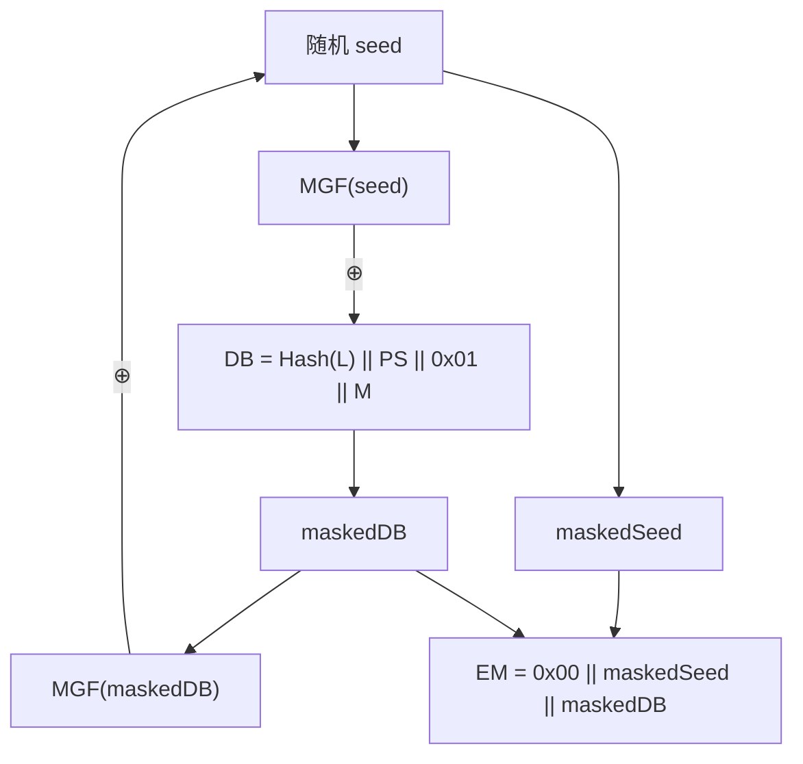

# RSA非对称加解密&签名算法

## 1. 算法概述

**RSA** 是世界上第一个也是最广泛使用的非对称（公钥）密码算法，由 Ron **R**ivest、Adi **S**hamir 和 Leonard **A**dleman 于 1977 年在 MIT 发明，以三人姓氏首字母命名。

RSA 既可用于**加密**也可用于**数字签名**，其安全性基于**大整数因数分解问题**的计算困难性。

### 1.1 基本参数

| 参数 | 值 |
|------|-----|
| 算法类型 | 非对称加密/签名 |
| 密钥长度 | 2048 / 3072 / 4096 位（推荐 ≥ 2048） |
| 加密分组大小 | 取决于密钥长度和填充方式 |
| 数学基础 | 大整数因数分解问题 |
| 标准 | PKCS#1 (RFC 8017) |

### 1.2 核心特性

- **非对称**：公钥加密，私钥解密；或私钥签名，公钥验签
- **双重用途**：同时支持加密和数字签名
- **密钥对**：公钥公开分发，私钥严格保密
- **计算密集**：比对称加密慢 1000 倍以上

## 2. 数学基础

### 2.1 前置知识

#### 欧拉函数 φ(n)

对正整数 n，φ(n) 表示小于 n 且与 n 互质的正整数个数：

- 若 p 为质数：φ(p) = p - 1
- 若 n = p × q（p, q 为不同质数）：φ(n) = (p-1)(q-1)

#### 欧拉定理

若 a 与 n 互质，则：

```
a^φ(n) ≡ 1 (mod n)
```

#### 模逆元

若 `e × d ≡ 1 (mod φ(n))`，则 d 为 e 对模 φ(n) 的逆元。

### 2.2 密钥生成

1. **选择两个大质数** p 和 q（各 1024 位以上）
2. **计算** n = p × q（即为 RSA 模数）
3. **计算欧拉函数** φ(n) = (p-1)(q-1)
4. **选择公钥指数** e，满足 1 < e < φ(n) 且 gcd(e, φ(n)) = 1
   - 常用值：e = 65537 (0x10001)
5. **计算私钥指数** d = e⁻¹ mod φ(n)

**密钥对**：
- 公钥：(n, e)
- 私钥：(n, d)

### 2.3 加密与解密

```
加密：C = M^e mod n （使用公钥）
解密：M = C^d mod n （使用私钥）
```

正确性证明（基于欧拉定理）：

```
C^d mod n = (M^e)^d mod n = M^(ed) mod n = M^(1+kφ(n)) mod n = M × (M^φ(n))^k mod n = M × 1^k mod n = M
```

### 2.4 签名与验签

```
签名：S = H(M)^d mod n （使用私钥对消息哈希签名）
验签：H(M) =? S^e mod n （使用公钥验证）
```

## 3. 填充方案

**裸 RSA**（直接对消息做模幂运算）是不安全的，必须配合填充方案使用。

### 3.1 OAEP（最优非对称加密填充）— 用于加密

OAEP（Optimal Asymmetric Encryption Padding）定义在 PKCS#1 v2.x 中：



特点：
- **CCA2 安全**（适应性选择密文安全）
- 引入随机性，相同明文每次加密结果不同
- 当前推荐的 RSA 加密填充方案

### 3.2 PSS（概率签名方案）— 用于签名

PSS（Probabilistic Signature Scheme）定义在 PKCS#1 v2.x 中：

```
EM = maskedDB || H || 0xbc
其中：
- H = Hash(0x0000000000000000 || Hash(M) || salt)
- maskedDB = DB ⊕ MGF(H)
- DB = PS || 0x01 || salt
```

特点：
- 引入随机盐值，同一消息每次签名不同
- 可证明安全性（在随机预言模型下）
- 当前推荐的 RSA 签名方案

### 3.3 PKCS#1 v1.5（旧方案）

- 加密填充：`0x00 || 0x02 || PS || 0x00 || M`
- 签名填充：`0x00 || 0x01 || PS || 0x00 || DigestInfo`

> **⚠️ 安全警告**
>
> PKCS#1 v1.5 加密填充易受 Bleichenbacher 攻击（1998年），不应用于新系统。签名填充也存在一些实现层面的漏洞。新系统应使用 OAEP（加密）和 PSS（签名）。

## 4. 安全性分析

### 4.1 密钥长度与安全性

| RSA 密钥长度 | 等效对称密钥长度 | 安全性评估 | 推荐状态 |
|-------------|----------------|-----------|----------|
| 1024 位 | ~80 位 | 不安全 | ❌ 禁止使用 |
| 2048 位 | ~112 位 | 安全至 ~2030 年 | ✅ 最低推荐 |
| 3072 位 | ~128 位 | 安全至 ~2040 年 | ✅ 推荐 |
| 4096 位 | ~152 位 | 长期安全 | ✅ 高安全需求 |

### 4.2 已知攻击

| 攻击方法 | 说明 | 防护 |
|----------|------|------|
| 因数分解 | 分解 n=p×q | 使用 2048+ 位密钥 |
| Bleichenbacher 攻击 | 利用 PKCS#1 v1.5 填充 | 使用 OAEP |
| 低指数攻击 | e 过小时的攻击 | 使用 e=65537 |
| 共模攻击 | 不同用户共用 n | 每个用户独立生成密钥对 |
| 时序攻击 | 私钥运算时间泄露 | 常数时间实现、RSA盲化 |
| Coppersmith 攻击 | 部分信息泄露时的攻击 | 安全的密钥生成 |

### 4.3 量子计算威胁

> **🚨 量子计算威胁**
>
> Shor 算法可在量子计算机上以多项式时间分解大整数，这将**彻底破解 RSA**。虽然当前量子计算机规模不足以威胁实际 RSA 密钥，但应为后量子时代做准备。

应对策略：
- 长期保密数据现在就应考虑后量子方案
- NIST 已发布后量子密码标准（ML-KEM, ML-DSA 等）
- 混合方案：RSA + 后量子算法并行使用

## 5. Go 语言实现

```go
package main

import (
	"crypto"
	"crypto/rand"
	"crypto/rsa"
	"crypto/sha256"
	"crypto/x509"
	"encoding/pem"
	"fmt"
)

// 生成 RSA 密钥对
func GenerateKeyPair(bits int) (*rsa.PrivateKey, *rsa.PublicKey, error) {
	privateKey, err := rsa.GenerateKey(rand.Reader, bits)
	if err != nil {
		return nil, nil, err
	}
	return privateKey, &privateKey.PublicKey, nil
}

// RSA-OAEP 加密
func Encrypt(publicKey *rsa.PublicKey, plaintext []byte) ([]byte, error) {
	return rsa.EncryptOAEP(sha256.New(), rand.Reader, publicKey, plaintext, nil)
}

// RSA-OAEP 解密
func Decrypt(privateKey *rsa.PrivateKey, ciphertext []byte) ([]byte, error) {
	return rsa.DecryptOAEP(sha256.New(), rand.Reader, privateKey, ciphertext, nil)
}

// RSA-PSS 签名
func Sign(privateKey *rsa.PrivateKey, message []byte) ([]byte, error) {
	hash := sha256.Sum256(message)
	return rsa.SignPSS(rand.Reader, privateKey, crypto.SHA256, hash[:], nil)
}

// RSA-PSS 验签
func Verify(publicKey *rsa.PublicKey, message, signature []byte) error {
	hash := sha256.Sum256(message)
	return rsa.VerifyPSS(publicKey, crypto.SHA256, hash[:], signature, nil)
}

// 私钥导出为 PEM
func PrivateKeyToPEM(privateKey *rsa.PrivateKey) string {
	privDER := x509.MarshalPKCS1PrivateKey(privateKey)
	privBlock := &pem.Block{
		Type:  "RSA PRIVATE KEY",
		Bytes: privDER,
	}
	return string(pem.EncodeToMemory(privBlock))
}

// 公钥导出为 PEM
func PublicKeyToPEM(publicKey *rsa.PublicKey) string {
	pubDER, _ := x509.MarshalPKIXPublicKey(publicKey)
	pubBlock := &pem.Block{
		Type:  "PUBLIC KEY",
		Bytes: pubDER,
	}
	return string(pem.EncodeToMemory(pubBlock))
}

func main() {
	// 生成 2048 位密钥对
	privateKey, publicKey, err := GenerateKeyPair(2048)
	if err != nil {
		panic(err)
	}

	fmt.Println("=== RSA 密钥对生成 ===")
	fmt.Printf("密钥长度: %d 位\n", privateKey.N.BitLen())

	// 加密/解密示例
	plaintext := []byte("Hello, RSA-OAEP Encryption!")
	fmt.Printf("\n=== 加密/解密 ===\n")
	fmt.Printf("明文: %s\n", plaintext)

	ciphertext, err := Encrypt(publicKey, plaintext)
	if err != nil {
		panic(err)
	}
	fmt.Printf("密文长度: %d 字节\n", len(ciphertext))

	decrypted, err := Decrypt(privateKey, ciphertext)
	if err != nil {
		panic(err)
	}
	fmt.Printf("解密: %s\n", decrypted)

	// 签名/验签示例
	message := []byte("This message needs to be signed.")
	fmt.Printf("\n=== 签名/验签 ===\n")
	fmt.Printf("消息: %s\n", message)

	signature, err := Sign(privateKey, message)
	if err != nil {
		panic(err)
	}
	fmt.Printf("签名长度: %d 字节\n", len(signature))

	err = Verify(publicKey, message, signature)
	if err != nil {
		fmt.Println("验签失败:", err)
	} else {
		fmt.Println("验签成功 ✓")
	}

	// 篡改消息后验签
	tamperedMessage := []byte("This message has been tampered.")
	err = Verify(publicKey, tamperedMessage, signature)
	if err != nil {
		fmt.Println("篡改后验签失败 ✓ (预期行为):", err)
	}
}
```

## 6. 实际应用

### 6.1 典型应用场景

| 场景 | 用法 | 说明 |
|------|------|------|
| TLS/HTTPS | 密钥交换 + 服务器认证 | RSA 签名验证证书，密钥协商 |
| 数字证书 (X.509) | 签名 | CA 使用 RSA 签发证书 |
| 代码签名 | 签名 | 验证软件来源和完整性 |
| SSH | 身份认证 | RSA 密钥对登录 |
| PGP/GPG | 加密 + 签名 | 邮件加密和签名 |
| JWT | 签名 | RS256/RS384/RS512 |

### 6.2 混合加密模式

RSA 不适合直接加密大量数据（速度慢、有长度限制），实际中常用**混合加密**：

```
发送方：
1. 生成随机 AES 密钥 K
2. 用 AES-GCM + K 加密大量数据 → 密文 C
3. 用 RSA 公钥加密 K → 加密密钥 EK
4. 发送 (EK, C)

接收方：
1. 用 RSA 私钥解密 EK → K
2. 用 AES-GCM + K 解密 C → 明文
```

### 6.3 RSA 与 ECDSA/EdDSA 的对比

| 特性 | RSA-2048 | ECDSA P-256 | Ed25519 |
|------|----------|-------------|---------|
| 公钥大小 | 256 字节 | 64 字节 | 32 字节 |
| 签名大小 | 256 字节 | 64 字节 | 64 字节 |
| 签名速度 | 慢 | 中 | 快 |
| 验签速度 | 快 | 中 | 快 |
| 安全强度 | 112 位 | 128 位 | 128 位 |

## 7. 最佳实践

### 7.1 密钥生成

- 密钥长度 ≥ 2048 位（推荐 3072 或 4096）
- 使用安全随机数生成器
- p 和 q 的差值不能太小
- 验证生成的密钥质量

### 7.2 使用建议

- 加密使用 **OAEP** 填充（而非 PKCS#1 v1.5）
- 签名使用 **PSS** 方案（而非 PKCS#1 v1.5）
- 公钥指数使用 **65537**
- 大数据使用混合加密方案
- 避免自己实现 RSA，使用成熟库

### 7.3 密钥管理

- 私钥安全存储（加密保存、HSM）
- 证书及时更新和轮换
- 实施密钥泄露应急预案
- 考虑向后量子算法迁移

## 8. 总结

| 维度 | 评价 |
|------|------|
| 历史意义 | ⭐⭐⭐⭐⭐ 公钥密码学的奠基者 |
| 安全性 | ⭐⭐⭐⭐ 2048+ 位当前安全，但受量子计算威胁 |
| 性能 | ⭐⭐ 显著慢于对称加密和 ECC |
| 生态 | ⭐⭐⭐⭐⭐ 全球最广泛部署的公钥算法 |
| 未来性 | ⭐⭐ 量子计算将构成根本性威胁 |

RSA 至今仍是 PKI 体系的基石，但在新系统设计中，ECC（如 Ed25519）在签名场景中已成为更优选择，而在加密场景中 ECDH + AES-GCM 的组合也比纯 RSA 更高效。面向后量子时代，需关注 NIST 后量子标准的进展。
