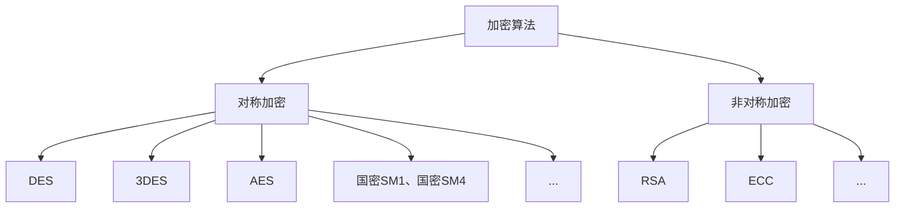
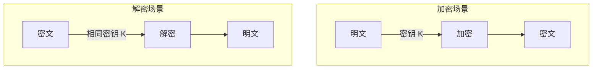
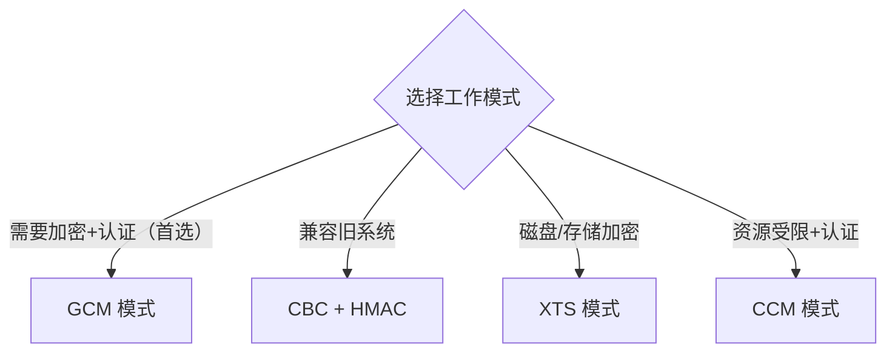
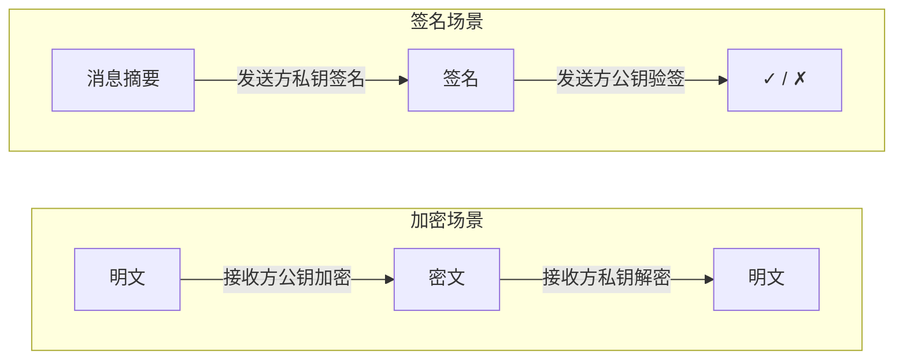
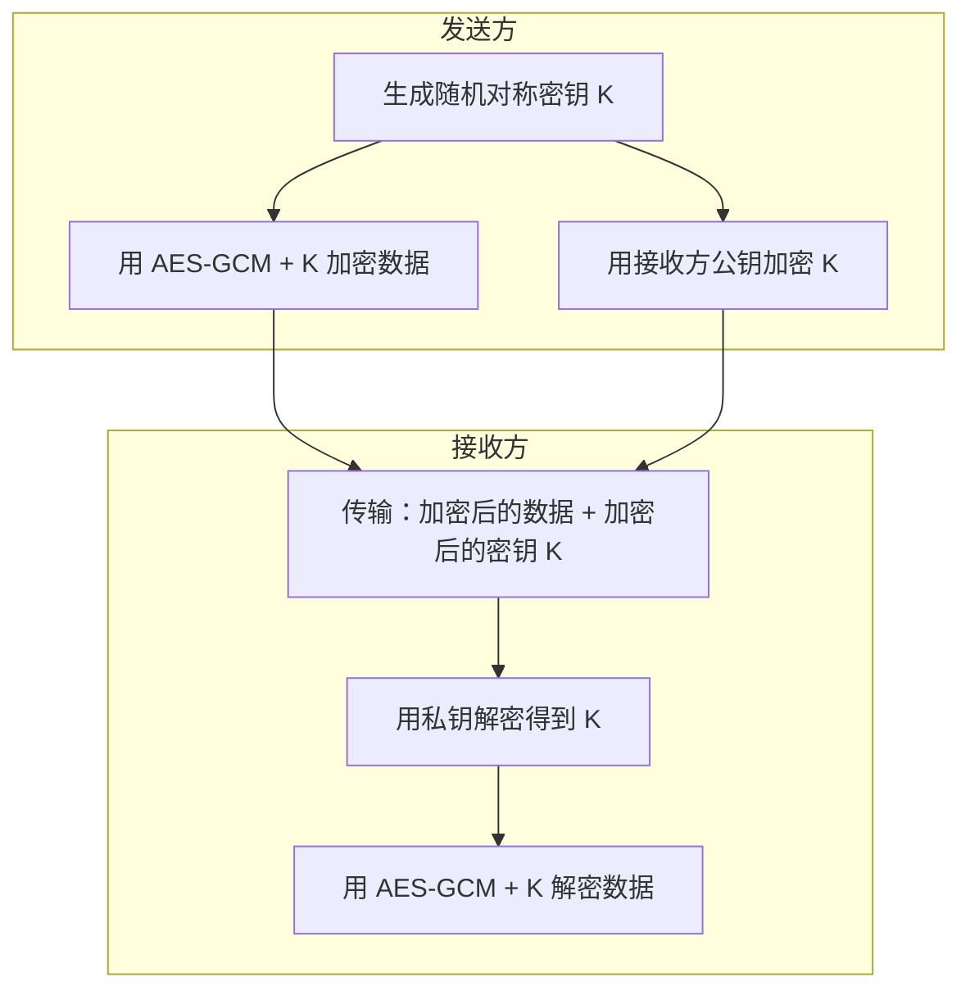
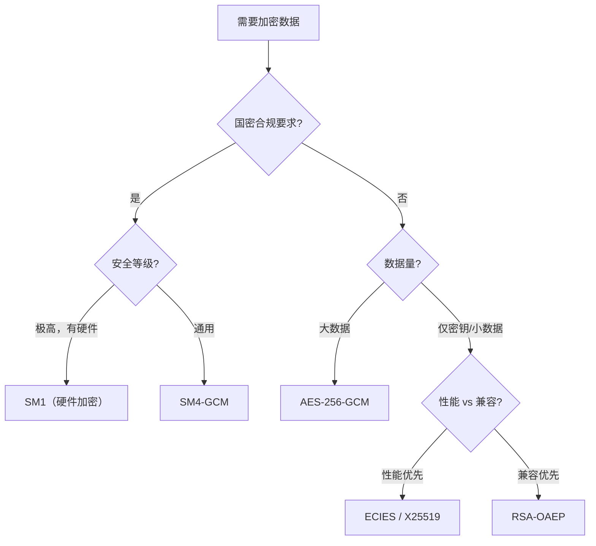

# 加密算法概述

## 1. 什么是加密算法？

加解密算法是将**明文转换为密文**（加密）以及将**密文还原为明文**（解密）的数学方法。它的核心目的是保护信息的**机密性**——确保数据即使被截获也无法被未授权者读取。

加解密算法分为两大类：

* 对称加密：使用同一密钥进行加密和解密。
* 非对称加密：使用不同密钥进行加密和解密（公钥用于加密，私钥用于解密）。

## 2. 对称加密

### 2.1 基本原理

对称加密中，加密和解密使用**同一个密钥**（或可以互相推导的密钥）。通信双方必须事先安全地共享这个密钥。

### 2.2 对称加密的优缺点

| 优点 | 缺点 |
|------|------|
| 加解密速度极快 | 密钥分发困难（如何安全传递密钥？） |
| 适合加密大量数据 | 密钥管理复杂（n 人通信需 n(n-1)/2 个密钥） |
| 有硬件加速支持（AES-NI） | 无法实现数字签名和身份认证 |
| 算法成熟、实现广泛 | 无法解决不可否认性问题 |

### 2.3 分组密码与流密码

对称加密根据数据处理方式可进一步分为：

| 维度 | 分组密码 (Block Cipher) | 流密码 (Stream Cipher) |
|------|------------------------|------------------------|
| 处理方式 | 将明文分成固定大小的块，逐块加密 | 生成密钥流，逐位/逐字节与明文异或 |
| 典型代表 | AES、SM4、DES、3DES | ChaCha20、RC4（已废弃） |
| 填充需求 | 需要填充（PKCS7 等），或使用流式模式 | 不需要填充 |
| 适用场景 | 文件加密、数据库加密、磁盘加密 | 实时通信、TLS 数据传输 |

本目录下的算法（DES、3DES、AES、SM4、SM1）均属于**分组密码**。

### 2.4 分组密码的工作模式

由于分组密码一次只处理固定大小的块（如 AES 为 128 位），处理更长的数据需要**工作模式**来定义块之间如何关联：

| 模式 | 全称 | 特点 | 推荐度 |
|------|------|------|--------|
| ECB | Electronic Codebook | 各块独立加密；相同明文块 → 相同密文块 | ❌ 不安全 |
| CBC | Cipher Block Chaining | 每块与前一密文块异或后加密；需 IV | ⚠️ 需搭配 MAC |
| CTR | Counter | 加密递增计数器生成密钥流；支持并行 | ⚠️ 需搭配 MAC |
| **GCM** | Galois/Counter Mode | CTR 加密 + GMAC 认证；AEAD 模式 | ✅ **首选** |
| CCM | Counter with CBC-MAC | CTR 加密 + CBC-MAC；适合资源受限环境 | ✅ 物联网场景 |
| XTS | XEX Tweaked-codebook | 每块使用不同 tweak 值 | ✅ 磁盘加密专用 |

> **💡 AEAD 是最佳实践**
>
> **AEAD**（Authenticated Encryption with Associated Data）模式同时提供加密和完整性认证。GCM 是最常用的 AEAD 模式。单独使用加密而不认证（如裸 CBC）会导致填充预言攻击等漏洞。

### 2.5 填充方式

当明文长度不是块大小的整数倍时（CBC 等模式），需要填充：

| 填充方式 | 规则 | 示例（块大小 8，数据 5 字节） |
|----------|------|------|
| PKCS7/PKCS5 | 填充 n 字节，每字节值为 n | `DD DD DD DD DD 03 03 03` |
| Zero Padding | 填充 0x00 | `DD DD DD DD DD 00 00 00` |
| ISO 10126 | 填充随机字节，最后一字节为填充长度 | `DD DD DD DD DD xx xx 03` |

> GCM/CTR 等流式模式不需要填充。

### 2.6 主要对称加密算法一览

| 算法 | 密钥长度 | 分组大小 | 轮数 | 结构 | 安全状态 |
|------|----------|----------|------|------|----------|
| [DES](DES.md) | 56 位 | 64 位 | 16 | Feistel | ❌ 已破解，禁止使用 |
| [3DES](3DES.md) | 112/168 位 | 64 位 | 48 | Feistel×3 | ⚠️ 已弃用 |
| [AES](AES.md) | 128/192/256 位 | 128 位 | 10/12/14 | SPN | ✅ 当前标准 |
| [SM1](国密SM1.md) | 128 位 | 128 位 | 未公开 | 未公开 | ✅ 国密（不公开，仅硬件） |
| [SM4](国密SM4.md) | 128 位 | 128 位 | 32 | 广义 Feistel | ✅ 国密（公开） |

## 3. 非对称加密

### 3.1 基本原理

非对称加密使用数学上相关但不同的**一对密钥**：

- **公钥**（Public Key）：公开分发，任何人可获取
- **私钥**（Private Key）：严格保密，仅持有者拥有

核心特性：公钥加密的内容只有私钥能解密，私钥签名的内容公钥可验证。

### 3.2 非对称加密的优缺点

| 优点 | 缺点 |
|------|------|
| 不需要预先安全地共享密钥 | 计算速度极慢（比对称加密慢 1000+ 倍） |
| n 人通信只需 n 对密钥 | 不适合直接加密大量数据 |
| 支持数字签名和身份认证 | 密钥长度较长（RSA 需 2048+ 位） |
| 支持不可否认性 | 需要公钥基础设施（PKI）支撑 |

### 3.3 主要非对称加密算法一览

| 算法 | 数学基础 | 128 位安全等效密钥长度 | 主要用途 | 安全状态 |
|------|----------|----------------------|----------|----------|
| [RSA](RSA.md) | 大整数因式分解 | 3072 位 | 加密 + 签名 | ✅（受量子计算威胁） |
| [ECC](ECC.md) | 椭圆曲线离散对数 | 256 位 | 签名 + 密钥协商 | ✅ 推荐 |

### 3.4 为什么 ECC 密钥比 RSA 短得多？

同等安全强度下的密钥长度对比：

| 对称等效安全性 | RSA 密钥长度 | ECC 密钥长度 | 比值 |
|---------------|-------------|-------------|------|
| 80 位 | 1024 位 | 160 位 | 6.4× |
| 112 位 | 2048 位 | 224 位 | 9.1× |
| 128 位 | 3072 位 | 256 位 | 12× |
| 192 位 | 7680 位 | 384 位 | 20× |
| 256 位 | 15360 位 | 521 位 | 29.5× |

ECC 基于的**椭圆曲线离散对数问题**比 RSA 基于的**整数分解问题**在计算上更困难，因此用更短的密钥就能达到同样的安全性。

## 4. 对称加密 vs 非对称加密

| 维度 | 对称加密 | 非对称加密 |
|------|----------|-----------|
| 密钥 | 加密解密用同一密钥 | 公钥加密，私钥解密 |
| 速度 | 极快（GB/s 级别） | 极慢（KB/s 级别） |
| 密钥分发 | 困难 | 简单（公钥可公开） |
| 适合数据量 | 大数据 | 小数据（通常仅加密密钥） |
| 数字签名 | 不支持 | 支持 |
| 典型密钥长度 | 128-256 位 | 2048-4096 位 (RSA) / 256 位 (ECC) |
| 代表算法 | AES、SM4 | RSA、ECC |

## 5. 混合加密：实际系统的选择

实际生产系统中，对称加密和非对称加密几乎从不单独使用，而是**结合使用**（混合加密）：

**混合加密的逻辑**：

1. 用非对称加密解决**密钥分发**问题（安全传递对称密钥）
2. 用对称加密解决**性能**问题（高效加密大量数据）

**典型应用**：

- **TLS/HTTPS**：ECDHE 协商对称密钥 → AES-GCM 加密通信数据
- **PGP 邮件加密**：RSA 加密会话密钥 → AES 加密邮件内容
- **Signal/微信**：X25519 密钥协商 → AES-256 或 ChaCha20 加密消息

## 6. 量子计算的影响

| 算法 | 量子计算威胁 | 应对 |
|------|-------------|------|
| AES-128 | Grover 算法将安全性降至 64 位 | 使用 AES-256（仍有 128 位安全性） |
| AES-256 | Grover 算法后仍有 128 位安全性 | ✅ 继续使用 |
| SM4 | 同 AES-128，安全性降至 64 位 | 关注国密后量子方案 |
| RSA | ❌ Shor 算法可多项式时间破解 | 迁移到后量子密码 |
| ECC | ❌ Shor 算法可多项式时间破解 | 迁移到后量子密码 |

> **⚠️ 后量子迁移**
>
> 所有基于因式分解和离散对数的非对称算法（RSA、ECC）在量子计算面前**不堪一击**。NIST 已发布后量子密码标准（ML-KEM/ML-DSA），对需要长期保密的数据，现在就应规划迁移。对称加密只需加倍密钥长度即可应对。

## 7. 算法选型建议

### 7.1 通用场景

| 需求 | 推荐 | 理由 |
|------|------|------|
| 数据加密 | AES-256-GCM | 安全、快速、AEAD、硬件加速 |
| 密钥交换 | X25519 (ECDH) | 高性能、短密钥、抗侧信道 |
| 数字签名 | Ed25519 | 快速、确定性、短签名 |
| 兼容性优先 | RSA-2048 + AES-128-GCM | 广泛支持 |

### 7.2 国密合规场景

| 需求 | 推荐 | 理由 |
|------|------|------|
| 数据加密 | SM4-GCM | 国密标准，公开可实现 |
| 高安全加密 | SM1（硬件） | 算法不公开，硬件保护 |
| 密钥交换/签名 | SM2 | 基于 ECC，国密标准 |

### 7.3 选型决策流程

## 8. 常见安全陷阱

| 陷阱 | 风险 | 正确做法 |
|------|------|----------|
| 使用 ECB 模式 | 明文模式泄露 | 使用 GCM 模式 |
| Nonce/IV 重复 | 密钥流重复，明文泄露 | 每次加密使用 `crypto/rand` 生成唯一值 |
| 仅加密不认证 | 无法检测篡改（Padding Oracle 等） | 使用 AEAD 模式（GCM） |
| 硬编码密钥在代码中 | 密钥随代码泄露 | 使用 KMS、Vault 或环境变量 |
| 使用 `math/rand` 生成密钥 | 可预测的"随机"数 | 使用 `crypto/rand`（密码学安全） |
| 使用 DES/3DES | 密钥过短或性能差 | 迁移到 AES-256-GCM |
| 自己实现加密算法 | 几乎必然存在漏洞 | 使用经审计的标准库或成熟密码库 |
| 用 RSA 直接加密大数据 | 性能极差、有长度限制 | 混合加密方案（RSA 加密对称密钥） |
| 不验证公钥来源 | 中间人攻击 | 使用 PKI 证书体系 |
| PKCS#1 v1.5 填充 | Bleichenbacher 攻击 | RSA 加密用 OAEP，签名用 PSS |
| 密钥不轮换 | 长期使用增加泄露风险 | 制定密钥轮换策略 |

## 9. 开发者快速决策表

不想看细节？直接对照这张表选算法：

| 我要做什么 | 推荐方案 | 备注 |
|-----------|----------|------|
| 加密数据 | AES-256-GCM | 默认选择 |
| 加密数据（国密合规） | SM4-GCM | 用法与 AES-GCM 相同 |
| 数字签名 | Ed25519 | 新项目首选 |
| 数字签名（兼容性） | RSA-PSS (2048+) | TLS 证书等场景 |
| 密钥协商 | X25519 + HKDF | TLS 1.3 默认方案 |
| 保护密码 | 不用加密，用 bcrypt/argon2 | 这是摘要/KDF 的领域 |
| 传输层安全 | TLS 1.3 | 不要自己实现协议 |

## 10. 总结

| 维度 | 对称加密 | 非对称加密 |
|------|----------|-----------|
| 核心价值 | 高效加密大量数据 | 安全交换密钥、身份认证 |
| 代表算法 | AES-256、SM4 | RSA、ECC/Ed25519、SM2 |
| 推荐模式 | GCM（AEAD） | OAEP（加密）、PSS（签名） |
| 量子安全性 | 加倍密钥即可 | 需迁移到后量子方案 |
| 实际使用 | 与非对称加密配合使用 | 与对称加密配合使用 |

**核心理念**：现代安全系统使用**混合加密**——非对称加密解决"信任建立"问题（密钥交换、身份认证），对称加密解决"高效保护"问题（数据加密）。两者缺一不可。
