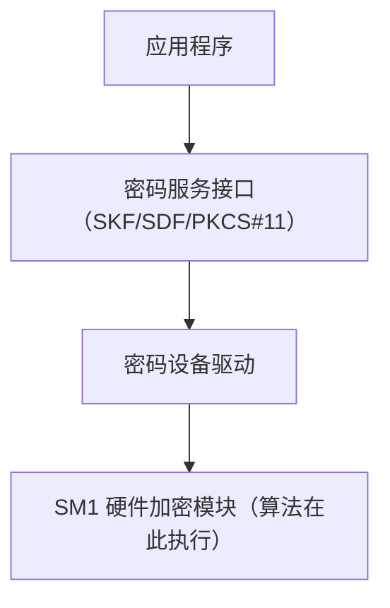
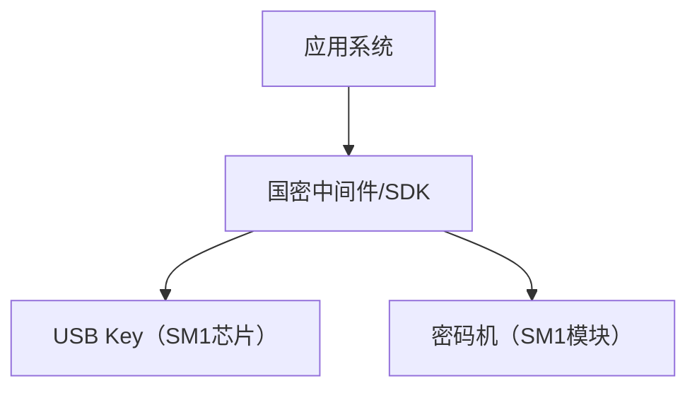

# 国密SM1对称加解密算法

## 1. 算法概述

**SM1** 是由中国国家密码管理局设计的一种对称分组加密算法。SM1 的算法**不公开**，仅以 IP 核的形式存在于芯片中，其安全性在设计上达到与 AES-128 同等水平。

由于 SM1 不公开算法细节，它只能通过经过认证的硬件芯片（如智能卡、加密机等）来使用，无法进行纯软件实现。

### 1.1 基本参数

| 参数 | 值 |
|------|-----|
| 算法类型 | 对称分组加密 |
| 分组长度 | 128 位（16 字节） |
| 密钥长度 | 128 位（16 字节） |
| 加密轮数 | 未公开 |
| 结构 | 未公开 |
| 公开程度 | **不公开（仅芯片实现）** |
| 等效安全强度 | 与 AES-128 相当 |

### 1.2 SM1 在国密体系中的定位

| 算法 | 类型 | 公开程度 | 用途 |
|------|------|----------|------|
| **SM1** | **对称加密** | **不公开** | **硬件加密** |
| SM2 | 非对称加密/签名 | 公开 | 密钥交换、签名 |
| SM3 | 哈希 | 公开 | 完整性校验 |
| SM4 | 对称加密 | 公开 | 软件加密 |
| SM7 | 对称加密 | 不公开 | 非接触式 IC 卡 |
| SM9 | 标识密码 | 公开 | 基于身份的密码 |

## 2. 设计特点

### 2.1 为什么不公开？

SM1 不公开算法细节的设计理念：

| 考量 | 说明 |
|------|------|
| 硬件绑定 | 算法仅存在于认证芯片中，防止软件层面的攻击 |
| 抗逆向工程 | 即使获取硬件，也难以提取算法 |
| 安全策略 | 通过保密性增加额外的安全层（Security through obscurity + 内在安全性）|
| 商业考量 | 保护国产密码技术的知识产权 |
| 分级管理 | 满足特定保密等级的要求 |

### 2.2 已知特征

虽然算法不公开，但以下信息是已知的：

- 分组长度和密钥长度均为 128 位
- 加解密流程使用密钥扩展
- 支持 ECB、CBC 等标准工作模式
- 安全性经过国家密码管理局评估认证
- 可以使用硬件随机数生成器
- 支持主密钥、工作密钥等多层密钥管理

### 2.3 与 SM4 的关系

| 维度 | SM1 | SM4 |
|------|-----|-----|
| 公开程度 | 不公开 | 完全公开 |
| 实现方式 | 仅硬件 | 软件/硬件均可 |
| 安全级别 | 略高（含保密性加成） | 标准 128 位安全 |
| 应用场景 | 高安全级别 | 通用场景 |
| 认证要求 | 需经认证的芯片 | 无特殊要求 |
| 成本 | 较高 | 低 |

## 3. 硬件实现形态

### 3.1 芯片类型

| 芯片形态 | 应用场景 | 典型产品 |
|----------|----------|----------|
| 智能卡芯片 | 身份证、社保卡 | 大唐微电子、华大电子 |
| USB Key | 数字证书、网银 | 飞天诚信、握奇 |
| PCI/PCIe 加密卡 | 服务器加密 | 卫士通、三未信安 |
| SOC 集成 | 嵌入式安全 | 国芯科技 |
| TF 卡 | 移动安全 | 握奇 |

### 3.2 密码模块接口

SM1 通常通过以下标准接口提供服务：



### 3.3 国密接口标准

| 标准 | 全称 | 适用场景 |
|------|------|----------|
| SKF | 智能密码钥匙密码应用接口 | USB Key、智能卡 |
| SDF | 服务器密码机应用接口 | 服务器端加密设备 |
| SOF | 签名应用接口 | 电子签名 |

## 4. 代码示例（通过接口调用）

由于 SM1 不可软件实现，以下为通过硬件接口调用的伪代码/接口示例。

### 4.1 C 语言 SKF 接口调用

```c
#include "skf.h"  // 国密 SKF 接口头文件

/**
 * 使用 SM1-CBC 加密数据
 * 需要连接支持 SM1 的密码设备（如 USB Key）
 */
int sm1_encrypt_example() {
    HANDLE hDev = NULL;
    HANDLE hApp = NULL;
    HANDLE hContainer = NULL;
    HANDLE hKey = NULL;
    
    BYTE key[16] = {0};     // 128位密钥
    BYTE iv[16] = {0};      // 初始向量
    BYTE plaintext[] = "Hello, SM1 Encryption!";
    BYTE ciphertext[256] = {0};
    ULONG cipherLen = sizeof(ciphertext);
    
    BLOCKCIPHERPARAM param;
    param.PaddingType = 1;           // PKCS#5 填充
    param.FeedBitLen = 0;
    memcpy(param.IV, iv, 16);
    
    ULONG rv;
    
    // 1. 连接设备
    rv = SKF_ConnectDev("DeviceName", &hDev);
    if (rv != SAR_OK) return -1;
    
    // 2. 打开应用
    rv = SKF_OpenApplication(hDev, "AppName", &hApp);
    if (rv != SAR_OK) goto cleanup;
    
    // 3. 导入密钥（或使用设备内部密钥）
    rv = SKF_SetSymmKey(hDev, key, SGD_SM1_CBC, &hKey);
    if (rv != SAR_OK) goto cleanup;
    
    // 4. 加密初始化
    rv = SKF_EncryptInit(hKey, param);
    if (rv != SAR_OK) goto cleanup;
    
    // 5. 执行加密
    rv = SKF_Encrypt(hKey, plaintext, sizeof(plaintext), 
                     ciphertext, &cipherLen);
    if (rv != SAR_OK) goto cleanup;
    
    printf("加密成功，密文长度: %lu\n", cipherLen);
    
cleanup:
    if (hKey) SKF_CloseHandle(hKey);
    if (hApp) SKF_CloseApplication(hApp);
    if (hDev) SKF_DisConnectDev(hDev);
    
    return (rv == SAR_OK) ? 0 : -1;
}
```

### 4.2 Java 接口调用示例

```java
/**
 * 通过 JCE Provider 调用 SM1 加密
 * 需要安装支持国密的 JCE Provider（如 CFCA、Koal 等厂商提供）
 */
public class SM1Example {
    
    public static byte[] sm1Encrypt(byte[] plaintext, byte[] key, byte[] iv) 
            throws Exception {
        // 加载国密 Provider（需厂商提供）
        // Security.addProvider(new GMProvider());
        
        // 通过 JCE 接口调用（需要连接硬件设备）
        // Cipher cipher = Cipher.getInstance("SM1/CBC/PKCS5Padding", "GM");
        // SecretKeySpec keySpec = new SecretKeySpec(key, "SM1");
        // IvParameterSpec ivSpec = new IvParameterSpec(iv);
        // cipher.init(Cipher.ENCRYPT_MODE, keySpec, ivSpec);
        // return cipher.doFinal(plaintext);
        
        throw new UnsupportedOperationException(
            "SM1 requires certified hardware device. " +
            "Cannot be implemented in pure software."
        );
    }
    
    public static void main(String[] args) {
        System.out.println("SM1 算法不公开，无法进行纯软件实现。");
        System.out.println("需要通过以下方式使用：");
        System.out.println("  1. USB Key（智能密码钥匙）");
        System.out.println("  2. 服务器密码机");
        System.out.println("  3. 加密卡（PCI/PCIe）");
        System.out.println("  4. 安全芯片（智能卡、SIM卡）");
        System.out.println("\n如需纯软件对称加密，请使用公开的 SM4 算法。");
    }
}
```

### 4.3 Go 语言说明

```go
package main

import "fmt"

/*
SM1 算法不公开，无法进行纯软件实现。

在 Go 语言中使用 SM1 的方式：
1. 通过 CGO 调用 C 语言的 SKF/SDF 接口库
2. 通过 PKCS#11 接口访问硬件设备
3. 使用厂商提供的 Go SDK

如果需要纯软件国密对称加密，请使用 SM4 算法。
推荐库：github.com/emmansun/gmsm
*/

func main() {
	fmt.Println("=== SM1 使用说明 ===")
	fmt.Println()
	fmt.Println("SM1 是不公开的国密对称加密算法，只能通过硬件芯片使用。")
	fmt.Println()
	fmt.Println("使用方式：")
	fmt.Println("  1. 通过 CGO 调用 SKF/SDF 接口")
	fmt.Println("  2. 通过 PKCS#11 接口")
	fmt.Println("  3. 使用厂商提供的 SDK")
	fmt.Println()
	fmt.Println("替代方案：")
	fmt.Println("  如需纯软件实现，请使用 SM4 算法")
	fmt.Println("  推荐库: github.com/emmansun/gmsm")
}
```

## 5. 应用场景

### 5.1 主要应用领域

| 领域 | 应用 | 说明 |
|------|------|------|
| 电子政务 | 政务系统加密 | 等保三级以上系统 |
| 金融行业 | 银行卡、POS 机 | 金融 IC 卡 |
| 身份认证 | 二代身份证 | 卡片内部加密 |
| 社会保障 | 社保卡 | 信息保护 |
| 电子商务 | 数字证书 | USB Key 中 |
| 移动支付 | NFC 支付 | 安全芯片 |
| 物联网 | 安全通信 | 嵌入式安全芯片 |

### 5.2 合规要求

在中国，以下场景可能要求使用国密算法（包括 SM1）：

- 等级保护三级及以上系统
- 关键信息基础设施
- 政府机关信息系统
- 金融核心系统
- 涉及国家秘密的系统

### 5.3 典型部署架构



## 6. SM1 vs AES 对比

| 维度 | SM1 | AES-128 |
|------|-----|---------|
| 密钥长度 | 128 位 | 128/192/256 位 |
| 分组长度 | 128 位 | 128 位 |
| 公开程度 | 不公开 | 完全公开 |
| 实现方式 | 仅硬件 | 软件/硬件 |
| 国际认可 | 中国标准 | 国际标准 |
| 形式化验证 | 不可公开验证 | 可公开验证 |
| 适用范围 | 中国境内特定领域 | 全球通用 |
| 性能 | 取决于硬件 | 有 AES-NI 加速 |

## 7. 选型建议

| 场景 | 建议算法 | 原因 |
|------|----------|------|
| 国内等保/合规要求 | SM1（硬件）| 政策要求 |
| 国内通用加密 | SM4 | 公开算法，软件可实现 |
| 国际通用 | AES-256 | 国际标准，生态完善 |
| 高安全 + 国密合规 | SM1（硬件）| 硬件保护 + 算法保密 |
| 双算法支持 | SM4 + AES | 同时满足国内外要求 |

## 8. 总结

| 维度 | 评价 |
|------|------|
| 安全性 | ⭐⭐⭐⭐ 经国家密码管理局认证，与 AES-128 相当 |
| 可用性 | ⭐⭐ 必须通过硬件使用，门槛较高 |
| 透明性 | ⭐ 算法不公开，无法独立验证 |
| 合规性 | ⭐⭐⭐⭐⭐ 满足中国国密标准要求 |
| 性价比 | ⭐⭐⭐ 硬件成本较高 |

SM1 在中国特定安全领域有不可替代的地位。但对于大多数商用场景，**SM4**（公开算法，软件可实现）是更实际的国密对称加密选择。只有在安全等级要求特别高、需要硬件级保护的场景中，才需要使用 SM1。
