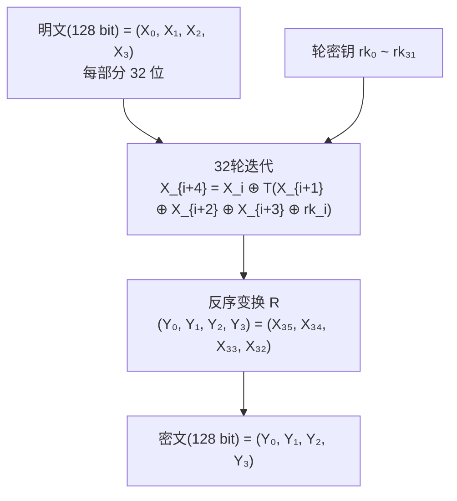

# 国密SM4对称加解密算法

## 1. 算法概述

**SM4**（原名 SMS4）是中国国家密码管理局于 2012 年发布的分组对称加密算法标准（GM/T 0002-2012）。它最初作为无线局域网安全标准 WAPI 的加密算法设计，后来成为通用的国密对称加密标准。

SM4 是**完全公开**的算法（区别于不公开的 SM1），可以在软件和硬件中自由实现。其安全性与 AES-128 相当，是国密体系中使用最广泛的对称加密算法。

### 1.1 基本参数

| 参数 | 值 |
|------|-----|
| 算法类型 | 对称分组加密 |
| 分组长度 | 128 位（16 字节） |
| 密钥长度 | 128 位（16 字节） |
| 加密轮数 | 32 轮 |
| 结构 | 非平衡 Feistel（广义 Feistel） |
| S-盒大小 | 8×8（256 字节查找表） |
| 标准 | GM/T 0002-2012, ISO/IEC 18033-3:2010 |

### 1.2 标准化历程

- **2006年**：作为 WAPI 的加密算法首次公开
- **2012年**：发布为国家密码行业标准 GM/T 0002-2012
- **2016年**：成为国家标准 GB/T 32907-2016
- **2021年**：纳入 ISO/IEC 18033-3:2010 国际标准

## 2. 算法原理

### 2.1 整体结构

SM4 采用 32 轮的非平衡 Feistel 结构：



### 2.2 轮函数 T

轮函数 T 是一个可逆变换，由**非线性变换 τ** 和**线性变换 L** 复合而成：

```
T(A) = L(τ(A))
```

#### 2.2.1 非线性变换 τ（S-盒替换）

将 32 位输入分为 4 个字节，每个字节通过 S-盒替换：

```
τ(A) = (Sbox(a₀), Sbox(a₁), Sbox(a₂), Sbox(a₃))
```

SM4 的 S-盒（16×16，十六进制表示）：

```
     0  1  2  3  4  5  6  7  8  9  A  B  C  D  E  F
0:  D6 90 E9 FE CC E1 3D B7 16 B6 14 C2 28 FB 2C 05
1:  2B 67 9A 76 2A BE 04 C3 AA 44 13 26 49 86 06 99
2:  9C 42 50 F4 91 EF 98 7A 33 54 0B 43 ED CF AC 62
3:  E4 B3 1C A9 C9 08 E8 95 80 DF 94 FA 75 8F 3F A6
4:  47 07 A7 FC F3 73 17 BA 83 59 3C 19 E6 85 4F A8
5:  68 6B 81 B2 71 64 DA 8B F8 EB 0F 4B 70 56 9D 35
6:  1E 24 0E 5E 63 58 D1 A2 25 22 7C 3B 01 21 78 87
7:  D4 00 46 57 9F D3 27 52 4C 36 02 E7 A0 C4 C8 9E
8:  EA BF 8A D2 40 C7 38 B5 A3 F7 F2 CE F9 61 15 A1
9:  E0 AE 5D A4 9B 34 1A 55 AD 93 32 30 F5 8C B1 E3
A:  1D F6 E2 2E 82 66 CA 60 C0 29 23 AB 0D 53 4E 6F
B:  D5 DB 37 45 DE FD 8E 2F 03 FF 6A 72 6D 6C 5B 51
C:  8D 1B AF 92 BB DD BC 7F 11 D9 5C 41 1F 10 5A D8
D:  0A C1 31 88 A5 CD 7B BD 2D 74 D0 12 B8 E5 B4 B0
E:  89 69 97 4A 0C 96 77 7E 65 B9 F1 09 C5 6E C6 84
F:  18 F0 7D EC 3A DC 4D 20 79 EE 5F 3E D7 CB 39 48
```

#### 2.2.2 线性变换 L

```
L(B) = B ⊕ (B <<< 2) ⊕ (B <<< 10) ⊕ (B <<< 18) ⊕ (B <<< 24)
```

其中 `<<<` 表示 32 位循环左移。

### 2.3 密钥扩展

#### 2.3.1 系统参数 FK

```
FK₀ = A3B1BAC6
FK₁ = 56AA3350
FK₂ = 677D9197
FK₃ = B27022DC
```

#### 2.3.2 常量 CK

```
CK_i 的生成方式：
ck_{i,j} = (4i + j) × 7 (mod 256)

其中 i = 0, 1, ..., 31; j = 0, 1, 2, 3
```

32 个 CK 值：

```
00070e15, 1c232a31, 383f464d, 545b6269,
70777e85, 8c939aa1, a8afb6bd, c4cbd2d9,
e0e7eef5, fc030a11, 181f262d, 343b4249,
50575e65, 6c737a81, 888f969d, a4abb2b9,
c0c7ced5, dce3eaf1, f8ff060d, 141b2229,
30373e45, 4c535a61, 686f767d, 848b9299,
a0a7aeb5, bcc3cad1, d8dfe6ed, f4fb0209,
10171e25, 2c333a41, 484f565d, 646b7279
```

#### 2.3.3 密钥扩展过程

```
1. 将128位密钥 MK 分为4个32位字: MK = (MK₀, MK₁, MK₂, MK₃)
2. 计算: K_i = MK_i ⊕ FK_i, (i = 0, 1, 2, 3)
3. 生成轮密钥:
   rk_i = K_{i+4} = K_i ⊕ T'(K_{i+1} ⊕ K_{i+2} ⊕ K_{i+3} ⊕ CK_i)
   (i = 0, 1, ..., 31)

其中 T' = L'(τ(·))，L' 是密钥扩展专用线性变换：
L'(B) = B ⊕ (B <<< 13) ⊕ (B <<< 23)
```

### 2.4 解密过程

SM4 的解密与加密算法结构相同，只需将**轮密钥使用顺序逆序**：

```
解密时使用: rk₃₁, rk₃₀, ..., rk₁, rk₀
```

## 3. 安全性分析

### 3.1 安全强度

| 性质 | 理论强度 | 当前状态 |
|------|----------|----------|
| 暴力攻击 | 2¹²⁸ | 不可行 |
| 差分分析 | 安全 | 完整 32 轮安全 |
| 线性分析 | 安全 | 完整 32 轮安全 |

### 3.2 公开分析结果

| 攻击类型 | 最优结果 | 影响 |
|----------|----------|------|
| 差分密码分析 | 约 23 轮 | 不影响完整版本 |
| 线性密码分析 | 约 24 轮 | 不影响完整版本 |
| 不可能差分 | 约 14 轮 | 不影响完整版本 |
| 积分攻击 | 约 13 轮 | 不影响完整版本 |

### 3.3 与 AES-128 的安全性对比

| 维度 | SM4 | AES-128 |
|------|-----|---------|
| 密钥长度 | 128 位 | 128 位 |
| 安全目标 | 128 位 | 128 位 |
| 最佳公开攻击 | ~23 轮 | ~7 轮（Biclique） |
| 轮数/攻击轮数 比 | 32/23 ≈ 1.39 | 10/7 ≈ 1.43 |
| 安全余量 | 充足 | 充足 |

两者在当前技术水平下都是安全的。

### 3.4 S-盒特性

SM4 的 S-盒具有良好的密码学性质：

- 差分均匀性：δ = 4
- 非线性度：N_f = 112
- 代数次数：7

这些指标与 AES 的 S-盒相当。

## 4. Go 语言实现

```go
package main

import (
	"crypto/cipher"
	"crypto/rand"
	"encoding/hex"
	"fmt"
	"io"

	"github.com/emmansun/gmsm/sm4"
)

// PKCS7 填充
func PKCS7Padding(data []byte, blockSize int) []byte {
	padding := blockSize - len(data)%blockSize
	padText := make([]byte, padding)
	for i := range padText {
		padText[i] = byte(padding)
	}
	return append(data, padText...)
}

// PKCS7 去除填充
func PKCS7Unpadding(data []byte) []byte {
	padding := int(data[len(data)-1])
	return data[:len(data)-padding]
}

// SM4-GCM 加密（推荐）
func SM4GCMEncrypt(plaintext, key []byte) ([]byte, error) {
	block, err := sm4.NewCipher(key)
	if err != nil {
		return nil, err
	}

	aesGCM, err := cipher.NewGCM(block)
	if err != nil {
		return nil, err
	}

	nonce := make([]byte, aesGCM.NonceSize())
	if _, err := io.ReadFull(rand.Reader, nonce); err != nil {
		return nil, err
	}

	ciphertext := aesGCM.Seal(nonce, nonce, plaintext, nil)
	return ciphertext, nil
}

// SM4-GCM 解密
func SM4GCMDecrypt(ciphertext, key []byte) ([]byte, error) {
	block, err := sm4.NewCipher(key)
	if err != nil {
		return nil, err
	}

	aesGCM, err := cipher.NewGCM(block)
	if err != nil {
		return nil, err
	}

	nonceSize := aesGCM.NonceSize()
	nonce, ciphertext := ciphertext[:nonceSize], ciphertext[nonceSize:]

	return aesGCM.Open(nil, nonce, ciphertext, nil)
}

// SM4-CBC 加密
func SM4CBCEncrypt(plaintext, key []byte) ([]byte, error) {
	block, err := sm4.NewCipher(key)
	if err != nil {
		return nil, err
	}

	plaintext = PKCS7Padding(plaintext, sm4.BlockSize)
	ciphertext := make([]byte, sm4.BlockSize+len(plaintext))
	iv := ciphertext[:sm4.BlockSize]
	if _, err := io.ReadFull(rand.Reader, iv); err != nil {
		return nil, err
	}

	mode := cipher.NewCBCEncrypter(block, iv)
	mode.CryptBlocks(ciphertext[sm4.BlockSize:], plaintext)

	return ciphertext, nil
}

// SM4-CBC 解密
func SM4CBCDecrypt(ciphertext, key []byte) ([]byte, error) {
	block, err := sm4.NewCipher(key)
	if err != nil {
		return nil, err
	}

	iv := ciphertext[:sm4.BlockSize]
	ciphertext = ciphertext[sm4.BlockSize:]

	mode := cipher.NewCBCDecrypter(block, iv)
	mode.CryptBlocks(ciphertext, ciphertext)

	return PKCS7Unpadding(ciphertext), nil
}

func main() {
	// SM4 密钥为 16 字节
	key := []byte("1234567890abcdef")
	plaintext := []byte("Hello, SM4 Encryption!")

	fmt.Printf("明文: %s\n", plaintext)
	fmt.Printf("密钥(hex): %s\n", hex.EncodeToString(key))

	// GCM 模式
	fmt.Println("\n=== SM4-GCM 模式 ===")
	encrypted, err := SM4GCMEncrypt(plaintext, key)
	if err != nil {
		panic(err)
	}
	fmt.Printf("密文(hex): %s\n", hex.EncodeToString(encrypted))

	decrypted, err := SM4GCMDecrypt(encrypted, key)
	if err != nil {
		panic(err)
	}
	fmt.Printf("解密: %s\n", decrypted)

	// CBC 模式
	fmt.Println("\n=== SM4-CBC 模式 ===")
	encryptedCBC, err := SM4CBCEncrypt(plaintext, key)
	if err != nil {
		panic(err)
	}
	fmt.Printf("密文(hex): %s\n", hex.EncodeToString(encryptedCBC))

	decryptedCBC, err := SM4CBCDecrypt(encryptedCBC, key)
	if err != nil {
		panic(err)
	}
	fmt.Printf("解密: %s\n", decryptedCBC)
}
```

## 5. SM4 vs AES 选型指南

| 场景 | 推荐 | 原因 |
|------|------|------|
| 中国境内合规系统 | SM4 | 国密标准要求 |
| 国际化项目 | AES | 全球通用 |
| 双合规需求 | SM4 + AES | 同时满足 |
| 性能极致优化 | AES (有 AES-NI) | 硬件加速更成熟 |
| 国密改造 | SM4 替换 AES/DES | 直接替换 |

## 6. 总结

| 维度 | 评价 |
|------|------|
| 安全性 | ⭐⭐⭐⭐⭐ 与 AES-128 同级，无已知攻击 |
| 性能 | ⭐⭐⭐⭐ 软件实现较好，部分平台有硬件加速 |
| 公开性 | ⭐⭐⭐⭐⭐ 完全公开，可自由实现 |
| 合规性 | ⭐⭐⭐⭐⭐ 中国国标 + ISO 国际标准 |
| 生态 | ⭐⭐⭐⭐ 主流语言均有成熟实现 |
| 推荐度 | ⭐⭐⭐⭐⭐ 国密对称加密首选 |

SM4 是中国国密体系中最重要的对称加密算法——完全公开、安全可靠、生态完善。对于需要满足国密合规的系统，SM4 是对称加密的首选算法；对于国际化系统的国密改造，SM4 可以直接替换 AES，工作模式完全兼容。
