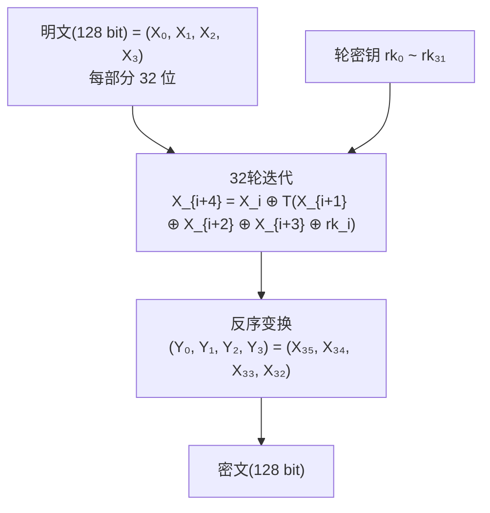

# 国密SM4对称加解密算法

## 1. 算法概述

**SM4**（原名 SMS4）是中国国家密码管理局于 2012 年发布的分组对称加密算法标准（GM/T 0002-2012）。它最初作为无线局域网安全标准 WAPI 的加密算法设计，后来成为通用的国密对称加密标准。

SM4 是**完全公开**的算法（区别于不公开的 SM1），可以在软件和硬件中自由实现。其安全性与 AES-128 相当，是国密体系中使用最广泛的对称加密算法。

> 对于需要满足**国密合规**要求的系统（政务、金融、电信等），SM4 是对称加密的首选算法。

### 1.1 基本参数

| 参数 | 值 |
|------|-----|
| 算法类型 | 对称分组加密 |
| 分组长度 | 128 位（16 字节） |
| 密钥长度 | 128 位（16 字节） |
| 加密轮数 | 32 轮 |
| 结构 | 非平衡 Feistel（广义 Feistel） |
| 标准 | GM/T 0002-2012, GB/T 32907-2016, ISO/IEC 18033-3:2010 |
| 安全状态 | ✅ **安全，国密对称加密标准** |

### 1.2 标准化历程

- **2006年**：作为 WAPI 的加密算法首次公开
- **2012年**：发布为国家密码行业标准 GM/T 0002-2012
- **2016年**：成为国家标准 GB/T 32907-2016
- **2021年**：纳入 ISO/IEC 18033-3:2010 国际标准（国际认可）

## 2. 算法原理（简述）

SM4 采用 32 轮的**非平衡 Feistel 结构**：



**核心流程**：

1. 将 128 位明文分为 4 个 32 位字
2. 每轮通过**轮函数 T** 进行变换：T = 线性变换 L ∘ 非线性变换 τ（S-盒替换）
3. 经过 32 轮迭代后反序输出得到密文
4. 解密与加密结构相同，只需将轮密钥使用顺序逆序

**与 AES 的结构对比**：

| 维度 | SM4 | AES-128 |
|------|-----|---------|
| 结构 | 广义 Feistel | SPN |
| 轮数 | 32 轮 | 10 轮 |
| 分组/密钥 | 128 位 / 128 位 | 128 位 / 128~256 位 |
| S-盒 | 8×8（固定） | 8×8（基于 GF(2⁸) 逆元） |
| 安全余量 | 32/23 ≈ 1.39 | 10/7 ≈ 1.43 |

两者安全余量相当，均为当前安全的算法。

## 3. 安全性分析

### 3.1 安全强度

| 性质 | 评估 |
|------|------|
| 暴力攻击 | 2¹²⁸，当前不可行 |
| 差分分析 | 完整 32 轮安全（最优攻击约 23 轮） |
| 线性分析 | 完整 32 轮安全（最优攻击约 24 轮） |
| 国际认可 | ISO/IEC 18033-3 收录 |

### 3.2 与 AES-128 的安全性对比

SM4 与 AES-128 在当前技术水平下**安全性相当**：

- 两者密钥长度相同（128 位）
- 两者安全目标相同（128 位安全强度）
- 两者安全余量充足
- SM4 已通过国际标准化审查

### 3.3 量子计算影响

与 AES-128 相同，Grover 算法会将 SM4 安全性降至 64 位（可能不够安全）。对于后量子安全：
- 短期：SM4 仍然安全（量子计算机尚不成熟）
- 长期：关注国密后量子方案的发展

## 4. 开发者实践指南

### 4.1 何时使用 SM4

| 场景 | 是否使用 SM4 | 说明 |
|------|-------------|------|
| 政务系统 | ✅ 必须 | 国密合规要求 |
| 金融系统（国内） | ✅ 推荐 | 监管要求逐步强制 |
| 电信系统 | ✅ 推荐 | 行业规范要求 |
| 国际化项目 | ❌ 用 AES | AES 全球通用 |
| 双合规需求 | ✅ SM4 + AES | 同时满足国内国际标准 |
| 替换 DES/3DES | ✅ 可以 | SM4 工作模式与 AES 兼容，可直接替换 |

### 4.2 工作模式选择

SM4 支持与 AES 相同的工作模式：

| 模式 | 推荐度 | 说明 |
|------|--------|------|
| **SM4-GCM** | ✅ 首选 | AEAD 模式，加密+认证 |
| SM4-CBC + HMAC-SM3 | ⚠️ 可用 | 需额外做 MAC |
| SM4-ECB | ❌ 禁止 | 相同明文块产生相同密文块 |
| SM4-CTR | ⚠️ 需搭配 MAC | 需要额外完整性保护 |

### 4.3 使用要点

| 要点 | 说明 |
|------|------|
| 密钥长度 | 固定 16 字节（128 位） |
| 分组大小 | 16 字节（与 AES 相同） |
| Nonce/IV | GCM 用 12 字节，CBC 用 16 字节 |
| 填充方式 | CBC 模式用 PKCS7，GCM/CTR 不需要填充 |
| Go 推荐库 | `github.com/emmansun/gmsm/sm4` |
| Java 推荐库 | Bouncy Castle（`org.bouncycastle`） |

### 4.4 国密全家桶搭配

完整的国密方案通常包含：

| 功能 | 国密算法 | 等价国际算法 |
|------|----------|-------------|
| 对称加密 | SM4 | AES |
| 摘要/哈希 | SM3 | SHA-256 |
| 非对称加密/签名 | SM2 | ECDSA / ECIES |
| 密钥协商 | SM2 | ECDH |
| 随机数 | 国密随机数生成器 | CSPRNG |

### 4.5 从 AES 迁移到 SM4

SM4 与 AES 的工作模式完全兼容，迁移非常简单：

```go
// AES-GCM 代码
block, _ := aes.NewCipher(key)  // 16/24/32 字节密钥

// 迁移到 SM4-GCM，只需替换 NewCipher
block, _ := sm4.NewCipher(key)  // 16 字节密钥

// 后续 GCM 使用代码完全不变
aead, _ := cipher.NewGCM(block)
```

### 4.6 性能参考

| 实现 | 吞吐量 | 说明 |
|------|--------|------|
| SM4 纯软件 | ~200-400 MB/s | 取决于具体实现优化 |
| SM4 硬件加速 | ~1000+ MB/s | 部分 ARM 和国产 CPU 支持 |
| AES-NI | ~4000+ MB/s | 对比参考 |

SM4 性能略低于带 AES-NI 的 AES，但对于大多数应用场景来说完全够用。

## 5. Go 语言实现

### 5.1 SM4-GCM（推荐）

```go
package main

import (
	"crypto/cipher"
	"crypto/rand"
	"encoding/hex"
	"fmt"
	"io"

	"github.com/emmansun/gmsm/sm4"
)

// SM4-GCM 加密
func SM4GCMEncrypt(plaintext, key []byte) ([]byte, error) {
	block, err := sm4.NewCipher(key)
	if err != nil {
		return nil, err
	}

	aead, err := cipher.NewGCM(block)
	if err != nil {
		return nil, err
	}

	nonce := make([]byte, aead.NonceSize()) // 12 字节
	if _, err := io.ReadFull(rand.Reader, nonce); err != nil {
		return nil, err
	}

	// nonce 放在密文前面，便于解密时提取
	ciphertext := aead.Seal(nonce, nonce, plaintext, nil)
	return ciphertext, nil
}

// SM4-GCM 解密
func SM4GCMDecrypt(ciphertext, key []byte) ([]byte, error) {
	block, err := sm4.NewCipher(key)
	if err != nil {
		return nil, err
	}

	aead, err := cipher.NewGCM(block)
	if err != nil {
		return nil, err
	}

	nonceSize := aead.NonceSize()
	if len(ciphertext) < nonceSize {
		return nil, fmt.Errorf("ciphertext too short")
	}

	nonce, ciphertext := ciphertext[:nonceSize], ciphertext[nonceSize:]
	return aead.Open(nil, nonce, ciphertext, nil)
}

func main() {
	// SM4 密钥固定为 16 字节
	key := make([]byte, 16)
	if _, err := rand.Read(key); err != nil {
		panic(err)
	}

	plaintext := []byte("Hello, SM4-GCM Encryption!")

	fmt.Printf("明文: %s\n", plaintext)
	fmt.Printf("密钥(hex): %s\n", hex.EncodeToString(key))

	// 加密
	encrypted, err := SM4GCMEncrypt(plaintext, key)
	if err != nil {
		panic(err)
	}
	fmt.Printf("密文(hex): %s\n", hex.EncodeToString(encrypted))

	// 解密
	decrypted, err := SM4GCMDecrypt(encrypted, key)
	if err != nil {
		panic(err)
	}
	fmt.Printf("解密: %s\n", decrypted)
}
```

### 5.2 SM4-CBC（兼容场景）

```go
package main

import (
	"crypto/cipher"
	"crypto/rand"
	"encoding/hex"
	"fmt"
	"io"

	"github.com/emmansun/gmsm/sm4"
)

// PKCS7 填充
func PKCS7Padding(data []byte, blockSize int) []byte {
	padding := blockSize - len(data)%blockSize
	padText := make([]byte, padding)
	for i := range padText {
		padText[i] = byte(padding)
	}
	return append(data, padText...)
}

// PKCS7 去除填充
func PKCS7Unpadding(data []byte) ([]byte, error) {
	if len(data) == 0 {
		return nil, fmt.Errorf("empty data")
	}
	padding := int(data[len(data)-1])
	if padding > len(data) || padding == 0 {
		return nil, fmt.Errorf("invalid padding")
	}
	return data[:len(data)-padding], nil
}

// SM4-CBC 加密
func SM4CBCEncrypt(plaintext, key []byte) ([]byte, error) {
	block, err := sm4.NewCipher(key)
	if err != nil {
		return nil, err
	}

	plaintext = PKCS7Padding(plaintext, sm4.BlockSize)
	ciphertext := make([]byte, sm4.BlockSize+len(plaintext))
	iv := ciphertext[:sm4.BlockSize]
	if _, err := io.ReadFull(rand.Reader, iv); err != nil {
		return nil, err
	}

	mode := cipher.NewCBCEncrypter(block, iv)
	mode.CryptBlocks(ciphertext[sm4.BlockSize:], plaintext)

	return ciphertext, nil
}

// SM4-CBC 解密
func SM4CBCDecrypt(ciphertext, key []byte) ([]byte, error) {
	block, err := sm4.NewCipher(key)
	if err != nil {
		return nil, err
	}

	if len(ciphertext) < sm4.BlockSize*2 {
		return nil, fmt.Errorf("ciphertext too short")
	}

	iv := ciphertext[:sm4.BlockSize]
	ciphertext = ciphertext[sm4.BlockSize:]

	mode := cipher.NewCBCDecrypter(block, iv)
	plaintext := make([]byte, len(ciphertext))
	mode.CryptBlocks(plaintext, ciphertext)

	return PKCS7Unpadding(plaintext)
}

func main() {
	key := []byte("1234567890abcdef") // 16 字节
	plaintext := []byte("Hello, SM4-CBC Encryption!")

	fmt.Printf("明文: %s\n", plaintext)

	encrypted, err := SM4CBCEncrypt(plaintext, key)
	if err != nil {
		panic(err)
	}
	fmt.Printf("密文(hex): %s\n", hex.EncodeToString(encrypted))

	decrypted, err := SM4CBCDecrypt(encrypted, key)
	if err != nil {
		panic(err)
	}
	fmt.Printf("解密: %s\n", decrypted)
}
```

## 6. SM4 vs AES 选型指南

| 场景 | 推荐 | 原因 |
|------|------|------|
| 中国境内合规系统 | SM4 | 国密标准要求 |
| 国际化项目 | AES | 全球通用，硬件加速更好 |
| 双合规需求 | SM4 + AES 双算法 | 同时满足国内外标准 |
| 性能极致优化 | AES（有 AES-NI） | 硬件加速更成熟 |
| 国密改造 | SM4 替换 AES/DES | 工作模式兼容，迁移简单 |

## 7. 总结

| 维度 | 评价 |
|------|------|
| 安全性 | ⭐⭐⭐⭐⭐ 与 AES-128 同级，无已知实际攻击 |
| 性能 | ⭐⭐⭐⭐ 软件实现良好，部分平台有硬件加速 |
| 合规性 | ⭐⭐⭐⭐⭐ 国标 + ISO 国际标准 |
| 生态 | ⭐⭐⭐⭐ 主流语言均有成熟实现 |
| 迁移成本 | ⭐⭐⭐⭐⭐ 与 AES 工作模式兼容，替换简单 |

**一句话总结**：需要国密合规就用 SM4-GCM，使用方式和 AES-GCM 几乎完全一样，迁移成本极低。
