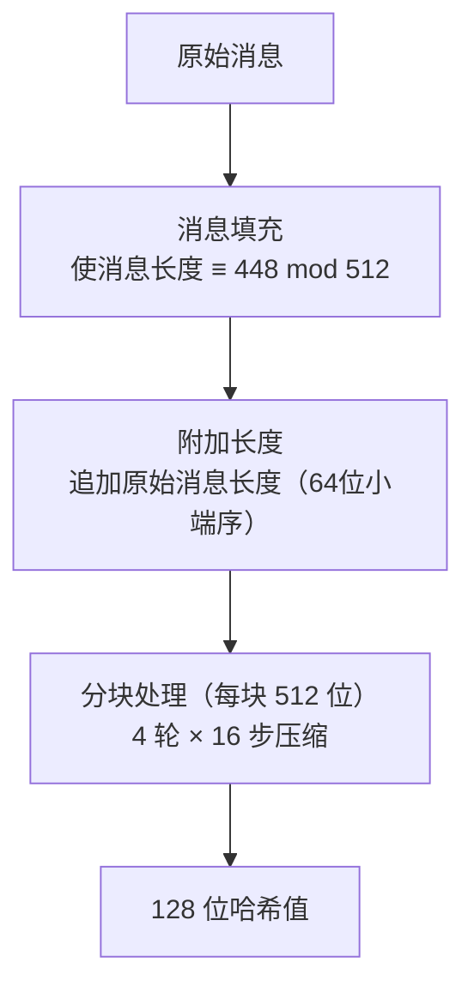

# MD5摘要算法

## 1. 算法概述

**MD5**（Message-Digest Algorithm 5）是由 Ronald Rivest（RSA 中的 R）于 1991 年设计的密码散列函数，输出 128 位（16 字节）的哈希值。它是 MD4 的改进版本，曾广泛用于验证数据完整性。

MD5 定义在 RFC 1321 中，曾是互联网上使用最广泛的哈希算法之一，但由于已发现严重的碰撞漏洞，现已**不推荐用于任何安全用途**。

### 1.1 基本参数

| 参数 | 值 |
|------|-----|
| 算法类型 | 密码散列函数 |
| 输出长度 | 128 位（32 个十六进制字符） |
| 输入长度 | 任意（理论上无限制） |
| 分组大小 | 512 位（64 字节） |
| 计算轮数 | 4 轮 × 16 步 = 64 步 |
| 结构 | Merkle-Damgård |
| 标准 | RFC 1321 |

### 1.2 散列函数的基本性质

一个安全的密码散列函数应满足：

| 性质 | 说明 | MD5 状态 |
|------|------|----------|
| 抗原像攻击 | 给定 H(x)，难以找到 x | ⚠️ 弱化但尚未完全破解 |
| 抗第二原像攻击 | 给定 x，难以找到 x' 使 H(x)=H(x') | ⚠️ 理论弱化 |
| 抗碰撞攻击 | 难以找到任意 x≠x' 使 H(x)=H(x') | ❌ **已彻底破解** |
| 雪崩效应 | 输入微小变化导致输出巨大变化 | ✅ 满足 |
| 确定性 | 相同输入总产生相同输出 | ✅ 满足 |

## 2. 算法原理

### 2.1 整体流程



### 2.2 消息填充

1. 在消息末尾追加一个 `1` 位
2. 追加若干 `0` 位，使消息长度 ≡ 448 (mod 512)
3. 追加原始消息长度的 64 位小端序表示

填充后消息总长度为 512 的倍数。

### 2.3 初始化向量

4 个 32 位寄存器的初始值（小端序）：

```
A = 0x67452301
B = 0xEFCDAB89
C = 0x98BADCFE
D = 0x10325476
```

### 2.4 压缩函数

对每个 512 位消息块，执行 4 轮操作，每轮 16 步：

#### 四个非线性函数

```
F(B, C, D) = (B ∧ C) ∨ (¬B ∧ D)     // 轮1: 选择函数
G(B, C, D) = (B ∧ D) ∨ (C ∧ ¬D)     // 轮2: 条件函数
H(B, C, D) = B ⊕ C ⊕ D              // 轮3: 奇偶函数
I(B, C, D) = C ⊕ (B ∨ ¬D)           // 轮4: 逻辑函数
```

#### 每步操作

```
设当前步使用的非线性函数为 func，则：
temp = A + func(B, C, D) + M[k] + T[i]
A = D
D = C
C = B
B = B + leftrotate(temp, s)

其中：
- M[k] 为当前消息块的第 k 个 32 位字
- T[i] 为常量表（基于 sin 函数生成）
- s 为每步的循环左移位数
```

#### 常量表 T

```
T[i] = floor(2³² × |sin(i)|)，i = 1, 2, ..., 64
```

### 2.5 输出

处理完所有消息块后，将 A、B、C、D 四个寄存器按小端序拼接，得到 128 位哈希值。

## 3. 安全性分析

### 3.1 碰撞攻击历史

| 时间 | 事件 | 研究者 |
|------|------|--------|
| 1996 | 发现 MD5 压缩函数碰撞 | Dobbertin |
| 2004 | 首次构造完整碰撞 | 王小云等 |
| 2005 | 碰撞攻击实用化 | 多个研究组 |
| 2008 | 利用 MD5 碰撞伪造 CA 证书 | Sotirov 等 |
| 2012 | Flame 恶意软件利用 MD5 碰撞 | 国家级攻击 |

### 3.2 王小云的突破

2004 年，中国密码学家**王小云**等人发表了对 MD5 的实用碰撞攻击：

- 找到碰撞的计算复杂度从理论的 2⁶⁴ 降低到约 2³⁹
- 在普通计算机上可在**数秒内**找到碰撞
- 这一成果震动了整个密码学界

### 3.3 碰撞示例

以下两个不同的输入产生相同的 MD5 值（前缀碰撞攻击）：

```
一个实际例子：两个不同的可执行文件可以被构造为具有相同的 MD5 哈希
这意味着 MD5 不能用于验证文件完整性或真实性
```

### 3.4 当前安全状态

| 安全性质 | 状态 | 影响 |
|----------|------|------|
| 碰撞攻击 | ❌ 秒级破解 | 不能用于数字签名、证书 |
| 前缀碰撞 | ❌ 实用化 | 不能用于任何认证场景 |
| 原像攻击 | ⚠️ 理论弱化 | 不建议依赖 |
| 长度扩展攻击 | ❌ 存在 | 不能用于 MAC（直接构造） |

> **🚨 安全警告**
>
> **MD5 已被密码学界彻底抛弃用于安全用途。** 任何依赖 MD5 碰撞抗性的应用都是不安全的。

## 4. 代码实现

### 4.1 Go 语言实现

```go
package main

import (
	"crypto/md5"
	"encoding/hex"
	"fmt"
	"io"
	"os"
	"strings"
)

// 计算字符串的 MD5
func MD5String(s string) string {
	hash := md5.Sum([]byte(s))
	return hex.EncodeToString(hash[:])
}

// 计算文件的 MD5
func MD5File(filepath string) (string, error) {
	file, err := os.Open(filepath)
	if err != nil {
		return "", err
	}
	defer file.Close()

	hasher := md5.New()
	if _, err := io.Copy(hasher, file); err != nil {
		return "", err
	}

	return hex.EncodeToString(hasher.Sum(nil)), nil
}

// 流式计算 MD5（适合大数据）
func MD5Stream(reader io.Reader) (string, error) {
	hasher := md5.New()
	if _, err := io.Copy(hasher, reader); err != nil {
		return "", err
	}
	return hex.EncodeToString(hasher.Sum(nil)), nil
}

func main() {
	// 基本用法
	fmt.Println("=== MD5 哈希示例 ===")

	testCases := []string{
		"",
		"hello",
		"Hello, MD5!",
		"The quick brown fox jumps over the lazy dog",
	}

	for _, tc := range testCases {
		hash := MD5String(tc)
		fmt.Printf("MD5(\"%s\")\n  = %s\n", tc, hash)
	}

	// 验证雪崩效应
	fmt.Println("\n=== 雪崩效应演示 ===")
	s1 := "Hello"
	s2 := "hello" // 仅一个字母大小写不同
	fmt.Printf("MD5(\"%s\") = %s\n", s1, MD5String(s1))
	fmt.Printf("MD5(\"%s\") = %s\n", s2, MD5String(s2))

	// 流式计算
	fmt.Println("\n=== 流式计算 ===")
	reader := strings.NewReader("Hello, streaming MD5!")
	hash, _ := MD5Stream(reader)
	fmt.Printf("流式 MD5 = %s\n", hash)
}
```

### 4.2 Python 实现

```python
import hashlib

def md5_string(s: str) -> str:
    """计算字符串的 MD5"""
    return hashlib.md5(s.encode('utf-8')).hexdigest()

def md5_file(filepath: str) -> str:
    """计算文件的 MD5"""
    hasher = hashlib.md5()
    with open(filepath, 'rb') as f:
        for chunk in iter(lambda: f.read(4096), b''):
            hasher.update(chunk)
    return hasher.hexdigest()

def md5_bytes(data: bytes) -> str:
    """计算字节数据的 MD5"""
    return hashlib.md5(data).hexdigest()

if __name__ == "__main__":
    print("=== MD5 哈希示例 ===")

    test_cases = [
        "",
        "hello",
        "Hello, MD5!",
        "The quick brown fox jumps over the lazy dog",
    ]

    for tc in test_cases:
        hash_value = md5_string(tc)
        print(f'MD5("{tc}")')
        print(f'  = {hash_value}')

    # 验证雪崩效应
    print("\n=== 雪崩效应演示 ===")
    s1, s2 = "Hello", "hello"
    h1, h2 = md5_string(s1), md5_string(s2)
    print(f'MD5("{s1}") = {h1}')
    print(f'MD5("{s2}") = {h2}')

    # 计算不同位数
    bits_diff = bin(int(h1, 16) ^ int(h2, 16)).count('1')
    print(f"不同的位数: {bits_diff}/128 ({bits_diff/128*100:.1f}%)")

    # 增量计算
    print("\n=== 增量计算 ===")
    hasher = hashlib.md5()
    hasher.update(b"Hello, ")
    hasher.update(b"MD5!")
    print(f"增量计算结果: {hasher.hexdigest()}")
    print(f"一次性计算:   {md5_string('Hello, MD5!')}")
```

### 4.3 Java 实现

```java
import java.security.MessageDigest;
import java.nio.file.Files;
import java.nio.file.Path;
import java.util.HexFormat;

public class MD5Example {

    public static String md5String(String input) throws Exception {
        MessageDigest md = MessageDigest.getInstance("MD5");
        byte[] hash = md.digest(input.getBytes("UTF-8"));
        return HexFormat.of().formatHex(hash);
    }

    public static String md5File(String filepath) throws Exception {
        MessageDigest md = MessageDigest.getInstance("MD5");
        byte[] fileBytes = Files.readAllBytes(Path.of(filepath));
        byte[] hash = md.digest(fileBytes);
        return HexFormat.of().formatHex(hash);
    }

    public static void main(String[] args) throws Exception {
        System.out.println("=== MD5 哈希示例 ===");

        String[] testCases = {
            "",
            "hello",
            "Hello, MD5!",
            "The quick brown fox jumps over the lazy dog"
        };

        for (String tc : testCases) {
            String hash = md5String(tc);
            System.out.printf("MD5(\"%s\")%n  = %s%n", tc, hash);
        }

        // 雪崩效应
        System.out.println("\n=== 雪崩效应演示 ===");
        System.out.printf("MD5(\"Hello\") = %s%n", md5String("Hello"));
        System.out.printf("MD5(\"hello\") = %s%n", md5String("hello"));
    }
}
```

## 5. 当前合理用途

虽然 MD5 不能用于安全场景，但在以下**非安全**场景仍可使用：

| 用途 | 说明 | 是否合适 |
|------|------|----------|
| 文件校验和 | 检测传输错误（非恶意篡改） | ✅ 可接受 |
| 数据去重 | 快速判断文件是否相同 | ✅ 可接受 |
| 缓存键生成 | 生成缓存标识符 | ✅ 可接受 |
| 数据库分片 | 均匀分布哈希 | ✅ 可接受 |
| 密码存储 | - | ❌ 绝对禁止 |
| 数字签名 | - | ❌ 绝对禁止 |
| 消息认证 | - | ❌ 绝对禁止 |
| 证书指纹 | - | ❌ 绝对禁止 |

## 6. 替代方案

| 场景 | 推荐算法 | 输出长度 |
|------|----------|----------|
| 通用哈希 | SHA-256 | 256 位 |
| 高性能哈希 | BLAKE3 | 256 位 |
| 密码存储 | Argon2id / bcrypt | 可配置 |
| HMAC | HMAC-SHA-256 | 256 位 |
| 文件校验 | SHA-256 或 BLAKE3 | 256 位 |
| 需要 128 位输出 | BLAKE3(128) 或截断 SHA-256 | 128 位 |

## 7. 总结

| 维度 | 评价 |
|------|------|
| 历史意义 | ⭐⭐⭐⭐⭐ 曾是互联网最广泛使用的哈希算法 |
| 安全性 | ❌ 碰撞攻击已完全实用化 |
| 性能 | ⭐⭐⭐⭐ 计算速度快 |
| 现代安全适用性 | ❌ 不应用于任何安全相关场景 |
| 非安全用途 | ⭐⭐⭐ 仍可用于校验和、去重等非安全场景 |

MD5 的故事是密码学发展的一个重要教训：没有永远安全的算法，密码标准需要与时俱进。当发现算法弱点时，应及时迁移到更安全的替代方案。
