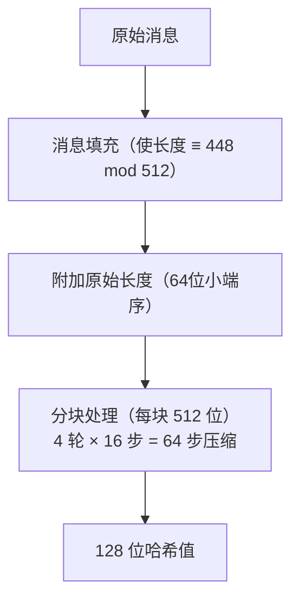

# MD5摘要算法

## 1. 算法概述

**MD5**（Message-Digest Algorithm 5）是由 Ronald Rivest（RSA 中的 R）于 1991 年设计的密码散列函数，输出 128 位（16 字节）的哈希值。它曾是互联网上使用最广泛的哈希算法之一。

> **⚠️ 安全警告：MD5 的碰撞攻击已完全实用化（秒级破解），不应用于任何安全用途。** 如果你的项目中 MD5 用于数字签名、证书验证、密码存储等安全场景，必须立即迁移。

### 1.1 基本参数

| 参数 | 值 |
|------|-----|
| 算法类型 | 密码散列函数 |
| 输出长度 | 128 位（32 个十六进制字符） |
| 输入长度 | 任意 |
| 分组大小 | 512 位（64 字节） |
| 结构 | Merkle-Damgård |
| 标准 | RFC 1321 |
| 安全状态 | ❌ **碰撞已破解，禁止用于安全场景** |

### 1.2 散列函数应满足的性质

| 性质 | 说明 | MD5 状态 |
|------|------|----------|
| 抗碰撞攻击 | 难以找到任意 x≠x' 使 H(x)=H(x') | ❌ **已彻底破解（秒级）** |
| 抗原像攻击 | 给定 H(x)，难以找到 x | ⚠️ 弱化但未完全破解 |
| 抗第二原像攻击 | 给定 x，难以找到 x' 使 H(x)=H(x') | ⚠️ 理论弱化 |
| 确定性 | 相同输入总产生相同输出 | ✅ 满足 |
| 雪崩效应 | 输入微小变化导致输出巨大变化 | ✅ 满足 |

## 2. 算法原理（简述）

MD5 基于 **Merkle-Damgård** 结构：



**核心流程**：

1. **消息填充**：追加 `1` 位和若干 `0` 位，再追加原始长度，使总长度为 512 的倍数
2. **初始化 4 个 32 位寄存器**（A、B、C、D）
3. **对每个 512 位分块**：通过 4 轮（每轮 16 步）非线性函数运算，混合消息和常量
4. **输出**：将 4 个寄存器按小端序拼接为 128 位哈希值

> 开发者无需了解内部细节。重要的是知道：MD5 输出固定 128 位，计算速度快，但碰撞抗性已被彻底破解。

## 3. 安全性分析

### 3.1 为什么 MD5 不安全？

| 时间 | 事件 | 影响 |
|------|------|------|
| 2004 | 王小云等首次构造完整碰撞 | 碰撞复杂度从 2⁶⁴ 降至 2³⁹ |
| 2005 | 碰撞攻击实用化 | 普通计算机数秒内找到碰撞 |
| 2008 | 利用 MD5 碰撞伪造 CA 证书 | 证明可伪造 HTTPS 证书 |
| 2012 | Flame 恶意软件利用 MD5 碰撞 | 国家级攻击实例 |

### 3.2 实际危害

- **可以构造两个不同文件，具有相同的 MD5 值**
- **可以伪造数字证书**（已有真实案例）
- **密码存储用 MD5 极易被彩虹表破解**
- **长度扩展攻击**：已知 H(M) 和 |M|，无需知道 M 即可计算 H(M || padding || M')

## 4. 开发者实践指南

### 4.1 MD5 的使用决策

| 场景 | 能否使用 MD5 | 应该用什么 |
|------|-------------|-----------|
| 密码存储 | ❌ 绝对禁止 | Argon2id / bcrypt |
| 数字签名 | ❌ 绝对禁止 | SHA-256 + RSA/ECDSA |
| 消息认证（MAC） | ❌ 绝对禁止 | HMAC-SHA-256 |
| 证书指纹 | ❌ 绝对禁止 | SHA-256 |
| 文件完整性（防篡改） | ❌ 不安全 | SHA-256 / BLAKE3 |
| 文件校验和（防传输错误） | ✅ 可以 | 但 SHA-256 也不慢 |
| 数据去重 | ✅ 可以 | 不涉及安全 |
| 缓存键/分片键 | ✅ 可以 | 不涉及安全 |
| ETag / 内容标识 | ✅ 可以 | 非安全用途 |

**一条原则**：如果存在"恶意对手可能构造碰撞来欺骗系统"的可能，就不能用 MD5。

### 4.2 遗留系统迁移

如果你的系统中仍在安全场景使用 MD5：

```
迁移路径：

密码存储：MD5(password) → Argon2id(password, salt)
  - 不能直接替换，需要用户下次登录时重新哈希
  - 过渡期可用：Argon2id(MD5(password), salt)

文件校验：MD5 → SHA-256
  - 重新计算所有文件的 SHA-256
  - 新旧哈希并存一段时间

消息认证：H(key||msg) → HMAC-SHA-256(key, msg)
  - 注意 HMAC 的正确用法
```

### 4.3 为什么有些地方还在用 MD5？

- **历史惯性**：老系统迁移成本高
- **非安全场景**：不需要碰撞抗性时，MD5 速度快、输出短
- **协议要求**：某些旧协议（如部分 HTTP 认证）指定 MD5
- **开发者不了解风险**：这正是本文存在的意义

## 5. Go 语言实现

> ⚠️ 以下代码仅用于非安全场景（校验和、去重等）。安全场景请使用 `crypto/sha256`。

```go
package main

import (
	"crypto/md5"
	"encoding/hex"
	"fmt"
	"io"
	"os"
)

// 计算字符串的 MD5
func MD5String(s string) string {
	hash := md5.Sum([]byte(s))
	return hex.EncodeToString(hash[:])
}

// 计算文件的 MD5（流式处理，适合大文件）
func MD5File(filepath string) (string, error) {
	file, err := os.Open(filepath)
	if err != nil {
		return "", err
	}
	defer file.Close()

	hasher := md5.New()
	if _, err := io.Copy(hasher, file); err != nil {
		return "", err
	}
	return hex.EncodeToString(hasher.Sum(nil)), nil
}

func main() {
	// 基本用法
	fmt.Println("=== MD5 哈希示例 ===")
	testCases := []string{
		"hello",
		"Hello, MD5!",
		"The quick brown fox jumps over the lazy dog",
	}

	for _, tc := range testCases {
		fmt.Printf("MD5(\"%s\") = %s\n", tc, MD5String(tc))
	}

	// 雪崩效应演示
	fmt.Println("\n=== 雪崩效应 ===")
	fmt.Printf("MD5(\"Hello\") = %s\n", MD5String("Hello"))
	fmt.Printf("MD5(\"hello\") = %s\n", MD5String("hello"))
}
```

## 6. 替代方案

| 场景 | 推荐算法 | 说明 |
|------|----------|------|
| 通用哈希 | SHA-256 | 当前标准，全平台支持 |
| 高性能哈希 | BLAKE3 | 比 SHA-256 快 10 倍+ |
| 密码存储 | Argon2id / bcrypt | 专为密码设计，慢哈希 |
| 消息认证 | HMAC-SHA-256 | 标准 MAC 方案 |
| 国密合规 | SM3 | 国密哈希标准 |
| 需要 128 位输出 | 截断 SHA-256 或 BLAKE3 | 比 MD5 安全 |

## 7. 总结

| 维度 | 评价 |
|------|------|
| 安全性 | ❌ 碰撞攻击已完全实用化 |
| 性能 | ⭐⭐⭐⭐ 计算速度快 |
| 现代安全适用性 | ❌ 不应用于任何安全场景 |
| 非安全用途 | ✅ 校验和、去重、缓存键等仍可用 |
| 开发者建议 | 安全场景用 SHA-256，新项目不要选 MD5 |

**一句话总结**：MD5 在安全用途上已经"死"了，但作为快速校验和工具在非安全场景仍有一席之地。如果你在代码审查中看到 MD5 用于安全场景，应该立刻标记为安全隐患。
