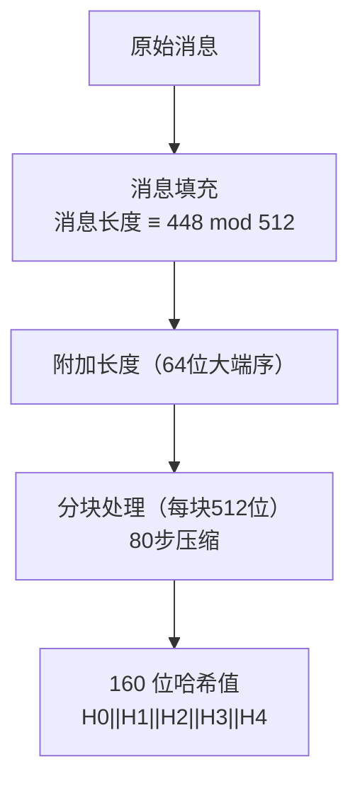

# SHA-1摘要算法

## 1. 算法概述

**SHA-1**（Secure Hash Algorithm 1）是由美国国家安全局（NSA）设计、美国国家标准与技术研究院（NIST）于 1995 年发布的密码散列函数（FIPS PUB 180-1），输出 160 位（20 字节）的哈希值。

SHA-1 是 SHA-0 的修正版本，曾长期作为互联网安全基础设施的核心组件，广泛用于 TLS 证书、Git 版本控制、数字签名等场景。但自 2017 年 Google 实现实际碰撞攻击后，SHA-1 已被视为不安全。

### 1.1 基本参数

| 参数 | 值 |
|------|-----|
| 算法类型 | 密码散列函数 |
| 输出长度 | 160 位（40 个十六进制字符） |
| 输入长度 | < 2⁶⁴ 位 |
| 分组大小 | 512 位（64 字节） |
| 计算轮数 | 4 轮 × 20 步 = 80 步 |
| 字长 | 32 位 |
| 结构 | Merkle-Damgård |
| 标准 | FIPS 180-4, RFC 3174 |

### 1.2 SHA 家族

| 算法 | 输出位数 | 状态 | 发布年份 |
|------|----------|------|----------|
| SHA-0 | 160 | 已撤销 | 1993 |
| **SHA-1** | **160** | **已弃用** | **1995** |
| SHA-224 | 224 | 安全 | 2004 |
| SHA-256 | 256 | 安全 | 2001 |
| SHA-384 | 384 | 安全 | 2001 |
| SHA-512 | 512 | 安全 | 2001 |
| SHA-3 | 224/256/384/512 | 安全 | 2015 |

## 2. 算法原理

### 2.1 整体流程



### 2.2 消息填充

与 MD5 类似，但使用**大端序**：

1. 追加 `1` 位
2. 追加 `0` 位至长度 ≡ 448 (mod 512)
3. 追加 64 位大端序原始消息长度

### 2.3 初始哈希值

```
H0 = 0x67452301
H1 = 0xEFCDAB89
H2 = 0x98BADCFE
H3 = 0x10325476
H4 = 0xC3D2E1F0
```

### 2.4 消息扩展

将 512 位消息块的 16 个 32 位字扩展为 80 个字：

```
W[t] = M[t]                              (0 ≤ t ≤ 15)
W[t] = (W[t-3] ⊕ W[t-8] ⊕ W[t-14] ⊕ W[t-16]) <<< 1   (16 ≤ t ≤ 79)
```

> 注：SHA-0 没有最后的循环左移 1 位操作，这正是 SHA-0 的安全缺陷所在。

### 2.5 压缩函数

每个 512 位块经过 80 步处理：

```
初始化工作变量：a=H0, b=H1, c=H2, d=H3, e=H4

对 t = 0 到 79:
    temp = (a <<< 5) + f(t, b, c, d) + e + W[t] + K[t]
    e = d
    d = c
    c = b <<< 30
    b = a
    a = temp

更新哈希值：
    H0 = H0 + a
    H1 = H1 + b
    H2 = H2 + c
    H3 = H3 + d
    H4 = H4 + e
```

#### 非线性函数 f(t, B, C, D)

| 轮次 | 步骤范围 | 函数 | 常量 K |
|------|----------|------|--------|
| 1 | 0-19 | Ch(B,C,D) = (B∧C)∨(¬B∧D) | 0x5A827999 |
| 2 | 20-39 | Parity(B,C,D) = B⊕C⊕D | 0x6ED9EBA1 |
| 3 | 40-59 | Maj(B,C,D) = (B∧C)∨(B∧D)∨(C∧D) | 0x8F1BBCDC |
| 4 | 60-79 | Parity(B,C,D) = B⊕C⊕D | 0xCA62C1D6 |

### 2.6 输出

将 H0 至 H4 按大端序拼接输出 160 位哈希值。

## 3. 安全性分析

### 3.1 攻击历史

| 时间 | 事件 | 复杂度 |
|------|------|--------|
| 2005 | 王小云等发布理论攻击 | 2⁶⁹（理论） |
| 2011 | Marc Stevens 改进攻击 | 2⁶¹ |
| 2015 | Freestart 碰撞 | 2⁶⁴ |
| **2017** | **Google SHAttered：首个实际碰撞** | **2⁶³·¹** |
| 2020 | SHA-1 选择前缀碰撞 | 2⁶³·⁴ |

### 3.2 SHAttered 攻击

2017 年，Google 和 CWI Amsterdam 联合发布了首个 SHA-1 实际碰撞（SHAttered）：

- 构造了两个不同的 PDF 文件，具有相同的 SHA-1 哈希
- 消耗约 6500 CPU 年 + 110 GPU 年的算力
- 比暴力攻击快 10 万倍
- 证明了 SHA-1 在实际中已不安全

### 3.3 选择前缀碰撞（2020年）

2020 年的进展更为严重：

- 攻击者可以选择**任意两个不同的消息前缀**
- 然后计算出后缀使两个完整消息哈希相同
- 这使伪造 PGP 密钥等攻击成为可能
- 成本：约 $45,000 的云计算费用

### 3.4 退役时间线

| 时间 | 事件 |
|------|------|
| 2011 | NIST 建议停止使用 SHA-1 |
| 2016 | CA/Browser Forum 禁止签发 SHA-1 证书 |
| 2017 | 主要浏览器拒绝 SHA-1 证书 |
| 2017 | Google 实现 SHAttered 碰撞 |
| 2020 | Git 开始迁移到 SHA-256 |

## 4. 代码实现

### 4.1 Go 语言实现

```go
package main

import (
	"crypto/sha1"
	"encoding/hex"
	"fmt"
	"io"
	"os"
	"strings"
)

// 计算字符串的 SHA-1
func SHA1String(s string) string {
	hash := sha1.Sum([]byte(s))
	return hex.EncodeToString(hash[:])
}

// 计算文件的 SHA-1
func SHA1File(filepath string) (string, error) {
	file, err := os.Open(filepath)
	if err != nil {
		return "", err
	}
	defer file.Close()

	hasher := sha1.New()
	if _, err := io.Copy(hasher, file); err != nil {
		return "", err
	}
	return hex.EncodeToString(hasher.Sum(nil)), nil
}

// 流式计算
func SHA1Stream(reader io.Reader) (string, error) {
	hasher := sha1.New()
	if _, err := io.Copy(hasher, reader); err != nil {
		return "", err
	}
	return hex.EncodeToString(hasher.Sum(nil)), nil
}

func main() {
	fmt.Println("=== SHA-1 哈希示例 ===")

	testCases := []string{
		"",
		"hello",
		"Hello, SHA-1!",
		"The quick brown fox jumps over the lazy dog",
	}

	for _, tc := range testCases {
		hash := SHA1String(tc)
		fmt.Printf("SHA1(\"%s\")\n  = %s\n", tc, hash)
	}

	// 雪崩效应
	fmt.Println("\n=== 雪崩效应 ===")
	h1 := SHA1String("Hello")
	h2 := SHA1String("hello")
	fmt.Printf("SHA1(\"Hello\") = %s\n", h1)
	fmt.Printf("SHA1(\"hello\") = %s\n", h2)

	// 增量计算
	fmt.Println("\n=== 增量计算 ===")
	hasher := sha1.New()
	hasher.Write([]byte("Hello, "))
	hasher.Write([]byte("SHA-1!"))
	fmt.Printf("增量: %s\n", hex.EncodeToString(hasher.Sum(nil)))
	fmt.Printf("一次: %s\n", SHA1String("Hello, SHA-1!"))
}
```

### 4.2 Python 实现

```python
import hashlib

def sha1_string(s: str) -> str:
    """计算字符串的 SHA-1"""
    return hashlib.sha1(s.encode('utf-8')).hexdigest()

def sha1_file(filepath: str) -> str:
    """计算文件的 SHA-1"""
    hasher = hashlib.sha1()
    with open(filepath, 'rb') as f:
        for chunk in iter(lambda: f.read(4096), b''):
            hasher.update(chunk)
    return hasher.hexdigest()

def sha1_bytes(data: bytes) -> str:
    """计算字节数据的 SHA-1"""
    return hashlib.sha1(data).hexdigest()

if __name__ == "__main__":
    print("=== SHA-1 哈希示例 ===")

    test_cases = [
        "",
        "hello",
        "Hello, SHA-1!",
        "The quick brown fox jumps over the lazy dog",
    ]

    for tc in test_cases:
        print(f'SHA1("{tc}")')
        print(f'  = {sha1_string(tc)}')

    # 标准测试向量验证
    print("\n=== 标准测试向量 ===")
    assert sha1_string("abc") == "a9993e364706816aba3e25717850c26c9cd0d89d"
    print("测试向量验证通过 ✓")

    # 雪崩效应
    print("\n=== 雪崩效应 ===")
    h1 = sha1_string("Hello")
    h2 = sha1_string("hello")
    print(f'SHA1("Hello") = {h1}')
    print(f'SHA1("hello") = {h2}')

    # 计算汉明距离
    diff_bits = bin(int(h1, 16) ^ int(h2, 16)).count('1')
    print(f"不同位数: {diff_bits}/160 ({diff_bits/160*100:.1f}%)")
```

### 4.3 Java 实现

```java
import java.security.MessageDigest;
import java.nio.file.Files;
import java.nio.file.Path;
import java.util.HexFormat;

public class SHA1Example {

    public static String sha1String(String input) throws Exception {
        MessageDigest md = MessageDigest.getInstance("SHA-1");
        byte[] hash = md.digest(input.getBytes("UTF-8"));
        return HexFormat.of().formatHex(hash);
    }

    public static String sha1File(String filepath) throws Exception {
        MessageDigest md = MessageDigest.getInstance("SHA-1");
        byte[] fileBytes = Files.readAllBytes(Path.of(filepath));
        byte[] hash = md.digest(fileBytes);
        return HexFormat.of().formatHex(hash);
    }

    public static void main(String[] args) throws Exception {
        System.out.println("=== SHA-1 哈希示例 ===");

        String[] testCases = {
            "",
            "hello",
            "Hello, SHA-1!",
            "The quick brown fox jumps over the lazy dog"
        };

        for (String tc : testCases) {
            System.out.printf("SHA1(\"%s\")%n  = %s%n", tc, sha1String(tc));
        }

        // 验证标准测试向量
        System.out.println("\n=== 标准测试向量 ===");
        String result = sha1String("abc");
        String expected = "a9993e364706816aba3e25717850c26c9cd0d89d";
        System.out.println("SHA1(\"abc\") = " + result);
        System.out.println("验证: " + (result.equals(expected) ? "通过 ✓" : "失败 ✗"));
    }
}
```

## 5. SHA-1 的遗留使用

### 5.1 Git 中的 SHA-1

Git 使用 SHA-1 作为对象标识符。虽然 SHAttered 攻击表明 SHA-1 碰撞可行，但 Git 已采取措施：

- Git 2.13+ 包含 SHAttered 攻击检测
- Git 正在逐步迁移到 SHA-256（`git init --object-format=sha256`）
- 对于 Git 的使用场景，碰撞风险较低（攻击者需要同时控制两个碰撞对象的内容）

### 5.2 HMAC-SHA-1

HMAC-SHA-1 的安全性不依赖于碰撞抗性，因此仍然是安全的：

- TOTP（基于时间的一次性密码）中仍使用 HMAC-SHA-1
- 但新系统建议使用 HMAC-SHA-256

## 6. 迁移指南

### 6.1 替代方案

| 原用途 | 替代方案 |
|--------|----------|
| 数字签名 | SHA-256 或 SHA-3 |
| TLS 证书 | SHA-256（已强制执行） |
| 代码签名 | SHA-256 |
| 文件校验 | SHA-256 或 BLAKE3 |
| Git 对象 ID | SHA-256（迁移中） |
| HMAC | HMAC-SHA-256 |

### 6.2 迁移注意事项

1. **评估影响范围**：盘点所有使用 SHA-1 的系统和协议
2. **优先级排序**：签名和证书场景最紧急
3. **兼容性过渡**：某些场景可能需要同时支持新旧算法
4. **性能评估**：SHA-256 比 SHA-1 稍慢，但有硬件加速

## 7. 总结

| 维度 | 评价 |
|------|------|
| 历史意义 | ⭐⭐⭐⭐⭐ 互联网安全基础设施的重要支柱 |
| 安全性 | ❌ 碰撞攻击已实用化 |
| 性能 | ⭐⭐⭐⭐ 比 SHA-256 稍快 |
| 现代适用性 | ❌ 新系统不应使用 |
| 遗留兼容 | ⚠️ 某些场景仍在使用（如 Git、HMAC） |

SHA-1 的退役过程告诉我们：密码算法的安全性会随时间递减，系统设计应具备**算法敏捷性（Crypto Agility）**——即能够在不重构整个系统的情况下更换底层密码算法。
