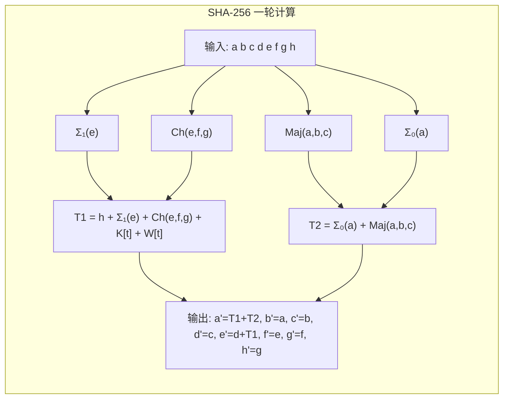

# SHA-256摘要算法

## 1. 算法概述

**SHA-256** 是 SHA-2（Secure Hash Algorithm 2）家族中最常用的变体，由 NSA 设计，NIST 于 2001 年发布为 FIPS PUB 180-2 标准。它输出 256 位（32 字节）的哈希值，是当今互联网安全最核心的哈希算法之一。

SHA-256 广泛应用于 TLS 证书、数字签名、区块链（比特币）、代码签名等关键安全场景。

### 1.1 基本参数

| 参数 | 值 |
|------|-----|
| 算法类型 | 密码散列函数 |
| 输出长度 | 256 位（64 个十六进制字符） |
| 输入长度 | < 2⁶⁴ 位 |
| 分组大小 | 512 位（64 字节） |
| 字长 | 32 位 |
| 计算轮数 | 64 轮 |
| 结构 | Merkle-Damgård |
| 标准 | FIPS 180-4 |

### 1.2 SHA-2 家族

| 算法 | 输出位数 | 字长 | 分组大小 | 轮数 | 安全强度 |
|------|----------|------|----------|------|----------|
| SHA-224 | 224 | 32 | 512 | 64 | 112 位 |
| **SHA-256** | **256** | **32** | **512** | **64** | **128 位** |
| SHA-384 | 384 | 64 | 1024 | 80 | 192 位 |
| SHA-512 | 512 | 64 | 1024 | 80 | 256 位 |
| SHA-512/224 | 224 | 64 | 1024 | 80 | 112 位 |
| SHA-512/256 | 256 | 64 | 1024 | 80 | 128 位 |

## 2. 算法原理

### 2.1 预处理

#### 消息填充

1. 追加位 `1`
2. 追加 k 个 `0` 位，使 (消息长度 + 1 + k + 64) 为 512 的倍数
3. 追加原始消息长度的 64 位大端序表示

#### 初始哈希值

取前 8 个质数（2, 3, 5, 7, 11, 13, 17, 19）的平方根小数部分的前 32 位：

```
H0 = 0x6a09e667
H1 = 0xbb67ae85
H2 = 0x3c6ef372
H3 = 0xa54ff53a
H4 = 0x510e527f
H5 = 0x9b05688c
H6 = 0x1f83d9ab
H7 = 0x5be0cd19
```

#### 64 个轮常量 K

取前 64 个质数的立方根小数部分的前 32 位：

```
K[0..7]   = 428a2f98 71374491 b5c0fbcf e9b5dba5 3956c25b 59f111f1 923f82a4 ab1c5ed5
K[8..15]  = d807aa98 12835b01 243185be 550c7dc3 72be5d74 80deb1fe 9bdc06a7 c19bf174
K[16..23] = e49b69c1 efbe4786 0fc19dc6 240ca1cc 2de92c6f 4a7484aa 5cb0a9dc 76f988da
... (共64个)
```

### 2.2 消息扩展

将 16 个 32 位消息字扩展为 64 个：

```
W[t] = M[t]                                          (0 ≤ t ≤ 15)
W[t] = σ₁(W[t-2]) + W[t-7] + σ₀(W[t-15]) + W[t-16]  (16 ≤ t ≤ 63)
```

其中小 σ 函数：

```
σ₀(x) = ROTR²(x) ⊕ ROTR¹³(x) ⊕ SHR³(x)     — 注意这里应为 ROTR⁷ ⊕ ROTR¹⁸ ⊕ SHR³
σ₁(x) = ROTR¹⁷(x) ⊕ ROTR¹⁹(x) ⊕ SHR¹⁰(x)
```

准确定义：
```
σ₀(x) = ROTR⁷(x) ⊕ ROTR¹⁸(x) ⊕ SHR³(x)
σ₁(x) = ROTR¹⁷(x) ⊕ ROTR¹⁹(x) ⊕ SHR¹⁰(x)
```

### 2.3 压缩函数

每个消息块经过 64 轮处理：

```
初始化: a=H0, b=H1, c=H2, d=H3, e=H4, f=H5, g=H6, h=H7

对 t = 0 到 63:
    T1 = h + Σ₁(e) + Ch(e,f,g) + K[t] + W[t]
    T2 = Σ₀(a) + Maj(a,b,c)
    h = g
    g = f
    f = e
    e = d + T1
    d = c
    c = b
    b = a
    a = T1 + T2

更新: H0+=a, H1+=b, H2+=c, H3+=d, H4+=e, H5+=f, H6+=g, H7+=h
```

#### 逻辑函数

```
Ch(x, y, z) = (x ∧ y) ⊕ (¬x ∧ z)         // 选择函数
Maj(x, y, z) = (x ∧ y) ⊕ (x ∧ z) ⊕ (y ∧ z) // 多数函数
Σ₀(x) = ROTR²(x) ⊕ ROTR¹³(x) ⊕ ROTR²²(x) // 大 Sigma 0
Σ₁(x) = ROTR⁶(x) ⊕ ROTR¹¹(x) ⊕ ROTR²⁵(x) // 大 Sigma 1
```

### 2.4 整体结构图



## 3. 安全性分析

### 3.1 安全强度

| 性质 | 理论安全位数 | 当前最优攻击 |
|------|-------------|-------------|
| 碰撞抗性 | 128 位 | 无实际威胁 |
| 原像抗性 | 256 位 | 无实际威胁 |
| 第二原像抗性 | 256 位 | 无实际威胁 |

### 3.2 已知分析结果

| 攻击类型 | 最优结果 | 威胁程度 |
|----------|----------|----------|
| 碰撞攻击 | 31轮 SHA-256 的碰撞 | 不影响完整版本 |
| 原像攻击 | 45轮的原像 | 不影响完整版本 |
| 差分攻击 | 仅对缩减轮数有效 | 不实用 |
| 线性攻击 | 仅对缩减轮数有效 | 不实用 |

**结论**：SHA-256 的全 64 轮版本目前没有任何已知的实际安全威胁。

### 3.3 与量子计算

- Grover 算法可将碰撞搜索降至 2⁸⁵（仍然安全）
- 原像搜索降至 2¹²⁸（仍然安全）
- SHA-256 被认为**对量子计算具有足够的安全余量**

### 3.4 长度扩展攻击

SHA-256（和所有 Merkle-Damgård 结构的哈希）存在**长度扩展攻击**：

```
已知 H(M) 和 |M|，无需知道 M 即可计算 H(M || padding || M')
```

防护措施：
- 使用 HMAC-SHA-256 代替 H(key || message)
- 或使用不受此攻击的 SHA-3

## 4. 代码实现

### 4.1 Go 语言实现

```go
package main

import (
	"crypto/hmac"
	"crypto/sha256"
	"encoding/hex"
	"fmt"
	"io"
	"os"
)

// 计算字符串的 SHA-256
func SHA256String(s string) string {
	hash := sha256.Sum256([]byte(s))
	return hex.EncodeToString(hash[:])
}

// 计算文件的 SHA-256
func SHA256File(filepath string) (string, error) {
	file, err := os.Open(filepath)
	if err != nil {
		return "", err
	}
	defer file.Close()

	hasher := sha256.New()
	if _, err := io.Copy(hasher, file); err != nil {
		return "", err
	}
	return hex.EncodeToString(hasher.Sum(nil)), nil
}

// 计算 HMAC-SHA-256
func HMACSHA256(message, key []byte) string {
	mac := hmac.New(sha256.New, key)
	mac.Write(message)
	return hex.EncodeToString(mac.Sum(nil))
}

// 验证 HMAC-SHA-256
func VerifyHMAC(message, key []byte, expectedMAC string) bool {
	actualMAC := HMACSHA256(message, key)
	return hmac.Equal([]byte(actualMAC), []byte(expectedMAC))
}

func main() {
	fmt.Println("=== SHA-256 哈希示例 ===")

	testCases := []string{
		"",
		"hello",
		"Hello, SHA-256!",
		"The quick brown fox jumps over the lazy dog",
	}

	for _, tc := range testCases {
		hash := SHA256String(tc)
		fmt.Printf("SHA256(\"%s\")\n  = %s\n", tc, hash)
	}

	// 标准测试向量
	fmt.Println("\n=== 标准测试向量 ===")
	expected := "ba7816bf8f01cfea414140de5dae2223b00361a396177a9cb410ff61f20015ad"
	actual := SHA256String("abc")
	fmt.Printf("SHA256(\"abc\") = %s\n", actual)
	fmt.Printf("验证: %v\n", actual == expected)

	// HMAC-SHA-256
	fmt.Println("\n=== HMAC-SHA-256 ===")
	key := []byte("secret-key")
	message := []byte("Hello, HMAC-SHA-256!")

	macValue := HMACSHA256(message, key)
	fmt.Printf("HMAC-SHA256 = %s\n", macValue)

	valid := VerifyHMAC(message, key, macValue)
	fmt.Printf("验证结果: %v\n", valid)

	// 雪崩效应
	fmt.Println("\n=== 雪崩效应 ===")
	h1 := SHA256String("Hello")
	h2 := SHA256String("hello")
	fmt.Printf("SHA256(\"Hello\") = %s\n", h1)
	fmt.Printf("SHA256(\"hello\") = %s\n", h2)
}
```

### 4.2 Python 实现

```python
import hashlib
import hmac

def sha256_string(s: str) -> str:
    """计算字符串的 SHA-256"""
    return hashlib.sha256(s.encode('utf-8')).hexdigest()

def sha256_file(filepath: str) -> str:
    """计算文件的 SHA-256"""
    hasher = hashlib.sha256()
    with open(filepath, 'rb') as f:
        for chunk in iter(lambda: f.read(4096), b''):
            hasher.update(chunk)
    return hasher.hexdigest()

def hmac_sha256(message: bytes, key: bytes) -> str:
    """计算 HMAC-SHA-256"""
    return hmac.new(key, message, hashlib.sha256).hexdigest()

def verify_hmac(message: bytes, key: bytes, expected_mac: str) -> bool:
    """安全地验证 HMAC（使用常数时间比较）"""
    actual_mac = hmac.new(key, message, hashlib.sha256).hexdigest()
    return hmac.compare_digest(actual_mac, expected_mac)

if __name__ == "__main__":
    print("=== SHA-256 哈希示例 ===")

    test_cases = [
        "",
        "hello",
        "Hello, SHA-256!",
        "The quick brown fox jumps over the lazy dog",
    ]

    for tc in test_cases:
        print(f'SHA256("{tc}")')
        print(f'  = {sha256_string(tc)}')

    # 标准测试向量
    print("\n=== 标准测试向量 ===")
    expected = "ba7816bf8f01cfea414140de5dae2223b00361a396177a9cb410ff61f20015ad"
    actual = sha256_string("abc")
    print(f"SHA256(\"abc\") = {actual}")
    print(f"验证: {'通过 ✓' if actual == expected else '失败 ✗'}")

    # HMAC-SHA-256
    print("\n=== HMAC-SHA-256 ===")
    key = b"secret-key"
    message = b"Hello, HMAC-SHA-256!"
    mac_value = hmac_sha256(message, key)
    print(f"HMAC-SHA256 = {mac_value}")

    valid = verify_hmac(message, key, mac_value)
    print(f"验证结果: {'成功 ✓' if valid else '失败 ✗'}")

    # 雪崩效应
    print("\n=== 雪崩效应 ===")
    h1 = sha256_string("Hello")
    h2 = sha256_string("hello")
    diff = bin(int(h1, 16) ^ int(h2, 16)).count('1')
    print(f"不同位数: {diff}/256 ({diff/256*100:.1f}%)")
```

### 4.3 Java 实现

```java
import java.security.MessageDigest;
import javax.crypto.Mac;
import javax.crypto.spec.SecretKeySpec;
import java.util.HexFormat;

public class SHA256Example {

    public static String sha256String(String input) throws Exception {
        MessageDigest md = MessageDigest.getInstance("SHA-256");
        byte[] hash = md.digest(input.getBytes("UTF-8"));
        return HexFormat.of().formatHex(hash);
    }

    public static String hmacSHA256(byte[] message, byte[] key) throws Exception {
        Mac mac = Mac.getInstance("HmacSHA256");
        SecretKeySpec secretKey = new SecretKeySpec(key, "HmacSHA256");
        mac.init(secretKey);
        byte[] hash = mac.doFinal(message);
        return HexFormat.of().formatHex(hash);
    }

    public static void main(String[] args) throws Exception {
        System.out.println("=== SHA-256 哈希示例 ===");

        String[] testCases = {"", "hello", "Hello, SHA-256!"};
        for (String tc : testCases) {
            System.out.printf("SHA256(\"%s\")%n  = %s%n", tc, sha256String(tc));
        }

        // 测试向量验证
        System.out.println("\n=== 标准测试向量 ===");
        String result = sha256String("abc");
        String expected = "ba7816bf8f01cfea414140de5dae2223b00361a396177a9cb410ff61f20015ad";
        System.out.println("验证: " + (result.equals(expected) ? "通过 ✓" : "失败 ✗"));

        // HMAC-SHA-256
        System.out.println("\n=== HMAC-SHA-256 ===");
        byte[] key = "secret-key".getBytes();
        byte[] message = "Hello, HMAC!".getBytes();
        String macValue = hmacSHA256(message, key);
        System.out.println("HMAC-SHA256 = " + macValue);
    }
}
```

## 5. 应用场景

### 5.1 核心应用

| 场景 | 用法 | 说明 |
|------|------|------|
| TLS/HTTPS | 证书签名、握手完整性 | 默认使用 SHA-256 |
| 比特币 | 工作量证明（双重 SHA-256） | 区块哈希、交易 ID |
| 数字签名 | RSA-SHA256, ECDSA-SHA256 | 签名前计算消息摘要 |
| 文件校验 | 软件发布验证 | 替代 MD5/SHA-1 |
| JWT | HS256 (HMAC-SHA-256) | Token 签名 |
| 密码存储 | PBKDF2-SHA256 | 作为 KDF 的内部函数 |
| Git (新版) | 对象 ID | 替代 SHA-1 |
| 代码签名 | 软件完整性 | 验证软件未被篡改 |

### 5.2 比特币中的 SHA-256

比特币使用双重 SHA-256（SHA-256d）：

```python
# 比特币哈希
def bitcoin_hash(data):
    return sha256(sha256(data))
```

工作量证明：找到 nonce 使得 `SHA256d(block_header) < target`

### 5.3 HMAC-SHA-256

HMAC（基于哈希的消息认证码）是 SHA-256 最重要的派生用法：

```
HMAC(K, M) = H((K' ⊕ opad) || H((K' ⊕ ipad) || M))

其中：
- K' = 规范化后的密钥
- opad = 0x5c5c...5c (重复至块大小)
- ipad = 0x3636...36 (重复至块大小)
```

## 6. 性能考量

### 6.1 性能基准（参考值）

| 实现方式 | 吞吐量（大约） |
|----------|---------------|
| 纯软件（x86-64） | ~500 MB/s |
| SHA Extensions (x86) | ~2000+ MB/s |
| ARM SHA2 指令 | ~1500+ MB/s |
| BLAKE3 (对比) | ~6000+ MB/s |

### 6.2 性能优化建议

- 使用支持 SHA 硬件加速的 CPU 指令
- 大文件使用流式处理（避免全量读入内存）
- 如果不需要密码学安全性，考虑非密码学哈希（如 xxHash）
- 需要极高性能可考虑 BLAKE3

## 7. 最佳实践

### 7.1 使用指南

| 场景 | 建议 |
|------|------|
| 消息认证 | 使用 HMAC-SHA-256，而非 H(key\|\|msg) |
| 密码存储 | 使用 Argon2id/bcrypt/scrypt，而非裸 SHA-256 |
| 随机数生成 | 不要用 SHA-256 作为 PRNG |
| 密钥派生 | 使用 HKDF-SHA-256 |
| 数据完整性 | SHA-256 适用 |

### 7.2 常见错误

| 错误做法 | 正确做法 |
|----------|----------|
| `SHA256(password)` | `Argon2id(password, salt)` |
| `SHA256(key + message)` | `HMAC-SHA256(key, message)` |
| 硬编码哈希比较 | 使用常数时间比较函数 |
| 忽视盐值 | 为每个哈希使用唯一随机盐 |

## 8. 总结

| 维度 | 评价 |
|------|------|
| 安全性 | ⭐⭐⭐⭐⭐ 无已知实际攻击 |
| 性能 | ⭐⭐⭐⭐ 有硬件加速支持 |
| 生态 | ⭐⭐⭐⭐⭐ 全平台全语言标准支持 |
| 量子安全 | ⭐⭐⭐⭐ 安全余量充足 |
| 推荐度 | ⭐⭐⭐⭐⭐ 当前通用哈希的首选 |

SHA-256 是当前最广泛部署、最受信赖的密码散列函数。对于绝大多数需要密码学哈希的场景，SHA-256 都是安全、可靠、高性能的选择。
