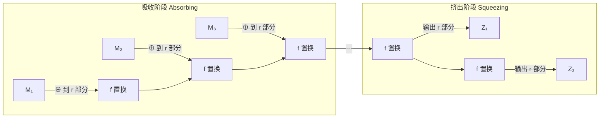

# SHA-3摘要算法

## 1. 算法概述

**SHA-3**（Secure Hash Algorithm 3）是由 NIST 于 2015 年正式发布的最新一代密码散列标准（FIPS 202）。它基于 Guido Bertoni、Joan Daemen（AES 的设计者之一）、Michaël Peeters 和 Gilles Van Assche 设计的 **Keccak** 算法。

SHA-3 采用了与 SHA-2 **完全不同**的内部结构（海绵结构），旨在提供一个不依赖 Merkle-Damgård 结构的备选标准，作为 SHA-2 万一出现漏洞时的"保险"。

### 1.1 基本参数

| 变体 | 输出长度 | 容量 c | 速率 r | 安全强度（碰撞） |
|------|----------|--------|--------|-----------------|
| SHA3-224 | 224 位 | 448 | 1152 | 112 位 |
| SHA3-256 | 256 位 | 512 | 1088 | 128 位 |
| SHA3-384 | 384 位 | 768 | 832 | 192 位 |
| SHA3-512 | 512 位 | 1024 | 576 | 256 位 |
| SHAKE128 | 可变 | 256 | 1344 | min(d/2, 128) |
| SHAKE256 | 可变 | 512 | 1088 | min(d/2, 256) |

### 1.2 SHA-3 的诞生背景

- **2004-2005年**：MD5 和 SHA-1 相继被攻破
- **2007年**：NIST 启动 SHA-3 征集计划
- **2008年**：64 个候选算法进入第一轮
- **2010年**：5 个算法进入决赛
- **2012年**：Keccak 胜出
- **2015年**：正式发布为 FIPS 202

### 1.3 为什么需要 SHA-3？

| 原因 | 说明 |
|------|------|
| 结构多样性 | SHA-2 和 SHA-1 都基于 Merkle-Damgård，单一结构风险 |
| 备选方案 | 万一 SHA-2 被攻破，需要一个完全独立的替代 |
| 创新设计 | 海绵结构提供更灵活的功能 |
| 无长度扩展攻击 | 天然免疫 Merkle-Damgård 结构的缺陷 |

## 2. 算法原理

### 2.1 海绵结构（Sponge Construction）

SHA-3 的核心创新是**海绵结构**，它与传统 Merkle-Damgård 结构完全不同：



> **状态大小** = r + c = 1600 位
> 
> - r = 速率（与外部交互的部分）
> - c = 容量（内部保护的部分，决定安全性）

**关键概念**：
- **速率 r**：每轮吸收的消息位数，也是每轮输出位数
- **容量 c**：内部隐藏状态，c = 2 × 安全强度
- **状态**：r + c = 1600 位（固定）
- **置换函数 f**：Keccak-f[1600]

### 2.2 Keccak-f[1600] 置换

状态被组织为 5×5×64 的三维位数组（1600 位）：

```
State[x][y][z]，其中 x,y ∈ {0,1,2,3,4}，z ∈ {0,...,63}
```

每轮包含 5 个操作（共 24 轮）：

#### θ (Theta) — 列奇偶校验混合

```
C[x] = State[x,0] ⊕ State[x,1] ⊕ State[x,2] ⊕ State[x,3] ⊕ State[x,4]
D[x] = C[x-1] ⊕ ROT(C[x+1], 1)
State[x,y] = State[x,y] ⊕ D[x]
```

作用：提供扩散，使每一位影响相邻列。

#### ρ (Rho) — 位旋转

对每个 lane（同一 x,y 不同 z）进行不同偏移量的循环移位。

作用：在 z 方向上提供扩散。

#### π (Pi) — 位置置换

```
State[y, 2x+3y] = State[x, y]
```

作用：在 x-y 平面上重排 lane 位置。

#### χ (Chi) — 非线性操作

```
State[x,y] = State[x,y] ⊕ (¬State[x+1,y] ∧ State[x+2,y])
```

作用：唯一的非线性操作，提供混淆。

#### ι (Iota) — 轮常量加

```
State[0,0] = State[0,0] ⊕ RC[round]
```

作用：打破轮间对称性，防止滑动攻击。

### 2.3 填充规则

SHA-3 使用 **multi-rate padding**：

```
SHA-3:    消息 || 0x06 || 0x00...00 || 0x80
SHAKE:    消息 || 0x1F || 0x00...00 || 0x80
```

### 2.4 SHA-3 vs SHAKE（可扩展输出函数 XOF）

| 特性 | SHA3-256 | SHAKE256 |
|------|----------|----------|
| 输出长度 | 固定 256 位 | 任意长度 |
| 用途 | 标准哈希 | 密钥派生、流密码等 |
| 填充域分隔 | 0x06 | 0x1F |

## 3. 安全性分析

### 3.1 安全性优势

| 性质 | SHA-3 | SHA-2 |
|------|-------|-------|
| 碰撞抗性 | c/2 位 | 取决于输出长度 |
| 原像抗性 | min(c, 输出长度) | 输出长度 |
| 长度扩展攻击 | ✅ 天然免疫 | ❌ 存在 |
| 结构独立性 | 海绵结构 | Merkle-Damgård |

### 3.2 当前安全状态

| 攻击类型 | 状态 | 说明 |
|----------|------|------|
| 碰撞攻击 | ✅ 安全 | 无实际威胁 |
| 原像攻击 | ✅ 安全 | 无实际威胁 |
| 差分分析 | 仅对缩减轮数有效 | 完整 24 轮安全 |
| 代数攻击 | 理论研究阶段 | 不实用 |
| 量子攻击 | 与 SHA-2 同级 | 安全余量充足 |

### 3.3 SHA-3 vs SHA-2 选择

| 场景 | 推荐 | 原因 |
|------|------|------|
| 通用哈希 | SHA-256 | 更广泛的硬件加速支持 |
| 需要 XOF | SHA-3 (SHAKE) | SHA-2 不支持可变输出 |
| 防长度扩展 | SHA-3 | 天然免疫 |
| 后量子准备 | 均可 | 安全余量相当 |
| 性能敏感 | SHA-256 | 有 CPU 专用指令 |
| 多样性需求 | SHA-3 | 结构完全独立 |

## 4. 代码实现

### 4.1 Go 语言实现

```go
package main

import (
	"encoding/hex"
	"fmt"
	"io"
	"os"

	"golang.org/x/crypto/sha3"
)

// SHA3-256 哈希
func SHA3_256String(s string) string {
	hash := sha3.Sum256([]byte(s))
	return hex.EncodeToString(hash[:])
}

// SHA3-512 哈希
func SHA3_512String(s string) string {
	hash := sha3.Sum512([]byte(s))
	return hex.EncodeToString(hash[:])
}

// SHAKE256 可扩展输出
func SHAKE256(data []byte, outputLen int) string {
	hash := make([]byte, outputLen)
	sha3.ShakeSum256(hash, data)
	return hex.EncodeToString(hash)
}

// SHA3-256 文件哈希
func SHA3_256File(filepath string) (string, error) {
	file, err := os.Open(filepath)
	if err != nil {
		return "", err
	}
	defer file.Close()

	hasher := sha3.New256()
	if _, err := io.Copy(hasher, file); err != nil {
		return "", err
	}
	return hex.EncodeToString(hasher.Sum(nil)), nil
}

func main() {
	fmt.Println("=== SHA3-256 哈希示例 ===")

	testCases := []string{
		"",
		"hello",
		"Hello, SHA-3!",
	}

	for _, tc := range testCases {
		hash := SHA3_256String(tc)
		fmt.Printf("SHA3-256(\"%s\")\n  = %s\n", tc, hash)
	}

	// SHA3-512
	fmt.Println("\n=== SHA3-512 哈希示例 ===")
	hash512 := SHA3_512String("hello")
	fmt.Printf("SHA3-512(\"hello\")\n  = %s\n", hash512)

	// SHAKE256 可变长度输出
	fmt.Println("\n=== SHAKE256 可扩展输出 ===")
	data := []byte("Hello, SHAKE256!")
	fmt.Printf("SHAKE256(16字节): %s\n", SHAKE256(data, 16))
	fmt.Printf("SHAKE256(32字节): %s\n", SHAKE256(data, 32))
	fmt.Printf("SHAKE256(64字节): %s\n", SHAKE256(data, 64))

	// 增量计算
	fmt.Println("\n=== 增量计算 ===")
	hasher := sha3.New256()
	hasher.Write([]byte("Hello, "))
	hasher.Write([]byte("SHA-3!"))
	fmt.Printf("增量: %s\n", hex.EncodeToString(hasher.Sum(nil)))
	fmt.Printf("一次: %s\n", SHA3_256String("Hello, SHA-3!"))
}
```

### 4.2 Python 实现

```python
import hashlib

def sha3_256_string(s: str) -> str:
    """计算 SHA3-256"""
    return hashlib.sha3_256(s.encode('utf-8')).hexdigest()

def sha3_512_string(s: str) -> str:
    """计算 SHA3-512"""
    return hashlib.sha3_512(s.encode('utf-8')).hexdigest()

def shake256(data: bytes, output_length: int) -> str:
    """SHAKE256 可扩展输出"""
    return hashlib.shake_256(data).hexdigest(output_length)

def sha3_256_file(filepath: str) -> str:
    """计算文件的 SHA3-256"""
    hasher = hashlib.sha3_256()
    with open(filepath, 'rb') as f:
        for chunk in iter(lambda: f.read(4096), b''):
            hasher.update(chunk)
    return hasher.hexdigest()

if __name__ == "__main__":
    print("=== SHA3-256 哈希示例 ===")

    test_cases = ["", "hello", "Hello, SHA-3!"]
    for tc in test_cases:
        print(f'SHA3-256("{tc}")')
        print(f'  = {sha3_256_string(tc)}')

    # SHA3-512
    print("\n=== SHA3-512 ===")
    print(f'SHA3-512("hello")')
    print(f'  = {sha3_512_string("hello")}')

    # SHAKE256 可变长度
    print("\n=== SHAKE256 可扩展输出 ===")
    data = b"Hello, SHAKE256!"
    print(f"SHAKE256(16字节): {shake256(data, 16)}")
    print(f"SHAKE256(32字节): {shake256(data, 32)}")
    print(f"SHAKE256(64字节): {shake256(data, 64)}")

    # 与 SHA-256 对比
    print("\n=== SHA3-256 vs SHA-256 对比 ===")
    msg = "The quick brown fox jumps over the lazy dog"
    print(f"SHA-256:  {hashlib.sha256(msg.encode()).hexdigest()}")
    print(f"SHA3-256: {sha3_256_string(msg)}")
    print("（输出长度相同，但值完全不同——内部结构不同）")

    # 雪崩效应
    print("\n=== 雪崩效应 ===")
    h1 = sha3_256_string("Hello")
    h2 = sha3_256_string("hello")
    diff = bin(int(h1, 16) ^ int(h2, 16)).count('1')
    print(f"不同位数: {diff}/256 ({diff/256*100:.1f}%)")
```

### 4.3 Java 实现

```java
import java.security.MessageDigest;
import java.util.HexFormat;

public class SHA3Example {

    public static String sha3_256(String input) throws Exception {
        MessageDigest md = MessageDigest.getInstance("SHA3-256");
        byte[] hash = md.digest(input.getBytes("UTF-8"));
        return HexFormat.of().formatHex(hash);
    }

    public static String sha3_512(String input) throws Exception {
        MessageDigest md = MessageDigest.getInstance("SHA3-512");
        byte[] hash = md.digest(input.getBytes("UTF-8"));
        return HexFormat.of().formatHex(hash);
    }

    public static void main(String[] args) throws Exception {
        System.out.println("=== SHA3-256 哈希示例 ===");

        String[] testCases = {"", "hello", "Hello, SHA-3!"};
        for (String tc : testCases) {
            System.out.printf("SHA3-256(\"%s\")%n  = %s%n", tc, sha3_256(tc));
        }

        // SHA3-512
        System.out.println("\n=== SHA3-512 ===");
        System.out.printf("SHA3-512(\"hello\")%n  = %s%n", sha3_512("hello"));

        // SHA-256 vs SHA3-256 对比
        System.out.println("\n=== SHA-256 vs SHA3-256 ===");
        MessageDigest sha256 = MessageDigest.getInstance("SHA-256");
        String msg = "hello";
        System.out.println("SHA-256:  " + 
            HexFormat.of().formatHex(sha256.digest(msg.getBytes())));
        System.out.println("SHA3-256: " + sha3_256(msg));
    }
}
```

## 5. SHAKE 可扩展输出函数

### 5.1 SHAKE 的独特价值

SHAKE128/SHAKE256 是 SHA-3 标准中的**可扩展输出函数（XOF）**，可以产生任意长度的输出：

| 用途 | 说明 |
|------|------|
| 密钥派生 | 从共享秘密生成任意长度密钥 |
| 流密码 | 作为密钥流生成器 |
| 确定性随机 | 需要确定性伪随机输出 |
| 掩码生成 | 替代 MGF1 |
| 后量子密码 | ML-KEM/ML-DSA 内部使用 SHAKE |

### 5.2 SHAKE 在后量子密码中的应用

NIST 后量子标准大量使用 SHAKE：

- **ML-KEM (CRYSTALS-Kyber)**：使用 SHAKE128/SHAKE256 进行采样和哈希
- **ML-DSA (CRYSTALS-Dilithium)**：使用 SHAKE256 生成挑战和掩码
- **SLH-DSA (SPHINCS+)**：基于 SHAKE256 的哈希签名

## 6. 实际应用

| 场景 | SHA-3 的角色 |
|------|-------------|
| 后量子密码标准 | 核心内部组件 |
| 以太坊 | 使用 Keccak-256（注意：与 SHA3-256 略有不同） |
| 密钥派生 | SHAKE 作为 XOF |
| 随机数生成 | NIST SP 800-90A |
| 某些政府系统 | 合规性要求 |

> **📝 以太坊的 Keccak vs SHA-3**
>
> 以太坊使用的是 **Keccak-256**，它与标准 SHA3-256 的区别仅在于填充字节不同（Keccak 用 0x01，SHA-3 用 0x06）。两者的核心置换函数完全相同。

## 7. 性能对比

| 算法 | 软件性能（大约） | 硬件加速 |
|------|-----------------|----------|
| SHA-256 | ~500 MB/s | SHA Extensions |
| SHA3-256 | ~300 MB/s | 部分平台有加速 |
| BLAKE3 | ~6000 MB/s | SIMD 优化 |
| SHA-512 | ~700 MB/s（64位） | SHA Extensions |

SHA-3 在纯软件实现上通常比 SHA-2 慢，但其设计更适合硬件并行实现。

## 8. 总结

| 维度 | 评价 |
|------|------|
| 安全性 | ⭐⭐⭐⭐⭐ 完全安全，无已知攻击 |
| 设计创新性 | ⭐⭐⭐⭐⭐ 海绵结构，彻底不同于前代 |
| 性能 | ⭐⭐⭐ 软件实现比 SHA-2 稍慢 |
| 灵活性 | ⭐⭐⭐⭐⭐ XOF 提供可变长度输出 |
| 生态 | ⭐⭐⭐⭐ 主流平台支持，但不如 SHA-2 普及 |
| 未来性 | ⭐⭐⭐⭐⭐ 后量子密码标准的关键组件 |

SHA-3 的价值不在于取代 SHA-2（SHA-2 目前仍然安全），而在于提供**结构性多样性**和**更强大的功能**（如 XOF）。在后量子密码时代，SHA-3/SHAKE 已成为不可替代的基础组件。对于新系统，如果需要 XOF 或天然防长度扩展攻击，SHA-3 是最佳选择。
