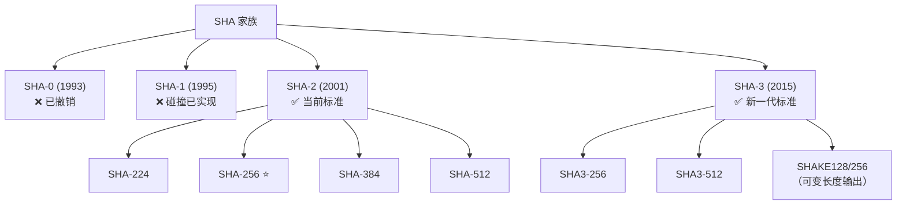
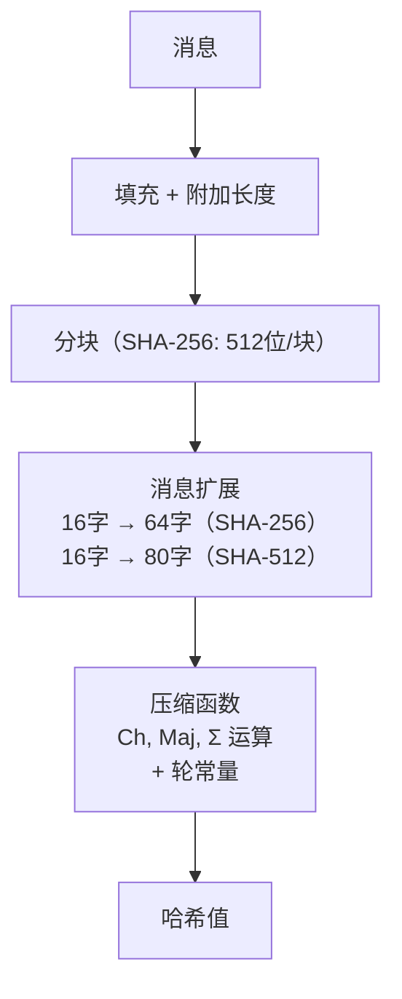
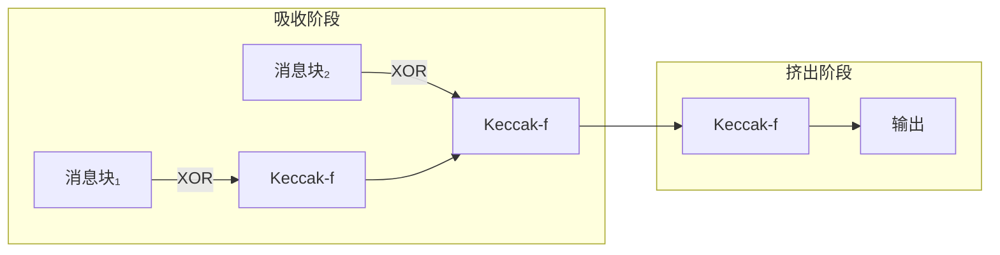
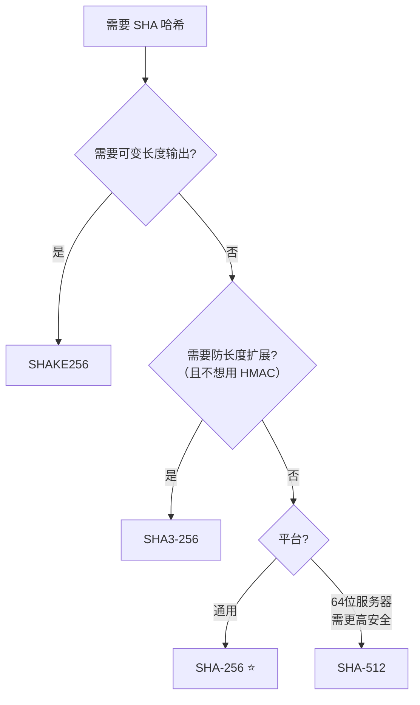

# SHA家族摘要算法

## 1. SHA 家族概述

**SHA**（Secure Hash Algorithm，安全散列算法）是由美国国家安全局（NSA）设计、NIST 发布的一系列密码散列函数标准。从 1993 年至今，SHA 家族经历了多代演进，是互联网安全基础设施中最核心的哈希算法。



### 1.1 家族全景

| 算法 | 输出长度 | 发布年份 | 安全状态 | 开发者建议 |
|------|----------|----------|----------|-----------|
| SHA-0 | 160 位 | 1993 | ❌ 已撤销 | 不要使用 |
| SHA-1 | 160 位 | 1995 | ❌ 碰撞已实现 | 迁移到 SHA-256 |
| SHA-224 | 224 位 | 2004 | ✅ 安全 | 较少使用 |
| **SHA-256** | **256 位** | **2001** | **✅ 安全** | **通用首选** |
| SHA-384 | 384 位 | 2001 | ✅ 安全 | 高安全需求 |
| SHA-512 | 512 位 | 2001 | ✅ 安全 | 64 位平台性能好 |
| SHA-512/224 | 224 位 | 2012 | ✅ 安全 | 较少使用 |
| SHA-512/256 | 256 位 | 2012 | ✅ 安全 | 64 位平台替代 SHA-256 |
| SHA3-224 | 224 位 | 2015 | ✅ 安全 | 较少使用 |
| SHA3-256 | 256 位 | 2015 | ✅ 安全 | 需要防长度扩展时 |
| SHA3-384 | 384 位 | 2015 | ✅ 安全 | 高安全需求 |
| SHA3-512 | 512 位 | 2015 | ✅ 安全 | 极高安全需求 |
| SHAKE128 | 可变 | 2015 | ✅ 安全 | XOF / 密钥派生 |
| SHAKE256 | 可变 | 2015 | ✅ 安全 | 后量子密码标准组件 |

### 1.2 演进动因

| 代际 | 推动力 |
|------|--------|
| SHA-0 → SHA-1 | 修复 SHA-0 设计缺陷（消息扩展缺少循环移位） |
| SHA-1 → SHA-2 | SHA-1 密钥空间不足（160位），设计更强的算法 |
| SHA-2 → SHA-3 | 结构多样性（SHA-2 和 SHA-1 都基于 Merkle-Damgård，需要独立备选） |

---

## 2. SHA-1（已弃用）

### 2.1 基本信息

| 参数 | 值 |
|------|-----|
| 输出长度 | 160 位（40 个十六进制字符） |
| 分组大小 | 512 位 |
| 计算轮数 | 80 步 |
| 结构 | Merkle-Damgård |
| 安全状态 | ❌ **碰撞已实现，已弃用** |

### 2.2 算法原理（简述）

SHA-1 将消息填充后分为 512 位块，每块经过 80 步压缩函数处理，输出 5 个 32 位寄存器拼接的 160 位哈希值。消息扩展将 16 个字扩展为 80 个字（含循环左移 1 位操作，这是区别于 SHA-0 的关键改进）。

### 2.3 安全性

| 时间 | 事件 | 意义 |
|------|------|------|
| 2005 | 王小云等发布理论攻击（2⁶⁹） | 首次证明弱于设计强度 |
| 2017 | **Google SHAttered：首个实际碰撞** | 两个不同 PDF 具有相同 SHA-1 |
| 2020 | 选择前缀碰撞（~$45,000） | 可伪造 PGP 密钥 |

**退役时间线**：

- 2016：CA/Browser Forum 禁止签发 SHA-1 证书
- 2017：Chrome/Firefox 拒绝 SHA-1 TLS 证书
- 2020：Git 开始迁移到 SHA-256

### 2.4 开发者指南

| 场景 | 能否使用 SHA-1 | 应该用什么 |
|------|---------------|-----------|
| TLS 证书 | ❌ 已被浏览器拒绝 | SHA-256 |
| 数字签名 | ❌ 禁止 | SHA-256 |
| HMAC-SHA-1 | ⚠️ 仍安全（不依赖碰撞抗性） | 新系统用 HMAC-SHA-256 |
| TOTP（两步验证） | ⚠️ 仍安全（RFC 规定） | 可继续使用 |
| Git 对象 ID | ⚠️ 正在迁移 | `git init --object-format=sha256` |
| 非安全校验和 | ✅ 可以 | 不涉及安全 |

---

## 3. SHA-2（当前标准）

### 3.1 基本信息

| 变体 | 输出长度 | 字长 | 分组大小 | 轮数 | 安全强度（碰撞） |
|------|----------|------|----------|------|-----------------|
| SHA-224 | 224 位 | 32 | 512 | 64 | 112 位 |
| **SHA-256** | **256 位** | **32** | **512** | **64** | **128 位** |
| SHA-384 | 384 位 | 64 | 1024 | 80 | 192 位 |
| SHA-512 | 512 位 | 64 | 1024 | 80 | 256 位 |
| SHA-512/256 | 256 位 | 64 | 1024 | 80 | 128 位 |

> **SHA-512 在 64 位处理器上反而比 SHA-256 快**（使用 64 位字运算）。如果你在 64 位服务器上且需要更高安全强度，可以考虑 SHA-512 或 SHA-512/256。

### 3.2 算法原理（简述）

SHA-2 家族基于 **Merkle-Damgård** 结构：



**核心设计**：
- 初始化寄存器：取自素数的平方根（SHA-256 用 8 个，SHA-512 也用 8 个）
- 轮常量：取自素数的立方根（"没有后门"的透明设计）
- 压缩函数：使用 Ch（选择）、Maj（多数）、Σ（旋转组合）三类运算

**SHA-224 和 SHA-384 的区别**：分别是 SHA-256 和 SHA-512 的截断版本，使用不同的初始值。

### 3.3 安全性分析

| 性质 | SHA-256 安全强度 | 当前状态 |
|------|-----------------|----------|
| 碰撞抗性 | 128 位 | ✅ 无实际威胁 |
| 原像抗性 | 256 位 | ✅ 无实际威胁 |
| 最优公开攻击 | 31 轮碰撞 / 45 轮原像 | 完整 64 轮安全 |

**已知弱点——长度扩展攻击**：

```
已知 SHA256(M) 和 |M|，无需知道 M，即可计算 SHA256(M || padding || M')
```

防护：
- ❌ 不要用 `SHA256(key || message)` 做 MAC
- ✅ 使用 `HMAC-SHA256(key, message)`

**量子计算影响**：Grover 算法将碰撞搜索降至 ~2⁸⁵，原像搜索降至 ~2¹²⁸，**仍然安全**。

### 3.4 开发者实践指南

#### 使用场景

| 场景 | 做法 | 说明 |
|------|------|------|
| 数据完整性校验 | `SHA256(data)` | 文件校验、下载验证 |
| 消息认证 | `HMAC-SHA256(key, msg)` | 不要直接用 SHA256 |
| 数字签名前哈希 | `Sign(SHA256(msg))` | 先哈希再签名 |
| 密码存储 | ❌ **不要用 SHA-256** | 用 Argon2id / bcrypt |
| 密钥派生 | `HKDF-SHA256(secret)` | 从共享秘密派生密钥 |
| JWT 签名 | `HS256 = HMAC-SHA256` | Token 签名验证 |
| 内容寻址 | `SHA256(content)` | Git、Docker、IPFS |

#### 常见错误

| 错误做法 | 正确做法 | 原因 |
|----------|----------|------|
| `SHA256(password)` | `Argon2id(password, salt)` | SHA-256 太快，易暴力破解 |
| `SHA256(key + msg)` | `HMAC-SHA256(key, msg)` | 防长度扩展攻击 |
| `if mac1 == mac2` | `hmac.Equal(mac1, mac2)` | 防时序侧信道 |
| 无盐值哈希密码 | 每用户唯一随机盐 | 防彩虹表 |

#### 性能参考

| 实现方式 | SHA-256 吞吐量 |
|----------|---------------|
| 纯软件（x86-64） | ~500 MB/s |
| SHA Extensions（Intel/AMD） | ~2000+ MB/s |
| ARM SHA2 指令 | ~1500+ MB/s |

Go/Java/Python 标准库会自动利用硬件加速。

---

## 4. SHA-3（新一代标准）

### 4.1 基本信息

| 变体 | 输出长度 | 安全强度（碰撞） | 特点 |
|------|----------|-----------------|------|
| SHA3-256 | 256 位 | 128 位 | 固定输出 |
| SHA3-512 | 512 位 | 256 位 | 固定输出 |
| **SHAKE128** | **可变** | **128 位** | **XOF** |
| **SHAKE256** | **可变** | **256 位** | **XOF** |

### 4.2 为什么需要 SHA-3？

SHA-3 **不是为了替代 SHA-2**（SHA-2 仍然安全），而是为了：

| 目的 | 说明 |
|------|------|
| 结构多样性 | SHA-2 和 SHA-1 都基于 Merkle-Damgård，单一结构有系统风险 |
| 备选方案 | 万一 SHA-2 被攻破时有完全独立的替代 |
| 新功能 | 海绵结构支持可变长度输出（XOF）、天然防长度扩展 |
| 后量子支撑 | NIST 后量子标准（ML-KEM/ML-DSA）大量使用 SHAKE |

### 4.3 算法原理（简述）

SHA-3 基于**海绵结构（Sponge Construction）**，与 SHA-2 完全不同：



**核心概念**：

| 参数 | 说明 |
|------|------|
| 状态大小 | 1600 位（固定） |
| 速率 r | 与外部交互的部分 |
| 容量 c | 内部保护部分（c = 2 × 安全强度） |
| 置换函数 | Keccak-f[1600]，24 轮，5 种操作 |

**与 SHA-2 的核心区别**：容量部分（c）永远不直接暴露给外部，因此**天然免疫长度扩展攻击**。

### 4.4 SHA-3 vs SHA-2 对比

| 维度 | SHA-2 (SHA-256) | SHA-3 (SHA3-256) |
|------|-----------------|------------------|
| 内部结构 | Merkle-Damgård | 海绵结构 |
| 长度扩展攻击 | ❌ 存在（需 HMAC） | ✅ 天然免疫 |
| 可变输出长度 | ❌ 不支持 | ✅ SHAKE 支持 |
| 硬件加速 | ✅ 广泛 | ⚠️ 部分平台 |
| 软件性能 | ~500 MB/s | ~300 MB/s |
| 安全性 | ✅ 安全 | ✅ 安全 |
| 生态成熟度 | ⭐⭐⭐⭐⭐ | ⭐⭐⭐⭐ |

### 4.5 SHAKE 的独特价值

SHAKE128/SHAKE256 是**可扩展输出函数（XOF）**，可产生任意长度输出：

| 用途 | 说明 |
|------|------|
| 密钥派生 | 从共享秘密生成任意长度密钥材料 |
| 后量子密码 | ML-KEM/ML-DSA 核心组件 |
| 确定性随机 | 从种子生成确定性伪随机输出 |
| 掩码生成 | 替代 MGF1 |

### 4.6 开发者指南

| 场景 | 选 SHA-2 还是 SHA-3 | 理由 |
|------|---------------------|------|
| 通用哈希 | SHA-256 | 生态更成熟，硬件加速更好 |
| 需要可变长度输出 | **SHAKE256** | SHA-2 不支持 XOF |
| 需要防长度扩展 | **SHA-3** | 天然免疫，不需要 HMAC 包装 |
| 后量子密码组件 | **SHAKE** | NIST 标准要求 |
| 以太坊开发 | **Keccak-256** | 注意：不是标准 SHA3-256 |
| 多样性/纵深防御 | **SHA-3** | 结构独立于 SHA-2 |

> **📝 以太坊注意**：以太坊使用的 Keccak-256 与标准 SHA3-256 填充规则不同（Keccak 用 `0x01`，SHA-3 用 `0x06`），输出结果不同。做以太坊开发要用专门的 Keccak-256 实现。

---

## 5. Go 语言实现

### 5.1 SHA-256（推荐）

```go
package main

import (
	"crypto/hmac"
	"crypto/sha256"
	"encoding/hex"
	"fmt"
	"io"
	"os"
)

// SHA-256 哈希
func SHA256String(s string) string {
	hash := sha256.Sum256([]byte(s))
	return hex.EncodeToString(hash[:])
}

// 文件 SHA-256（流式处理，适合大文件）
func SHA256File(filepath string) (string, error) {
	file, err := os.Open(filepath)
	if err != nil {
		return "", err
	}
	defer file.Close()

	hasher := sha256.New()
	if _, err := io.Copy(hasher, file); err != nil {
		return "", err
	}
	return hex.EncodeToString(hasher.Sum(nil)), nil
}

// HMAC-SHA-256
func HMACSHA256(message, key []byte) []byte {
	mac := hmac.New(sha256.New, key)
	mac.Write(message)
	return mac.Sum(nil)
}

// HMAC 验证（常数时间比较，防时序攻击）
func VerifyHMAC(message, key, expectedMAC []byte) bool {
	actualMAC := HMACSHA256(message, key)
	return hmac.Equal(actualMAC, expectedMAC)
}

func main() {
	// 基本哈希
	fmt.Println("=== SHA-256 ===")
	fmt.Printf("SHA256(\"hello\") = %s\n", SHA256String("hello"))
	fmt.Printf("SHA256(\"Hello\") = %s\n", SHA256String("Hello"))

	// 测试向量
	expected := "ba7816bf8f01cfea414140de5dae2223b00361a396177a9cb410ff61f20015ad"
	actual := SHA256String("abc")
	fmt.Printf("\n测试向量 SHA256(\"abc\") 验证: %v\n", actual == expected)

	// HMAC-SHA-256
	fmt.Println("\n=== HMAC-SHA-256 ===")
	key := []byte("my-secret-key")
	message := []byte("Hello, HMAC!")
	mac := HMACSHA256(message, key)
	fmt.Printf("HMAC = %s\n", hex.EncodeToString(mac))
	fmt.Printf("验证: %v\n", VerifyHMAC(message, key, mac))
}
```

### 5.2 SHA-512

```go
package main

import (
	"crypto/sha512"
	"encoding/hex"
	"fmt"
)

func main() {
	// SHA-512
	hash := sha512.Sum512([]byte("hello"))
	fmt.Printf("SHA512(\"hello\") = %s\n", hex.EncodeToString(hash[:]))

	// SHA-384
	hash384 := sha512.Sum384([]byte("hello"))
	fmt.Printf("SHA384(\"hello\") = %s\n", hex.EncodeToString(hash384[:]))

	// SHA-512/256（64位平台上比 SHA-256 快）
	hash512_256 := sha512.Sum512_256([]byte("hello"))
	fmt.Printf("SHA512/256(\"hello\") = %s\n", hex.EncodeToString(hash512_256[:]))
}
```

### 5.3 SHA-3 / SHAKE

```go
package main

import (
	"encoding/hex"
	"fmt"

	"golang.org/x/crypto/sha3"
)

func main() {
	// SHA3-256
	hash := sha3.Sum256([]byte("hello"))
	fmt.Printf("SHA3-256(\"hello\") = %s\n", hex.EncodeToString(hash[:]))

	// SHA3-512
	hash512 := sha3.Sum512([]byte("hello"))
	fmt.Printf("SHA3-512(\"hello\") = %s\n", hex.EncodeToString(hash512[:]))

	// SHAKE256 可变长度输出
	fmt.Println("\n=== SHAKE256 可变长度 ===")
	data := []byte("Hello, SHAKE256!")
	
	out16 := make([]byte, 16)
	sha3.ShakeSum256(out16, data)
	fmt.Printf("SHAKE256(16字节): %s\n", hex.EncodeToString(out16))

	out32 := make([]byte, 32)
	sha3.ShakeSum256(out32, data)
	fmt.Printf("SHAKE256(32字节): %s\n", hex.EncodeToString(out32))

	out64 := make([]byte, 64)
	sha3.ShakeSum256(out64, data)
	fmt.Printf("SHAKE256(64字节): %s\n", hex.EncodeToString(out64))
}
```

> **依赖**：SHA-3 需要 `go get golang.org/x/crypto/sha3`，SHA-256/SHA-512 在标准库中。

---

## 6. 选型决策

### 6.1 SHA 家族内部选型



### 6.2 快速决策表

| 我的需求 | 推荐 | 备注 |
|---------|------|------|
| 通用哈希 | **SHA-256** | 默认选择 |
| 消息认证 | HMAC-SHA-256 | 不要直接拼接 |
| JWT 签名 | HS256 (HMAC-SHA-256) | 标准方案 |
| 数字签名 | SHA-256 + Ed25519/RSA-PSS | 先哈希再签名 |
| 文件校验 | SHA-256 | 替代 MD5/SHA-1 |
| 密码存储 | ❌ 不用 SHA | 用 Argon2id |
| 密钥派生 | HKDF-SHA-256 或 SHAKE256 | 取决于生态 |
| 以太坊 | Keccak-256 | 不是 SHA3-256 |
| 后量子准备 | SHAKE256 | ML-KEM/ML-DSA 使用 |
| 极高性能 | 考虑 BLAKE3 | 非 SHA 家族 |
| 国密合规 | SM3 | 非 SHA 家族 |

### 6.3 变体选择理由

| 选择 | 理由 |
|------|------|
| SHA-256 而非 SHA-224 | 安全余量更大，性能差异可忽略 |
| SHA-256 而非 SHA-512 | 32 位平台更快，输出更短，绝大多数场景够用 |
| SHA-512 而非 SHA-256 | 64 位平台更快，256 位安全强度 |
| SHA3-256 而非 SHA-256 | 需要防长度扩展或结构多样性 |
| SHAKE256 而非 SHA3-256 | 需要可变长度输出 |

---

## 7. 量子计算影响

| 算法 | 碰撞（经典） | 碰撞（量子 Grover） | 评估 |
|------|-------------|-------------------|------|
| SHA-1 | 2⁸⁰ → 已破解 | — | ❌ 已不安全 |
| SHA-256 | 2¹²⁸ | ~2⁸⁵ | ✅ 仍然安全 |
| SHA-512 | 2²⁵⁶ | ~2¹⁷⁰ | ✅ 绰绰有余 |
| SHA3-256 | 2¹²⁸ | ~2⁸⁵ | ✅ 仍然安全 |

> 与非对称加密（RSA/ECC）不同，**SHA 家族算法在量子计算面前仍然安全**。Grover 算法只能将搜索加速到平方根，安全余量充足。

---

## 8. 总结

| 维度 | SHA-1 | SHA-2 (SHA-256) | SHA-3 |
|------|-------|-----------------|-------|
| 安全性 | ❌ 已破解 | ✅ 安全 | ✅ 安全 |
| 性能 | 快 | 快（有硬件加速） | 稍慢 |
| 生态 | 遗留 | ⭐⭐⭐⭐⭐ 最广泛 | ⭐⭐⭐⭐ |
| 长度扩展防护 | ❌ | ❌（需 HMAC） | ✅ 天然免疫 |
| XOF 支持 | ❌ | ❌ | ✅ SHAKE |
| 后量子密码 | — | 安全 | 核心组件 |
| 开发者建议 | 迁移 | **默认选择** | 特定场景使用 |

**一句话总结**：SHA-256 是绝大多数场景的正确选择。只在需要可变长度输出（SHAKE）、天然防长度扩展（SHA-3）、或后量子密码（SHAKE）时才需要考虑 SHA-3。SHA-1 已经退出历史舞台，遇到就迁移。
