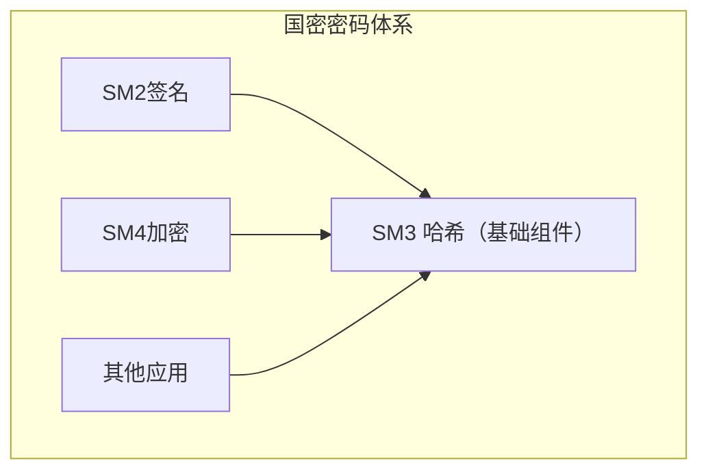
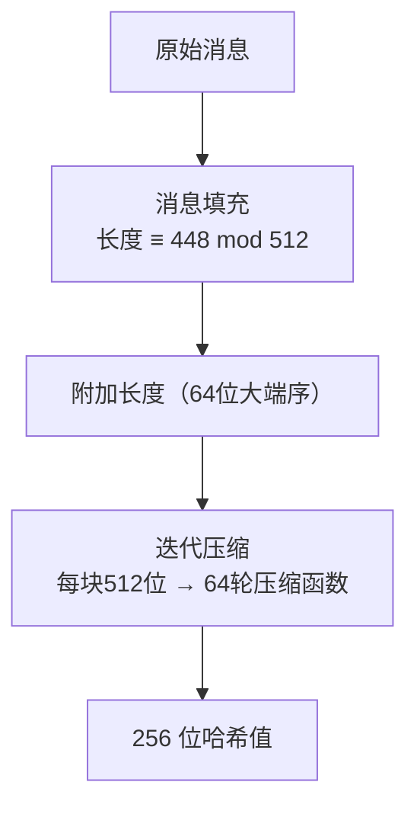

# 国密SM3摘要算法

## 1. 算法概述

**SM3** 是中国国家密码管理局于 2010 年发布的密码散列函数标准（GM/T 0004-2012），由王小云院士团队设计。SM3 输出 256 位（32 字节）的哈希值，安全性与 SHA-256 相当。

SM3 已被纳入 ISO/IEC 10118-3:2018 国际标准，是中国商用密码体系中的核心哈希算法，在数字签名、消息认证、密钥派生等场景中广泛使用。

### 1.1 基本参数

| 参数 | 值 |
|------|-----|
| 算法类型 | 密码散列函数 |
| 输出长度 | 256 位（64 个十六进制字符） |
| 输入长度 | < 2⁶⁴ 位 |
| 分组大小 | 512 位（64 字节） |
| 字长 | 32 位 |
| 计算轮数 | 64 轮 |
| 结构 | Merkle-Damgård（改进型） |
| 标准 | GM/T 0004-2012, ISO/IEC 10118-3:2018 |

### 1.2 SM3 在国密体系中的角色



SM3 是 SM2 数字签名的前置步骤：

```
签名 = SM2_Sign(SM3(ZA || M))
其中 ZA 为签名者标识信息
```

## 2. 算法原理

### 2.1 整体流程



### 2.2 初始值 IV

```
IV = 7380166f 4914b2b9 172442d7 da8a0600 a96f30bc 163138aa e38dee4d b0fb0e4e
```

### 2.3 常量

```
T_j = 79cc4519  (0 ≤ j ≤ 15)
T_j = 7a879d8a  (16 ≤ j ≤ 63)
```

### 2.4 布尔函数

```
FF_j(X, Y, Z) = X ⊕ Y ⊕ Z                          (0 ≤ j ≤ 15)
FF_j(X, Y, Z) = (X ∧ Y) ∨ (X ∧ Z) ∨ (Y ∧ Z)       (16 ≤ j ≤ 63)

GG_j(X, Y, Z) = X ⊕ Y ⊕ Z                          (0 ≤ j ≤ 15)
GG_j(X, Y, Z) = (X ∧ Y) ∨ (¬X ∧ Z)                 (16 ≤ j ≤ 63)
```

### 2.5 置换函数

```
P0(X) = X ⊕ (X <<< 9) ⊕ (X <<< 17)    // 压缩函数中使用
P1(X) = X ⊕ (X <<< 15) ⊕ (X <<< 23)   // 消息扩展中使用
```

### 2.6 消息扩展

将 512 位消息块扩展为 132 个 32 位字（W₀~W₆₇ 和 W'₀~W'₆₃）：

```
步骤1：前16个字直接来自消息块
W_0, W_1, ..., W_15 = 消息块的 16 个字

步骤2：扩展到 68 个字
W_j = P1(W_{j-16} ⊕ W_{j-9} ⊕ (W_{j-3} <<< 15)) ⊕ (W_{j-13} <<< 7) ⊕ W_{j-6}
(16 ≤ j ≤ 67)

步骤3：生成 W' 序列
W'_j = W_j ⊕ W_{j+4}
(0 ≤ j ≤ 63)
```

### 2.7 压缩函数

```
初始化: A=V_i[0], B=V_i[1], ..., H=V_i[7]

对 j = 0 到 63:
    SS1 = ((A <<< 12) + E + (T_j <<< j)) <<< 7
    SS2 = SS1 ⊕ (A <<< 12)
    TT1 = FF_j(A, B, C) + D + SS2 + W'_j
    TT2 = GG_j(E, F, G) + H + SS1 + W_j
    D = C
    C = B <<< 9
    B = A
    A = TT1
    H = G
    G = F <<< 19
    F = E
    E = P0(TT2)

输出: V_{i+1} = (A⊕V_i[0]) || (B⊕V_i[1]) || ... || (H⊕V_i[7])
```

### 2.8 SM3 vs SHA-256 结构对比

| 特征 | SM3 | SHA-256 |
|------|-----|---------|
| 输出长度 | 256 位 | 256 位 |
| 分组大小 | 512 位 | 512 位 |
| 轮数 | 64 轮 | 64 轮 |
| 消息扩展 | 更复杂（P1 置换） | 线性组合 + σ 函数 |
| 布尔函数 | 分段使用不同函数 | Ch 和 Maj |
| 压缩函数 | 含 P0 置换 | 纯加法和移位 |
| 常量来源 | 直接给定 | 质数的立方根 |

SM3 的消息扩展比 SHA-256 更复杂，引入了额外的非线性变换，理论上可提供更好的扩散效果。

## 3. 安全性分析

### 3.1 安全强度

| 性质 | 理论强度 | 当前状态 |
|------|----------|----------|
| 碰撞抗性 | 128 位 | ✅ 安全 |
| 原像抗性 | 256 位 | ✅ 安全 |
| 第二原像抗性 | 256 位 | ✅ 安全 |

### 3.2 公开分析结果

| 研究 | 结果 | 影响 |
|------|------|------|
| 缩减轮数碰撞 | 最高达到约 20+ 轮 | 不影响完整 64 轮 |
| 差分分析 | 仅对缩减轮数有效 | 完整版本安全 |
| 原像攻击 | 仅对缩减轮数 | 完整版本安全 |
| 线性密码分析 | 安全余量充足 | 无实际威胁 |

### 3.3 与 SHA-256 的安全性对比

SM3 和 SHA-256 在设计上具有相似的安全目标：

- 两者都针对 128 位碰撞安全性
- 两者当前都没有被实际攻破
- SM3 的消息扩展更复杂，可能具有更好的安全余量
- 两者都可能受到长度扩展攻击（需使用 HMAC）

## 4. 代码实现

### 4.1 Go 语言实现

```go
package main

import (
	"encoding/hex"
	"fmt"
	"io"
	"os"

	"github.com/emmansun/gmsm/sm3"
)

// 计算字符串的 SM3
func SM3String(s string) string {
	hash := sm3.Sum([]byte(s))
	return hex.EncodeToString(hash[:])
}

// 计算文件的 SM3
func SM3File(filepath string) (string, error) {
	file, err := os.Open(filepath)
	if err != nil {
		return "", err
	}
	defer file.Close()

	hasher := sm3.New()
	if _, err := io.Copy(hasher, file); err != nil {
		return "", err
	}
	return hex.EncodeToString(hasher.Sum(nil)), nil
}

// HMAC-SM3
func HMACSM3(message, key []byte) string {
	// 使用 crypto/hmac + sm3
	import "crypto/hmac"
	mac := hmac.New(sm3.New, key)
	mac.Write(message)
	return hex.EncodeToString(mac.Sum(nil))
}

func main() {
	fmt.Println("=== SM3 哈希示例 ===")

	testCases := []string{
		"",
		"hello",
		"abc",
		"Hello, SM3!",
	}

	for _, tc := range testCases {
		hash := SM3String(tc)
		fmt.Printf("SM3(\"%s\")\n  = %s\n", tc, hash)
	}

	// 标准测试向量
	fmt.Println("\n=== 标准测试向量 ===")
	// SM3("abc") 的标准结果
	expected := "66c7f0f462eeedd9d1f2d46bdc10e4e24167c4875cf2f7a2297da02b8f4ba8e0"
	actual := SM3String("abc")
	fmt.Printf("SM3(\"abc\") = %s\n", actual)
	fmt.Printf("验证: %v\n", actual == expected)

	// 另一个标准测试向量
	// SM3("abcdabcdabcdabcdabcdabcdabcdabcdabcdabcdabcdabcdabcdabcdabcdabcd")
	// 即 "abcd" 重复 16 次
	msg := ""
	for i := 0; i < 16; i++ {
		msg += "abcd"
	}
	expected2 := "debe9ff92275b8a138604889c18e5a4d6fdb70e5387e5765293dcba39c0c5732"
	actual2 := SM3String(msg)
	fmt.Printf("\nSM3(\"abcd\"×16) = %s\n", actual2)
	fmt.Printf("验证: %v\n", actual2 == expected2)

	// 雪崩效应
	fmt.Println("\n=== 雪崩效应 ===")
	h1 := SM3String("Hello")
	h2 := SM3String("hello")
	fmt.Printf("SM3(\"Hello\") = %s\n", h1)
	fmt.Printf("SM3(\"hello\") = %s\n", h2)
}
```

> **注意**：需要安装 `github.com/emmansun/gmsm` 包：`go get github.com/emmansun/gmsm`

### 4.2 Python 实现

```python
# 方法1：使用 gmssl 库
# pip install gmssl

from gmssl import sm3, func

def sm3_string(s: str) -> str:
    """计算字符串的 SM3"""
    data = list(s.encode('utf-8'))
    hash_value = sm3.sm3_hash(data)
    return hash_value

def sm3_bytes(data: bytes) -> str:
    """计算字节数据的 SM3"""
    return sm3.sm3_hash(list(data))

def sm3_file(filepath: str) -> str:
    """计算文件的 SM3"""
    with open(filepath, 'rb') as f:
        data = list(f.read())
    return sm3.sm3_hash(data)

if __name__ == "__main__":
    print("=== SM3 哈希示例 ===")

    test_cases = [
        "",
        "hello",
        "abc",
        "Hello, SM3!",
    ]

    for tc in test_cases:
        print(f'SM3("{tc}")')
        print(f'  = {sm3_string(tc)}')

    # 标准测试向量验证
    print("\n=== 标准测试向量 ===")
    result = sm3_string("abc")
    expected = "66c7f0f462eeedd9d1f2d46bdc10e4e24167c4875cf2f7a2297da02b8f4ba8e0"
    print(f"SM3(\"abc\") = {result}")
    print(f"验证: {'通过 ✓' if result == expected else '失败 ✗'}")

    # 第二个测试向量
    msg = "abcd" * 16
    result2 = sm3_string(msg)
    expected2 = "debe9ff92275b8a138604889c18e5a4d6fdb70e5387e5765293dcba39c0c5732"
    print(f"\nSM3(\"abcd\"×16) = {result2}")
    print(f"验证: {'通过 ✓' if result2 == expected2 else '失败 ✗'}")

    # 雪崩效应
    print("\n=== 雪崩效应 ===")
    h1 = sm3_string("Hello")
    h2 = sm3_string("hello")
    print(f'SM3("Hello") = {h1}')
    print(f'SM3("hello") = {h2}')
    diff = bin(int(h1, 16) ^ int(h2, 16)).count('1')
    print(f"不同位数: {diff}/256 ({diff/256*100:.1f}%)")
```

### 4.3 Python 纯实现（教学用）

```python
"""
SM3 算法的纯 Python 实现（仅供教学理解，生产环境请使用 gmssl 库）
"""
import struct

# 初始值
IV = [
    0x7380166f, 0x4914b2b9, 0x172442d7, 0xda8a0600,
    0xa96f30bc, 0x163138aa, 0xe38dee4d, 0xb0fb0e4e
]

# 常量 T
def T(j):
    return 0x79cc4519 if j < 16 else 0x7a879d8a

# 循环左移
def rotl(x, n):
    return ((x << n) | (x >> (32 - n))) & 0xFFFFFFFF

# 布尔函数
def FF(j, X, Y, Z):
    if j < 16:
        return X ^ Y ^ Z
    return (X & Y) | (X & Z) | (Y & Z)

def GG(j, X, Y, Z):
    if j < 16:
        return X ^ Y ^ Z
    return (X & Y) | ((~X & 0xFFFFFFFF) & Z)

# 置换函数
def P0(X):
    return X ^ rotl(X, 9) ^ rotl(X, 17)

def P1(X):
    return X ^ rotl(X, 15) ^ rotl(X, 23)

def sm3_hash(message: bytes) -> str:
    """SM3 哈希"""
    # 消息填充
    msg_len = len(message)
    message += b'\x80'
    message += b'\x00' * ((55 - msg_len) % 64)
    message += struct.pack('>Q', msg_len * 8)

    # 迭代压缩
    V = IV[:]
    for i in range(0, len(message), 64):
        block = message[i:i+64]
        V = compress(V, block)

    return ''.join(f'{x:08x}' for x in V)

def compress(V, block):
    """压缩函数"""
    W = list(struct.unpack('>16I', block))

    # 消息扩展
    for j in range(16, 68):
        w = P1(W[j-16] ^ W[j-9] ^ rotl(W[j-3], 15)) ^ rotl(W[j-13], 7) ^ W[j-6]
        W.append(w & 0xFFFFFFFF)

    W_prime = [W[j] ^ W[j+4] for j in range(64)]

    # 压缩
    A, B, C, D, E, F, G, H = V

    for j in range(64):
        SS1 = rotl((rotl(A, 12) + E + rotl(T(j), j % 32)) & 0xFFFFFFFF, 7)
        SS2 = SS1 ^ rotl(A, 12)
        TT1 = (FF(j, A, B, C) + D + SS2 + W_prime[j]) & 0xFFFFFFFF
        TT2 = (GG(j, E, F, G) + H + SS1 + W[j]) & 0xFFFFFFFF
        D = C
        C = rotl(B, 9)
        B = A
        A = TT1
        H = G
        G = rotl(F, 19)
        F = E
        E = P0(TT2)

    return [
        (A ^ V[0]) & 0xFFFFFFFF, (B ^ V[1]) & 0xFFFFFFFF,
        (C ^ V[2]) & 0xFFFFFFFF, (D ^ V[3]) & 0xFFFFFFFF,
        (E ^ V[4]) & 0xFFFFFFFF, (F ^ V[5]) & 0xFFFFFFFF,
        (G ^ V[6]) & 0xFFFFFFFF, (H ^ V[7]) & 0xFFFFFFFF,
    ]

if __name__ == "__main__":
    # 验证标准测试向量
    result = sm3_hash(b"abc")
    expected = "66c7f0f462eeedd9d1f2d46bdc10e4e24167c4875cf2f7a2297da02b8f4ba8e0"
    print(f"SM3(\"abc\") = {result}")
    print(f"期望值:      {expected}")
    print(f"验证: {'通过 ✓' if result == expected else '失败 ✗'}")
```

### 4.4 Java 实现

```java
import org.bouncycastle.crypto.digests.SM3Digest;
import org.bouncycastle.jce.provider.BouncyCastleProvider;
import java.security.MessageDigest;
import java.security.Security;
import java.util.HexFormat;

public class SM3Example {

    static {
        Security.addProvider(new BouncyCastleProvider());
    }

    // 方法1：使用 JCE
    public static String sm3String(String input) throws Exception {
        MessageDigest md = MessageDigest.getInstance("SM3", "BC");
        byte[] hash = md.digest(input.getBytes("UTF-8"));
        return HexFormat.of().formatHex(hash);
    }

    // 方法2：直接使用 BouncyCastle API
    public static String sm3Bytes(byte[] data) {
        SM3Digest digest = new SM3Digest();
        digest.update(data, 0, data.length);
        byte[] hash = new byte[digest.getDigestSize()];
        digest.doFinal(hash, 0);
        return HexFormat.of().formatHex(hash);
    }

    public static void main(String[] args) throws Exception {
        System.out.println("=== SM3 哈希示例 ===");

        String[] testCases = {"", "hello", "abc", "Hello, SM3!"};
        for (String tc : testCases) {
            System.out.printf("SM3(\"%s\")%n  = %s%n", tc, sm3String(tc));
        }

        // 标准测试向量
        System.out.println("\n=== 标准测试向量 ===");
        String result = sm3String("abc");
        String expected = "66c7f0f462eeedd9d1f2d46bdc10e4e24167c4875cf2f7a2297da02b8f4ba8e0";
        System.out.println("SM3(\"abc\") = " + result);
        System.out.println("验证: " + (result.equals(expected) ? "通过 ✓" : "失败 ✗"));
    }
}
```

> **依赖**：需要添加 BouncyCastle 库：`org.bouncycastle:bcprov-jdk18on`

## 5. 应用场景

### 5.1 核心应用

| 场景 | 用法 | 说明 |
|------|------|------|
| SM2 数字签名 | 签名前的消息哈希 | SM3 是 SM2 的必需前置步骤 |
| 数据完整性校验 | 文件校验、消息认证 | 替代 SHA-256 |
| 密钥派生 | KDF 内部哈希函数 | 国密密钥派生 |
| 随机数生成 | DRBG 内部函数 | 国密随机数 |
| 口令存储 | SM3(salt + password) | 需配合 KDF 使用 |
| 区块链 | 国密联盟链 | 如 FISCO BCOS |
| SSL/TLS | 国密 SSL (GMTLS) | 握手和记录层 |

### 5.2 国密 SSL/TLS 中的 SM3

在国密 TLS 协议中，SM3 用于：

- 握手消息的完整性保护
- PRF（伪随机函数）的内部哈希
- 证书验证
- Finished 消息计算

### 5.3 SM2 + SM3 联合使用

SM2 签名必须配合 SM3 使用：

```
1. 计算用户标识哈希 ZA = SM3(ENTLA || IDA || a || b || xG || yG || xA || yA)
2. 计算消息摘要 e = SM3(ZA || M)
3. 对 e 进行 SM2 签名
```

## 6. 推荐库与工具

| 语言/平台 | 库 | 说明 |
|-----------|-----|------|
| Go | github.com/emmansun/gmsm | 高性能，支持 SM2/SM3/SM4 |
| Go | github.com/tjfoc/gmsm | 另一选择 |
| Python | gmssl | 纯 Python 实现 |
| Python | pysmx | 支持 SM2/SM3/SM4 |
| Java | BouncyCastle | 成熟的密码库 |
| C | OpenSSL 1.1.1+ | 内置 SM3 支持 |
| C | GmSSL | 专门的国密实现 |
| Rust | libsm | SM 系列算法 |

## 7. 总结

| 维度 | 评价 |
|------|------|
| 安全性 | ⭐⭐⭐⭐⭐ 与 SHA-256 同级，无已知攻击 |
| 性能 | ⭐⭐⭐⭐ 与 SHA-256 相当 |
| 合规性 | ⭐⭐⭐⭐⭐ 中国国密标准 + ISO 国际标准 |
| 生态 | ⭐⭐⭐⭐ 主流语言均有成熟实现 |
| 推荐度 | ⭐⭐⭐⭐⭐ 国密场景首选哈希算法 |

SM3 是中国国密体系的核心哈希算法，在安全性上与 SHA-256 相当，且已获得国际标准认可。对于需要满足国密合规的系统，SM3 是必选的哈希算法。在非合规场景中，SM3 同样是一个安全可靠的选择。
