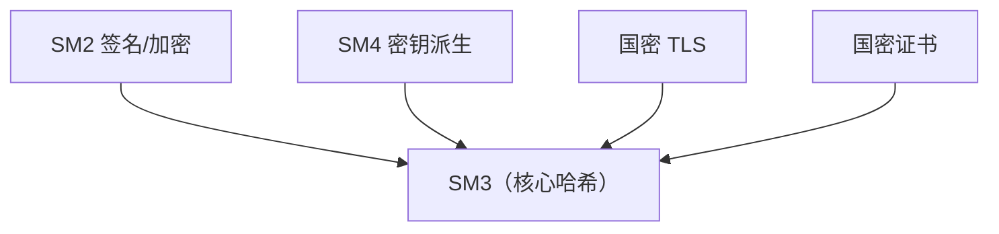
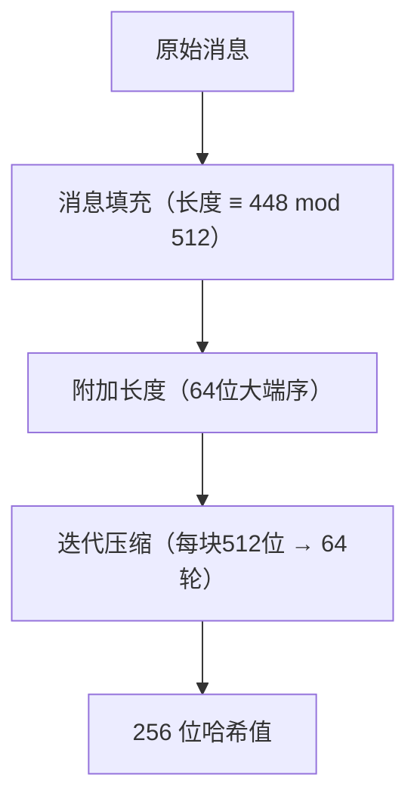

# 国密SM3摘要算法

## 1. 算法概述

**SM3** 是中国国家密码管理局于 2010 年发布的密码散列函数标准（GM/T 0004-2012），由王小云院士团队设计。SM3 输出 256 位（32 字节）的哈希值，安全性与 SHA-256 相当。

SM3 已被纳入 ISO/IEC 10118-3:2018 国际标准，是中国商用密码体系中的核心哈希算法。

> 对于需要满足**国密合规**要求的系统，SM3 是哈希算法的唯一正确选择。与 SM4 类似，SM3 的使用方式和 SHA-256 几乎完全相同，迁移成本极低。

### 1.1 基本参数

| 参数 | 值 |
|------|-----|
| 算法类型 | 密码散列函数 |
| 输出长度 | 256 位（64 个十六进制字符） |
| 输入长度 | < 2⁶⁴ 位 |
| 分组大小 | 512 位（64 字节） |
| 计算轮数 | 64 轮 |
| 结构 | Merkle-Damgård（改进型） |
| 标准 | GM/T 0004-2012, GB/T 32905-2016, ISO/IEC 10118-3:2018 |
| 安全状态 | ✅ **安全，国密哈希标准** |

### 1.2 SM3 在国密体系中的角色



SM3 是国密体系的**基础组件**，几乎所有其他国密算法都依赖它。

## 2. 算法原理（简述）

SM3 基于改进的 **Merkle-Damgård** 结构，与 SHA-256 设计思路相似：



**核心设计**：

1. 初始化 8 个 32 位寄存器
2. 消息扩展：将 16 个字扩展为 68+64 = 132 个字（使用 P1 置换函数，比 SHA-256 更复杂）
3. 64 轮压缩：使用分段布尔函数（FF/GG）和置换函数（P0）
4. 输出 8 个寄存器拼接的 256 位结果

### 2.1 SM3 vs SHA-256 结构对比

| 维度 | SM3 | SHA-256 |
|------|-----|---------|
| 输出长度 | 256 位 | 256 位 |
| 分组大小 | 512 位 | 512 位 |
| 轮数 | 64 轮 | 64 轮 |
| 消息扩展 | 更复杂（含 P1 非线性置换） | 线性组合 + σ 函数 |
| 安全余量 | 充足 | 充足 |
| 性能 | 与 SHA-256 相当 | 有更广泛的硬件加速 |

> 两者在安全性和用法上几乎等价，主要区别是合规要求不同。

## 3. 安全性分析

### 3.1 安全强度

| 性质 | 安全强度 | 状态 |
|------|----------|------|
| 碰撞抗性 | 128 位 | ✅ 安全 |
| 原像抗性 | 256 位 | ✅ 安全 |
| 第二原像抗性 | 256 位 | ✅ 安全 |

最优公开攻击仅对约 20+ 轮缩减版本有效，完整 64 轮版本安全。

### 3.2 与 SHA-256 安全性对比

- 两者安全目标相同（128 位碰撞安全性）
- 两者当前都没有被实际攻破
- SM3 的消息扩展更复杂，可能具有更好的安全余量
- 两者都存在长度扩展攻击弱点（需使用 HMAC）
- SM3 已通过 ISO 国际标准化审查

### 3.3 长度扩展攻击

与 SHA-256 相同，SM3 也存在长度扩展攻击。防护方式一致：

- ❌ 不要用 `SM3(key || message)` 做消息认证
- ✅ 使用 `HMAC-SM3(key, message)`

## 4. 开发者实践指南

### 4.1 何时使用 SM3

| 场景 | 是否使用 SM3 | 说明 |
|------|-------------|------|
| 政务系统 | ✅ 必须 | 国密合规硬性要求 |
| 金融系统（国内） | ✅ 推荐 | 监管要求 |
| 电信系统 | ✅ 推荐 | 行业规范 |
| SM2 签名 | ✅ 必须 | SM2 规范要求配合 SM3 |
| 国密 TLS | ✅ 必须 | 握手和记录层完整性 |
| 国际化项目 | ❌ 用 SHA-256 | SHA-256 全球通用 |
| 双合规需求 | ✅ SM3 + SHA-256 | 同时满足 |

### 4.2 SM3 + SM2 联合使用

SM2 签名**必须**配合 SM3：

```
SM2 签名流程：
1. 计算用户标识哈希 ZA = SM3(ENTLA || IDA || 曲线参数 || 公钥)
2. 计算消息摘要 e = SM3(ZA || M)
3. 对 e 进行 SM2 签名

注意：ZA 的计算是 SM2 规范强制要求的，不能省略。
```

### 4.3 国密全家桶

| 功能 | 国密算法 | 等价国际算法 |
|------|----------|-------------|
| 哈希 | **SM3** | SHA-256 |
| 对称加密 | SM4 | AES |
| 非对称加密/签名 | SM2 | ECDSA/ECIES |
| MAC | HMAC-SM3 | HMAC-SHA-256 |
| 密钥派生 | KDF(SM3) | HKDF-SHA-256 |

### 4.4 使用要点

| 要点 | 说明 |
|------|------|
| 输出长度 | 256 位（32 字节），与 SHA-256 相同 |
| 消息认证 | 使用 HMAC-SM3，不要直接拼接密钥 |
| 密码存储 | 不要直接 SM3(password)，用 KDF + SM3 |
| 与 SM2 配合 | 必须先计算 ZA，再计算消息摘要 |
| Go 推荐库 | `github.com/emmansun/gmsm/sm3` |
| Java 推荐库 | Bouncy Castle (`"SM3"`) |
| Python 推荐库 | `gmssl` |

### 4.5 从 SHA-256 迁移到 SM3

迁移非常简单，API 完全兼容：

```go
// SHA-256
import "crypto/sha256"
hash := sha256.Sum256(data)

// SM3（用法完全相同）
import "github.com/emmansun/gmsm/sm3"
hash := sm3.Sum(data)

// HMAC 也一样
// HMAC-SHA-256
mac := hmac.New(sha256.New, key)

// HMAC-SM3
mac := hmac.New(sm3.New, key)
```

### 4.6 各语言库推荐

| 语言 | 库 | 说明 |
|------|-----|------|
| Go | `github.com/emmansun/gmsm/sm3` | 高性能，支持 SM2/SM3/SM4 |
| Java | BouncyCastle (`"SM3"`) | 成熟稳定 |
| Python | `gmssl` | 纯 Python 实现 |
| C | OpenSSL 1.1.1+ | 内置 SM3 |
| C | GmSSL | 国密专用库 |
| Rust | `libsm` | SM 系列算法 |
| Node.js | `gm-crypto` | SM2/SM3/SM4 |

## 5. Go 语言实现

```go
package main

import (
	"crypto/hmac"
	"encoding/hex"
	"fmt"
	"io"
	"os"

	"github.com/emmansun/gmsm/sm3"
)

// 计算字符串的 SM3
func SM3String(s string) string {
	hash := sm3.Sum([]byte(s))
	return hex.EncodeToString(hash[:])
}

// 计算文件的 SM3（流式处理）
func SM3File(filepath string) (string, error) {
	file, err := os.Open(filepath)
	if err != nil {
		return "", err
	}
	defer file.Close()

	hasher := sm3.New()
	if _, err := io.Copy(hasher, file); err != nil {
		return "", err
	}
	return hex.EncodeToString(hasher.Sum(nil)), nil
}

// HMAC-SM3
func HMACSM3(message, key []byte) []byte {
	mac := hmac.New(sm3.New, key)
	mac.Write(message)
	return mac.Sum(nil)
}

// HMAC-SM3 验证
func VerifyHMACSM3(message, key, expectedMAC []byte) bool {
	actualMAC := HMACSM3(message, key)
	return hmac.Equal(actualMAC, expectedMAC)
}

func main() {
	// 基本哈希
	fmt.Println("=== SM3 哈希 ===")
	testCases := []string{"hello", "abc", "Hello, SM3!"}
	for _, tc := range testCases {
		fmt.Printf("SM3(\"%s\") = %s\n", tc, SM3String(tc))
	}

	// 标准测试向量
	fmt.Println("\n=== 测试向量验证 ===")
	expected := "66c7f0f462eeedd9d1f2d46bdc10e4e24167c4875cf2f7a2297da02b8f4ba8e0"
	actual := SM3String("abc")
	fmt.Printf("SM3(\"abc\") = %s\n", actual)
	fmt.Printf("验证: %v\n", actual == expected)

	// HMAC-SM3
	fmt.Println("\n=== HMAC-SM3 ===")
	key := []byte("my-secret-key")
	message := []byte("Hello, HMAC-SM3!")

	mac := HMACSM3(message, key)
	fmt.Printf("HMAC-SM3 = %s\n", hex.EncodeToString(mac))

	valid := VerifyHMACSM3(message, key, mac)
	fmt.Printf("验证结果: %v\n", valid)

	// 雪崩效应
	fmt.Println("\n=== 雪崩效应 ===")
	fmt.Printf("SM3(\"Hello\") = %s\n", SM3String("Hello"))
	fmt.Printf("SM3(\"hello\") = %s\n", SM3String("hello"))
}
```

> **依赖**：`go get github.com/emmansun/gmsm`

## 6. 实际应用场景

| 场景 | SM3 的角色 | 说明 |
|------|-----------|------|
| SM2 数字签名 | 消息预处理（必须） | `e = SM3(ZA \|\| M)` |
| 国密 TLS (GMTLS) | 握手完整性、PRF | 替代 SHA-256 |
| 国密证书 | 证书签名哈希 | 国密 CA 系统 |
| 区块链（国密链） | 区块哈希、交易哈希 | FISCO BCOS 等 |
| 电子印章 | 文档完整性 | 配合 SM2 签名 |
| 数据完整性 | 文件校验 | 国密合规场景 |

## 7. 总结

| 维度 | 评价 |
|------|------|
| 安全性 | ⭐⭐⭐⭐⭐ 与 SHA-256 同级，无已知攻击 |
| 性能 | ⭐⭐⭐⭐ 与 SHA-256 相当 |
| 合规性 | ⭐⭐⭐⭐⭐ 国标 + ISO 国际标准 |
| 生态 | ⭐⭐⭐⭐ 主流语言均有成熟实现 |
| 迁移成本 | ⭐⭐⭐⭐⭐ API 与 SHA-256 兼容，替换简单 |

**一句话总结**：需要国密合规就用 SM3，用法和 SHA-256 几乎一模一样。SM3 是 SM2 签名的必需前置组件，国密体系中不可或缺。
