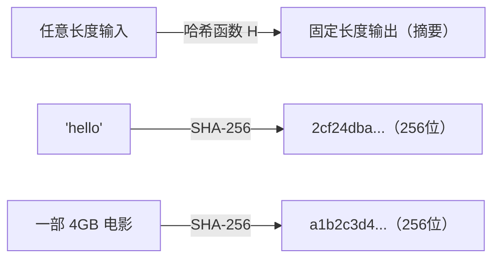
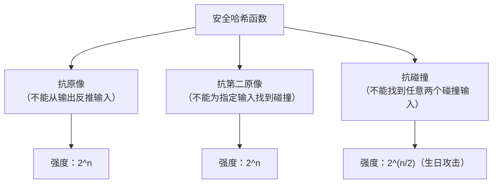
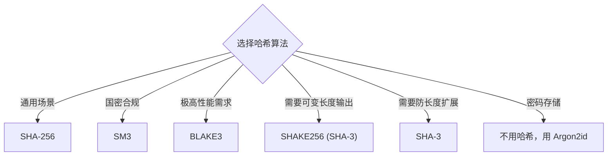
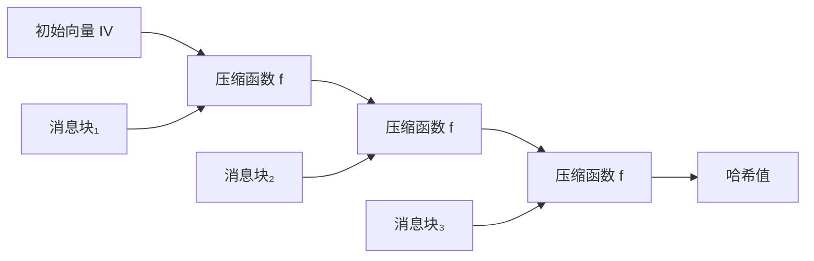
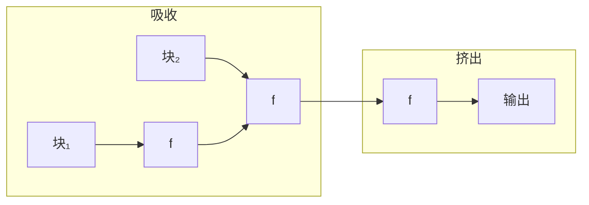
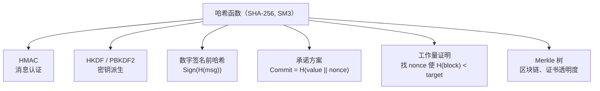

# 摘要算法概述

## 1. 什么是摘要算法？

摘要算法（Hash Function / 散列函数 / 哈希函数）是将**任意长度的输入**转换为**固定长度输出**的单向函数。输出通常称为"哈希值"、"摘要"或"指纹"。

摘要算法的核心目的是保护信息的**完整性**——确保数据没有被篡改。



**关键特性**：

- **单向性**：从哈希值无法反推出原始输入
- **确定性**：相同输入永远产生相同输出
- **雪崩效应**：输入改变 1 位，输出变化约 50% 的位
- **固定长度**：无论输入多大，输出长度固定

## 2. 摘要算法 vs 加密算法

这是开发者最常混淆的概念：

| 维度 | 摘要算法（哈希） | 加密算法 |
|------|-----------------|----------|
| 方向性 | **单向**（不可逆） | 双向（可加密可解密） |
| 目的 | 验证完整性、身份认证 | 保护机密性 |
| 密钥 | 不需要（HMAC 除外） | 需要密钥 |
| 输出长度 | 固定（如 256 位） | 与输入长度相关 |
| 能否还原 | ❌ 不能从哈希值还原数据 | ✅ 用密钥可解密 |

> **常见误区**：有人用"MD5 加密"来表述密码哈希——这是**错误的说法**。哈希不是加密，因为它不可逆。

## 3. 安全哈希函数的三大性质

一个密码学安全的哈希函数应满足：

| 性质 | 定义 | 被破解的后果 |
|------|------|-------------|
| **抗原像攻击** | 给定 H(x)，难以找到 x | 可从哈希值反推密码等数据 |
| **抗第二原像攻击** | 给定 x，难以找到 x'≠x 使 H(x)=H(x') | 可伪造具有相同哈希的替代文件 |
| **抗碰撞攻击** | 难以找到任意 x≠x' 使 H(x)=H(x') | 可伪造证书、签名等 |



> **生日攻击**：碰撞攻击的复杂度为 2^(n/2) 而非 2^n（生日悖论）。所以 256 位哈希的碰撞安全性是 128 位，而非 256 位。

## 4. 主要摘要算法一览

| 算法 | 输出长度 | 安全状态 | 开发者建议 |
|------|----------|----------|-----------|
| [MD5](MD5.md) | 128 位 | ❌ 碰撞已破解（秒级） | 仅用于非安全场景（校验和、去重） |
| [SHA-1](SHA家族.md#2-sha-1已弃用) | 160 位 | ❌ 碰撞已实现（2017） | 迁移到 SHA-256 |
| [SHA-256](SHA家族.md#3-sha-2当前标准) | 256 位 | ✅ 安全 | **通用首选** |
| SHA-384 | 384 位 | ✅ 安全 | 高安全需求 |
| SHA-512 | 512 位 | ✅ 安全 | 64 位平台性能好 |
| [SHA-3](SHA家族.md#4-sha-3新一代标准) | 224/256/384/512 位 | ✅ 安全 | 需要 XOF 或防长度扩展时 |
| BLAKE3 | 256 位（可变） | ✅ 安全 | 需要极高性能时 |
| [SM3](国密SM3.md) | 256 位 | ✅ 安全 | 国密合规场景 |



## 5. 摘要算法的内部结构

### 5.1 Merkle-Damgård 结构

MD5、SHA-1、SHA-256、SM3 都采用此结构：



**特点**：消息分块，逐块通过压缩函数处理，最终输出即为哈希值。

**缺陷**：存在**长度扩展攻击**——已知 H(M)，无需知道 M 即可计算 H(M || padding || M')。

### 5.2 海绵结构

SHA-3（Keccak）采用此结构：



**特点**：天然免疫长度扩展攻击，支持可变长度输出（XOF）。

### 5.3 对开发者的意义

| 结构 | 长度扩展攻击 | 做 MAC 的方式 |
|------|-------------|--------------|
| Merkle-Damgård (SHA-256, SM3) | ❌ 存在 | 必须用 HMAC |
| 海绵结构 (SHA-3) | ✅ 免疫 | 可直接 `H(key \|\| msg)`（但仍推荐 HMAC） |

## 6. 摘要算法的应用场景

### 6.1 数据完整性校验

验证文件在传输或存储过程中没有被损坏或篡改：

```bash
# 发布方提供 SHA-256 校验和
sha256sum myapp-v1.0.tar.gz
# 输出: a1b2c3d4...  myapp-v1.0.tar.gz

# 下载者验证
sha256sum -c checksums.txt
```

### 6.2 数字签名

哈希是数字签名的前置步骤——先哈希再签名：

```
签名流程：signature = Sign(privateKey, SHA256(message))
验签流程：Verify(publicKey, SHA256(message), signature)
```

直接签名大文件太慢（RSA 性能差），所以先哈希为固定长度再签名。

### 6.3 密码存储

> **⚠️ 不要直接用 SHA-256 存储密码！**

正确的密码存储应使用专门的**慢哈希/KDF**：

| 方案 | 推荐度 | 说明 |
|------|--------|------|
| **Argon2id** | ✅ 首选 | 2015 年 PHC 竞赛冠军，抗 GPU/ASIC |
| **bcrypt** | ✅ 推荐 | 经典方案，广泛支持 |
| scrypt | ✅ 可用 | 内存硬函数 |
| PBKDF2-SHA256 | ⚠️ 较弱 | 老方案，迭代次数需很高 |
| SHA-256(password) | ❌ 禁止 | 太快，易暴力破解 |
| MD5(password) | ❌ 禁止 | 不安全且太快 |

**为什么不能直接用 SHA-256？** 因为 SHA-256 设计目标是"快"——每秒可计算数十亿次。攻击者可以用 GPU 以极高速度暴力枚举密码。慢哈希算法刻意让每次计算耗时（如 100ms），使暴力破解不可行。

### 6.4 消息认证码（MAC）

验证消息完整性**且**验证发送者身份：

```
HMAC-SHA-256(key, message)

不要用：SHA-256(key || message)  ← 长度扩展攻击
不要用：SHA-256(message || key)  ← 也有弱点
要用：  HMAC-SHA-256(key, message)  ← 标准安全方案
```

### 6.5 密钥派生（KDF）

从共享秘密或密码中派生密钥：

```
HKDF-SHA-256(inputKeyMaterial, salt, info) → derivedKey

典型应用：TLS 1.3 从 ECDH 共享秘密派生会话密钥
```

### 6.6 内容寻址

以哈希值作为内容的唯一标识：

| 系统 | 哈希算法 | 用途 |
|------|----------|------|
| Git | SHA-1 → SHA-256 | 对象 ID |
| Docker | SHA-256 | 镜像层 ID |
| IPFS | SHA-256 (multihash) | 内容 CID |
| 比特币 | 双重 SHA-256 | 区块哈希 |

## 7. 常见安全陷阱

| 陷阱 | 风险 | 正确做法 |
|------|------|----------|
| 用 MD5/SHA-1 做安全用途 | 碰撞攻击已实用化 | 使用 SHA-256 |
| `SHA256(password)` 存密码 | GPU 暴力破解极快 | 使用 Argon2id / bcrypt |
| `SHA256(key \|\| msg)` 做 MAC | 长度扩展攻击 | 使用 HMAC-SHA-256 |
| 比较哈希值用 `==` | 时序侧信道攻击 | 使用常数时间比较函数 |
| 无盐值哈希密码 | 彩虹表攻击 | 每用户唯一随机盐值 |
| 自实现哈希算法 | 几乎必然有漏洞 | 使用标准库 |
| 混淆"哈希"和"加密" | 概念错误导致方案错误 | 哈希不可逆，加密可逆 |

## 8. 开发者快速决策表

| 我要做什么 | 推荐方案 | 不要用什么 |
|-----------|----------|-----------|
| 验证文件完整性 | SHA-256 | MD5（但非安全场景可用） |
| 存储用户密码 | Argon2id（首选）/ bcrypt | SHA-256 / MD5 |
| 消息认证（MAC） | HMAC-SHA-256 | `H(key+msg)` |
| 数字签名前哈希 | SHA-256 | MD5 / SHA-1 |
| 密钥派生 | HKDF-SHA-256 | 直接截取哈希值 |
| 生成缓存键/ETag | SHA-256 或 MD5 | — |
| 数据去重/指纹 | SHA-256（安全）/ MD5（快速） | — |
| 国密合规 | SM3 | SHA-256（不满足国密要求） |
| 需要可变长度输出 | SHAKE256 (SHA-3) | — |
| 极高性能需求 | BLAKE3 | — |

## 9. 量子计算的影响

| 算法 | 量子影响 | 应对 |
|------|----------|------|
| SHA-256 | Grover 算法将碰撞搜索降至 ~2⁸⁵ | ✅ 仍然安全 |
| SHA-256 | 原像搜索降至 ~2¹²⁸ | ✅ 仍然安全 |
| SM3 | 与 SHA-256 相同 | ✅ 仍然安全 |
| SHA-3 | 与 SHA-256 同级 | ✅ 仍然安全 |

> 与非对称加密不同，哈希算法在量子计算面前**仍然安全**。Grover 算法只能将搜索加速到平方根，SHA-256 仍保有足够的安全余量。

## 10. 哈希算法与其他密码原语的关系



哈希函数是密码学的**基础设施**——几乎所有高层密码方案都依赖它。选择一个安全的哈希函数（SHA-256 / SM3），就为上层应用提供了坚实的基础。

## 11. 总结

| 维度 | 要点 |
|------|------|
| 核心功能 | 任意输入 → 固定长度指纹，单向不可逆 |
| 通用推荐 | SHA-256（默认）、SM3（国密）、BLAKE3（高性能） |
| 已过时算法 | MD5（碰撞秒级破解）、SHA-1（碰撞已实现） |
| 密码存储 | 不用哈希函数，用 Argon2id / bcrypt |
| MAC 用法 | HMAC-SHA-256，不要直接拼接 |
| 量子安全 | 哈希算法安全余量充足，无需担忧 |

**核心理念**：摘要算法保护的是**完整性**而非机密性。它回答的问题是"数据有没有被改过"，而不是"数据有没有被看过"。正确理解这个区别，是选择合适密码方案的基础。
