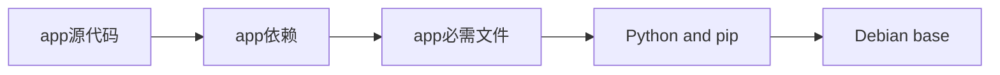
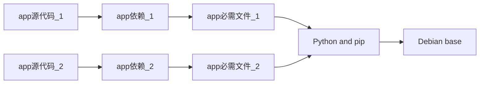
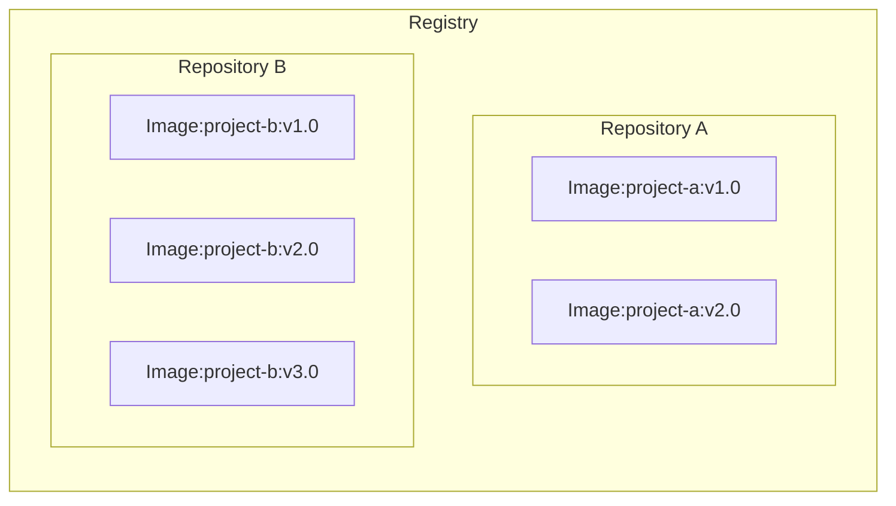

Docker是一个用于开发、发布和运行应用程序的开放平台。

《Docker入门指南》将循序渐进且详细地讲解Docker的基本概念和使用方式。力求让初学者从0开始，对Docker有一个基本的初步印象，并能够简单地使用Docker。

文章主要内容包括：

1. Docker概述：讲解什么是Docker？Docker有什么用？
2. Docker架构：讲解Docker的基本架构。
3. Docker核心概念：讲解Docker中的集合核心概念及其作用。
4. Docker基础使用：讲解镜像和容器的基础操作。
5. 完整实例：通过一个完整的实例，将前面的内容串联起来.


关于本文：

* 文章基于官方文档[Get started](https://docs.docker.com/get-started/)编写，所以基本可以不用担心其正确性。
* 文章内容基本源自上述的官方文档，但对其顺序和讲解方式做了全面的调整，使其更适合国内开发者阅读。

# 1. Docker概述

## 1.1. 什么是Docker？

Docker是一个用于开发、发布和运行应用程序的开放平台。使我们能够将应用与基础设施分离，从而快速交付软件。通过Docker，我们可以像管理应用程序一样管理基础设施。

使用Docker，可以大幅缩短从编写代码到生产发布之间的耗时。

---

Docker 提供了在隔离的环境（称为**容器**）中打包和运行应用程序的能力。

> 这里的隔离并非完全隔离，Docker允许一定程度上的资源共享，后文会讲。

**核心特性：**

* **隔离性：**提供进程级别的隔离保护，使得系统更加安全，且可以在一个主机上运行多个容器。

- **轻量级：**容器体积小，启动快。但包含了应用运行所需要的一切，所以可以不依赖主机上安装的内容。
- **可分发：**可以在工作中向其他人分享容器，且能够确保所有人得到相同的容器。

---

Docker 提供了完整的工具链和平台，用于管理容器的整个生命周期：

* **开发阶段：**使用容器构建应用程序及其支撑组件，创建标准化的开发环境。

* **分发与测试：**容器作为应用程序分发的基本单位，提供统一的测试环境。

* **生产部署：**将应用程序作为容器部署到生产环境，支持容器编排服务，可以跨越不同基础设施（本地数据中心、云服务或混合环境）。

## 1.2. 可以用Docker做什么？

### 1.2.1. 快速、持续交付

Docker使用本地容器为应用程序和服务提供服务，让开发者在一个标准化的环境中工作，从而优化开发生命周期。非常适合持续集成和持续交付（CI/CD）工作流。


示例场景：

1. 开发者在本地编写代码，使用Docker容器与同事们协同。
2. 开发者使用Docker来将应用程序推送到测试环境中，并执行自动化测试或手动测试。
3. 发现BUG后，开发者在开发环境中修复BUG，并重新部署到测试环境中进行测试和验证。
4. 测试完成后，将修复后的镜像推送到生产环境，即可完成修复方案的交付。


### 1.2.2. 响应式部署与拓展

Docker基于容器，具备高度的可移植性。

Docker容器可以在开发者本地笔记本上运行，也可以在数据中心、云服务、或混合环境的物理机或虚拟机上运行。

Docker的可移植性和轻量性，可以非常方便地动态管理工作负载，开发者可以根据业务需求几乎实时地拓展或关闭应用和服务。


### 1.2.3. 在同一台硬件上运行多个工作负载

Docker是轻量且快速的，它提供了一种可行的、经济的方案来替代虚拟机。

Docker非常适合高密度环境以及需要使用更少资源来做更多工作的中小型部署.


## 1.3. 安装Docker

安装docker非常简单，我这里就不去赘述了~

可以参考官网：[Get Docker](https://docs.docker.com/get-started/get-docker/)


## 1.4. 底层技术

Docker使用Go语言编写，利用了Linux内核中多种特性来实现其功能。

Docker使用一种名为`namespace`命名空间的技术，来提供隔离的工作空间（也就是容器）。当运行容器时，Docker会为其创建一组`namespace`命名空间。

这些命名空间为容器提供了一层隔离，容器运行在一个独立的命名空间中，其访问受限于该命名空间。

# 2. Docker架构

Docker采用客户端-服务器架构。Docker客户端与Docker守护进程通信，后者负责构建、运行和分发Docker容器等繁重工作。

Docker客户端和守护进程可以运行在同一套系统上，也可以使用Docker客户端连接远程的Docker守护进程。Docker客户端和守护进程通过REST API、Unix套接字或者网络接口进行通信。

还有一个Docker客户端是Docker Compose，它让我们可以处理由一组容器组成的应用程序。


**Docker架构图：**


**图中元素讲解：**

* **Client 客户端**：用户与 Docker 交互的入口，通过命令行或 API 发送指令给 Docker Daemon。`docker` 命令使用 Docker API，Docker 客户端可以与多个守护进程通信。

  * `docker run` ：用于运行一个容器。它会从本地 Images 中查找指定镜像，若不存在则从 Registry 拉取，然后启动容器

  * `docker build`：用于构建镜像。通常基于 Dockerfile 构建，生成的镜像会被存储在本地 Images 中。

  * `docker pull` ：用于从远程 Registry 拉取镜像到本地 Images 中。

* **Docker Host 主机**：Docker 的核心运行环境，包含 Docker daemon、本地镜像库和容器实例。

  * **Docker daemon**：是 Docker 的后台服务进程，负责接收客户端请求并管理镜像、容器、网络和存储等资源。守护进程还可以与其他守护进程通信以管理Docker服务。

  * **Images 注册表**：存储本地的镜像集合，图中展示了几个常见的镜像：Python应用、Redis、Alpine（轻量级Linux发行版）。

  * **Containers 容器**：基于镜像启动的运行实例。

* **Registry 注册表**：这是远程镜像存储中心，用于存放和分发 Docker 镜像。

  * **Images 镜像**：远程镜像。

  * **Extensions 拓展**：Docker拓展。

  * **Plugins 插件**：Docker插件。

    

**整体流程总结：**

1. 用户通过` docker build `构建镜像 → 存入本地 Images。
2. 用户通过 `docker pull` 从 注册表 拉取镜像 → 存入本地 Images。
3. 用户通过 `docker run `启动容器 → 从本地 Images 创建 Containers。
4. 若本地无对应镜像，Docker daemon 会自动从 Registry 拉取。
5. 用户可将本地镜像推送到 Registry，供他人使用。

# 3. Docker核心概念

本章节将介绍几乎所有的Docker相关的核心概念。

如果实在不理解也没有关系，随着学习的深入，自然而然地就能够理解了~

## 3.1. Container 容器

Container容器是Docker中最核心的概念：

**Container容器是Docker中基于Image镜像创建的可执行应用程序实例，它将应用及其所有依赖打包在一个轻量级、可移植的运行环境中。**


**核心特点：**

* **轻量级虚拟化：**基于Linux内核特性实现进程隔离，比虚拟机开销小得多。
* **可移植性**：具备环境一致性，在不同环境上行为统一。可以在任何地方运行，不论是在开发机、数据中心、云端，还是在任何其他地方。
* **自成一体：** 容器包含应用及其运行所需的一切依赖，无需依赖主机上预装的依赖。
* **资源隔离：** 容器隔离运行，具有独立的文件系统、网络和资源配额。对主机和其他容器的影响极小，提升了应用的安全性。


> 想象一下，我们正在开发一个网页应用（React 前端、Python API 和 PostgreSQL 数据库）。如果要参与这个项目，就必须安装Node、Python和PostgreSQL。你如何确保团队中的开发者使用相同的版本呢？你如何确保你的Python、Node、数据库，不会受你机器上其他的内容影响呢？你如何管理潜在的冲突？
>
> 这时候容器出现了！简单来说，容器是应用中每个组件的隔离进程，每个组件都运行在独立的环境中，与机器上其它的内容完全隔离。


**容器和虚拟机的区别：**

* 虚拟机是一个拥有内核、硬件驱动、程序和应用程序的完整操作系统。如果使用虚拟机来隔离单个应用程序，将是一笔很大的开销。
* 容器是一个独立进程，包含运行所需的所有文件。如果运行多个容器，他们共享一个内核，这样就能在更少的基础设施上运行更多的应用。

## 3.2. Image 镜像

**Image 镜像是只读的容器模板**，包含了运行应用程序所需的所有文件、依赖库、环境变量和配置信息。

Image 镜像作为容器运行的基础模板，确保应用环境的一致性和可移植性，支持快速构建和部署应用程序。


**核心特点：**

* **分层存储：** 每个镜像由多个**层（layer）**组成，每个层包含一组文件系统的变更（新增、删除或修改文件）。
* **不可变性：** 镜像一旦创建就不能修改。只能基于现有镜像创建新的镜像并进行拓展。
* **可复用性：** 同一个镜像可以创建多个容器实例。


> 上文中提到，容器是一个孤立的进程，那么他是从哪里获取文件和配置呢？我们又如何分享这些环境呢？
>
> 答案是使用**镜像**。
>
> 容器镜像是一个标准化包，包含了容器运行所需的所有文件、二进制文件、库和配置。
>
> 比如PostgreSQL镜像，会包含数据库二进制文件、配置文件和其他依赖。
>
> 比如Python Web应用的镜像，会包含Python运行时环境、应用代码及其所有依赖。


**镜像拓展：**

镜像的分层存储和不可变特性，使得我们可以拓展现有镜像：比如要开发一个Python应用，可以从Python镜像开始，添加额外的层（layer）来安装应用的依赖并添加代码。这样就可以专注于应用，而不是Python本身。


## 3.3. Layer 层

上文中提过，容器镜像是由多层layer组成的，而这些层一旦形成，就不可变。

镜像中的每一**Layer 层**都包含一组文件系统的变更（添加、删除或修改）。


理论上一个镜像：

1. 第一层增加了基本命了和包管理器，比如apt。
2. 第二层安装了Python运行时和用于依赖管理的PIP。
3. 第三层包含应用程序指定的requirements.txt 文件中。
4. 第四层安装该应用的特定依赖。
5. 第五层包含应用程序的实际源代码。


上例中的关系图：




这种方式有很大的好处：允许镜像之间重用镜像层。

比如需要再创建一个Python程序，由于分层，可以直接使用相同的Python基础。这样就能减少分发镜像所需的存储和带宽，加快构建速度。示例图：




分层是通过内容寻址和联合文件系统实现的，具体流程如下：

1. 每个层下载完成后，会被解压到主机文件系统中的独立目录中。
2. 每次从镜像运行容器时，会创建一个联合文件系统，将镜像的层叠加在一起形成一个统一视图。
3. 容器启东市，其根目录设置为该统一目录的位置，使用`chroot`

当创建联合文件系统时，处理镜像的层外，还会专门为运行中的容器创建一个目录。这使得容器能够进行文件系统更改，同时保持原镜像的层不变。这使得我们可以从同一个底层镜像运行多个容器。


## 3.4. Registry 注册表

Registry 注册表是**集中存储和分发Docker镜像**的地方，允许用户推送、拉取和管理容器镜像。


**核心特点：**

* **集中存储：**是集中存储Docker镜像的地方，有点类似于GitHub存储代码。
* **镜像托管**：允许镜像的上传、下载和版本管理。
* **访问控制：** 支持公有和私有仓库的权限管理。


> 前面已经了解了什么是镜像以及它是如何工作的，那么这些镜像存储在哪里呢？
>
> 如果把容器镜像存储在本地电脑系统上，该如何与其他人分享，或是在另一台机器上使用呢？
>
> 我们可以把镜像存储到**注册表**中：
>
> 注册表是一个集中存储和共享容器镜像的地方。它可以是公开的，也可以是私密的。


**常见类型：**

* **Docker Hub：**官方公共注册表。

  > Docker Hub是全球默认的镜像仓库和分发平台，提供多种支持和认可的镜像（称为Docker可信内容）。
  >
  > Docker Hub提供全托管服务或者为我们创建自己的镜像提供了很好的起始工具，包括：
  >
  > * Docker官方镜像：Docker仓库中一些经过精心策划的镜像，是大多数用户起始工具，也是Docker Hub上最安全的镜像。
  > * Docker验证镜像：Docker官方验证过的，由商业发布者发布的高质量镜像。
  > * Docker赞助的开源镜像：由Docker赞助的开源项目发布和维护的镜像。

* **云服务商注册表：**云服务商提供的注册表。

  >  比如阿里云容器镜像服务、[亚马逊弹性容器注册表（ECR）](https://aws.amazon.com/ecr/)、[Azure 容器注册表（ACR）](https://azure.microsoft.com/en-in/products/container-registry) 、[谷歌容器注册表（GCR）](https://cloud.google.com/artifact-registry) 。

* **私有注册表：**个人或企业内部部署的容器镜像注册表。

  > 比如 Harbor、JFrog Artifactory、GitLab Container registry 等。


**注册表与仓库：**

在使用注册表时，可能会听到或想到，注册表和仓库这两个概念好像是一样的。

虽然它们有所关联，但并不完全相同。注册表是一个集中存储和管理容器镜像的地方，而仓库则是注册表内相关容器镜像的集合。可以把它想象成一个文件夹，用来根据项目整理你的镜像。每个仓库包含一个或多个容器镜像。


关系图：



## 3.5. Docker Compose

Compose是一个用户**定义和运行多容器Docker应用程序的声明式工具**，通过一个YAML文件（Compose file）配置整个应用栈。


**核心特性：**

* **多容器管理：** 同时启动、停止和管理多个容器。
* **声明式：** 使用`docker-compose.yml`文件定义服务关系。
* **环境一致性：** 确保多容器应用在不同环境上部署一致。


Compose是一个声明式工具，只需要定义它，就可以开始使用。

如果做了修改，重新运行`docker compose up`命令，就能自动对比文件变更并只能应用。


## 3.6. Dockerfile、Compose file

**Dockerfile：** Dockerfile是一种用于创建容器镜像的文本文档，为镜像构建器提供执行、复制文件、启动等命令。用于在构建阶段自定义镜像，其中包含一系列用于构建Docker镜像的指令。专注于单一镜像的构建过程。

**Compose file：** 定义多容器应用的配置，用于启动和管理多容器应用，处理服务间依赖、网络、卷等配置。


**两者关系：**

* **职责互补：**Dockerfile 负责镜像构建，Compose File 负责服务编排。
* **协同工作**：Compose File 可以引用 Dockerfile 来构建自定义镜像
* **生命周期不同：**Dockerfile 用于构建阶段，Compose File 用于运行阶段

## 3.7 Volume卷、Bind Mount 绑定挂载

> 容器启动时，使用镜像提供的文件和配置。每个容器都会创建、修改和删除数据，且不会影响其他容器。当容器被删除时，这些文件的变更也被删除。
>
> 虽然容器这种临时性很好，但在想持久保存数据时却是个问题。比如，重启数据库容器时，肯定不希望从一个空数据开始，那么文件如何持久保存呢？

**Volume 卷：** Volume是Docker中由Docker引擎管理的数据持久化存储卷。

它是一种个存储机制，能够将数据持久化到容器的生命周期之外。可以把它想象成一个快捷方式或符号链接（从容器内部到外部）。

**核心特性：**

* Docker管理：由Docker引擎自动创建和维护。
* 数据持久化：独立于容器生命周期之外，确保卷数据不丢失。
* 跨容器共享：可以将同一个卷绑定到多个容器上，以便在容器间共享文件。这在日志聚合、数据管道或者其他时间驱动应用中可能很有帮助。


> 每个容器都具备运行所需的一切，无需依赖主机上预装的依赖。
>
> 由于容器是孤立运行的，对宿主机和其他容器影响极小。这种隔离带来了一个巨大的好处：容器最大限度地减小了与主机系统及其他容器的冲突。然而这种隔离也意味着容器默认无法直接访问主机上的数据。
>
> 比如一个场景：有一个网络应用容器，需要访问主机系统文件中的配置。该文件可能包含敏感数据，如数据库凭证或API秘钥。直接在容器镜像中存储此类敏感信息存在安全风险，尤其是镜像共享过程中。
>
> 为了应对这一问题，docker提供了存储选项，弥补容器隔离与主机数据共享的问题。
>
> 
>
> Docker提供两种主要的存储方式，用于持久化数据和在主机与容器之间共享数据：卷和绑定挂载（bind mounts）。
>
> 
>
> 如果想确保容器内部生成或修改的数据即使在容器停止后依然存在，应该选择使用卷。
>
> 如果主机系统上有特定的文件或目录，要直接与容器共享，比如配置文件或开发代码，应该使用绑定挂载。这就像在主机和容器之间打开了一个直接的门户以便分享。绑定挂载非常适用于开发环境，因为主机和容器之间需要实时文件访问和共享。

**Bind Mount 绑定挂载：** Bind Mount是Docker中将宿主机文件系统中的文件或目录直接挂载到容器内的挂载方法，实现宿主机和容器之间的实时文件共享。

**核心特性：**

* 路径映射：将宿主机实际路径映射到容器指定路径。
* 实时同步：宿主机和容器间文件变更实时可见。
* 双向访问：宿主机和容器都可以直接访问。
* 用户管理：由用户而非Docker管理挂载路径。


**Volume VS Bind Mount：**

|              | Volume 卷                                                   | Bind Mount 绑定挂载                                          |
| ------------ | ----------------------------------------------------------- | ------------------------------------------------------------ |
| 管理方式     | 由 Docker 引擎统一管理，自动创建和维护                      | 由用户直接管理，映射宿主机实际路径                           |
| 存储位置     | 存储在 Docker 的受管目录中（通常 /var/lib/docker/volumes/） | 使用宿主机任意指定的文件系统路径                             |
| 数据持久化   | 独立于容器生命周期，数据持久性更强                          | 依赖宿主机路径的存在，容器删除不影响数据                     |
| 跨平台兼容性 | 更好的跨平台兼容性                                          | 可能存在路径格式差异                                         |
| 性能表现     | 在某些系统上提供更优的 I/O 性能                             | 性能取决于宿主机文件系统                                     |
| 适用场景     | 数据库数据存储、应用状态持久化等需要高可靠性的场景          | 配置文件映射、日志输出、开发环境代码同步等需要实时访问宿主机文件的场景 |

## 3.8 Image Tag镜像标签

使用不带标签的基本构建命令时，没有指定镜像名称，默认会输出镜像ID。比如：

```SHELL
docker build .
[+] Building 3.5s (11/11) FINISHED                                       docker:desktop-linux
 => [internal] load build definition from Dockerfile                                   0.0s
 => => transferring dockerfile: 308B                                                   0.0s
 => [internal] load metadata for docker.io/library/python:3.12                         0.0s
 => [internal] load .dockerignore                                                      0.0s
 => => transferring context: 2B                                                        0.0s
 => [1/6] FROM docker.io/library/python:3.12                                           0.0s
 => [internal] load build context                                                      0.0s
 => => transferring context: 123B                                                      0.0s
 => [2/6] WORKDIR /usr/local/app                                                       0.0s
 => [3/6] RUN useradd app                                                              0.1s
 => [4/6] COPY ./requirements.txt ./requirements.txt                                   0.0s
 => [5/6] RUN pip install --no-cache-dir --upgrade -r requirements.txt                 3.2s
 => [6/6] COPY ./app ./app                                                             0.0s
 => exporting to image                                                                 0.1s
 => => exporting layers                                                                0.1s
 => => writing image sha256:9924dfd9350407b3df01d1a0e1033b1e543523ce7d5d5e2c83a724480ebe8f00    0.0s
```

根据输出的镜像ID，可以使用下面的命令来启动容器：

```shell
docker run sha256:9924dfd9350407b3df01d1a0e1033b1e543523ce7d5d5e2c83a724480ebe8f00
```


为了易于记忆，可以为镜像添加标签，这是一种为镜像命名的方法。

镜像名称是有结构的，完整镜像名称的结构如下：

```shell
[HOST[:PORT_NUMBER]/]PATH[:TAG]
```

* HOST：镜像所在的注册表主机名，如果没有指定主机，则使用默认的`docker.io`公共注册表。
* PORT_NUMBER：注册表端口号。
* PATH：镜像的路径，使用`/`分隔。对于Docker Hub，格式应该遵循`[NAMESPACE/]REPOSITORY`格式， 其中NAMESPACE是用户名或组织名。如果没有指定命名空间，则使用`library`，`library`是 Docker 官方镜像的命名空间。
* TAG：一种定制的、具有可读性的标识符。通常用于识别镜像的不同版本或变体。如果没有指定标签，默认使用`latest`标签。


镜像名称示例：

Some examples of image names include:
一些图片名称的例子包括：

- `nginx`：等同于 `docker.io/library/nginx:latest` ，它从 `docker.io` 注册表、` library`命名空间、`nginx` 映像仓库和`latest`标签中拉取镜像。
- `docker/welcome-to-docker`：等同于 `docker.io/docker/welcome-to-docker:latest` 
- `ghcr.io/dockersamples/example-voting-app-vote:pr-311`。


# 4. 基本操作

## 4.1. 拉取与推送镜像

1. 拉取镜像：从注册表拉取镜像到本地。

   ```shell
   docker pull
   ```

2. 推送镜像：推送本地镜像到注册表

   ```shell
   docker push
   ```

## 4.2. 镜像构建

### 4.2.1. 构建镜像

大多数情况下，镜像是通过Dockerfile构建的，最基本的构建命令如下：

```shell
docker build .
```

> `.`指定构建上下文的路径或url。在指定的位置，构建器可以找到Dockerfile和其他引用文件。

运行构建时，构建器会拉取基础镜像（如果需要的话），然后执行Dockerfile文件中的指令。


使用前面的基本构建命令时，没有指定镜像名称，会输出镜像ID。比如：

```SHELL
docker build .
[+] Building 3.5s (11/11) FINISHED                                       docker:desktop-linux
 => [internal] load build definition from Dockerfile                                   0.0s
 => => transferring dockerfile: 308B                                                   0.0s
 => [internal] load metadata for docker.io/library/python:3.12                         0.0s
 => [internal] load .dockerignore                                                      0.0s
 => => transferring context: 2B                                                        0.0s
 => [1/6] FROM docker.io/library/python:3.12                                           0.0s
 => [internal] load build context                                                      0.0s
 => => transferring context: 123B                                                      0.0s
 => [2/6] WORKDIR /usr/local/app                                                       0.0s
 => [3/6] RUN useradd app                                                              0.1s
 => [4/6] COPY ./requirements.txt ./requirements.txt                                   0.0s
 => [5/6] RUN pip install --no-cache-dir --upgrade -r requirements.txt                 3.2s
 => [6/6] COPY ./app ./app                                                             0.0s
 => exporting to image                                                                 0.1s
 => => exporting layers                                                                0.1s
 => => writing image sha256:9924dfd9350407b3df01d1a0e1033b1e543523ce7d5d5e2c83a724480ebe8f00    0.0s
```

根据输出的镜像ID，可以使用下面的命令来启动容器：

```shell
docker run sha256:9924dfd9350407b3df01d1a0e1033b1e543523ce7d5d5e2c83a724480ebe8f00
```


### 4.2.2. 镜像标签

要在构建过程中给镜像打标签，可以使用`-t`或`--tag`参数：

```shell
docker build -t my-username/my-image .
```

要给一个已经构建好的镜像添加新的标签，可以使用`docker image tag`命令：

```shell
docker image tag my-username/my-image another-username/another-image:v1
```

### 4.2.3. 使用构建缓存

当运行`docker build`命令构建新的镜像时，Docker会执行Dockerfile中的每条命令，按照顺序为每个命令创建一个层。对于每个命令，Docker会检查是否可以复用之前构建的指令。如果发现你之前已经执行过类似的命令，Docker就不会重新执行，而是直接使用缓存的结果。这样，构建过程就会更快更高效，可以节省宝贵的时间和资源。


为了最大化缓存使用率并避免资源你急且耗时的重建，就有必要了解缓存失效的工作原理。

一下是一些可能导致缓存失效的情况：

* 任何对`RUN`指令的修改，都可能导致该层失效。Docker会检查变更，如果Docker文件中的`RUN`命令被修改，构建缓存会失效。
* 修改任何使用`COPY`或`ADD`复制文件到镜像的指令。Docker会监控项目目录中文件的任何变更。无论是内容变更还是权限等属性变更，Docker都会讲这些修改视为触发缓存失效的条件。
* 一旦一个层失效，后续的所有层都会失效。如果前面的任意层失效，包括基础镜像或中间层，Docker会确保后续依赖它的层也失效。这样可以保证构建过程的同步，防止不一致。

在编写或编辑Dockerfile是，注意不必要的缓存未命中，可以确保构建运行尽可能的快和高效。

### 4.2.4. 多阶段构建

传统构建过程中，所有构建指令按照顺序执行，且在一个构建容器中执行：下载依赖、编译代码和打包应用程序。所有这些层最终都会形成最终镜像。这种方法有效，但是会是的镜像体积庞大，增加不必要的负担，增加安全风险。

这时候多阶段构建就派上用场了。


多阶段构建会在你的Dockerfile中引入多个阶段，每个阶段都有特定的用途。可以把它想象成能同时在多个不同环境中运行构建的不同部分。通过将构建环境与最终运行环境分离，你可以显著缩小镜像大小和共计面。这对依赖较大的构建应用非常有利。

多阶段构建适用于所有类型的应用：

* 对于解释型语言，比如JS、Ruby、Python，可以在一个阶段构建并压缩代码，然后将生产准备文件复制到更小的运行时镜像。这会优化部署的镜像。
* 对于编译型语言，比如C、Go、Rust，多阶段构建可以在一个阶段编译，并将编译后的二进制文件复制到最终的运行时镜像中。不需要把整个编译器打包到最终镜像里。


这里有一个使用伪代码的多阶段构建示例：

```dockerfile
# Stage 1: Build Environment
FROM builder-image AS build-stage 
# Install build tools (e.g., Maven, Gradle)
# Copy source code
# Build commands (e.g., compile, package)

# Stage 2: Runtime environment
FROM runtime-image AS final-stage  
#  Copy application artifacts from the build stage (e.g., JAR file)
COPY --from=build-stage /path/in/build/stage /path/to/place/in/final/stage
# Define runtime configuration (e.g., CMD, ENTRYPOINT) 
```

该Dockerfile使用两个阶段：

1. 构建阶段使用包含编译应用所需的构建工具的基础进行镜像。包含安装构建工具、复制源代码和执行构建命令。
2. 最后阶段使用一个适合运行应用的较小的基础镜像。他从构建阶段复制编译出来的成果（如JAR文件）。最后，它定义了运行时配置用于启动应用程序。


## 4.3. 运行容器

### 4.3.1. 启动容器

```shell
docker run
```


### 4.3.2. 发布与暴露端口

容器会为应用的每个组件提供独立的进程。每个组件（React前端、Python API、PLSQL数据库）运行在自己的沙箱环境中，与主机上的一切完全隔离。这种隔离对安全和依赖管理非常有帮助，但是也一位置无法直接访问它们。比如，无法在浏览器中访问网页应用。

这时就需要发布端口了。


#### 4.3.2.1. 发布端口

发布端口是通过设置转发规则，突破网络隔离。比如，可以指定主机`8080`端口的请求应该转发到容器的`80`端口。

发布端口是在容器创建时使用`docker run`的`-p`或`--pulish`参数进行的，语法如下：

```shell
docker run -d -p HOST_PORT:CONTAINER_PORT nginx
```

* HOST_PORT：主机端口号
* CONTAINER_PORT：容器端口号。


示例：将容器端口80发布到主机端口8080上

```shell
 docker run -d -p 8080:80 nginx
```

这样，任何发送到主机8080端口上的流量都会被转发到容器的80端口。

> 端口发布时，默认会发布到所有网络接口。这意味着任何到达主机的流量都可以访问已发布的应用程序。注意不要发布数据库或其他的敏感信息。


#### 4.3.2.2. 发布临时端口

有时候，可能只想发布端口，而不在乎使用哪个主机端口。这时，可以让Docker帮你选端口。只需要省略`HOST_PORT`配置即可。


比如，下面的示例将容器80端口发布到主机的临时端口上：

```shell
docker run -p 80 nginx
```

容器运行后，使用`docker ps`命令可以看到选择的端口：

```shell
docker ps
CONTAINER ID IMAGE COMMAND 								  CREATED 			STATUS 				PORTS 								NAMES
a527355c9c53 nginx "/docker-entrypoint.…" 4 seconds ago Up 3 seconds  0.0.0.0:54772->80/tcp romantic_williamson
```

#### 4.3.2.3. 发布全部端口

创建容器镜像时，可以使用`EXPOSE`命令指定打包好应用程序将要使用的端口。这些端口不会默认发布。

使用`-P`或`--pulish-all`参数，可以自动将所有暴露端口发布到临时端口。这在像避免开发或测试环境端口冲突时非常有用。


下面的示例中，将发布由镜像配置的所有暴露端口：

```shell
docker run -P nginx
```


### 4.3.3. 覆盖容器默认值

Docker容器启动时，会执行一个应用程序或命令。容器通过镜像配置获取该可执行文件（脚本或文件）。容器使用默认配置时通常会正常运行，但有时我们可能需要修改这些默认配置，以使容器按照想要的方式运行。

比如，如果现在有一个数据库容器在标准端口监听，而我们想运行统一数据库容器的新实例，就需要修改新容器监听的端口设置，以避免与现有容器冲突。

比如，有时候程序可能需要更多的资源来处理繁重的负载，就需要增加容器的可用内存。

再比如，可能需要设置环境变量以提供程序正常运行所需的具体配置细节。


`docker run`命令提供了一种强大的方式来覆盖这些默认配置，该命令提供多个参数以实时自定义容器行为。

#### 4.3.3.1. 覆盖网络端口

上文已经提过，可以使用`-p`参数将容器端口发布到主机端口。

比如：

```SHELL
 docker run -d -p HOST_PORT:CONTAINER_PORT postgres
```


#### 4.3.3.2. 设置环境变量

使用`-e`参数可以设置环境变量。

比如：

```shell
 docker run -e foo=bar postgres env
```

输出：

```shell
HOSTNAME=2042f2e6ebe4
foo=bar
```


另外，还可以使用`.env`文件来设置Docker环境变量，这样更加方便，可以避免命令行中大量的`-e`参数。

要使用`.env`文件，可以使用`--env-file`参数，比如：

```shell
 docker run --env-file .env postgres env
```


#### 4.3.3.3. 限制容器资源消耗

使用`--memory`和`--cups`参数可以限制容器占用多少CPU和内存。

比如，可以为`Python API`容器设置内存限制，以防止它在主机上占用过多的资源：

```shell
 docker run -e POSTGRES_PASSWORD=secret --memory="512m" --cpus="0.5" postgres
```

这个命令限制容器使用的内存为512MB，并设置CPU配额为0.5.


> 可以使用`docker stats`命令来监控运行容器的实时资源使用情况。者有助于了解分配的资源是否足够和是否需要调整。

### 4.3.4. 持久化容器数据

容器启动时，使用镜像提供的文件和配置。每个容器都会创建、修改和删除数据，且不会影响其他容器。当容器被删除时，这些文件的变更也被删除。

虽然容器这种临时性很好，但在想持久保存数据时却是个问题。比如，重启数据库容器时，肯定不希望从一个空数据开始，那么文件如何持久保存呢？

#### 4.3.4.1. 容器卷

卷时一种个存储机制，能够将数据持久化到容器的生命周期之外。可以把它想象成一个快捷方式或符号链接（从容器内部到外部）。


比如，创建一个名为log-data的卷：

```shell
docker volume create log-data
```

使用下面的命令启动容器时，该卷会被挂载（或者附带）到`/logs`的容器中：

```shell
docker run -d -p 80:80 -v log-data:/logs docker/welcome-to-docker
```

如果卷`log-data`不存在，Docker将自动创建。


容器运行时，所有写入`/logs`文件夹的所有文件都会被保存到这个卷里，放在容器之外。如果你删除容器并使用同一个卷新建一个容器，文件依然会在那里。

> **使用卷共享文件：**
>
> 可以将同一个卷绑定到多个容器上，以便在容器间共享文件。这在日志聚合、数据管道或者其他时间驱动应用中可能很有帮助。

#### 4.3.4.2. 管理卷

卷的生命周期在容器的生命周期之外，且根据使用的数据和应用类型，其规模可能相当大。

以下命令有助于管理卷：

* `docker volume ls`：列出所有卷
* `docker volume rm <volume-name-or-id>`：删除指定卷（仅在卷未连接任何容器时有效）
* `docker volume prune`：移除所有未使用的卷。


### 4.3.5. 与容器共享本地文件

每个容器都具备运行所需的一切，无需依赖主机上预装的依赖。

由于容器是孤立运行的，对宿主机和其他容器影响极小。这种隔离带来了一个巨大的好处：容器最大限度地减小了与主机系统及其他容器的冲突。然而这种隔离也意味着容器默认无法直接访问主机上的数据。


比如一个场景：有一个网络应用容器，需要访问主机系统文件中的配置。该文件可能包含敏感数据，如数据库凭证或API秘钥。直接在容器镜像中存储此类敏感信息存在安全风险，尤其是镜像共享过程中。

为了应对这一问题，docker提供了存储选项，弥补容器隔离与主机数据之间的差距。


Docker提供两种主要的存储方式，用于持久化数据和在主机与容器之间共享数据：卷和绑定挂载（bind mounts）。

#### 4.3.5.1. 卷与绑定挂载

如果想确保容器内部生成或修改的数据即使在容器停止后依然存在，应该选择使用卷。


如果主机系统上有特定的文件或目录，要直接与容器共享，比如配置文件或开发代码，应该使用绑定挂载。这就像在主机和容器之间打开了一个直接的门户以便分享。绑定挂载非常适用于开发环境，因为主机和容器之间需要实时文件访问和共享。

#### 4.3.5.2. 与容器共享本机文件

使用`docker run`命令的`-v`（或者`--volume`）和`--mount`参数，都可以在主机和Docker容器之间共享文件和目录。

但是它们在行为和使用上存在一些差异。


`-v`参数更加简单，也更方便用于基本的卷或绑定挂载操作。如果使用`-v`（或者`--volume`）时主机目录不存在，会自动创建一个目录。


想象你是一个正在做项目的开发者。你的开发机上有一个源目录，代码就存放在那里。当你编译或构建代码时，生成的产物（已编译的代码、可执行文件、图片等）会被保存在源目录中的另一个子目录中。在以下示例中，该子目录是 `/HOST/PATH。` 现在你希望这些构建成果能在运行你的应用的 Docker 容器中被访问。此外，你希望容器在重建代码时自动访问最新的构建工件。

可以用 `docker run` 启动容器，使用绑定挂载，并将其映射到容器文件位置。

```shell
 docker run -v /HOST/PATH:/CONTAINER/PATH -it nginx
```

`--mount` 标志提供了更先进的功能和细致控制，适合复杂的挂载场景或生产部署。如果你用 `--mount` 绑定挂载一个尚未在 Docker 主机上存在的文件或目录，`docker run` 命令不会自动帮你创建，而是会生成错误。

```shell
 docker run --mount type=bind,source=/HOST/PATH,target=/CONTAINER/PATH,readonly nginx
```

> Docker 建议使用 `--mount` 语法代替 `-v`。它能更好地控制挂载过程，避免目录缺失带来的潜在问题。

#### 4.3.5.3. Docker访问主机的文件权限

使用绑定挂载时，需要确保Docker拥有访问主机目录的必要权限。要授予读写权限，可以在容器创建时使用`:ro`只读标志，或者使用`:rw`（读写）标志与`-v`或`--mount`一起搭配使用。

比如下面的命令授予读写访问权限：

```shell
 docker run -v HOST-DIRECTORY:/CONTAINER-DIRECTORY:rw nginx
```


只读绑定挂载允许容器访问主机上挂载的文件进行读取，但不能更改或删除文件。通过读写绑定挂载，容器可以修改或删除已挂载文件，这些更改或删除也会反映在主机系统上。只读绑定挂载确保主机上的文件不会被容器意外修改或删除。


> **同步文件共享：**
>
> 随着代码库的扩大，传统文件共享方式（如绑定挂载）可能变得低效或缓慢，尤其是在需要频繁访问文件的开发环境中。同步文件共享(Synchronized file shares)通过利用同步文件系统缓存来提升绑定挂载的性能。这种优化确保了主机与虚拟机（VM）这这件的文件访问快速高效。

## 4.4. 多容器应用

启动单一容器应用非常简单。例如，执行特定数据处理任务的 Python 脚本运行在带有所有依赖的容器中。同样，一个 Node.js 应用服务于静态网站，且 API 端点较小，可以有效地容器化，包含所有必要的库和依赖。然而，随着应用规模的扩大，将它们作为单独容器管理变得越来越困难。


想象一下，Python 脚本需要连接到数据库的数据处理。突然之间，你不仅要管理脚本，还要管理同一容器内的数据库服务器。如果脚本需要用户登录，你就需要认证机制，这会进一步增加容器体积。


容器的一个最佳实践是，每个容器都应该做好一件事。虽然有例外，但避免让一个容器同时做多项任务。


你可能会问，“我需要分别运行这些容器吗？如果我分别运行它们，我该如何连接它们？”


虽然 `docker run` 是启动容器的便捷工具，但管理不断增长的应用栈变得困难。原因如下：

* 想象一下，运行多个 docker` 命令 `（前端、后端和数据库），并以不同的配置分别用于开发、测试和生产环境。它容易出错且耗时。
* 应用程序之间往往相互依赖。随着堆栈扩展，手动按特定顺序启动容器和管理网络连接变得困难。
* 每个应用程序都需要其 `docker run` 命令，这使得扩展单个服务变得困难。扩展整个应用意味着可能会浪费资源在不需要提升的组件上。
* 为每个应用程序持久化数据需要在每个 `Docker 运行`命令内分别进行卷挂载或配置。这就形成了一种分散的数据管理方式。
* 通过分别的 `Docker 运行`命令为每个应用设置环境变量既繁琐又容易出错。


这时，Docker Compose 就派上用场了。

Docker Compose 在一个叫 `compose.yml` 的 YAML 文件中定义了整个多容器应用。这个文件会指定你所有容器的配置、依赖、环境变量，甚至卷和网络。使用 Docker Compose：

* 你不需要运行多个 `docker run`命令。你只需要在一个 YAML 文件中定义整个多容器应用。这使配置集中，管理更为简化。
* 你可以按特定顺序运行容器，轻松管理网络连接。
* 你可以在多容器设置中简单地扩展或缩减单个服务。这使得基于实时需求实现高效的分配。
* 你可以轻松实现持久卷。
* 只要在 Docker Compose 文件里设置环境变量就很容易。


通过利用 Docker Compose 运行多容器设置，你可以构建以模块化、可扩展性和一致性为核心的复杂应用。

#  5. Docker工作坊（完整实例）

本章节参考官网[Docker workshop](https://docs.docker.com/get-started/workshop/)，提供了一个Docker使用的完整实例。

对前面所学的概念和操作进行实践，将大大有助于对Docker相关概念的理解。


**先决条件：** 

* 安装了Docker Desktop
* 安装了Git
* 安装了IDE，这里推荐使用Visual Studio Code。

## 5.1. 容器化应用

第一步，我们需要将普通的应用代码，转换成容器。

### 5.1.1. 克隆应用代码

将指定的代码仓库克隆到本机上。

1. clone代码（使用官网示例代码）

   ```shell
   git clone https://github.com/docker/getting-started-app.git
   ```

2. 查看代码仓库内容

   ```shell
   ├── getting-started-app/
   │ ├── .dockerignore
   │ ├── package.json
   │ ├── README.md
   │ ├── spec/
   │ ├── src/
   │ └── yarn.lock
   ```

### 5.1.2. 构建应用镜像

要构建应用镜像，需要使用Dockerfile。Docker使用Dockerfile来构建容器镜像。

1. 在getting-started-app目录下，创建`Dockerfile`文件，并写入以下内容：

   ```dockerfile
   # 定义 Dockerfile 语法版本，确保使用最新的 Docker 构建特性
   # syntax=docker/dockerfile:1
   
   # 使用官方 Node.js LTS Alpine 版本作为基础镜像
   FROM node:lts-alpine 
   
   # 设置工作目录，在容器内创建并切换到 /app 目录
   WORKDIR /app
   
   # 将当前构建上下文中的所有文件复制到容器的工作目录中
   # 第一个 "." 表示源路径（主机上的当前目录）
   # 第二个 "." 表示目标路径（容器内的 /app 目录）
   COPY . .
   
   # 安装项目依赖，只安装 production 依赖项（不包括 devDependencies）
   # 这可以减小最终镜像的大小
   RUN yarn install --production
   
   # 定义容器启动时运行的命令
   # 当容器运行时，将执行 "node src/index.js" 来启动应用
   CMD ["node", "src/index.js"]
   
   # 声明容器在运行时会监听的端口
   # 该应用监听 3000 端口，Docker 会在容器运行时映射此端口
   EXPOSE 3000
   ```

   这个 Dockerfile 使用 `node：lts-alpine` 基础镜像作为起始（`node：lts-alpine` 是一个轻量级的 Linux 镜像，预装了 Node.js 和 Yarn 包管理器）。它会将所有源代码复制到镜像中，安装必要的依赖，然后启动应用程序。

2. 构建镜像

   ```shell
    cd getting-started-app
   
    docker build -t getting-started .
   ```

   `docker build` 命令使用 Dockerfile 来构建新镜像。

   * 你可能注意到 Docker 下载了很多“层”。这是因为你指示构建器你想从 `node：lts-alpine` 镜像开始。但既然你的机器上没有这个，Docker 就需要下载镜像。
   * `-t` 参数为镜像命令（标签）为 `getting-start`，运行容器时可以通过名称（标签）引用那个镜像。
   * 命令末尾的 `.`告诉 Docker 应该在当前目录中寻找 `Dockerfile`。

3. 查看构建的镜像

   ```shell
   docker image ls
   
   # 输出
   IMAGE                                     ID             DISK USAGE   CONTENT SIZE   EXTRA
   getting-started:latest                    9f8f22455b09   391MB        0B   
   ```

### 5.1.3. 启动应用容器

现在已经有了镜像，可以用 `docker run` 命令在容器中运行应用。

1. 用 `docker run` 命令运行你的容器：

   ```shell
    docker run -d -p 127.0.0.1:3000:3000 getting-started
   ```

   * `-d` 参数（--`detach` 的缩写）：表示在后台运行容器。这意味着 Docker 启动你的容器，并返回终端提示符。此外，终端里不会显示日志。
   * -p 参数（--publish 的缩写）：表示发布端口。该命令会发布容器的3000端口到主机上的3000端口。
   * getting-started：镜像的名称（标签）。

2. 启动完成后，打开浏览器 [http://localhost:3000](http://localhost:3000/)，就可以看到运行的应用：

   

3. 试试添加几个条目，看看效果是否如你所愿。


### 5.1.4. 容器检查

现在，已经成功启动了getting-started容器。

要查看容器，可以使用CLI或者Docker Desktop 的图形界面。


**CLI：**

```shell
docker ps
```

输出：

```shell
CONTAINER ID IMAGE 					 COMMAND                CREATED       STATUS       PORTS           NAMES
e0790b5b51a8 getting-started "docker-entrypoint.s…" 6 minutes ago Up 6 minutes 127.0.0.1:3000->3000/tcp   kind_ganguly
```


 **Docker Desktop 图形界面:**


## 5.2. 更新应用

第二步，我们演示如何更新源代码并启动新容器。

### 5.2.1. 更新代码

1. 在 `src/static/js/app.js` 文件中，更新第 56 行以使用新的空文本。

   ```js
   - <p className="text-center">No items yet! Add one above!</p>
   + <p className="text-center">You have no todo items yet! Add one above!</p>
   ```

2. 用 `docker build` 命令构建你更新后的镜像版本。

   ```shell
    docker build -t getting-started .
   ```

3. 尝试启动新容器

   ```shell
   docker run -dp 127.0.0.1:3000:3000 getting-started
   
   # docker: Error response from daemon: failed to set up container networking: driver failed programming external connectivity on endpoint gallant_khorana (cc54ea74a73270723245328108ec25ecf1f8b69e4d6c164b2e02a57198f81820): Bind for 127.0.0.1:3000 failed: port is already allocated
   ```

最后一步报错，是因为旧容器已经在使用主机的3000端口了，机器上只有一个进程（包括容器）能监听某个端口。要解决这个问题，需要移除旧容器。

### 5.2.2. 移除旧容器

1. 移除旧容器前，需要先停止它。

   ```shell
   docker ps # 查看运行容器
   
   # 输出
   CONTAINER ID   IMAGE          COMMAND                          PORTS                      NAMES
   e0790b5b51a8   9f8f22455b09   "docker-entrypoint.s…" 127.0.0.1:3000->3000/tcp   kind_ganguly
   ```

   ```shell
   # 根据容器ID停止容器
   docker stop e0790b5b51a8
   ```

2. 移除容器

   ```shell
    docker rm e0790b5b51a8
   ```


> 通过在 `docker rm` 命令中添加 `force` 选项，可以在一个命令中停止并移除容器。例如： `docker rm -f <the-container-id>` 

### 5.2.3. 启动新容器

1. 启动新容器

   ```shell
   docker run -dp 127.0.0.1:3000:3000 getting-started
   ```

2. 刷新浏览器，就能看到更新后的文本。

## 5.3. 分享应用

在前面的步骤中，我们已经创建好了Docker镜像，现在可以将它分享出去了。

分享Docker镜像需要使用Docker注册表，而Docker Hub是默认的全球最大的注册表，所以我们将已有的镜像分享到Docker Hub上。

1. 注册并登录[Docker Hub](https://hub.docker.com)

2. 在Docker Hub上创建公开仓库`getting-started`。

3. 设置镜像标签：前面说过，对于Docker Hub，镜像名称应该遵循`[NAMESPACE/]REPOSITORY`格式，其中NAMESPACE是DockerHub的用户名。所以我们需要先设置镜像名称（标签）。

   ```shell
    docker tag getting-started chinehe/getting-started
    # 将chinehe替换为你自己的用户名
   ```

4. 推送镜像

   ```shell
   docker push chinehe/getting-started
   ```

5. 等待推送完成，就能在Docker Hub中看到镜像了。

   

## 5.4 持久化数据库

如果多次尝试从镜像启动容器（删除旧容器），你会发现每次新启动的应用的待办列表都是空的。这是因为容器每次都是从镜像开始的，虽然容器可以创建、更新和删除文件，但当容器被移除时，这些数据文件变更也会丢失。

另外，容器间是隔离的，彼此不能访问对方的文件系统，即使两个容器可能是从同一个镜像创建的。

这也就是我们上文中说说过的持久化和文件共享的内容。


这一步，我们将尝试使用卷来持久化数据库数据。

### 5.4.1. 要持久化的数据

默认情况下，上面的应用将数据存储在SQLite数据库中，位于容器文件系统的`/etc/todos/todo.db`路径。

> 不知道SQLite也没有关系，只需要知道它是一个小型关系型数据库就可以了。
>
> SQLite将所有数据存储在一个文件中。

数据库文件是一个单一文件。如果将上一个容器的数据库文件持久化到主机上，并在启动下一个容器时，指定其使用该持久化文件。这样就可以实现持久化。


### 5.4.2. 创建卷并启动容器

Docker 完全管理卷，包括磁盘上的存储位置。你只需要记住卷名。

1. 创建`todo-db`卷

   ```shell
   docker volume create todo-db
   ```

2. 停止并移除旧容器

   ```shell
   # 查看运行中的容器
   docker ps
   
   # 停止并移除指定容器（ID）
   docker rm -f 4b1c5c8cd26b
   ```

3. 启动容器并将卷挂载到容器的`/etc/todos`

   ```shell
   # 卷挂载
   docker run -dp 127.0.0.1:3000:3000 --mount type=volume,src=todo-db,target=/etc/todos getting-started
   ```

### 5.4.3. 验证持久化

现在我们来验证一下是否实现了持久化。

1. 打开网址 [http://localhost:3000](http://localhost:3000/)并设置一些事项。

   

2. 停止并移除旧容器

   ```shell
   # 查看运行中的容器
   docker ps
   
   # 停止并移除指定容器（ID）
   docker rm -f 4b1c5c8cd26b
   ```

3. 启动容器并将卷挂载到容器的`/etc/todos`

   ```shell
   # 卷挂载
   docker run -dp 127.0.0.1:3000:3000 --mount type=volume,src=todo-db,target=/etc/todos getting-started
   ```

4. 打开网址 [http://localhost:3000](http://localhost:3000/)并检查事项是否存在。

   

### 5.4.4. 查看卷

在上面的操作中，我们并没有设置卷在主机的路径，那么Docker将数据存在哪里了呢？

可以使用下面的命令查看：

```shell
docker volume inspect todo-db
```

输出：

```json
[
    {
        "CreatedAt": "2026-01-16T06:26:43Z",
        "Driver": "local",
        "Labels": null,
        "Mountpoint": "/var/lib/docker/volumes/todo-db/_data",
        "Name": "todo-db",
        "Options": null,
        "Scope": "local"
    }
]
```

`Mountpoint`是数据在磁盘上的实际位置。

注意，在大多数机器上，你需要有 root 权限才能从主机访问该目录。


## 5.5. 使用绑定挂载

上一步中，我们使用卷来持久化数据库中的数据。当用作一个持久化应用数据的地方时，使用卷是一个很好的选择。


还有另外一种挂载方式：绑定挂载。

绑定挂载将主机文件系统中的一个目录共享给容器。在开发应用程序是，可以使用绑定挂载将源代码挂载到容器中。容器会在保存文件时，实时监测到代码的变更。这样在容器中运行应用时，能够建东文件系统的变化并自动做出响应。

在这一步中，我们将演示如何使用绑定挂载和一个叫做nodemon的工具来监控文件变更，并自动重启应用程序。

> 大多数其他语言和框架也有类似的工具。

### 5.5.1. volume卷 vs bind mount绑定挂载

使用`--mount`命名卷和绑定挂载的示例：

* 卷：`type=volume,src=my-volume,target=/usr/local/data`
* 绑定挂载：`type=bind,src=/path/to/data,target=/usr/local/data`


比较：

|            | 卷                                                 | 绑定挂载                                 |
| ---------- | -------------------------------------------------- | ---------------------------------------- |
| 宿主机路径 | Docker自动选择                                     | 用户指定                                 |
| 初始化行为 | 当创建新卷时，会自动复制容器中对应路径的内容到卷中 | 不会复制容器内容，而是直接映射到主机目录 |
| 驱动支持   | 支持各种卷驱动程序，可用于远程存储、加密等高级功能 | 不支持卷驱动程序                         |

### 5.5.2. 尝试绑定挂载

1. 进入项目目录

   ```shell
   cd getting-started-app
   ```

2. 启动容器（绑定挂载）

   ```shell
    docker run -it --mount type=bind,src="$(pwd)",target=/src ubuntu bash
   ```

3. 命令执行后，Docker会在容器文件系统的根目录中启动交互式`bash`会话。

   ```shell
   root@87add2f4b201:/# pwd
   /
   root@87add2f4b201:/# ls
   bin  boot  dev  etc  home  lib  media  mnt  opt  proc  root  run  sbin  src  srv  sys  tmp  usr  var
   ```

4. 进入`src`目录并创建一个`myfile.txt`文件

   ```shell
   root@87add2f4b201:/# cd src/
   root@87add2f4b201:/src# ls
   Dockerfile  README.md  package.json  spec  src  yarn.lock
   root@87add2f4b201:/src# touch myfile.txt
   root@87add2f4b201:/src# ls
   Dockerfile  README.md  myfile.txt  package.json  spec  src  yarn.lock
   ```

5. 打开宿主机上的项目目录，可以看到创建的`myfile.txt`文件。

6. 删除宿主机上的`myfile.txt`文件。

7. 再次检查容器中的`src`目录，可以看到`myfile.txt`文件消失了。

   ```shell
   root@87add2f4b201:/src# ls
   Dockerfile  README.md  package.json  spec  src  yarn.lock
   ```

8. 用 `Ctrl` + `D` 停止交互式容器会话。

上述过程展示了文件如何在主机和容器之间共享，以及变更如何立即反映在双方之间。

### 5.5.3. 容器开发

本地开发环境中常用绑定挂载。优点是开发机器不需要安装所有构建工具和环境。只需一个 docker run 命令，Docker 就能拉取依赖和工具。

下面将样式如何运行一个带有绑定挂载的开发容器，该容器能实现以下功能：

* 将源代码挂载到容器里。
* 安装所有依赖
* 启动nodemon以监控文件系统变化。


**操作步骤：**

1. 确保目前没有任何启动的`getting-started`容器。

   ```shell
   # 查看启动的docker 容器
   docker ps
   
   # 如果有getting-started容器，使用下面的命令停止并移除
   docker rm -f <容器ID>
   ```

2. 执行以下命令

   ```shell
    docker run -dp 127.0.0.1:3000:3000 \
       -w /app --mount type=bind,src="$(pwd)",target=/app \
       node:lts-alpine \
       sh -c "yarn install && yarn run dev"
   ```

   命令解释：

   * `-dp 127.0.0.1:3000:3000`：跟之前一样，后台运行并发布端口。
   * `-w /app`：设置工作目录。
   * `--mount type=bind,src="$(pwd)",target=/app`：绑定挂载当前目录到容器的`app`目录。
   * `node:lts-alpine`：使用的镜像。注意这是应用在Dockerfile中使用的基础镜像。
   * `sh -c "yarn install && yarn run dev"`：使用`sh`启动一个shell，然后运行`yarn install`安装包，再运行`yarn run dev`来启动开发服务器。

   > 从`packag.json`文件，可以发现`dev`脚本启动了`nodemon`。

3. 使用`docker logs <container-id>`命令监控日志。

   ```shell
   administrator@administratordeMacBook-Air getting-started-app % docker logs -f 0bb0c4b1ff0e
   yarn install v1.22.22
   [1/4] Resolving packages...
   (node:8) [DEP0169] DeprecationWarning: `url.parse()` behavior is not standardized and prone to errors that have security implications. Use the WHATWG URL API instead. CVEs are not issued for `url.parse()` vulnerabilities.
   (Use `node --trace-deprecation ...` to show where the warning was created)
   [2/4] Fetching packages...
   [3/4] Linking dependencies...
   [4/4] Building fresh packages...
   Done in 32.25s.
   yarn run v1.22.22
   $ nodemon -L src/index.js
   [nodemon] 2.0.20
   [nodemon] to restart at any time, enter `rs`
   [nodemon] watching path(s): *.*
   [nodemon] watching extensions: js,mjs,json
   [nodemon] starting `node src/index.js`
   Using sqlite database at /etc/todos/todo.db
   Listening on port 3000
   ```

4.  `Ctrl`+`C`退出

5. 修改 `src/static/js/app.js` 文件的109行把那个保存。

   ```shell
   - {submitting ? 'Adding...' : 'Add Item'}
   + {submitting ? 'Adding...' : 'Add'}
   ```

6. 刷新浏览器，可以看到页面更新了。

   

7. 如果你想做的其他改动，可以随时修改。每次你做更改并保存文件时，由于绑定挂载，这些更改都会反映在容器里。当 Nodemon 检测到变化时，它会自动在容器内重启应用。

8. 构建新镜像。

   ```shell
    docker build -t getting-started .
   ```

   

## 5.6. 多容器应用

上面的示例中，我们都在使用单一容器应用。

现在如果想把MySQL加入应用栈。MySQL运行在哪里？是安装在同一个容器里，还是分开运行在不同的容器里。

一般来说，每个容器都应该只做一件事情。以下是分开运行容器的一些理由：

* 可能需要以不同的方式拓展API和前端。
* 分开运行容器，可以单独进行版本管理和更新。
* 可能本地使用数据库容器，但在生产环境中，你可能希望使用数据库托管服务。那么你就不想把数据库引擎和应用一起发版了。
* 运行多个进程需要进程管理器（容器只启动一个进程），这会增加容器启动和关闭的复杂性。

所以，最好还是在多个容器中运行。


### 5.6.1. 容器网络

容器默认时孤立运行的，与同一台机器上的其他进程或容器完全隔离。

那么，如何让一个容器与另一个容器通信呢？

答案是建立网络：把两个容器放到同一个网络上，它们就可以互相通信了。

### 5.6.2. 启动MySQL

把容器放置到网络上有两种方式：

* 启动容器时分配网络。
* 把已经运行的容器连接到网络。


接下来，先创建网络，然后启动MySQL时连接网络：

1. 建立网络

   ```shell
   docker network create todo-app
   ```

2. 启动MySQL容器并将其连接到网络。

   ```shell
   docker run -d \
       --network todo-app --network-alias mysql \
       -v todo-mysql-data:/var/lib/mysql \
       -e MYSQL_ROOT_PASSWORD=secret \
       -e MYSQL_DATABASE=todos \
       mysql:8.0
   ```

   > 你会注意到在上述命令中有一个名为 `todo-mysql-data` 的卷，挂载于 `/var/lib/mysql，MySQL` 存储数据的地方。不过，你从未运行过 `docker 卷创建`命令。
   >
   > Docker 能识别你想使用命名卷，并自动为你创建一个。

3. 连接到数据库并确认是否连接，以确认数据库是否已经开始运行。

   ```shell
    docker exec -it <mysql-container-id> mysql -u root -p
   ```

   当出现密码提示时，输入`secret`。

   在MySQL Shell中列出数据库，并确认看到了`todos`数据库：

   ```SHELL
   mysql> SHOW DATABASES;
   ```

   ```shell
   # 输出
   +--------------------+
   | Database           |
   +--------------------+
   | information_schema |
   | mysql              |
   | performance_schema |
   | sys                |
   | todos              |
   +--------------------+
   5 rows in set (0.00 sec)
   ```

   

4. 退出MySQL Shell，返回机器的Shell。

   ```shell
   mysql> exit
   ```

   

现在，你拥有了一个`todos`数据库，并且随时可以使用。

### 5.6.3. 连接MySQL

现在，我们应该怎么使用MySQL数据库呢？

如果在同一个网络上运行另一个容器，怎么找到那个容器呢？每个容器都有自己的IP地址。


为了回答上述问题并更好的理解容器网络，需要使用`nicolaka/netshoot`容器。它自带许多有用的工具，用于排查或调试网络问题。

1. 使用`nicolaka/netshoot`镜像创建一个新的容器。确保连接到同一个网络。

   ```shell
    docker run -it --network todo-app nicolaka/netshoot
   ```

2. 在容器内部，可以使用`dig`命令（这是一个DNS工具）查找MySQL主机的IP地址。

   ```shell
    dig mysql
   ```

   输出：

   ```shell
   ; <<>> DiG 9.20.17 <<>> mysql
   ;; global options: +cmd
   ;; Got answer:
   ;; ->>HEADER<<- opcode: QUERY, status: NOERROR, id: 4839
   ;; flags: qr rd ra; QUERY: 1, ANSWER: 1, AUTHORITY: 0, ADDITIONAL: 0
   
   ;; QUESTION SECTION:
   ;mysql.                         IN      A
   
   ;; ANSWER SECTION:
   mysql.                  600     IN      A       172.18.0.2
   
   ;; Query time: 1 msec
   ;; SERVER: 127.0.0.11#53(127.0.0.11) (UDP)
   ;; WHEN: Fri Jan 16 09:14:30 UTC 2026
   ;; MSG SIZE  rcvd: 44
   ```

   在应答中，可以看到MySQL的A记录，解析为172.18.0.2（你的IP地址很可能不同）。

   虽然mysql通常不是一个有效的主机名，Docker可以将其解析为有指定网络别名的容器的IP地址。（记得吗？前面使用了`--network-alias`）。

   这意味着应用只需要连接到一个叫`mysql`的主机，就能与数据库进行通信了。

3. `Ctrl`+`D`退出Shell。

### 5.6.4 使用MySQL运行应用

Todo 应用支持设置一些环境变量来指定 MySQL 连接设置。它们是：

- `MYSQL_HOST` - 运行中的 MySQL 服务器的主机名
- `MYSQL_USER` - 用于连接的用户名
- `MYSQL_PASSWORD` - 连接时使用的密码
- `MYSQL_DB` - 连接后使用的数据库


现在，可以启动容器了：

1. 指定之前的每个环境变量，并将容器连接到应用网络。

   ```shell
   docker run -dp 127.0.0.1:3000:3000 \
     -w /app -v "$(pwd):/app" \
     --network todo-app \
     -e MYSQL_HOST=mysql \
     -e MYSQL_USER=root \
     -e MYSQL_PASSWORD=secret \
     -e MYSQL_DB=todos \
     node:lts-alpine \
     sh -c "yarn install && yarn run dev"
   ```

2. 查看容器日志.

   使用`docker logs -f <container-id>`命令查看容器日志：

   ```shell
   [nodemon] 2.0.20
   [nodemon] to restart at any time, enter `rs`
   [nodemon] watching path(s): *.*
   [nodemon] watching extensions: js,mjs,json
   [nodemon] starting `node src/index.js`
   Waiting for mysql:3306.
   Connected!
   Connected to mysql db at host mysql
   Listening on port 3000
   ```

   可以看到正在使用mysql数据库。

3. 打开浏览器 [http://localhost:3000](http://localhost:3000/)，插入几条待办事项。

4. 连接mysql数据库，看看这些项目是否写到了数据库。

   ```shell
    docker exec -it <mysql-container-id> mysql -p todos
   ```

   在mysql shell中运行以下命令：

   ```mysql
   mysql> select * from todo_items;
   +--------------------------------------+------+-----------+
   | id                                   | name | completed |
   +--------------------------------------+------+-----------+
   | 42e3f944-b7a5-4e6f-8a48-b467a047bbc7 | 111  |         0 |
   | 01d0794e-f6c7-4dbf-aa08-9ef36aca1aa3 | 222  |         0 |
   | fbace862-cd33-4ff9-98a8-4155416e72c0 | 333  |         0 |
   +--------------------------------------+------+-----------+
   3 rows in set (0.00 sec)
   ```

   可以看到，数据库中确实有数据了。

## 5.7. 使用Docker Compose

Docker Compose是一个帮助定义和分享多容器应用的工具。使用Compose时，就可以使用一个yaml文件来定义服务，只需要一个命令，就能全部启动或移除。

使用Compose最大的优势是可以在文件中定义应用栈，将其放在项目仓库的根节点（这样就可以进行版本控制）。其他人只需要克隆仓库，然后使用Compose启动应用就可以了。

### 5.7.1. 创建Compose文件

在项目根目录下，创建`compose.yaml`文件：

```shell
├── getting-started-app/
│ ├── Dockerfile
│ ├── compose.yaml
│ ├── node_modules/
│ ├── package.json
│ ├── spec/
│ ├── src/
│ └── yarn.lock
```

### 5.7.2. 定义应用服务

在上面的示例中，我们使用下面的命令来启动应用服务：

```shell
docker run -dp 127.0.0.1:3000:3000 \
  -w /app -v "$(pwd):/app" \
  --network todo-app \
  -e MYSQL_HOST=mysql \
  -e MYSQL_USER=root \
  -e MYSQL_PASSWORD=secret \
  -e MYSQL_DB=todos \
  node:lts-alpine \
  sh -c "yarn install && yarn run dev"
```


现在我们在`compose.yaml`文件中定义这个服务：

1. 编辑`compose.yaml`文件，先定义应用运行的子一个服务（或容器）的名称和镜像。这个名称会自动变成网络别名。

   ```yaml
   services:
     app:
       image: node:lts-alpine
   ```

2. 通常，镜像定义的后面有一个`command`（尽管没有顺序要求），现在将`command`命令添加到文件中。

   ```yaml
   services:
     app:
       image: node:lts-alpine
       command: sh -c "yarn install && yarn run dev"
   ```

3. 定义服务的`ports`，以完成命令的 `-p 127.0.0.1：3000：3000` 部分。

   ```yaml
   services:
     app:
       image: node:lts-alpine
       command: sh -c "yarn install && yarn run dev"
       ports:
         - 127.0.0.1:3000:3000
   ```

4. 定义`working_dir`和`volumes`，来完成命令的`-w /app`和`-v "$(pwd):/app"`部分。

   > Docker Compose 卷定义的一个优点是可以使用当前目录的相对路径。

   ```yaml
   services:
     app:
       image: node:lts-alpine
       command: sh -c "yarn install && yarn run dev"
       ports:
         - 127.0.0.1:3000:3000
       working_dir: /app
       volumes:
         - ./:/app
   ```

5. 使用`environment`来定义环境变量。

   ```yaml
   services:
     app:
       image: node:lts-alpine
       command: sh -c "yarn install && yarn run dev"
       ports:
         - 127.0.0.1:3000:3000
       working_dir: /app
       volumes:
         - ./:/app
       environment:
         MYSQL_HOST: mysql
         MYSQL_USER: root
         MYSQL_PASSWORD: secret
         MYSQL_DB: todos
   ```

   

### 5.7.3. 定义MySQL服务

上文中，我们使用以下的命令来定义MySQL服务：

```shell
docker run -d \
  --network todo-app --network-alias mysql \
  -v todo-mysql-data:/var/lib/mysql \
  -e MYSQL_ROOT_PASSWORD=secret \
  -e MYSQL_DATABASE=todos \
  mysql:8.0
```


现在，我们使用`compose.yaml`文件来定义：

1. 定义`mysql`服务，这样他会自动获得网络别名。指定要使用的镜像。

   ```yaml
   
   services:
     app:
       # The app service definition
     mysql:
       image: mysql:8.0
   ```

   

2. 定义卷。

   使用`docker run`命令运行容器时，Docker会自动创建指定名称的卷。但使用Compose时不会自动创建，所以需要在顶层的`volumes`部分定义卷，然后在服务配置中指定挂载点。

   ```yaml
   services:
     app:
       # The app service definition
     mysql:
       image: mysql:8.0
       volumes:
         - todo-mysql-data:/var/lib/mysql
   
   volumes:
     todo-mysql-data:
   ```

3. 指定环境变量。

   ```yaml
   services:
     app:
       # The app service definition
     mysql:
       image: mysql:8.0
       volumes:
         - todo-mysql-data:/var/lib/mysql
       environment:
         MYSQL_ROOT_PASSWORD: secret
         MYSQL_DATABASE: todos
   
   volumes:
     todo-mysql-data:
   ```


此时，完整的文件内容应该是这样的：

```yaml
services:
  app:
    image: node:lts-alpine
    command: sh -c "yarn install && yarn run dev"
    ports:
      - 127.0.0.1:3000:3000
    working_dir: /app
    volumes:
      - ./:/app
    environment:
      MYSQL_HOST: mysql
      MYSQL_USER: root
      MYSQL_PASSWORD: secret
      MYSQL_DB: todos

  mysql:
    image: mysql:8.0
    volumes:
      - todo-mysql-data:/var/lib/mysql
    environment:
      MYSQL_ROOT_PASSWORD: secret
      MYSQL_DATABASE: todos

volumes:
  todo-mysql-data:
```


### 5.7.4. 运行应用栈

上面，我们创建并编写完成了`compose.yaml`文件。现在可以启动应用程序了：

1. 确保没有其他容器副本运行。

   ```shell
   # 查看运行的容器
   docker ps
   
   # 停止并移除指定的容器
   docker rm -f <容器Id>
   ```

2. 启动应用栈。

   ```shell
    docker compose up -d # -d选项表示后台运行一切
   ```

   输出：

   ```shell
   [+] up 4/4
    ✔ Network getting-started-app_default        Created                  0.0s 
    ✔ Volume getting-started-app_todo-mysql-data Created                  0.0s 
    ✔ Container getting-started-app-mysql-1      Created                  0.0s 
    ✔ Container getting-started-app-app-1        Created 								 0.0s 
   ```

   可以看到Docker Compose创建了卷和网络。

   默认情况下，Docker Compose会自动为应用栈专门创建一个网络（所以我们没有在Composefile中定义）。

3. 查看日志

   ```shell
   docker compose logs -f
   ```

   输出：

   ```SHELL
   mysql_1  | 2019-10-03T03:07:16.083639Z 0 [Note] mysqld: ready for connections.
   mysql_1  | Version: '8.0.31'  socket: '/var/run/mysqld/mysqld.sock'  port: 3306  MySQL Community Server (GPL)
   app_1    | Connected to mysql db at host mysql
   app_1    | Listening on port 3000
   ```

   可以看到，日志行首是服务名称。

   如果想看特定服务的日志：

   ```shell
   docker compose logs -f app
   ```

4. 浏览器 [http://localhost:3000](http://localhost:3000/) 查看

### 5.7.5. 查看应用栈

在Docker Desktop的仪表盘中，会有一个叫`getting-started-app`的组。这是Docker Compose的项目名称，用来将容器分组在一起。默认情况下，项目名称也就是`compose.yaml`文件所在的目录名称。


如果你展开这个组，就能看到在`compose.yaml`文件中定义的两个容器。

这些名称也更加具有辨识性，因为它们遵循 `<service-name>-<replica-number>` 模式。可以很容易看出来哪个容器是应用，哪个是 mysql 数据库。

### 5.7.6. 全部移除

当你准备移除所有时，只需运行 docker `compose down`，或者在 Docker 桌面仪表盘中移除整个应用即可。

```shell
administrator@administratordeMacBook-Air getting-started-app % docker compose down
[+] down 3/3
 ✔ Container getting-started-app-mysql-1 Removed                                         1.2s 
 ✔ Container getting-started-app-app-1   Removed                                         0.2s 
 ✔ Network getting-started-app_default   Removed              													 0.2s
```

容器将停止，网络将被移除。

> 默认情况下，当你运行`docker compose down`时，compose 文件中的命名卷不会被移除。如果你想移除这些卷，你需要添加 `--volumes` 标志。
>
> 删除应用栈时，Docker Desktop 仪表盘不会移除卷。

## 5.8. 镜像构建最佳实践

### 5.8.1. 镜像分层

使用`docker image history`命令，可以看到镜像中每个层的创建命令。

比如：

```shell
docker image history getting-started
```

输出：

```shell
IMAGE          CREATED        CREATED BY                                      SIZE      COMMENT
4a71146bc000   3 hours ago    EXPOSE [3000/tcp]                               0B        buildkit.dockerfile.v0
<missing>      3 hours ago    CMD ["node" "src/index.js"]                     0B        buildkit.dockerfile.v0
<missing>      3 hours ago    RUN /bin/sh -c yarn install --production # b…   117MB     buildkit.dockerfile.v0
<missing>      3 hours ago    COPY . . # buildkit                             6.69MB    buildkit.dockerfile.v0
<missing>      7 hours ago    WORKDIR /app                                    8.19kB    buildkit.dockerfile.v0
<missing>      40 hours ago   CMD ["node"]                                    0B        buildkit.dockerfile.v0
<missing>      40 hours ago   ENTRYPOINT ["docker-entrypoint.sh"]             0B        buildkit.dockerfile.v0
<missing>      40 hours ago   COPY docker-entrypoint.sh /usr/local/bin/ # …   20.5kB    buildkit.dockerfile.v0
<missing>      40 hours ago   RUN /bin/sh -c apk add --no-cache --virtual …   5.48MB    buildkit.dockerfile.v0
<missing>      40 hours ago   ENV YARN_VERSION=1.22.22                        0B        buildkit.dockerfile.v0
<missing>      40 hours ago   RUN /bin/sh -c addgroup -g 1000 node     && …   154MB     buildkit.dockerfile.v0
<missing>      40 hours ago   ENV NODE_VERSION=24.13.0                        0B        buildkit.dockerfile.v0
<missing>      4 weeks ago    CMD ["/bin/sh"]                                 0B        buildkit.dockerfile.v0
<missing>      4 weeks ago    ADD alpine-minirootfs-3.23.2-aarch64.tar.gz …   9.36MB    buildkit.dockerfile.v0
```

每行输出表示镜像中的一层。最新层在顶部，旧的层在底部。可以快速查看每层的大小、帮助排查大镜像（哪一层导致的大镜像）。


在上面的输出中，有几条线被截断了，使用`--no-trunc`选项，可以看到完整的输出：

```shell
docker image history --no-trunc getting-started
```


### 5.8.2. 层缓存

通过上述的操作，我们看到了镜像分层。如何减少容器镜像的构建时间，是一个很重要的课题。

> 一旦镜像的一个层发生变化，所有下游的层也必须重建。

结合镜像历史输出和之前编写的Dockerfile，可以看到Dockerfile中的每个命令，都会变成镜像中的一个新图层。

如果有留意的话，会发现之前每次修改镜像时，yarn依赖都会重新安装。这样每次构建都重新安装这些依赖其实没什么意义。


要解决这个问题，需要重构Dockerfile，以支持依赖缓存。

对于基于node的应用，这些依赖在`package.json`文件中定义。你可以先复制这个文件，安装依赖，然后再复制其他文件。这样之后，只有在`package.json`文件发生变化时，才重新创建yarn依赖。


实例：

1. 更新Dockerfile，先复制`package.json`文件，然后再复制其他文件。

   ```dockerfile
   # syntax=docker/dockerfile:1
   FROM node:lts-alpine
   WORKDIR /app
   COPY package.json yarn.lock ./
   RUN yarn install --production
   COPY . .
   CMD ["node", "src/index.js"]
   ```

2. 使用`docker build`构建新镜像

   ```shell
    docker build -t getting-started .
   ```

   输出：

   ```shell
   
   ```

3. 修改源代码`src/static/index.html`文件，将`<title>`内容改成`The Awesome Todo App`

4. 再次构建

   输出：

   ```shell
   
   ```

   有几个步骤使用了之前缓存的镜像层！

有没有发现，构建速度快了很多？推送和拉取这个镜像以及镜像更新也会变快很多！


### 5.8.3. 多阶段构建

多阶段构建是一种及其强大的工具，可以帮助我们使用多阶段去构建镜像。

优势如下：

* 将构建时依赖与运行时依赖分开。
* 通过只包含应用运行时必须的内容，来减小整体镜像大小。


**Maven&Tomcat示例：**

在构建Java应用程序时，需要使用JDK来将源代码编译成字节码，但JDK在生产中是不需要的。

另外，可能还使用了Maven来帮忙构建应用，这在最终镜像中也是不需要的。

这时候使用多阶段构建就很有帮助：

```dockerfile
# syntax=docker/dockerfile:1
FROM maven AS build
WORKDIR /app
COPY . .
RUN mvn package

FROM tomcat
COPY --from=build /app/target/file.war /usr/local/tomcat/webapps 
```

在这个例子中，第一个阶段（build阶段）使用Maven来执行时机的Java构建；第二个阶段（从FROM tomcat开始），从build阶段复制文件。

最终镜像仅包含最后阶段创建的内容（可以使用`--target`来覆盖）。
