## 1. 串行、并行、并发

> 这三者指的都是系统（CPU）处理任务或指令的方式。

### 1.1. 串行(Serial)

**CPU按照顺序依次处理任务或指令，一次只能处理一个任务或指令。**


在串行处理中，任务按顺序依次执行，每个任务必须等待前一个任务完成后才能开始执行。这意味着任务的执行是相互依赖的，无法同时进行。

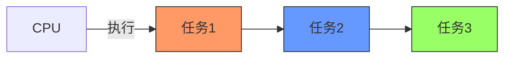

> 💡 想象你在餐厅点餐，只有一个服务员，他必须先完成你的点单，再为下一位顾客服务，这就是串行处理。虽然简单，但效率较低。

### 1.2. 并行(Parallel)

**多个CPU同时处理多个任务或指令的方式。**

在并行处理中，多个任务可以同时进行，每个任务都有独立的处理资源。这样可以显著提高处理速度和效率。并行处理通常需要多个处理器或多个计算单元。

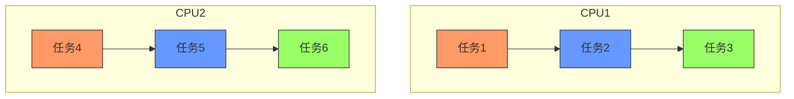

> 💡 就像餐厅有多个服务员，可以同时为多位顾客服务，每位服务员负责一位或多位顾客，这就是并行处理。它需要更多资源（服务员），但效率更高。

当一个CPU执行一个线程时，另一个CPU可以执行另一个线程，两个线程互不抢占CPU资源，可以同时进行，这种方式我们称之为并行。

### 1.3. 并发(Concurrent)

**一个或多个CPU，按照一定的策略，交替（分配CPU时间片和资源）执行多个任务。**

与并行不同，并发并不要求任务同时进行或独立处理资源。在并发处理中，任务可以按照一定的策略交替执行，任务之间通过快速切换来实现看起来同时执行的效果。

> * 并行处理时，同时能够处理的任务数取决于CPU数量，这些同时处理的任务是真正的同时处理，相当于N个人同时做N件事情，互不干扰。
> * 并发处理时，“同时”能够处理的任务数通过程序控制，这些同时处理的任务只是看起来在同时处理，相当于N个人同时做M件事情，人做事情的时候会交替着做。

单CPU执行两个任务示例：

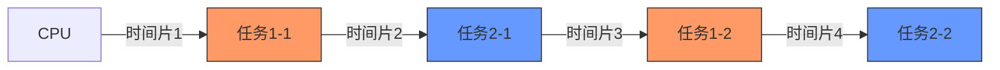

> 💡 想象一个厨师要同时做两道菜，他先切第一道菜的材料（时间片1），然后切第二道菜的材料（时间片2），再回来看第一道菜（时间片3）...虽然看起来他同时在做两道菜，但实际上是在交替进行。

双CPU执行三个任务示例：

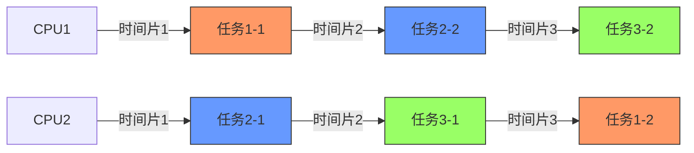

在程序中，往往有很多很耗时的工作，比如上传文件、下载文件、跟客户聊天需要长时间建立连接。这种时候，一个线程是服务不了多个用户的，会产生因为资源独占产生的等待问题。并发的实质是一个物理CPU(也可以多个物理CPU) 在若干道程序之间多路复用，并发性是对有限物理资源强制行使多用户共享以提高效率。

### 1.4. 总结

并发和并行是即相似又有区别的两个概念，并行是指两个或者多个事件在同一时刻发生；而并发是指两个或多个事件在同一时间间隔内发生。在多道程序环境下，并发性是指在一段时间内宏观上有多个程序在同时运行，但在单处理机系统中，每一时刻却仅能有一道程序执行，故微观上这些程序只能是分时地交替执行。倘若在计算机系统中有多个处理机，则这些可以并发执行的程序便可被分配到多个处理机上，实现并行执行，即利用每个处理机来处理一个可并发执行的程序，这样，多个程序便可以同时执行。


> 💡 简单来说，**并行是真正的同时执行，需要多核CPU；并发是看起来同时执行，通过快速切换实现，单核CPU也能实现**。Go语言的并发模型非常强大，即使在单核CPU上也能高效处理大量任务。

综上所述，串行是按顺序一个一个执行任务，一次只能处理一个任务；并行是同时处理多个任务，每个任务都有独立的处理资源；而并发是指同时处理多个任务的能力，任务之间可以交替执行，通过时间片切换或资源分配来实现。

## 2. 进程与线程

### 2.1. 进程(Process)

进程是操作系统中的一个执行实例。它拥有独立的内存空间和资源，是程序的一次执行过程。每个进程都是相互独立的，它们之间不能直接共享内存，通信需要通过进程间通信（IPC）机制。进程的创建和销毁是相对较重的操作。


> 💡可以把进程想象成一个独立的办公室，里面有自己独立的空间、资源和员工。不同办公室之间不能直接共享资源，需要通过特定渠道（如电话、邮件）沟通。

进程是一个具有一定独立功能的程序在一个数据集上的一次动态执行的过程，是操作系统进行资源分配和调度的一个独立单位，是应用程序运行的载体。进程是一种抽象的概念，从来没有统一的标准定义。


进程一般由程序、数据集合和进程控制块三部分组成：

- **程序**：用于描述进程要完成的功能，是控制进程执行的指令集
- **数据集合**：是程序在执行时所需要的数据和工作区
- **程序控制块(PCB)**：包含进程的描述信息和控制信息，是进程存在的唯一标志


进程具有的特征：

- **动态性**：进程是程序的一次执行过程，是临时的，有生命期的，是动态产生，动态消亡的
- **并发性**：任何进程都可以同其他进程一起并发执行
- **独立性**：进程是系统进行资源分配和调度的一个独立单位
- **结构性**：进程由程序、数据和进程控制块三部分组成


### 2.2. 线程(Thread)

线程是进程的一个执行实体，是进程内的一个轻量级执行单元。一个进程可以包含多个线程，它们共享同一进程的内存和资源，可以直接访问共享的数据。线程之间的切换开销较小，因为它们共享了进程的上下文。然而，线程之间的同步与互斥需要适当的同步机制，例如锁和信号量。


> 💡 线程就像是办公室里的员工，他们共享同一个办公室（进程）的空间和资源，可以一起工作，但也需要协调（同步）避免冲突。

线程是程序执行中一个单一的顺序控制流程，是程序执行流的最小单元，是处理器调度和分派的基本单位。一个标准的线程由线程ID、当前指令指针(PC)、寄存器和堆栈组成。


### 2.3. 进程与线程的关系

- 线程是程序执行的最小单位，而进程是操作系统分配资源的最小单位
- 一个进程由一个或多个线程组成，线程是一个进程中代码的不同执行路线
- 进程之间相互独立，但同一进程下的各个线程之间共享程序的内存空间(包括代码段、数据集、堆等)及一些进程级的资源(如打开文件和信号)，某进程内的线程在其它进程不可见
- 调度和切换：线程上下文切换比进程上下文切换要快得多


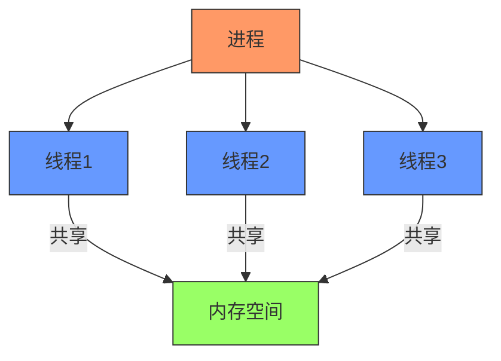

> 💡一个进程可以理解为一个应用程序（如Chrome浏览器），而线程则是这个应用程序中不同的工作单元（如一个标签页一个线程）。进程创建开销大，线程创建开销小。

总之，线程和进程都是一种抽象的概念，线程是一种比进程更小的抽象，线程和进程都可用于实现并发。在早期的操作系统中并没有线程的概念，进程是能拥有资源和独立运行的最小单位，也是程序执行的最小单位。它相当于一个进程里只有一个线程，进程本身就是线程。所以线程有时被称为轻量级进程(Lightweight Process，LWP)


### 2.4. 线程的生命周期

线程的生命周期共有五个状态：

- **创建**：一个新的线程被创建，等待该线程被调用执行
- **就绪**：时间片已用完，此线程被强制暂停，等待下一个属于它的时间片到来
- **运行**：此线程正在执行，正在占用时间片
- **阻塞**：也叫等待状态，等待某一事件(如IO或另一个线程)执行完
- **退出**：一个线程完成任务或者其他终止条件发生，该线程终止进入退出状态，退出状态释放该线程所分配的资源


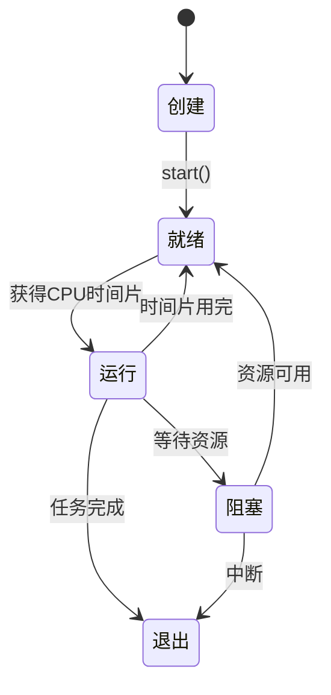

> 💡 线程就像一个员工，创建=招聘，就绪=准备好工作但等待任务，运行=正在工作，阻塞=等待其他同事完成某项工作，退出=完成工作离开。

## 3. 协程(Coroutine)


### 3.1. 什么是协程

协程是一种用户态的轻量级线程，也称为协作式任务。与线程不同，协程由程序员控制，而不是由操作系统调度。协程可以在执行过程中主动暂停和恢复，可以保存和恢复上下文，并通过协程调度器决定执行哪个协程。协程允许非抢占式的任务切换，因此可以实现高效的并发和协作。


> 💡 协程就像接力赛中的运动员，可以主动把接力棒交给下一位运动员（让出执行权），而不是被裁判强行中断（操作系统抢占）。

协程是一种基于线程之上，但又比线程更加轻量级的存在，这种由程序员自己写程序来管理的轻量级线程叫做『用户空间线程』，具有对内核来说不可见的特性。


正如一个进程可以拥有多个线程一样，一个线程也可以拥有多个协程。


### 3.2. Go语言中的协程(goroutine)

Go语言中的goroutine是协程的一种实现。它是Go并发编程的核心。


- **轻量**：goroutine的初始栈大小仅为2KB，可以根据需要动态增长
- **由Go运行时调度**：Go的调度器可以在操作系统线程上复用成千上万个goroutine
- **创建简单**：使用`go`关键字即可启动一个新的goroutine


```go
func main() {
	go someFunction() // 启动一个goroutine
}
```


### 3.3. 协程与线程的比较

| 特性 | 线程 | 协程 |
| --- | --- | --- |
| 创建开销 | 较大（通常1MB栈空间） | 极小（初始2KB栈空间） |
| 调度方式 | 操作系统抢占式调度 | 用户程序协作式调度 |
| 上下文切换 | 开销较大 | 开销极小 |
| 数量限制 | 通常几百到几千 | 可以成千上万 |
| 通信方式 | 共享内存+锁 | 通道(channel)通信 |


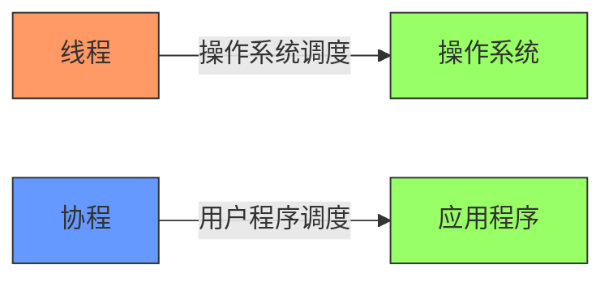

> 💡线程是操作系统管理的，切换需要系统调用，开销大；协程是程序自己管理的，切换只需保存/恢复少量寄存器，开销小。Go的goroutine是协程的高效实现。

## 4. 同步与异步

### 4.1. 同步(Synchronous)

同步操作是指任务按照顺序依次执行，当前任务必须等待前一个任务完成后才能开始。在同步模式下，调用者会一直等待被调用者返回结果。

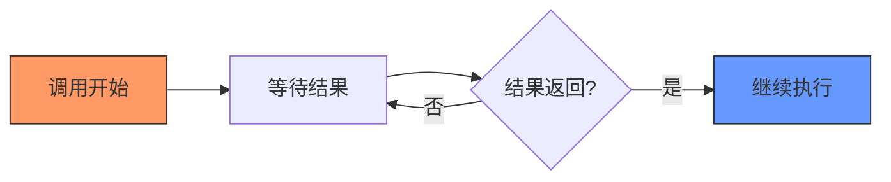

> 💡想象你在银行柜台办理业务，必须排队等待前面的人办完，然后你开始办理业务并全程等待工作人员处理，期间你不能离开去做其他事情，直到业务完成。（～～事实上你可以干点小事情，比如往头上套丝袜～～）

### 4.2. 异步(Asynchronous)

异步操作是指任务可以不必等待前一个任务完成就开始执行。在异步模式下，调用者发出调用后立即返回，不需要等待结果，结果通过回调、事件或轮询等方式获取。

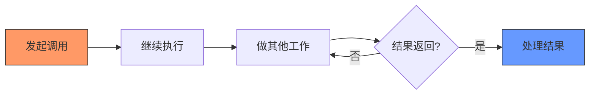


> 💡 异步就像发电子邮件——你发送邮件后可以立即去做其他事情，不需要一直盯着收件箱，当对方回复时你会收到通知再去处理。

> 🌰 就像你在餐厅点餐后拿到一个呼叫器，你可以去逛街或工作，当食物准备好时呼叫器会震动提醒你，这期间你可以自由做其他事情。

### 4.3. 阻塞与非阻塞

- **阻塞**：调用者在等待结果返回期间不能执行其他任务
- **非阻塞**：调用者在等待结果返回期间可以执行其他任务

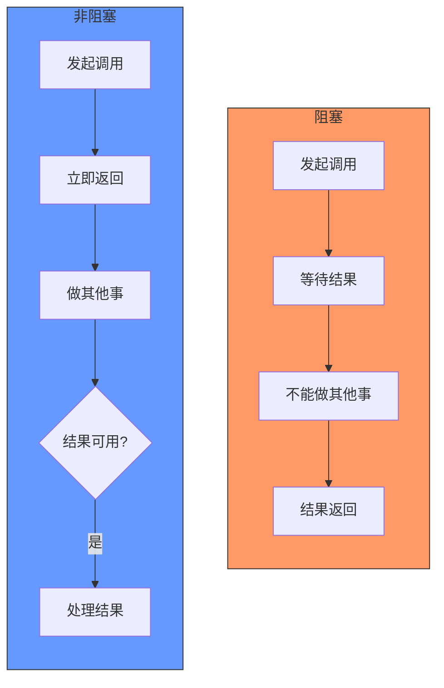

> 💡阻塞就像堵车时你在车里干等着；非阻塞就像你发现堵车后，可以下车去旁边咖啡店坐坐，时不时出来看看路况。

### 4.4. 组合模式

#### 4.4.1. 同步阻塞

调用者等待结果，期间不能做其他事情。


> 💡 **初学者小贴士**：就像在ATM机取钱，你必须一直站在机器前等待，直到交易完成才能离开。Go中channel的默认操作就是同步阻塞的。

#### 4.4.2. 同步非阻塞

调用者发起调用后立即返回，但需要定期检查结果是否可用，期间可以做其他事情。

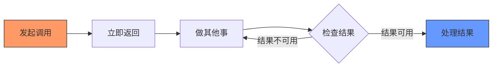

> 💡 就像煮鸡蛋时你设了个定时器，可以去做其他事，但每隔一段时间要检查一下鸡蛋是否煮好。

#### 4.4.3. 异步非阻塞

调用者发起调用后立即返回，不需要主动检查结果，结果通过回调或事件通知方式获取。

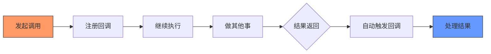

> 💡 就像网购商品，下单后你继续工作，当快递到达时会有短信通知你，你只需等待通知然后去取快递即可。

### 4.5. Go语言中的实现

在Go中，这些模式主要通过channel和select实现：

#### 4.5.1. 同步阻塞示例

```go
func main() {
	ch := make(chan int)

	// 启动一个goroutine执行任务
	go func() {
		result := doSomething()
		ch <- result // 发送结果，如果无接收者则阻塞
	}()
	
	result := <-ch // 接收结果，如果无发送者则阻塞
	fmt.Println("Result:", result)
}
```

#### 4.5.2. 同步非阻塞示例

```go
func main() {
	ch := make(chan int)
	
	go func() {
		result := doSomething()
		ch <- result
	}()
	
	// 定期检查结果是否可用
	for {
		select {
		case result := <-ch:
			fmt.Println("Result:", result)
			return
		default:
			// 结果不可用，做其他事情
			fmt.Println("Doing other work...")
			time.Sleep(100 * time.Millisecond)
		}
	}
}
```

#### 4.5.3. 异步非阻塞示例

```go
func main() {
	ch := make(chan int)
	
	// 启动一个goroutine执行任务
	go func() {
		result := doSomething()
		ch <- result
	}()
	
	// 使用select语句实现超时控制
	select {
	case result := <-ch:
		fmt.Println("Result:", result)
	case <-time.After(2 * time.Second):
		fmt.Println("Timeout!")
	}
}
```

> 💡 在Go中，channel的默认操作是同步阻塞的，但通过select语句可以轻松实现同步非阻塞和异步非阻塞模式。理解这些模式对编写高效的并发程序至关重要。

## 5. 竞态条件与临界区

### 5.1. 什么是竞态条件(Race Condition)

竞态条件是指多个goroutine或线程访问共享资源时，最终的结果取决于它们执行的相对时间。由于调度的不确定性，可能会导致程序行为不一致或数据损坏。


> 💡 就像两个人同时尝试从同一张银行卡取钱，如果系统没有正确处理，可能会导致账户余额错误。


### 5.2. 示例

```go
var counter int

func increment() {
	counter++ // 非原子操作
}

// 多个goroutine同时调用increment可能导致计数不准确
```


> 💡counter++实际包含三步操作：读取值、加1、写回。如果两个goroutine同时执行，可能会导致其中一个的增加操作被覆盖。


### 5.3. 临界区(Critical Section)

临界区是指访问共享资源的代码段，同一时间只能有一个goroutine或线程执行。保护临界区是避免竞态条件的关键。


> 💡临界区就像公共厕所的单间，一次只能有一个人使用，其他人需要等待。在Go中，可以使用sync.Mutex来保护临界区。
