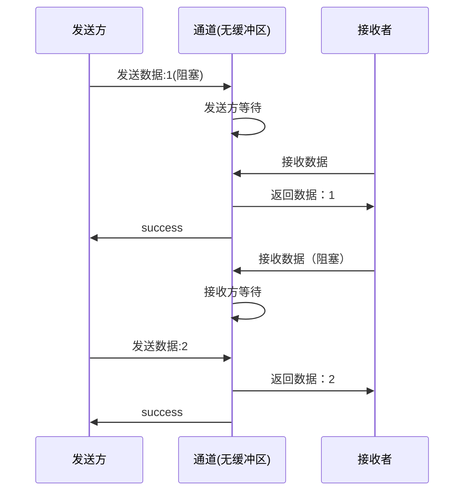
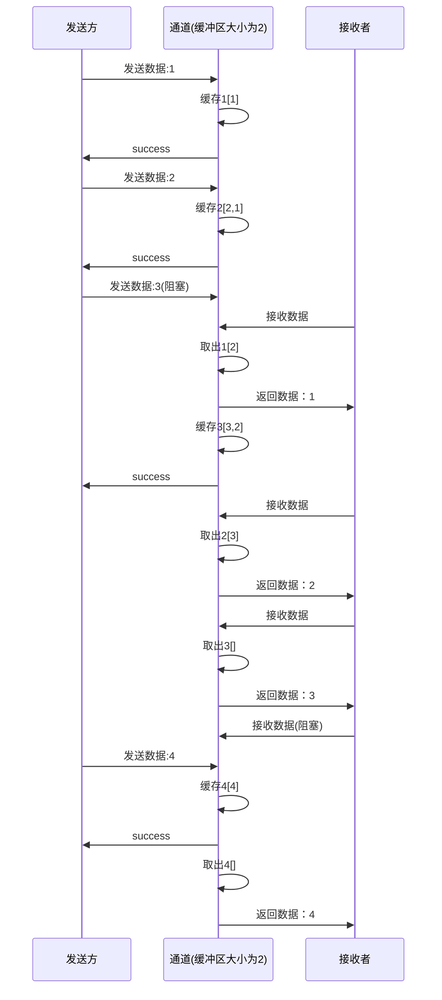

>  Go语言以其卓越的并发支持而闻名。通过goroutine和channel等原生特性，Go提供了一种简洁而强大的并发编程模型。

## 1. 并发思想（Slogan）

在很多编程语言中，为了实现多线程间的通信，通常会采用共享内存（变量）的方式。同时为了避免共享内存带来的各种并发问题，不得不采取种种复杂的措施。

Golang鼓励采取一种不同的方式来实现多协程间的通信：使用通道Channel来传递共享信息。在这种方式中，每个时刻都只有一个协程可以访问通道中的值，也就不会发生数据竞争。

Golang将这种方式概括为：

> Do not communicate by sharing memory; instead, share memory by communicating.
>
> 通信以共享内存，而非共享内存以通信。

## 2. Goroutine

### 2.1. 关于Goroutine

在java/c++中我们要实现并发编程的时候，我们通常需要自己维护一个线程池，并且需要自己去包装一个又一个的任务，同时需要自己去调度线程执行任务并维护上下文切换，这一切通常会耗费程序员大量的心智。那么能不能有一种机制，程序员只需要定义很多个任务，让系统去帮助我们把这些任务分配到CPU上实现并发执行呢？

Go语言中的goroutine就是这样一种机制，goroutine的概念类似于线程，但 goroutine是由Go的运行时（runtime）调度和管理的。Go程序会智能地将 goroutine 中的任务合理地分配给每个CPU。Go语言之所以被称为现代化的编程语言，就是因为它在语言层面已经内置了调度和上下文切换的机制。

在Go语言编程中你不需要去自己写进程、线程、协程，你的技能包里只有一个技能–goroutine，当你需要让某个任务并发执行的时候，你只需要把这个任务包装成一个函数，开启一个goroutine去执行这个函数就可以了，就是这么简单粗暴。

### 2.2. 使用Goroutine

使用Goroutine也非常的简单：只需要在调用函数时，在调用语句前面加上`go`关键字，即可开启一个协程去执行。

```go
// 开启协程去执行一个普通函数
go function_1()

// 开启一个协程去执行一个匿名函数
go func(){
  fmt.Println("Hello World")
}()
```


示例：

```go
func printInt(value int) {
	fmt.Printf("%d\n", value)
}

func main() {
	for i := 0; i < 5; i++ {
		// 开启多协程去执行
		go printInt(i)
	}
	fmt.Println("main goroutine done.")
	// main 协程等待其他协程执行完
	time.Sleep(time.Second)
}
// 输出
main goroutine done.
0
1
3
4
2

```

在上面的示例中，我们在循环中开启了五个协程去分别执行打印任务。

从输出结果可知，任务执行确实是异步的。

那么为什么我们要在main函数中睡眠一秒呢，这其实是为了等待其他协程执行完成。

> 在程序启动时，Go程序就会为main()函数创建一个默认的goroutine。当main()函数返回的时候该goroutine就结束了，所有在main()函数中启动的goroutine会一同结束。所以我们要想办法让main函数等一等hello函数，最简单粗暴的方式就是time.Sleep了。

## 3. Channel

### 3.1. 关于Channel
很多业务场景中，我们都需要在并发执行的函数与函数间进行交换数据。虽然可以使用共享内存进行数据交换，但是共享内存在不同的goroutine中容易发生竞态问题。为了保证数据交换的正确性，必须使用互斥量对内存进行加锁，这种做法势必造成性能问题。

Go语言的并发模型CSP（Communicating Sequential Processes）提倡：**通过通信共享内存而不是通过共享内存而实现通信。**

如果说goroutine是Go程序并发的执行体，channel就是它们之间的连接。channel是可以让一个goroutine发送特定值到另一个goroutine的通信机制。Channel像一个传送带或者队列，总是遵循先入先出（First In First Out）的规则，保证收发数据的顺序。每一个通道都是一个具体类型的导管，也就是声明channel的时候需要为其指定元素类型。


### 3.2. 声明

声明通道的语法格式如下：

```go
// 格式
var <channel_name> chan <type>
```

示例：

```go
// 声明一个int通道
var intChannel chan int

// 声明一个string通道
var strChannel chan int

// 声明一个结构体通道
type Person struct {
    Name string
}

var personChan chan Person

```


### 3.3. 初始化

Channel是一种引用类型，其零值为nil，声明后不能直接使用，而必须先进行初始化。

初始化Channel的语法格式如下：

```go
<channelName> = make(chan <type>,<buffer_size>)
// buffer_size表示缓冲区大小，可以忽略
```


```go
// 声明一个无缓冲区的int通道
var intChannel chan int
intChannel = make(chan int)

// 声明一个缓冲区大小为5的string通道
strChannel := make(chan string,5)
```

### 3.4. 缓冲区

#### 3.4.1. 概念

Channel中的缓冲区是Channel内部存储元素的空间，用于临时存储数据。

> 如果把Channel简单理解成队列的话，缓冲区的大小就是队列的长度。


发送方发送数据到通道时：

* 如果无缓冲区：发送方阻塞，直到有接收方来接收数据。
* 如果有缓冲区：
  * 如果缓冲区已满：发送方阻塞，直到有接收方来接收数据。
  * 如果缓冲区未满：无需等待，直接将数据放入通道缓冲区，然后继续执行后续处理。


接收方接收数据时：

* 如果无缓冲区：接收方阻塞，直到有发送方来发送数据。
* 如果有缓冲区：
  * 如果缓冲区已空：接收方阻塞，直到有发送方来发送数据。
  * 如果缓冲区有数据：直接从缓冲区取出最早的数据，然后继续执行后续处理。


缓冲区的大小决定了Channel可以缓存多少个元素。

>  使用缓冲区的Channel可以有效地处理发送和接收操作之间存在的时间差，提高并发性能。
> 

#### 3.4.2. 无缓冲区通道

无缓冲通道上的发送操作会阻塞，直到另一个goroutine在该通道上执行接收操作，这时值才能发送成功，两个goroutine将继续执行。相反，如果接收操作先执行，接收方的goroutine将阻塞，直到另一个goroutine在该通道上发送一个值。

> 使用无缓冲通道进行通信将导致发送和接收的goroutine同步化。因此，无缓冲通道也被称为同步通道。

示例时序图：




代码示例：

```go
package main

import (
	"log"
	"time"
)

// 无缓冲通道
var intChannel = make(chan int)

// 发送方
func send(i int) {
	log.Println("readyToSend ", i)
	intChannel <- i
	log.Println("send finish ", i)
}

// 接收方
func receive() {
	log.Println("readyToReceive")
	i := <-intChannel
	log.Println("receive finish", i)
}

// main函数
func main() {
	go send(1)
	time.Sleep(time.Second)
	go receive()
	time.Sleep(time.Second)
}

// 输出
2025/11/19 15:58:28 readyToSend  1
2025/11/19 15:58:29 readyToReceive
2025/11/19 15:58:29 receive finish 1
2025/11/19 15:58:29 send finish  1
```


代码示例2：死锁

```go
func main() {
	myChannel := make(chan int)
	myChannel <- 1
}
// 输出
fatal error: all goroutines are asleep - deadlock!   
```

示例中，只有发送者，没有接收者，main函数将一致阻塞，导致死锁！


#### 3.4.3. 有缓冲区通道

如果创建的Channel具有缓冲区，那么它可以在发送数据时暂时存储一定数量的数据，而不需要阻塞发送方。这使得发送方能够继续执行，而不必等待接收方接收数据。

> 只有当缓冲区已满时，发送方才会被阻塞。只有当缓冲区为空时，接收方才会被阻塞。



代码示例：

```go
package main

import (
	"log"
	"time"
)

var intChannel = make(chan int, 2)

func send() {
	for i := 0; i < 5; i++ {
		log.Println("readyToSend ", i)
		intChannel <- i
		log.Println("send finish ", i)
	}
}

func receive() {
	for i := 0; i < 5; i++ {
		log.Println("readyToReceive")
		i := <-intChannel
		log.Println("receive finish", i)
	}
}

func main() {
	go send()
	time.Sleep(100 * time.Millisecond)
	go receive()
	log.Println("main finish")
	time.Sleep(time.Second)
}

// 输出
2025/11/19 16:40:09 readyToSend  0
2025/11/19 16:40:09 send finish  0
2025/11/19 16:40:09 readyToSend  1
2025/11/19 16:40:09 send finish  1
2025/11/19 16:40:09 readyToSend  2
2025/11/19 16:40:09 main finish
2025/11/19 16:40:09 readyToReceive
2025/11/19 16:40:09 receive finish 0
2025/11/19 16:40:09 readyToReceive
2025/11/19 16:40:09 receive finish 1
2025/11/19 16:40:09 readyToReceive
2025/11/19 16:40:09 receive finish 2
2025/11/19 16:40:09 readyToReceive
2025/11/19 16:40:09 send finish  2
2025/11/19 16:40:09 readyToSend  3
2025/11/19 16:40:09 send finish  3
2025/11/19 16:40:09 readyToSend  4
2025/11/19 16:40:09 send finish  4
2025/11/19 16:40:09 receive finish 3
2025/11/19 16:40:09 readyToReceive
2025/11/19 16:40:09 receive finish 4
```

### 3.5. 通道操作

在上面章节的示例中，我们其实已经演示了如何发送数据到通道中，以及如何从通道中取出数据。

本章节将介绍更多通道操作。

#### 3.5.1. 发送/接收数据

发送数据到通道、从通道取出数据的基本语法格式如下：

```go
// 发送数据到通道
<channelName> <- <data>

intChannel <- 1 // 将1放入通道intChannel
stringChannel <- "Hello" // 将Hello放入通道stringChannel


// 取数据
<数据变量> <- <channelName>  // 从通道接收数据，并赋值给接收变量
<- <channelName> // 从通道接收数据，并丢弃
<数据变量>,<布尔变量> <- <channelName> // 从通道接收数据赋值给接收变量，并将是否取得数据布尔结果赋值给布尔变量

n := <- intChannel // 从intChannel中取出数据并赋值给新变量n
<- stringChannel // 从stringChannel取出数据并丢弃
n,ok := <-intChannel // 从intChannel取出数据，赋值给新变量n，并设置标识符ok
```


发送数据流程：

- 如果通道缓冲区还有空间，就将该元素保存到缓冲区。
- 如果通道无缓冲区，就阻塞，直到有另一个goroutine从通道中接收值。
- 如果通道缓冲区已满，就阻塞，直到另一个goroutine从通道缓存区取走值后，才将元素保存到缓冲区。


接收数据流程：

- 如果通道缓冲区中有元素，就从缓冲区中取走元素。接收操作的第一个返回值为取到的元素，第二个返回值为true。
- 如果通道无缓冲区或缓冲区没有元素，就阻塞，直到有另一个goroutine向通道中发送值。
- 当通道已经关闭时，接收操作的第一个返回值为元素类型的零值，第二个返回值为false。

#### 3.5.2. 关闭通道

关闭通道的语法格式如下：

```go
close(<channelName>)

close(myChannel) // 关闭myChannel通道
```


**关闭通道的操作不是必须的**，通道可以被垃圾回收机制回收。它和关闭文件是不一样的，在结束操作之后关闭文件是必须要做的，但关闭通道不是必须的。

通常在发送方发送完所有数据后才需要关闭通道（即使这个时候关闭通道也不是必须的）。


对一个已被关闭的通道执行操作时：

* 执行发送操作：会导致panic。
* 执行关闭操作：会导致panic。
* 执行接收操作：
  * 如果通道缓冲区还有数据：接收到缓冲区的值，返回的标识符为true。
  * 如果通道缓冲区没有数据（或没有缓冲区）：接收到数据零值，返回的标识符为false。


代码示例：

```go

var intChannel = make(chan int, 2)

func send() {
	for i := 0; i < 5; i++ {
		intChannel <- i
		log.Printf("send %d\n", i)
	}
	close(intChannel)
	log.Println("close channel")
}

func receive() {
	for {
		time.Sleep(100 * time.Millisecond)
		i, ok := <-intChannel
		if ok {
			log.Printf("receive %d\n", i)
			continue
		}
		log.Println("receive finish")
		break
	}
}

func main() {
	go send()
	time.Sleep(100 * time.Millisecond)
	go receive()
	log.Println("main finish")
	time.Sleep(time.Second)
}

// 输出
2025/11/19 17:09:24 send 0
2025/11/19 17:09:24 send 1
2025/11/19 17:09:24 main finish
2025/11/19 17:09:24 receive 0
2025/11/19 17:09:24 send 2
2025/11/19 17:09:24 receive 1
2025/11/19 17:09:24 send 3
2025/11/19 17:09:24 receive 2
2025/11/19 17:09:24 send 4
2025/11/19 17:09:24 close channel
2025/11/19 17:09:24 receive 3
2025/11/19 17:09:24 receive 4
2025/11/19 17:09:25 receive finish
```


#### 3.5.3. 通道状态与操作总结

| 通道状态           | 操作 | 结果                            |
| ------------------ | ---- | ------------------------------- |
| nil                | 发送 | 阻塞                            |
| nil                | 接收 | 阻塞                            |
| nil                | 关闭 | panic                           |
| 无缓冲区           | 发送 | 阻塞，直到有接收者接收数据      |
| 无缓冲区           | 接收 | 阻塞，直到有发送者发送数据      |
| 无缓冲区           | 关闭 | 关闭成功                        |
| 缓冲区无数据       | 发送 | 非阻塞，数据放入缓冲区          |
| 缓冲区无数据       | 接收 | 阻塞，直到有发送者发送数据      |
| 缓冲区无数据       | 关闭 | 关闭成功                        |
| 缓冲区已满         | 发送 | 阻塞，直到有接收者接收数据      |
| 缓冲区已满         | 接收 | 非阻塞，取出缓冲区数据          |
| 缓冲区已满         | 关闭 | 关闭成功                        |
| 缓冲区有数据且未满 | 发送 | 非阻塞，数据放入缓冲区          |
| 缓冲区有数据且未满 | 接收 | 非阻塞，取出缓冲区数据          |
| 缓冲区有数据且未满 | 关闭 | 关闭成功                        |
| 已关闭             | 发送 | panic                           |
| 已关闭             | 接收 | 非阻塞，返回数据零值和false标识 |
| 已关闭             | 关闭 | panic                           |

#### 3.5.4. for-range 优雅接收
当通过通道发送有限的数据时，我们可以通过close函数关闭通道来告知从该通道接收值的goroutine停止等待。
> 当通道被关闭时，往该通道发送值会引发panic，从该通道里接收的值一直都是类型零值。

 那如何判断一个通道是否被关闭了呢？按前面的方法可以这样写：
```go

func receive(c chan int) {
	for {
		v, ok := <-c // 当通道关闭时，ok值为false
		if ok {
			fmt.Printf("receive %d\n", v)
		} else {
			fmt.Printf("receive end\n")
			return // 当ok为false，表示通道关闭，直接返回
		}
	}
}
```

可以使用for-range来优雅第从通道中循环取值。
```go
func receiveWithRange(c chan int) {
	for i := range c {
		fmt.Printf("receive %d\n", i)
	}
	fmt.Printf("receive end\n")
}
```
在这种方式中，如果通道缓冲区无值且已经关闭，会直接结束for-range循环。

#### 3.5.5. select 多路复用
在某些场景下我们需要同时从多个通道接收数据。通道在接收数据时，如果没有数据可以接收将会发生阻塞。你也许会写出如下代码使用遍历的方式来实现：

```go
for{
    // 尝试从ch1接收值
    data, ok := <-ch1
    // 尝试从ch2接收值
    data, ok := <-ch2
    …
}
```
这种方式虽然可以实现从多个通道接收值的需求，但是运行性能会差很多。为了应对这种场景，Go内置了select关键字，可以同时响应多个通道的操作。select的使用类似于switch语句：

```go
select {
    case 通道操作1：
    	// doSomething
    case 通道操作2:
    	// doSomething
    default:
    	// doSomething
}
```
select语句包含一系列的case分支和一个默认分支（case分支和default分支都可以省略），每个case分支对应一个通道操作（接收/发送）。


select语句的执行流程如下：

* 检查case中的所有通道操作：
  * 如果有且只有一个通道操作非阻塞：执行该通道操作以及该分支下的逻辑。
  * 如果有多个通道操作非阻塞：随机执行一个通道操作以及该分支下的逻辑。
  * 如果没有通道操作非阻塞：执行default分支下的逻辑。


**注意事项：** 与switch语句一样，case子句下的break关键字，是跳出select语句，而非它外层的循环（如果有的话）。

### 4. 单向通道
在Go语言中，单向通道（One-way Channel）是指限制通道的发送或接收操作的通道。通过限制通道的发送或接收操作，可以实现更严格的通信模式，提高代码的可靠性和可读性。

在创建通道时，可以使用特殊的语法来指定通道的方向。具体而言，可以使用箭头符号` <- `来指定通道的发送或接收方向。它们的用法如下：

* `<-chan T`：表示只能从通道中接收类型为 T 的值，即只能用于接收操作的通道。
* `chan<- T`：表示只能向通道发送类型为 T 的值，即只能用于发送操作的通道。
> 这种限制使得在编写程序时，可以明确地指定通道的用途，防止在不正确的地方进行发送或接收操作，从而减少错误的发生。

单向通道在并发编程中非常有用，因为它们可以帮助提高代码的清晰度和可靠性。例如，下面的示例展示了如何使用单向通道：

```go
func send(ch chan<- int, value int) {
    ch <- value
}

func receive(ch <-chan int) {
    value := <-ch
    fmt.Println("Received:", value)
}

func main() {
    ch := make(chan int)
    go send(ch, 42)
    receive(ch)
}
```
在上述示例中，send 函数接受一个发送操作的单向通道 `chan<- int`，而 receive 函数接受一个接收操作的单向通道` <-chan int`。这样，编译器会在编译时检查是否在正确的地方使用了通道的发送或接收操作。

特别注意：

* 双向通道可以转换为任意类型的单向通道。
* 任何类型的单向通道都不能转换成双向通道。
* 单向通道只能转换为相应通道类型的单向类型，而不能逆转。例如，`chan<- int `类型的通道不能转换为` <-chan int `类型的通道。
