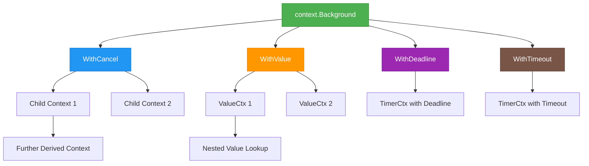

Go语言的context包提供了跨API边界和goroutine之间传递请求作用域值、取消信号和截止时间的方式。

## 1. 关于context包

### 1.1. 为什么要引入context？

* 解决并发难题： Go语天然支持并发，但在复杂的应用中缺乏标准的取消和超时控制机制。context包提供了统一的并发操作控制方式，特别是在处理大量goroutine时。
* HTTP服务器需求： Web服务中需要处理请求超时、客户端断开连接等情况。传统的net/http包需要一种机制来优雅地取消正在进行的操作。
* 微服务架构支持：在分布式系统中，请求可能跨越多个服务。需要在整个调用链中传播超时、取消信号和请求上下文信息。
* 资源泄漏问题：长时间运行的goroutine可能导致资源无法及时释放，context包提供了标准的取消机制来避免goroutine泄漏。
* 标准化API设计：在context包出现之前，各个库都有自己实现取消机制的方式，缺乏统一标准是的不同组件难以协同工作。
* 替代繁琐的手动控制：在context包之前，开发者需要自己实现复杂的取消逻辑和超时控制，context包简化了这些常见场景的实现复杂度。

### 1.2. context的作用


在 Go 服务器中，每个传入请求都在其自己的 goroutine 中处理。请求处理程序通常会启动其他 goroutine 来访问后端，例如数据库和 RPC 服务。处理请求的 goroutine 集通常需要访问特定于请求的值，例如最终用户的身份、授权令牌和请求的截止时间。当请求被取消或超时时，处理该请求的所有 goroutine 都应快速退出，以便系统可以回收它们正在使用的任何资源。

而context包，它可以轻松地将请求范围的值、取消信号和截止期限跨 API 边界传递给处理请求所涉及的所有 goroutine。

其实总结起就是一句话：context的作用就是在不同的goroutine之间同步请求特定的数据、取消信号以及处理请求的截止日期。

> 目前我们常用的一些库都是支持context的，例如gin、database/sql等库都是支持context的，这样更方便我们做并发控制了，只要在服务器入口创建一个context上下文，不断透传下去即可。


context包的主要功能：
* 取消信号传递：允许一个操作通知其子操作应该中止执行。
* 超时控制：设置操作的截止时间或超时时间。
* 请求作用域数据传递：在请求声明周期内传递键值对数据。


### 1.3. context核心接口

contex包的核心是Context接口：

```go
// Context 携带截止时间、取消信号、以及其他跨API边界的数据。
// Context的方法可以被多协程同时调用（并发安全）。
type Context interface {
  // 返回截止时间（代表上下文应该被取消的时间）
  // 如果没有设置截止时间，返回的ok为false
	Deadline() (deadline time.Time, ok bool)
  
  // 返回一个通道，充当context的取消信息，当上下文被取消或者超时时关闭。
  // 如果context不能被取消（超时），返回nil通道。
	Done() <-chan struct{}
  
  // 返回Done通道关闭的原因
	Err() error
  
  // 获取指定键的值
	Value(key any) any
}
```

**接口方法解释：**

* `Deadline() (deadline time.Time, ok bool)` 

  * 第一个返回值为截止时间（代表上下文应该被超时取消的时间）。

  * 第二个返回值为是否设置了截止时间的标识符，没有设置截止时间时返回false，设置了截止时间时（不论是否到达截止时间）则返回true。

* `Done() <-chan struct{}` 

  * 返回一个通道，该通道充当代表 Context 运行的函数的取消信号，该通道在Context被取消或者超时时关闭。如果Context永远不会被取消/超时，该方法将返回一个nil通道

    >  `WithCancel`会使Done通道在被取消时关闭；`WithDeadline`会使Done通道在到达截至时间时关闭；`WithTimeou`t会使Done通道在超时时关闭。

* `Err() error`

  * 返回Done通道关闭的原因（也就是context被取消的原因）
    * 如果Done通道没有关闭（也就是context没有被取消），返回nil
    * 如果Done通道关闭了，Err返回一个非空的error来解释原因
      * 如果是因为Context被取消了，返回Canceled
      * 如果是因为到达截止时间或者超时了，返回DeadlineExceeded
    * 当Err返回一个非空的报错后，后续都返回相同的报错。

* `Value(key any) any`Value 

  * 返回与 key 关联的值，如果没有则返回 nil。

## 2. 创建Context

所有的Context都应该源自context包中的根Context，并通过派生的方式创建更具体的Context实例，以保证Context树形结构的统一性和可控性。

### 2.1. 根Context

Go提供了两个方法来创建根Context实例：

* `context.Background() `
  创建默认的上下文，所有其他的上下文都应该从它衍生（Derived）出来。
* `context.TODO()`
  当暂时不知道使用哪一种上下文时，使用该方法创建上下文来占位。

> 从后文的源码解析可以知道，这两个方法创建的context是一模一样的，只是官方对其定义不同。


**源码：**

```go
// 空Context：无法取消、没有携带值、没有截止时间。
// 作为backgroundCtx和todoCtx的共同基础
type emptyCtx struct{}

func (emptyCtx) Deadline() (deadline time.Time, ok bool) {
	return
}

func (emptyCtx) Done() <-chan struct{} {
	return nil
}

func (emptyCtx) Err() error {
	return nil
}

func (emptyCtx) Value(key any) any {
	return nil
}

// 返回一个非nil的空Context：无法取消、没有携带值、没有截止时间。
// 通常用在main函数、初始化代码、测试代码中，作为进来的请求的顶层Context。
func Background() Context {
	return backgroundCtx{}
}

type backgroundCtx struct{ emptyCtx }

// 返回一个非nil的空Context：无法取消、没有携带值、没有截止时间。
// 当不知道使用哪一种上下文时，使用该方法创建上下文来占位
func TODO() Context {
	return todoCtx{}
}

type todoCtx struct{ emptyCtx }
```


从源码可以看到：这两种方式创建的都是空的根Context，不具备任何功能。要实现具体功能时，还需要根据需求，从根Context派生具体的Context。


### 2.2. Context派生方法

所谓Context派生：指的是使用context包中提供的相关派生方法，基于一个父Context，创建一个子Context。

根据派生出来的子Context的用途，可以将派生方法分为以下几类：

* WithCannel相关：派生可以被手动取消的上下文。
* WithDeadline相关：派生带截止时间的上下文。
* WithTimeout相关：派生带超时时间的上下文。
* WithValue相关：派生携带键值对数据的上下文。

#### 2.2.1. WithCannel相关的派生方法

相关方法：
* WithCancel：返回派生上下文和一个用于取消上下文的CancelFunc。
* WithCancelCause：与WithCancel类似，返回派生上下文和一个用于取消上下文的CancelCauseFunc（可以指定取消原因）。


`WithCancel`源码：

```go
func WithCancel(parent Context) (ctx Context, cancel CancelFunc) {
	c := withCancel(parent)
	return c, func() { c.cancel(true, Canceled, nil) }
}
```

* `WithCancel`返回一个可以被取消的派生context，以及一个用于取消该context的方法。
* 该context指向其父context，但有一个新的Done通道。当调用返回的CancelFunc或者关闭父上下文的Done通道时，该context的Done通道将关闭。
* 取消该上下文会释放语气关联的资源，因此在该context中运行的操作完成后，代码应该立即调用取消。


`WithCancelCause`源码：

```go
func WithCancelCause(parent Context) (ctx Context, cancel CancelCauseFunc) {
	c := withCancel(parent)
	return c, func(cause error) { c.cancel(true, Canceled, cause) }
}
```

* `WithCancelCause`返回一个可以被取消的派生context，以及一个可以指定原因的用于取消该context的方法。
* 调用返回的`CancelCauseFunc`方法时，可以传入一个error用于表示取消的原因，如果传入nil，该原因默认为`context canceled`。
* 可以用`Cause`方法来获取context被取消的原因，如果没有原因，将返回ctx.Error()。


#### 2.2.2. WithDeadline相关的派生方法

相关方法：
* WithDeadline：返回派生上下文和一个用于取消上下文的CancelFunc。
* WithDeadlineCause：与WithDeadline类似，返回派生上下文和一个用于取消上下文的CancelFunc（不可以指定取消原因）。


`WithDeadline`源码：
```go
func WithDeadline(parent Context, d time.Time) (Context, CancelFunc) {
	return WithDeadlineCause(parent, d, nil)
}
```

* `WithDeadline`返回一个带截止时间的派生context，以及一个用于取消该context的方法。
* 该context指向其父context，但有一个新的Done通道。当到达截止时间、调用返回的CancelFunc或关闭父context的Done通道时，该context的Done通道将关闭。
* 取消该上下文会释放其关联的资源，因此在该context中运行的操作完成后，代码应该立即调用取消。
* 如果父context的截止时间早于d，则返回的context等同于通过`WithCancel`创建的context。


`WithDeadlineCause`源码：
```go
func WithDeadlineCause(parent Context, d time.Time, cause error) (Context, CancelFunc) {
	if parent == nil {
		panic("cannot create context from nil parent")
	}
	if cur, ok := parent.Deadline(); ok && cur.Before(d) {
		// The current deadline is already sooner than the new one.
		return WithCancel(parent)
	}
	c := &timerCtx{
		deadline: d,
	}
	c.cancelCtx.propagateCancel(parent, c)
	dur := time.Until(d)
	if dur <= 0 {
		c.cancel(true, DeadlineExceeded, cause) // deadline has already passed
		return c, func() { c.cancel(false, Canceled, nil) }
	}
	c.mu.Lock()
	defer c.mu.Unlock()
	if c.err == nil {
		c.timer = time.AfterFunc(dur, func() {
			c.cancel(true, DeadlineExceeded, cause)
		})
	}
	return c, func() { c.cancel(true, Canceled, nil) }
}
```

* `WithDeadlineCause`返回一个带截止时间的派生context，以及一个用于取消该context的方法（不能指定取消原因）。
* 可以用`Cause`方法来获取context被取消的原因，如果未设置原因，则返回`ctx.Err()`。


**cause参数**
现在假定一个带超时时间或者截止时间的context(加入变量名为ctx)，因为到达指定的时间，被自动超时取消了：

* 如果创建时指定了cause参数为timeout
  * 调用`ctx.Err()`方法，将返回`context deadline exceeded`
  * 调用`context.Cause(ctx)`方法，将返回`timeout`
* 如果创建时没有指定cause
  *  调用`ctx.Err()`方法，将返回`context deadline exceeded`
  *  调用`context.Cause(ctx)`方法，将返回`context deadline exceeded`

> 一句话来说：WithDeadline和WithDeadlineCause的区别在于有无cause，cause用于指定超时后context.Cause()方法返回的值。这看起来好像作用不大~


#### 2.2.3. WithTimeout相关的派生方法

相关方法：
* WithTimeout：返回派生上下文和一个用于取消上下文的CancelFunc。
* WithTimeoutCause：与WithTimeout类似，返回派生上下文和一个用于取消上下文的CancelFunc。

`WithTimeout`源码：
```go
func WithTimeout(parent Context, timeout time.Duration) (Context, CancelFunc) {
	return WithDeadline(parent, time.Now().Add(timeout))
}
```

* `WithTimeout`是`WithDeadline`的便捷封装，用于设置相对超时时间。
* 它实际上调用`WithDeadline`并计算截止时间为当前时间加上timeout。
* 行为与`WithDeadline`完全一致，只是参数形式不同。


`WithTimeoutCause`源码：
```go
func WithTimeoutCause(parent Context, timeout time.Duration, cause error) (Context, CancelFunc) {
	return WithDeadlineCause(parent, time.Now().Add(timeout), cause)
}
```

* `WithTimeoutCause`是`WithDeadlineCause`的便捷封装，用于设置相对超时时间并指定取消原因。
* 它实际上调用`WithDeadlineCause`并计算截止时间为当前时间加上timeout。
* 行为与`WithDeadlineCause`完全一致，只是参数形式不同。


#### 2.2.4. WithValue相关的派生方法

相关方法：
* WithValue：返回携带键值对数据的派生context。

`WithValue`源码：
```go
func WithValue(parent Context, key, val any) Context {
	if parent == nil {
		panic("cannot create context from nil parent")
	}
	if key == nil {
		panic("nil key")
	}
	if !reflectlite.TypeOf(key).Comparable() {
		panic("key is not comparable")
	}
	return &valueCtx{parent, key, val}
}
```

* `WithValue`返回一个携带键值对数据的新context，该context基于提供的父context。
* 返回的context对于`Value(key)`调用会先检查是否是存储的key，如果是则返回对应的val，否则会递归调用父context的`Value`方法。
* 提供的key必须是可比较的类型，并且建议使用自定义类型以避免冲突。
* 不建议使用字符串或其他内置类型作为key，以防止不同包之间的key冲突。
* 仅应将context值用于传递请求范围的数据，而不应用于传递可选参数。


### 2.3. Context树

context的派生机制形成了一个树形结构，每个Context都源自一个父Context，并可以派生出多个子Context。这种树状结构保证了取消信号、截止时间和请求数据能够在整个调用链中正确传播。

#### 2.3.1. Context树形结构




如上图所示，Context树的结构特点包括：

* **根节点**：所有Context都起源于`context.Background()`或`context.TODO()`创建的根Context
* **分支节点**：通过`WithCancel`、`WithValue`、`WithDeadline`、`WithTimeout`等方法从父Context派生出子Context
* **继承特性**：子Context继承父Context的所有属性，包括截止时间、取消状态和存储的值
* **传播机制**：当父Context被取消时，所有子Context也会被级联取消
* **值查找**：`Value()`方法会沿着Context树向上查找，直到找到匹配的key或到达根节点

#### 2.3.2. 派生规则与最佳实践

1. **单向派生**：每个Context只能有一个父Context，但可以有多个子Context
2. **及时取消**：使用`WithCancel`、`WithDeadline`或`WithTimeout`创建的Context，在不再需要时必须调用对应的cancel函数
3. **避免内存泄漏**：未调用cancel函数会导致Context及其关联的资源无法被垃圾回收
4. **合理使用WithValue**：只用于传递请求范围的数据，不要滥用为通用的参数传递机制
5. **类型安全的Key**：使用自定义的未导出类型作为key，避免不同包之间的key冲突

#### 2.3.3 实际应用示例

```go
func handleRequest(ctx context.Context, req Request) error {
	// 基于请求Context创建取消Context
	ctx, cancel := context.WithCancel(ctx)
	defer cancel()

	// 添加请求特定的值
	ctx = context.WithValue(ctx, "requestID", req.ID)
	ctx = context.WithValue(ctx, "userID", req.UserID)

	// 设置业务处理超时
	ctx, timeoutCancel := context.WithTimeout(ctx, 30*time.Second)
	defer timeoutCancel()

	// 并发执行多个子任务
	var wg sync.WaitGroup
	for i := 0; i < len(req.Tasks); i++ {
		wg.Add(1)
		// 每个子任务都有自己的Context
		taskCtx := context.WithValue(ctx, "taskNum", i)
		go func(taskCtx context.Context, task Task) {
			defer wg.Done()
			processTask(taskCtx, task)
		}(taskCtx, req.Tasks[i])
	}

	wg.Wait()
	return nil
}
```

在这个示例中：

1. 从传入的请求Context开始
2. 派生出可取消的Context用于整体请求控制
3. 添加请求特定的值（requestID、userID）
4. 进一步派生出带超时的Context用于业务处理
5. 为每个并发任务派生出包含任务编号的Context
6. 所有子Context形成一棵完整的树，共享取消信号和请求数据

当任何一个cancel函数被调用，或者超时发生时，整棵Context树都会被级联取消，确保所有相关goroutine都能及时退出。

## 3. 使用Context传递数据
### 3.1. WithValue
* 使用`context.WithValue`方法，可以根据一个Context派生出一个新的子Context，这个新的Context会携带指定的数据。

* 使用context的`Value(key any) any`方法，可以从context中获取指定key的数据。

  ```go
  func (c *valueCtx) Value(key any) any {
  	if c.key == key {
  		return c.val
  	}
  	return value(c.Context, key)
  }
  ```

  * 如果当前context中找到了key，就返回对应值。 如果当前context中没有找到key，就从父context中找，以此类推。 如果在context及其所有父context中都没有找到key，返回nil。

### 3.2. 注意事项

Value 允许 Context 携带请求范围的数据。该数据对于多个 goroutine 同时使用必须是安全的。

* Context的Value应该用于跨API和进程边界传递请求范围的值，而不应该用于在方法中传递可选参数。
* key标识Context中的特定值。在 Context 中存储值的函数通常会在全局变量中分配一个键，然后使用该键作为 context.WithValue 和 Context.Value 的参数。键可以是任何支持相等的类型；包应该将键定义为未导出的类型以避免冲突。

* 定义 Context 键的包应该为使用该键存储的值提供类型安全的访问器。

* Context应该只用于跨API或进程传递请求数据，而不应该用于传递可选参数。（可以但不建议）

* key必须是可比较的类型。

* key不应该是字符串或任何其他内置类型，以避免不同包之间在使用上下文时发生键的冲突。

* Context 中存储值的函数通常会在全局变量中分配一个键，然后使用该键作为 context.WithValue 和 Context.Value 的参数。键可以是任何支持相等的类型；包应该将键定义为未导出的类型以避免冲突。

* 定义 Context 键的包应该为使用该键存储的值提供类型安全的访问器。
>可以参考[go blog - Go Concurrency Patterns: Context
]( https://go.dev/blog/context#TOC_3.2.)

### 3.3. 官方推荐示例
```go
// User 要存储到context中的值的类型
type User struct {
	UserID   string
	UserName string
}

// key 定义一个未导出的key类型
// 这可以防止与其他包中定义的key发生冲突。
type key int

// userKey context中存储用户信息的key.
// 它也是未导出的
// 客户端使用提供的安全访问器user.NewContext and user.FromContext来访问,而不是直接使用它
var userKey key

// NewContext 返回一个携带用户信息的新context
func NewContext(ctx context.Context, u *User) context.Context {
	return context.WithValue(ctx, userKey, u)
}

// FromContext 返回存储在context中的用户信息
func FromContext(ctx context.Context) (*User, bool) {
	u, ok := ctx.Value(userKey).(*User)
	return u, ok
}

func main() {
	c := context.Background()

	// 存储用户信息
	c = NewContext(c, &User{
		UserID:   "001",
		UserName: "admin",
	})

	// 读取用户信息
	user, exist := FromContext(c)
	if exist {
		log.Printf("%+v", user)
		return
	}
	log.Println("user not found.")
}

```
### 3.4. 笔者示例
```go
type requestKeyType string  // 请求Key类型
type businessKeyType string // 业务Key类型

const (
	traceIDRequestKey  requestKeyType = "traceID" // 请求跟踪号
	userNameRequestKey requestKeyType = "admin"   // 请求用户

	traceIDBusinessKey  businessKeyType = "traceID" // 业务跟踪号
	userNameBusinessKey businessKeyType = "admin"   // 业务用户
)

func main() {
	// 创建根Context
	c := context.Background()
	// 携带请求数据
	c = context.WithValue(c, traceIDRequestKey, "das454asd564a6s1da165d4a1a3s1d6a413")
	c = context.WithValue(c, userNameRequestKey, "admin")
	// 携带业务数据
	c = context.WithValue(c, traceIDBusinessKey, "das556da1d35de31as1d65a1da4ew15q46q")
	c = context.WithValue(c, userNameBusinessKey, "genAdmin")

	// 请求处理
	DoRequest(c)
	// 业务处理
	DoBusiness(c)
}

func DoRequest(c context.Context) {
	fmt.Println(c.Value(traceIDRequestKey))  // das454asd564a6s1da165d4a1a3s1d6a413
	fmt.Println(c.Value(userNameRequestKey)) // admin
}

func DoBusiness(c context.Context) {
	fmt.Println(c.Value(traceIDBusinessKey))  // das556da1d35de31as1d65a1da4ew15q46q
	fmt.Println(c.Value(userNameBusinessKey)) // genAdmin
}
```
> 示例中，我们遵循官方的建议，自定义了key的类型，避免了key的冲突。在上述的场景中，如果我们不自定义key类型，而是直接使用string，就会因为key冲突从而导致程序允许不正确。

## 4. 使用Context实现超时控制

使用`WithDeadline`相关方法和`WithTimeout`相关方法，可以很好滴实现goroutine的超时控制。如果不嫌麻烦的话，使用time包中的定时器，搭配`WithCancel`相关方法，也可以实现goroutine的超时控制。

### 4.1. WithDeadline使用示例
执行一个比较耗时的函数，并设置超时时间为5秒。如果5秒内执行完成，就打印执行结果，否则打印执行超时错误。
```go
func main() {
	// 设置超时时间为5秒钟
	ctx, cancelFunc := context.WithDeadline(context.Background(), time.Now().Add(time.Second*5))
	defer cancelFunc()

	// resultChan 结果通道
	resultChan := make(chan int,1)

	// 异步执行计算方法
	go func() {
		resultChan <- cal(5)
	}()

	// 等待
	select {
	case <-ctx.Done():
		// 打印超时信息
		fmt.Println(ctx.Err()) // 最终输出了：context deadline exceeded
		fmt.Println(context.Cause(ctx)) // 最终输出了：context deadline exceeded
	case n := <-resultChan:
		// 打印结果信息
		fmt.Println(n)
	}
}

// cal 方法睡眠6秒后返回
func cal(n int) int {
	time.Sleep(time.Second * 6)
	return n * n
}
```
### 4.2. WithDeadlineCause使用示例
本示例就在WithDeadline示例的基础上进行少量改造：
```go
func main() {
	// 设置超时时间为5秒钟
	// 设置超时原因为timeout
	ctx, cancelFunc := context.WithDeadlineCause(context.Background(), time.Now().Add(time.Second*5), errors.New("timeout"))
	defer cancelFunc()

	// resultChan 结果通道
	resultChan := make(chan int, 1)
	
	// 异步执行计算方法
	go func() {
		resultChan <- cal(5)
	}()
	
	// 等待
	select {
	case <-ctx.Done():
		// 打印超时信息
		fmt.Println(ctx.Err())          // 最终输出了：context deadline exceeded
		fmt.Println(context.Cause(ctx)) // 最终输出了：timeout
	case n := <-resultChan:
		// 打印结果信息
		fmt.Println(n)
	}
}

// cal 方法睡眠6秒后返回
func cal(n int) int {
	time.Sleep(time.Second * 6)
	return n * n
}
```
### 4.3. WithTimeout & WithTimeoutCause
可以看到，WithTimeout、WithTimeoutCause实际上分别是WithDeadline、WithDeadlineCause方法的简单变形。对于调用者来说，只是传参方式不一样而已，其他地方完全一致。因此这里不再赘述。
## 5. 使用Context取消goroutine执行
### 5.1 WithCancel使用示例
在下面的示例中，我们将启动一个协程去不断生成随机数。主协程负责读取生成的随机数，并在生成的随机数等于0时，取消随机数的生成。
```go
func main() {
	// 创建取消上下文
	ctx, cancelFunc := context.WithCancel(context.Background())

	// 启动一个协程去生成随机数
	c := genRandomNum(ctx)

	// 读取生成的随机数
	for {
		i := <-c
		log.Printf("receive %d\n", i)
		
		// 如果生成的随机数等于0,就取消随机数生成
		if i == 0 {
			cancelFunc()
			break
		}
	}

	log.Println("end")
	
	// 这是为了等待被取消的协程打印日志,正常是不需要的
	time.Sleep(time.Second)
}

// genRandomNum 用于不断生成随机数,知道上下文取消
func genRandomNum(ctx context.Context) <-chan int {
	res := make(chan int)
	go func() {
		for {
			select {
			case <-ctx.Done():
				log.Println(ctx.Err()) // 将打印：context canceled
				return
			case res <- rand.Intn(100):
			}
		}
	}()
	return res
}
```
### 5.2. WithCancelCause使用示例
在下面的示例中，我们将启动一个协程去不断生成随机数。主协程负责读取生成的随机数，并在生成的随机数等于0，或者生成的随机数数量达到100时，取消随机数的生成，同时设置取消的原因。
```go
func main() {
	// 创建取消上下文
	ctx, cancelFunc := context.WithCancelCause(context.Background())

	// 启动一个协程去生成随机数
	c := genRandomNum(ctx)

	count := 0

	// 读取生成的随机数
	for {
		i := <-c
		log.Printf("receive %d\n", i)

		// 如果生成的随机数等于0,就取消随机数生成
		if i == 0 {
			cancelFunc(errors.New("generated num is zero"))
			break
		}

		// 如果生成的随机数数量达到100个,就取消随机数生成
		count++
		if count == 100 {
			cancelFunc(errors.New("the number of generated numbers equals 100"))
			break
		}

	}

	log.Println("end")

	// 这是为了等待被取消的协程打印日志,正常是不需要的
	time.Sleep(time.Second)
}

// genRandomNum 用于不断生成随机数,知道上下文取消
func genRandomNum(ctx context.Context) <-chan int {
	res := make(chan int)
	go func() {
		for {
			select {
			case <-ctx.Done():
				log.Println(ctx.Err()) // 总会打印：context canceled
				// 可能打印：generated num is zero
				// 可能打印：the number of generated numbers equals 100
				log.Println(context.Cause(ctx))
				return
			case res <- rand.Intn(100):
			}
		}
	}()
	return res
}

```


## 6. AfterFunc方法

`context.AfterFunc` 是 Go 1.21 版本引入的一个强大工具，它简化了在 Context 被取消或超时后执行清理工作的模式。它允许你注册一个回调函数，当 Context 完成时，该函数会自动在独立的 goroutine 中被调用。

### 6.1. 核心功能与优势

**传统方式 vs AfterFunc**

在 `AfterFunc` 出现之前，我们通常需要手动启动一个 goroutine 来监听 `ctx.Done()`：

```go
// 传统方式：繁琐且容易出错
select {
case <-ctx.Done():
    // 执行清理工作
    cleanup()
}
```

这种方式不仅代码冗长，还可能因忘记处理而造成资源泄漏。`AfterFunc` 将这一模式封装起来，使代码更简洁、安全：

```go
// 使用 AfterFunc：简洁明了
stop := context.AfterFunc(ctx, func() {
    // 执行清理工作
    cleanup()
})
// 如果需要，可以在后续逻辑中调用 stop() 来取消注册
```

**关键特性：**

1. **异步执行**：`f` 函数总是在一个新的 goroutine 中运行，不会阻塞主流程。
2. **立即触发**：如果调用 `AfterFunc` 时 Context 已完成，`f` 会立即被安排执行。
3. **多次注册**：可以对同一个 Context 注册多个 `AfterFunc`，它们彼此独立，都会被执行。
4. **可撤销**：返回的 `stop()` 函数允许你在 Context 完成前取消回调的注册。

### 6.2. 实际应用示例

#### 6.2.1. 文件操作中的清理示例

以下示例展示如何使用 `AfterFunc` 确保临时文件在请求取消时被删除。

```go
func processFileWithCleanup(ctx context.Context, filename string) error {
    // 创建临时文件
    tempFile, err := os.CreateTemp("", "temp-*.txt")
    if err != nil {
        return err
    }
    defer tempFile.Close()

    // 使用 AfterFunc 注册清理函数，确保Context取消时删除临时文件
    stop := context.AfterFunc(ctx, func() {
        // 在独立的goroutine中执行清理
        go func() {
            if err := os.Remove(tempFile.Name()); err != nil {
                log.Printf("无法删除临时文件 %s: %v", tempFile.Name(), err)
            } else {
                log.Printf("已删除临时文件: %s", tempFile.Name())
            }
        }()
    })
    defer stop() // 确保正常退出时也移除回调

    // 模拟耗时的文件处理
    for i := 0; i < 5; i++ {
        select {
        case <-time.After(1 * time.Second):
            fmt.Printf("处理进度: %d/5\n", i+1)
            // 写入一些数据到临时文件
            tempFile.WriteString(fmt.Sprintf("Processing step %d\n", i+1))
        case <-ctx.Done():
            // 主流程收到取消信号
            fmt.Println("文件处理被用户取消")
            return ctx.Err()
        }
    }

    fmt.Println("文件处理完成！")
    return nil
}

func main() {
    // 场景1: 正常完成
    fmt.Println("--- 场景1: 正常完成 ---")
    ctx1, cancel1 := context.WithTimeout(context.Background(), 10*time.Second)
    defer cancel1()
    processFileWithCleanup(ctx1, "normal.txt")

    // 等待场景1完成
    time.Sleep(6 * time.Second)

    // 场景2: 提前取消
    fmt.Println("\n--- 场景2: 提前取消 ---")
    ctx2, cancel2 := context.WithCancel(context.Background())
    defer cancel2()

    done := make(chan error, 1)
    go func() {
        done <- processFileWithCleanup(ctx2, "canceled.txt")
    }()

    // 3秒后模拟用户取消
    time.Sleep(3 * time.Second)
    fmt.Println("用户请求取消!")
    cancel2()

    // 等待goroutine返回
    <-done
    time.Sleep(2 * time.Second) // 等待清理日志输出
}
```

####  6.2.2. 数据库连接池管理示例

在微服务架构中，`AfterFunc` 可以用于优雅地关闭数据库连接。

```go
type DatabaseManager struct {
    db *sql.DB
}

func (dm *DatabaseManager) QueryWithTimeout(ctx context.Context, query string) (*sql.Rows, error) {
    // 使用传入的ctx执行查询
    rows, err := dm.db.QueryContext(ctx, query)
    if err != nil {
        return nil, err
    }

    // 当ctx被取消时，主动关闭结果集，避免资源占用
    stop := context.AfterFunc(ctx, func() {
        log.Printf("查询上下文取消，正在关闭数据库结果集...")
        if closeErr := rows.Close(); closeErr != nil {
            log.Printf("关闭rows时出错: %v", closeErr)
        }
    })

    // 注意：这里不能defer stop()，因为我们需要stop来保持注册状态
    // 应该在外部逻辑中根据情况决定何时调用stop()
    return rows, nil
}

// 返回一个包装器，包含rows和stop函数
func (dm *DatabaseManager) QueryWrapper(ctx context.Context, query string) (rows *sql.Rows, cleanup func(), err error) {
    rows, err = dm.QueryWithTimeout(ctx, query)
    if err != nil {
        return nil, nil, err
    }

    // 返回一个cleanup函数，调用者可以选择提前清理
    cleanup = func() {
        rows.Close()
        // 这里不调用stop，让AfterFunc在ctx取消时自然触发
    }

    return rows, cleanup, nil
}
```

#### 6.2.3. 动态控制回调注册示例

展示如何使用返回的 `stop()` 函数来动态控制是否执行回调。

```go
func demonstrateStopFunction() {
    ctx, cancel := context.WithTimeout(context.Background(), 5*time.Second)
    defer cancel()

    var fCalled bool
    var stopCalled bool

    // 注册回调
    stop := context.AfterFunc(ctx, func() {
        fCalled = true
        fmt.Println("回调函数 f 已执行！")
    })

    // 情况1: 在ctx完成前调用stop()
    time.Sleep(1 * time.Second)
    stopped := stop()
    stopCalled = true
    fmt.Printf("首次调用stop(): %t (应该为true)\n", stopped) // true

    // 情况2: 再次调用stop() - 应该返回false
    stoppedAgain := stop()
    fmt.Printf("再次调用stop(): %t (应该为false)\n", stoppedAgain) // false

    // 情况3: 尝试重新注册（AfterFunc允许多次注册）
    context.AfterFunc(ctx, func() {
        fmt.Println("这是第二个回调函数，即使stop被调用也会执行！")
    })

    // 继续等待，观察行为
    <-ctx.Done()
    fmt.Printf("最终状态 - fCalled: %t, stopCalled: %t\n", fCalled, stopCalled)
    // 输出：fCalled 应为false，因为stop成功阻止了第一次注册的f执行
}
```

### 6.3. 最佳实践与注意事项

**何时使用 `AfterFunc`：**

- ✅ **推荐使用**：
  - 需要执行轻量级的清理工作（如记录日志、关闭文件描述符）。
  - 希望简化 `select { case <-ctx.Done(): ... }` 的样板代码。
  - 需要在 Context 生命周期结束时通知其他系统组件。

- ❌ **不推荐使用**：
  - 回调函数执行时间过长或消耗大量CPU，因为它会占用一个 goroutine。
  - 需要严格同步的场景，因为 `stop()` 不会等待 `f` 完成。
  - 对延迟非常敏感的路径，因为创建 goroutine 有开销。

**错误处理：**

`AfterFunc` 本身不提供错误处理机制。如果 `f` 函数内部发生 panic，会导致整个程序崩溃。因此，务必在 `f` 内部进行适当的错误捕获：

```go
stop := context.AfterFunc(ctx, func() {
    defer func() {
        if r := recover(); r != nil {
            log.Printf("recover from panic in AfterFunc: %v", r)
        }
    }()
    // 可能出错的操作
    riskyOperation()
})
```
