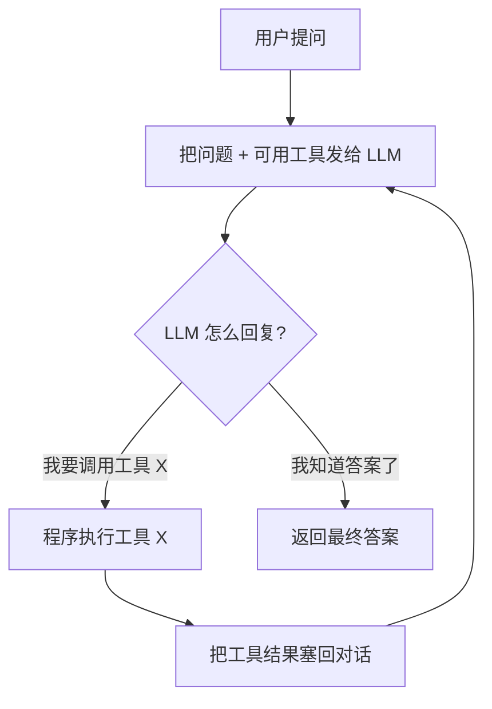
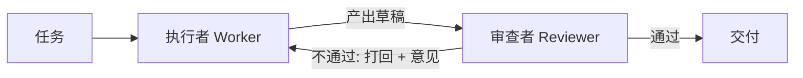

## 1. 背景

我们现在用的各种 AI 助手（ChatGPT、Claude、Cursor、Kiro……）都有一个共同的名字：**Agent（智能体）**。市面上的框架也很多——LangChain、AutoGPT、CrewAI……但如果只是把框架的 API 抄一遍，很容易"会用不会懂"：一旦出问题，或者想定制，就无从下手。

所以这篇笔记走另一条路：**先裸手写、吃透原理，再上框架**。全程只用一个 `openai` SDK（配合通义千问的兼容接口），从"发出第一条消息"开始，一步步搭到"多个 Agent 协作"，中间不依赖任何 Agent 框架。

一句话记住整篇文章的主线：

> **Agent = LLM + 循环（Loop） + 工具（Tools）**

LLM 本身只会"输出文字"，不能上网、不能读文件、不能算数。Agent 做的事，就是给 LLM 装上"手和脚"（工具），并让它在一个循环里反复 **思考 → 行动 → 观察 → 再思考**，直到任务完成。后面所有的进阶花样（记忆、检索、规划、多 Agent）都是在这个骨架上做加法。

---

## 2. 核心心智模型：ReAct 循环

最经典的 Agent 运行模式叫 **ReAct**（Reason + Act，推理与行动交替）。它的流程是这样的：



理解了这张图，就理解了 90% 的 Agent 框架。下面我们从最小的一步开始，逐步把这张图"写"出来。

> 环境说明：本文代码用 Python + 通义千问（DashScope）的兼容 OpenAI 接口。`base_url` 指向 `https://dashscope.aliyuncs.com/compatible-mode/v1`，密钥放在环境变量 `DASHSCOPE_API_KEY` 里，绝不写死在代码里。

---

## 3. 阶段 0：第一次 LLM 调用

**要解决的问题**：先跑通最基础的一次对话——发一条消息，拿到回复。

**核心认知**：一次 LLM 调用涉及三个概念：

* `role`（角色）：每条消息的身份。`system`（人设/规则）、`user`（你说的话）、`assistant`（模型说的话）。
* `message`（消息）：一条 `{"role": ..., "content": ...}` 结构。**注意发给模型的永远是一个消息列表**，这一点后面会反复用到。
* `response`（响应）：模型返回的结构化数据，真正的回复文字藏在 `response.choices[0].message.content` 里。

**关键代码**：

```python
client = OpenAI(
    api_key=api_key,
    base_url="https://dashscope.aliyuncs.com/compatible-mode/v1",
)

messages = [
    {"role": "system", "content": "你是一个乐于助人的中文 AI 助手，回答简洁清晰。"},
    {"role": "user", "content": "你好，请用一句话介绍一下你自己。"},
]

response = client.chat.completions.create(model="qwen3.8-27b", messages=messages)
reply = response.choices[0].message.content
print(reply)
```

**运行效果**：

```
你好，我是通义千问，一个乐于助人的中文 AI 助手，可以帮你写作、解答问题、分析信息和学习新事物。
```

为什么回复要 `.choices[0].message.content` 层层剥？因为 `choices` 是个列表（模型理论上可给多个候选，取第一个），`.message` 是那条候选消息，`.content` 才是文字。

---

## 4. 阶段 1：多轮对话

**要解决的问题**：阶段 0 有"失忆症"——你先说"我叫小明"，再问"我叫什么"，它答不上来。

**核心认知**：

> **LLM 本身没有记忆。** 每次调用它只能看到你这一次发过去的 `messages` 列表。所谓"记住上下文"，是**我们程序这边**把每一轮对话都追加进 `messages`，每次请求都把完整历史发一遍。

也就是说，**"记忆"在最基础层面就是一个不断增长的数组**。

**关键代码**（把阶段 0 包进一个循环，并不断追加消息）：

```python
messages = [{"role": "system", "content": "你是一个乐于助人的中文 AI 助手。"}]

while True:
    user_input = input("你: ")
    messages.append({"role": "user", "content": user_input})     # 追加你的话

    response = client.chat.completions.create(model="qwen3.8-flash", messages=messages)
    reply = response.choices[0].message.content

    messages.append({"role": "assistant", "content": reply})     # 关键：也要存模型的回复！
    print(f"助手: {reply}")
```

**最容易踩的坑**：很多人只追加了 `user` 消息，忘了把模型的 `assistant` 回复也存回列表，结果模型下一轮还是"失忆"——因为它看不到自己上一轮说过什么。

**验证记忆**：先说"我叫小明，25 岁"，再问"我叫什么？多大？"，模型准确答出"小明，25 岁"。这时 `messages` 里正好 5 条（system + 两轮问答），这就是"记忆"的全部真相——**一个从 1 条长到 5 条的列表，没有任何魔法**。

> 伏笔：历史会无限增长，聊久了 token 越来越多，又慢又贵，还会超出模型上下文上限。这个问题留到阶段 5.1 解决。

---

## 5. 阶段 2：工具调用（Function Calling）

**要解决的问题**：LLM 不会精确算数、不能读文件、查不了实时信息。给它配"工具"，让它自己决定何时调用。

**核心认知**：

> **工具调用的本质 = 模型输出一段结构化 JSON（"我要调用 add，参数 a=3、b=5"），再由我们的程序真正去执行这个函数，把结果告诉模型。模型永远不会自己执行代码。**

一次完整的工具调用分 5 步：

1. 把"问题 + 工具说明书（`tools`）"一起发给模型；
2. 模型不直接回答，而是返回一个 `tool_calls` 请求；
3. 我们解析请求，执行本地真正的函数；
4. 把结果作为一条 `role="tool"` 的消息追加回历史；
5. 再请求一次，模型基于工具结果给出自然语言答复。

**关键代码**（工具说明书 + 解析执行）：

```python
def add(a, b):
    return a + b

tools = [{
    "type": "function",
    "function": {
        "name": "add",
        "description": "计算两个数字相加的结果",
        "parameters": {
            "type": "object",
            "properties": {
                "a": {"type": "number", "description": "第一个加数"},
                "b": {"type": "number", "description": "第二个加数"},
            },
            "required": ["a", "b"],
        },
    },
}]

# 第 1 步：带上 tools 发请求
response = client.chat.completions.create(model="qwen3.8-flash", messages=messages, tools=tools)
assistant_message = response.choices[0].message

# 第 2、3 步：解析请求并执行本地函数
for tool_call in assistant_message.tool_calls:
    func_args = json.loads(tool_call.function.arguments)   # 模型给的参数是 JSON 字符串
    result = add(**func_args)

    # 第 4 步：结果以 role="tool" 回传，必须带 tool_call_id
    messages.append({
        "role": "tool",
        "tool_call_id": tool_call.id,
        "content": str(result),
    })

# 第 5 步：带着工具结果再问一次，拿最终答复
final = client.chat.completions.create(model="qwen3.8-flash", messages=messages)
```

**运行效果**：问"12345 加 6789 等于多少"，模型没有自己心算，而是请求 `add({'a': 12345, 'b': 6789})`，程序算出 `19134` 回传，模型答复"12345 + 6789 = 19134"。而问"你好呀"这种闲聊时，`tool_calls` 为空，模型直接回复——**调不调工具是模型自己判断的，不是我们写死的 if-else**。这种自主判断，正是 Agent 的核心特征。

---

## 6. 阶段 3：完整的 Agent Loop（ReAct）

**要解决的问题**：阶段 2 的流程写死了"发一次 → 执行工具 → 再发一次 → 结束"，只能处理**一步算完**的任务。遇到"先算 12+8，再乘以 10"这种多步、且后一步依赖前一步的任务就做不到。

**核心认知**：把阶段 2 那段"发请求 → 执行工具 → 回传"用一个 `while` 循环包起来，让它反复转圈，直到模型不再请求工具（`finish_reason == "stop"`）。这就是 ReAct 循环。

* 阶段 2：`if 有工具调用: 执行一次`（一锤子）
* 阶段 3：`while 有工具调用: 执行, 再问`（转圈直到收工）

**关键代码**（循环 + 两个安全措施）：

```python
def run_agent(question, max_iterations=10):   # 安全措施 1：轮数上限，防死循环
    messages = [
        {"role": "system", "content": "遇到数学计算必须调用工具，可分多步调用。"},
        {"role": "user", "content": question},
    ]

    for iteration in range(1, max_iterations + 1):
        response = client.chat.completions.create(model=MODEL, messages=messages, tools=tools)
        assistant_message = response.choices[0].message

        # 模型不再请求工具 → 给出最终答案，跳出循环
        if not assistant_message.tool_calls:
            return assistant_message.content

        messages.append(to_dict(assistant_message))

        # 安全措施 2：一圈里可能有多个 tool_calls，要全部执行
        for tool_call in assistant_message.tool_calls:
            func_name = tool_call.function.name
            func_args = json.loads(tool_call.function.arguments)
            result = AVAILABLE_FUNCTIONS[func_name](**func_args)
            messages.append({"role": "tool", "tool_call_id": tool_call.id, "content": str(result)})
        # 本圈结束，带着工具结果进入下一圈
```

**运行效果**：问"先算 12 加 8，再把结果乘以 10，最后再加上 5"，Agent 自动转了 4 圈：

```
第 1 圈  add(12, 8)      = 20     （finish_reason=tool_calls）
第 2 圈  multiply(20, 10) = 200    （20 是它从上一圈结果里读到的）
第 3 圈  add(200, 5)      = 205
第 4 圈  finish_reason=stop → 输出最终答案 205
```

**质变发生在这里**：我们从头到尾没告诉模型"要分三步、每步调什么"。是模型**自己规划、自己一步步执行、自己判断何时完成**的。我们的程序只负责"执行它点名的工具、把结果递回去"。这就是 Agent 的灵魂——**自主决策 + 多步执行**。

其中：`finish_reason` 是循环的"红绿灯"（`tool_calls`=继续转，`stop`=收工）；`max_iterations` 是防止模型犯傻反复调工具、烧光额度的保险。

---

## 7. 阶段 4：多工具与健壮性

阶段 3 的 Agent 内核已经通了，但它还是个"温室里的花朵"：工具是玩具，而且工具一报错整个程序就崩。阶段 4 做三件事让它从"能演示"变"能干活、摔不坏"。

**① 真正有用的工具**：加 `read_file`、`list_files`，让 Agent 能感知外部世界。

**② 健壮的工具路由**：用一个统一的"分发台" `dispatch_tool` 处理所有工具调用，模型点了不存在的工具也不会 `KeyError` 崩溃。

**③ 错误处理（本阶段灵魂）**：

> **对 Agent 来说，错误不是"程序崩溃的理由"，而是"喂给模型的一条观察信息"。** 模型完全有能力根据错误自己想办法。

看代码里这个分发台——无论发生什么，它都返回一个**字符串**，绝不向上抛异常：

```python
def dispatch_tool(func_name, func_args):
    if func_name not in AVAILABLE_FUNCTIONS:      # 路由错误：工具不存在
        return f"错误：不存在名为 '{func_name}' 的工具。"

    func = AVAILABLE_FUNCTIONS[func_name]
    try:
        return str(func(**func_args))
    except FileNotFoundError:
        # 关键：把"文件不存在"变成一条给模型的提示，而不是崩溃
        return f"错误：文件 '{func_args.get('filename')}' 不存在。你可以先调用 list_files 看看有哪些文件。"
    except Exception as e:
        return f"错误：执行 {func_name} 时发生异常：{type(e).__name__}: {e}"
```

**运行效果**（故意让它读一个不存在的 `diary.txt`）：

```
第 1 圈  list_files() → notes.txt
        read_file('diary.txt') → 错误：文件不存在，建议先 list_files
第 2 圈  read_file('notes.txt') → 读到内容，发现幸运数字 42
第 3 圈  收工，答出 42（并诚实说明其实没有 diary.txt）
```

如果按"糟糕的做法"，第 1 圈读 `diary.txt` 抛异常时程序就崩了。但因为我们把错误**转成一条 `role="tool"` 的观察信息**喂回循环，模型拿到了"重新思考的燃料"，自己绕过了障碍。**这就是玩具 Agent 和可用 Agent 的分水岭。**

> 另外注意：所有文件操作都锁死在一个 `data/` 目录里，不让 Agent 乱读整个磁盘。**工具越强，越要设安全边界。**

---

## 8. 阶段 5：进阶架构

内核通了，这一阶段是往上叠"高级能力"。

### 8.1 短期记忆：窗口 vs 摘要

阶段 1 埋的伏笔（历史无限增长）到这里解决。因为模型有**上下文窗口**上限，`messages` 越长越慢越贵、超限还会报错。两种最常用的短期记忆策略：

* **滑动窗口**：只保留 `system` + 最近 N 轮，旧的直接丢。简单快，但会**彻底遗忘**早期信息。
* **摘要压缩**：把较旧的对话让模型概括成一段摘要，用摘要替代原文。保留要点、省 token，但多花一次调用、细节有损。

做一个"密码考试"对比：对话第 1 轮藏了"保险箱密码 8888"，后面聊一堆无关话题把它推远，再追问"密码是多少"：

| 策略 | 消息数 | 结果 |
| --- | --- | --- |
| 不管理 | 11 条 | —— |
| 滑动窗口（留最近 2 轮） | 5 条 | ❌ 答不出（含密码的第 1 轮被丢了） |
| 摘要压缩 | 6 条 | ✅ 答出 8888（压缩时保留了关键事实） |

> **记忆管理没有银弹，全是权衡**：窗口快但遗忘，摘要保要点但有成本。真实系统常常两者结合——近期用原文，更早的滚动压成摘要。注意任何策略都**必须保留 `system` 消息**，否则 Agent 会"变傻"。

### 8.2 长期记忆：Embedding + 检索（RAG）

短期记忆只能管当前窗口，装不下海量、跨会话的知识（你所有的笔记、一整本手册）。思路变了：**把知识存到外部，提问时只检索出最相关的几条塞进上下文**。这就是 **RAG（检索增强生成）**。

关键概念是 **Embedding（嵌入向量）**：

> **把一段文字转换成一串数字（向量），语义越相近的文字，向量在空间里"距离"越近。** 于是"找最相关的内容"就变成一道数学题：算向量间的相似度（最常用**余弦相似度**，越接近 1 越相似）。

余弦相似度其实就是几行算术（点积除以两个向量的模长）：

```python
def cosine_similarity(a, b):
    dot = sum(x * y for x, y in zip(a, b))       # 点积 A·B
    norm_a = math.sqrt(sum(x * x for x in a))     # |A|
    norm_b = math.sqrt(sum(y * y for y in b))     # |B|
    return dot / (norm_a * norm_b)               # 越接近 1 越相似
```

RAG 完整流程：知识逐条转成向量存好 → 问题也转成向量 → 和每条知识算相似度 → 取 Top-K → 塞进 prompt 让模型作答。

**运行效果**（考点：知识库写的是"保险箱**口令**是 8888"，用户问的是"**密码**是多少"，两个词一个字都不重合）：

```
所有知识与问题的相似度（从高到低）：
    0.6938  |  小明的保险箱口令是 8888。      ← 遥遥领先
    0.3641  |  报销流程：先在系统提交申请…
    0.3289  |  Python 里用 def 关键字定义函数…
```

尽管"口令"和"密码"字面不同，语义检索照样精准地把它排到了第一。**这就是 embedding 相比关键词搜索的根本优势：它理解的是意思，不是字面。** 真实项目用向量数据库（FAISS 等）只是为了在海量数据下加速，原理和这几行手写的一模一样。

### 8.3 规划（Planning）：先出图纸，再施工

ReAct 是"走一步看一步"，任务一复杂容易迷路、漏步骤。**规划**则把任务分成两阶段：

* **规划阶段**：让模型先**不动手**，只输出一份步骤清单；
* **执行阶段**：拿着清单一步步执行，每步的产出喂给下一步。

一句话：**规划 = 先让模型"想清楚整体步骤"，再"照着步骤逐一执行"。**（这正是很多 AI 编程助手先列 todo、再逐项完成的做法。）

**运行效果**（任务："写一首秋天的四行诗 → 翻译成英文 → 统计原诗字数"）：模型先规划出 4 步（还自己多加了"汇总输出"一步），然后逐步执行。**关键在于依赖正确传递**：第 2 步翻译的正是第 1 步写的那首诗，第 3 步数的也是同一首——因为执行时把已完成步骤的产出带进了下一步的上下文。这和阶段 1 的"记忆"一脉相承：上下文靠程序主动传递。

**Planning vs ReAct 怎么选：**

| | ReAct（阶段 3） | Planning（8.3） |
| --- | --- | --- |
| 思路 | 走一步看一步 | 先出完整计划再执行 |
| 适合 | 步骤少、路径不确定、需随机应变 | 步骤多、目标明确、需有条理 |
| 短板 | 任务长了容易迷路 | 计划定死后不灵活 |

实战中两者常结合：用 Planning 拆出大步骤，每个大步骤内部再用 ReAct + 工具去完成。

### 8.4 多 Agent 协作

前面都是**一个** Agent 单打独斗。一个 Agent 又写又审，容易顾此失彼、缺乏制衡。多 Agent 的思路是**分工 + 制衡**：

> **让多个各有专长、各有独立"人设"的 Agent 分工协作，通过互相传递消息，像一个团队一样完成任务。**

经典组合是**执行者（Worker）+ 审查者（Reviewer）**：



**本质揭秘**：每个 Agent 就是**一次带专属 `system` 人设的 LLM 调用**。执行者人设是"你负责写"，审查者人设是"你负责严格挑错"。同一个模型扮演不同角色——这就是多 Agent 的朴素本质，不需要什么神秘技术。外面套一个"改→审→改→审"的循环，直到审查通过或到达轮数上限。

---

## 9. 那些真实的"翻车"瞬间

跑这些实验时遇到几个有意思的现象，比干讲原理更有价值：

* **语义检索的惊艳**：8.2 里"口令"和"密码"一个字都不重合，embedding 照样把它以 0.69 的相似度排第一。这是关键词搜索做不到的。
* **错误让 Agent 更聪明**：8.4 阶段 4 里，读不到 `diary.txt` 反而触发了模型"先列目录看看"的自救行为——错误信息成了它的思考燃料。
* **审查者自己也会犯错**：8.4 用更苛刻的约束（"正好 5 个单词"）测试时，审查者一度**把词数数错**、意见还自相矛盾，把明明合格的句子打了回去。但神奇的是，**整个系统仍然收敛到了正确答案**——执行者在几轮"改→审"后交出了满足全部约束的结果。

这最后一点给了一个重要提醒：

> **多 Agent 不是"多一个就一定更对"。** 每个 Agent 都是会犯错的 LLM。多 Agent 的价值不在于某个成员绝对可靠，而在于"分工 + 制衡 + 迭代"能让系统整体**逼近**好结果。这才是它真实的样子——不是魔法。

---

## 10. 总结

从"发出第一条消息"到"多个 Agent 协作"，我们没有用任何框架，把 Agent 的核心机制完整地写了一遍：

| 阶段 | 掌握的能力 | 核心认知 |
| --- | --- | --- |
| 0 | 一次 LLM 调用 | role / message / response |
| 1 | 多轮对话 | 记忆 = 不断增长的消息列表 |
| 2 | 工具调用 | 模型出 JSON，程序去执行 |
| 3 | ReAct 循环 | Agent = LLM + 循环 + 工具，自主多步 |
| 4 | 多工具 + 健壮性 | 错误是给模型的观察，不是崩溃理由 |
| 5.1 | 短期记忆 | 窗口 vs 摘要的取舍 |
| 5.2 | 长期记忆 | Embedding + 相似度检索（RAG） |
| 5.3 | 规划 | 先出蓝图，再照图施工 |
| 5.4 | 多 Agent | 分工 + 制衡 + 迭代 |

最重要的一句话，也是开篇那张心智模型图的兑现：

> **Agent = LLM + 循环 + 工具。** 记忆、RAG、规划、多 Agent，全都是在这个骨架上做加法。

理解了这条主线，再回头看 LangChain、AutoGen、CrewAI 这些框架，会发现它们的内核，就是我们亲手写过的这些东西。

**下一步可以怎么走**：把散落在各阶段的能力（工具 + ReAct 循环 + 长期记忆 + 规划）拼成**一个**真正好用的 Agent，比如"能读你笔记、会规划、能调多工具"的个人助理；或者挑一个框架（如 LangGraph）重写阶段 3，对照着看每个概念对应你手写的哪部分。
