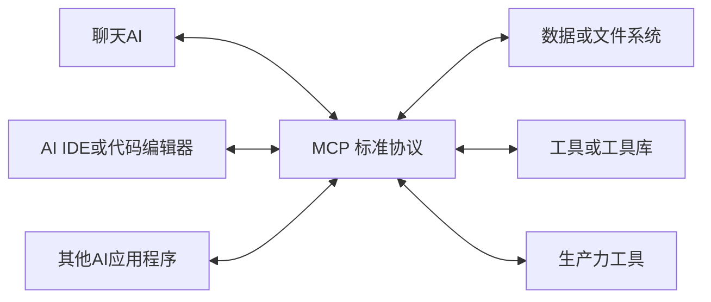

## 1. 背景
随着AI技术的快速发展，AI应用程序（如ChatGPT、Claude）变得越来越强大和普及。然而这些AI应用都面临同一个问题：他们缺乏与外部世界连接的标准方式。

现有的挑战：
* 数据孤岛问题
  * AI模型训练完成后，无法便捷访问企业内部的敏感数据。
  * 本地文件、私有数据库的关键信息难以被AI直接利用。
  * 数据更新滞后，影响AI回答的时效性和准确性。
* 集成复杂性
  * 每个AI应用都需要独立开发特定的数据连器。
  * 不同工具和系统之间缺乏统一的接口标准。
  * 开发成本高、维护困难。
* 安全性
  * 直接暴露AI密钥和敏感数据存在安全风险。
  * 缺乏标准化的安全认证机制。
  * 企业难以控制AI对内部系统的访问权限。

## 2. MCP是什么？
MCP（Model Context Protocol）是一个开源的，用于连接AI程序和外部系统的标准。

使用MCP，AI应用（比如Claude、ChatGPT）可以连接数据源（如本地文件、数据库）、工具（如搜索引擎、计算器）和工作流（如指定的提示词），从而使他们能够访问关键信息并执行任务。

想象一下,MCP就像是AI应用的USB-C接口。USB-C接口提供了一种标准的方式来连接电子设备；MCP提供了一种标准的方式来连接AI应用和外部系统。

示意图：

> MCP作为一个开发协议，被许多客户端和服务器支持。比如像Claude、ChatGPT这种AI助手，像Visual Studio Code、Cursor这样的开发工具，以及其他的很多应用程序。

## 3. MCP能做什么？

MCP 允许AI应用程序与外部系统进行交互，从而实现如以下的功能：

* 个人助理增强
  * 代理程序可以访问用户的 [Google Calendar] 和 [Notion]，充当更加个性化的 AI 助手
  * 实现日程管理和个人信息的智能整合
* 设计到开发的自动化
  * [Claude Code] 能够基于 [Figma] 设计图生成完整的 Web 应用程序
  * 实现从视觉设计到功能代码的直接转换
* 企业级数据分析
  * 企业聊天机器人可连接组织内的多个数据库
  * 用户可以通过聊天界面进行数据分析和查询
打破数据孤岛，实现跨系统数据访问
* 创意设计与物理制造集成
  * AI 模型可以直接在 [Blender] 中创建 3D 设计
  * 无缝连接到 3D 打印机进行实体打印
  * 实现从数字创意到物理产品的端到端流程

## 4. MCP为什么重要？

MCP之所以重要是因为它为AI生态系统中的不同角色提供了多层次的价值：

* 开发者层面
  * 降低开发复杂度 - 减少构建AI应用或代理时的开发时间和复杂性
  * 简化集成工作 - 无需为每个AI应用单独开发特定的数据连接器
  * 标准化接口 - 提供统一的协议标准，避免重复造轮子
* AI应用/代理层面
  * 扩展功能生态 - 访问丰富的数据源、工具和应用程序生态系统
  * 增强能力 - 通过外部系统集成提升AI应用的核心功能
  * 改善用户体验 - 提供更强大、更智能的服务体验
* 终端用户层面
  * 更强大的AI能力 - 获得能够访问用户个人数据的AI应用
  * 自动化代理 - AI可以在必要时代用户执行操作
  * 个性化体验 - 基于个人数据和偏好的定制化服务

MCP通过标准化AI与外部世界的连接方式，解决了数据孤岛、集成复杂性和安全性等问题，为整个AI生态系统创造了协同价值。
