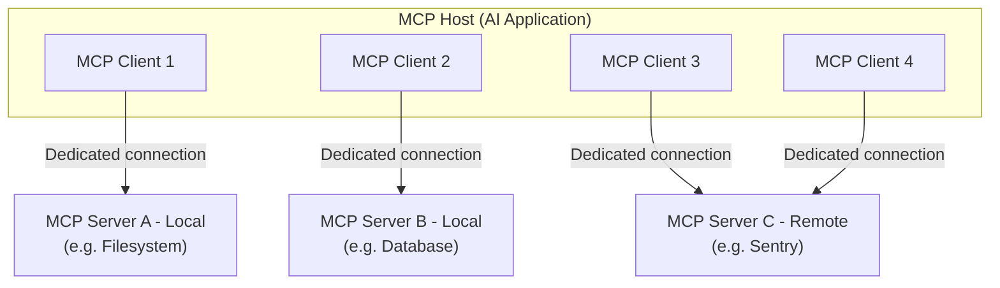
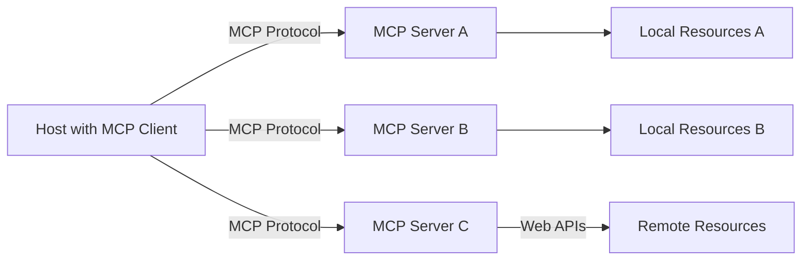
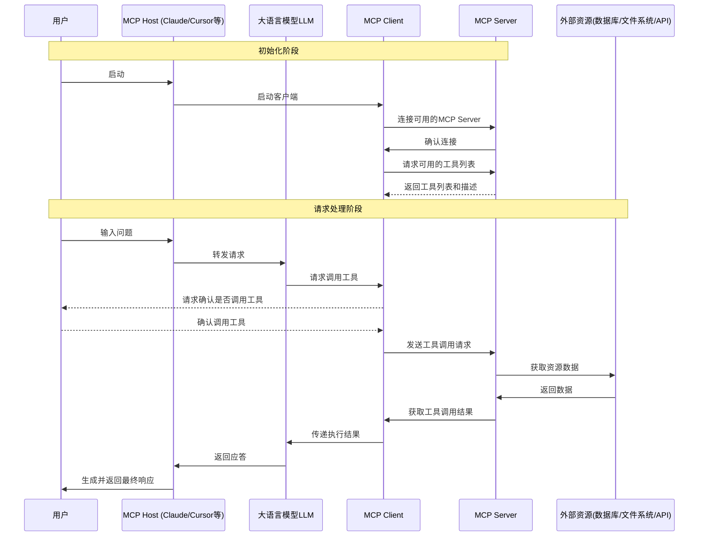
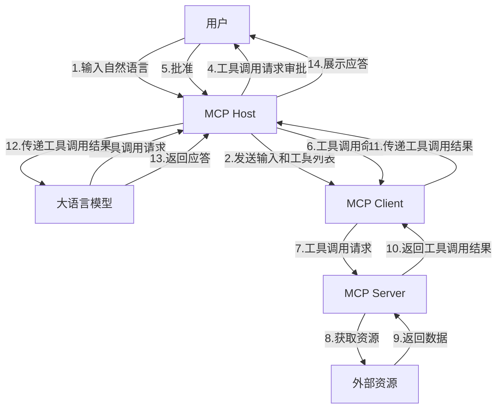

## 1. MCP 包含的内容（Scope ）

MCP（Model Context Protocol）协议包含以下内容：
* MCP规范（Specification）：定义客户端和服务端需要实现的需求。
* MCP SDKs： 用于实现MCP协议的，针对不同变成语言的SDK。
* MCP Development Tools： 帮助开发者开发MCP服务端和客户端的工具，包括MCP检查器（MCP Inspector）.
* MCP Reference Implementation： MCP协议的参考实现。

> MCP协议专注于上下文交换协议本身，不关心AI应用如何使用LLM大语言模型，也不关心如何使用上下文。

## 2. MCP架构的参与者
MCP遵循客户端-服务器（client-server）架构，MCP主机（如Claude Code等AI应用）建立与一个或多个MCP服务的连接。
> MCP主机通过为每个MCP服务创建一个MCP客户端来实现这一点。
> 每个MCP客户端都与其对应的MCP服务保持专用连接。

MCP架构的主要参与者：
* **MCP主机（Host）**：协调和管理一个或多个MCP客户端的AI应用。
* **MCP客户端（Client）**：一个组件，负责维护与MCP服务器连接，并从MCP服务获取上下文供主机使用。
* **MCP服务（Server）**：为MCP客户端提供上下文的程序。

**举例 ：**
Visual Studio Code 作为 MCP 主机。当 Visual Studio Code 建立与 MCP 服务器（如 Sentry MCP 服务器 ）的连接时，Visual Studio Code 运行时实例化一个 MCP 客户端对象，以维护与 Sentry MCP 服务器的连接。当 Visual Studio Code 随后连接到另一个 MCP 服务器（如本地文件系统服务器 ）时，Visual Studio Code 运行时会实例化一个额外的 MCP 客户端对象以维持该连接。

**示意图：**

> 注意：
> MCP服务器指的是提供上下文数据的程序，既可以运行在本地，也可以运行在远程。
> 例如：
> 当Claude Desktop启动filesystem server时，这个服务器和主机运行在相同的机器上，使用stdio传输，这种称为本地MCP服务器。
> 而Sentry MCP Server运行在Sentry平台上，使用HTTP流式传输，这种称为远程MCP服务器。

## 3. 深入理解MCP核心概念
其中包含以下的核心概念：
* MCP主机（Host）：运行大语言模型并发起连接的应用程序，是与用户直接交互的界面和环境。
  * 是整个架构的大脑，负责接收用户指令，决定需要调用什么工具或访问什么数据，并通过内置的Client发起请求。
  * 常见示例：Claude Desktop、Cursor、Cline
* MCP服务（Server）：轻量级的程序或服务，负责暴露特定的功能、数据或工具给 Host 使用。
  * 角色：它是“服务提供者”或“工具箱”。
    * 它不直接运行大模型，而是专注于提供具体的业务能力（如查询数据库、读取文件、调用 API、执行代码）。
    * 它向连接的 Client 声明自己支持的能力（Tools, Resources, Prompts）。
    * 它接收来自 Client 的请求，执行实际操作，并返回结果。
  * 特点：开发者可以针对不同的需求编写不同的 Server（例如：一个专门连接 MySQL 的 Server，一个专门读取本地 PDF 的 Server）。
* MCP客户端（Client）：嵌入到Host内部的通信模块或中间件，负责维护与特定Server的一对一连接。
  * 角色：它是“翻译官”或“连接器”。
    * 当 Host 中的 LLM 决定需要外部数据时，Client 负责将模型的意图转换为标准的 MCP 协议消息（基于 JSON-RPC 2.0）。
    * 它管理连接的生命周期（建立、保持、断开）。
    * 它处理传输层细节（如通过 stdio 或 Streamable HTTP 发送数据）。
  * 关系：Host 包含 Client。通常一个 Host 内部会有多个 Client 实例，每个实例专门负责连接一个特定的 Server。
* 本地资源（Local Resources）：指位于用户本地计算机上，通过 MCP Server 暴露给模型的数据或上下文。
  * 让 AI 能够安全地读取和理解用户本地的文件和环境，而无需将数据上传到云端（取决于具体实现和隐私设置）。
  * 常见类型：
    * 文件系统：本地代码库、文档（PDF, MD, TXT）、配置文件。
    * 本地数据库：SQLite 文件、本地运行的 PostgreSQL/MySQL 实例。
    * 系统信息：当前运行的进程、环境变量、Git 状态。
  * 访问方式：通常通过运行在本地机器上的 MCP Server（使用 stdio 传输层）来访问。
* 远程资源（Remote Resources）：指位于网络远端（云端或其他服务器），通过 MCP Server 暴露给模型的数据或服务。
  * 扩展 AI 的能力边界，使其能访问互联网实时数据、企业私有云数据或第三方 SaaS 服务。
  * 常见类型：
    * 在线数据库：云端的 RDS、Data Warehouse。
    * API 服务：天气数据、股票行情、搜索引擎、Jira/Slack 等企业工具。
    * 知识库：托管在云端的公司文档库、Wiki。
  * 访问方式：通常通过基于网络的 MCP Server（使用 Streamable HTTP 或早期的 SSE 传输层）来访问。

**架构图：**

## 4. MCP工作流程
MCP（Model Context Protocol）的工作流程基于客户端-服务器架构，采用JSON-RPC 2.0协议进行通信。整个流程涉及Host、MCP Client、MCP Server以及后端资源之间的协调配合。

主要工作步骤：
1. 初始化阶段
   1. 服务发现与注册：Host通过配置文件或服务注册中心发现可用的MCP Server
   2. 连接建立：MCP Client与指定的MCP Server建立通信连接（通过stdio或SSE）
   3. 能力声明：MCP Server向Host声明其支持的工具（Tools）、资源（Resources）和提示（Prompts）
2. 请求处理阶段
   1.  用户输入：用户向AI模型提出请求或问题
   2. 意图识别：AI模型分析用户意图，确定需要调用的外部工具或资源
   3. 请求转发：MCP Client将模型的请求转换为标准MCP协议消息
   4. 服务执行：MCP Server接收请求，执行相应的操作（如数据库查询、文件读取等）
   5. 结果返回：MCP Server将执行结果返回给MCP Client，再传递给AI模型
3. 响应生成阶段
   1. 上下文整合：AI模型将外部数据与原有知识整合
   2. 响应生成：基于整合后的信息生成最终响应
   3. 用户反馈：将结果呈现给用户

**工作流程图：**

**数据流向图：**

