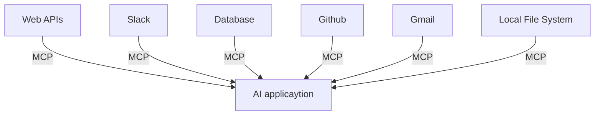
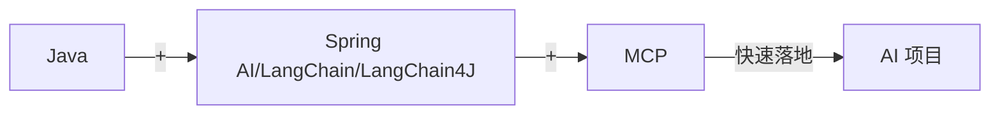
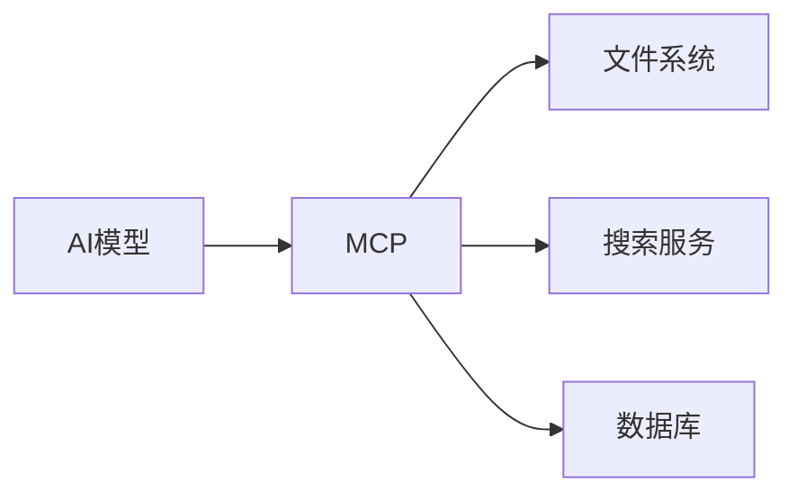
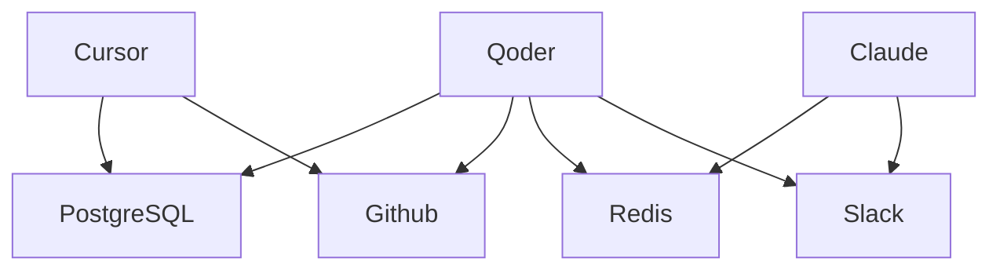
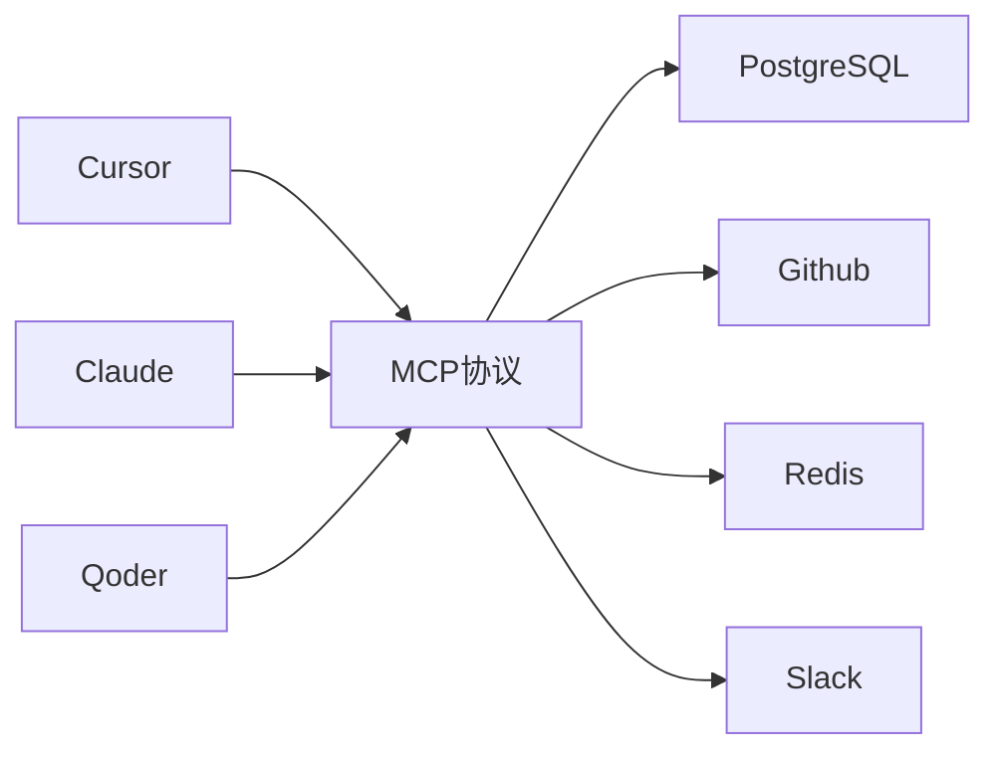
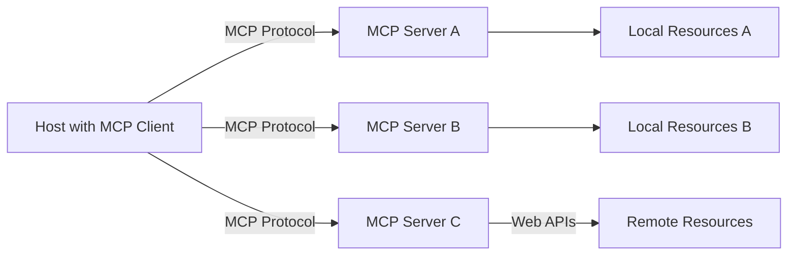
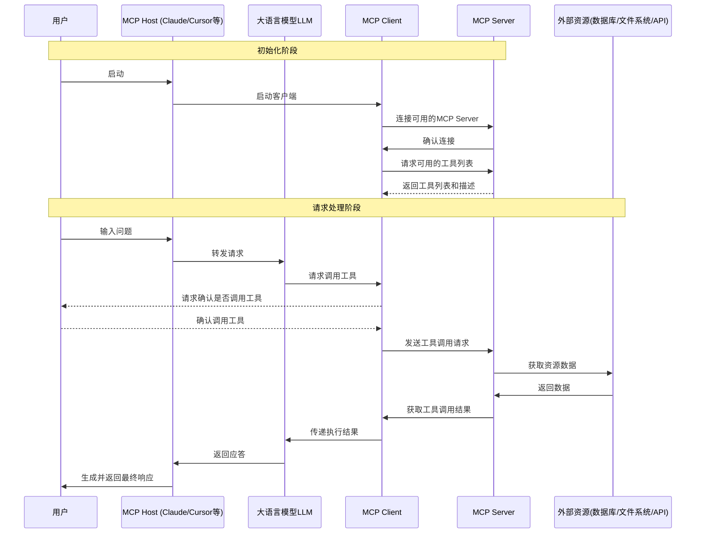
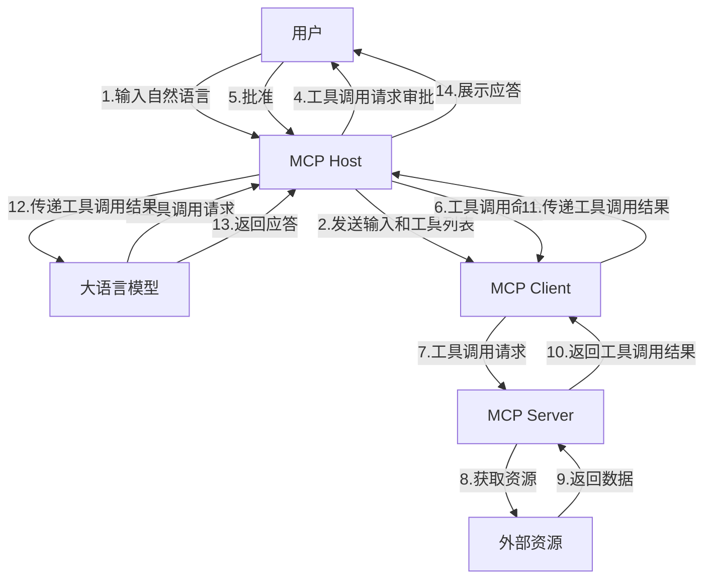

## 1. MCP基础
### 1.1. MCP概述
2025年时智能体Agent的元年，也注定是智能体集中爆发的一年！
智能体面临着两个互联领域的重大挑战：
1. Agent与Tools（工具）的交互
   > Agent需要调用外部工具和API、访问数据库、执行代码。 
2. Agent与Agent（其他智能体或用户）的交互
   > Agent需要理解其他Agent的意图、协同完成任务、与用户进行自然对话。

而对应的技术则是：
* MCP：完成Agent与Tools的交互
* A2A：完成Agent与Agent的交互


**MCP**是大模型连接世界的标准/桥梁：


**对于Java程序员：**
使用MCP，可以快速落地智能体项目：


**对于大众：如何理解MCP？**
有了LLM（如DeepSeek），就有了一个“智能助理”。但是，我们期望LLM能够实现更多的功能，而不仅限于简单对话，还要能与外部的多种数据、工具交互。
有了MCP，这就成为了现实：


### 1.2. MCP能干什么？
**对于程序员的示例场景：**
* 开发部署：开发者可以通过自然语言指令（如“部署新版本到测试环境”），使用MCP，可以链式调用GitLab API实现代码合并，调用Jenkins API实现镜像构建，调用Slack API通知团队。
* SQL查询：开发者输入自然语言，比如“查询某集团部门上个季度销售额”，就能查询出数据库中的数据。
* 智能体：智能体的每次任务处理可能需要调用网页搜索、网页访问、本地文件创建、代码解释器等几十个外部工具。
  这种情况下会有两个问题：
  1. 可供大模型调用的工具不足。
  2. 调用工具的工作量很大，需要为每个LLM和工具做适配。
 而MCP出现之后，只要支持了该协议，就能轻松将各种数据源和工具连接到LLM。

 **对于大众的示例场景：**
 * 旅行助手：旅行规划助手通过MCP调用天气、交通、地图等工具，自动生成带实时数据的旅行规划。
 * 业绩查询：用户询问“上季度营业额是多少？”，智能体使用MCP组合调用CRM系统、财务系统、邮件系统API，自动获取数据并发送总结报告。
### 1.3. MCP是什么？
MCP（Model Context Protocol，模型上下文协议），是2024年11月底，由Anthropic推出的一种开放标准。旨在为大语言模型提供统一的标准化方式，来与外部数据源和工具进行通信。

**无MCP时：**

在没有MCP时，每个LLM都需要为每个数据源构建独立的连接方式，可以被视为一个M*N的问题。
架构碎片化、难以拓展、限制了AI获取必要上下文信息的能力。

**有MCP时：**

MCP作为一种标准化协议，极大地简化了大语言模型与外部世界的交互方式，使得开发者能够以统一的方式为AI应用添加各种能力。


### 1.4. 查找MCP Server
说明：
* 随着越来越多Server接入MCP协议，未来AI能够直接调用的工具将呈现指数级增长，这能从根源上打开Agent能力的天花板。未来AI生态系统将变得更加的开放和强大。
* 目前社区的MCP Server还是比较混乱，有很多缺少教程和文档，很多的代码功能也有问题，只能凭经验和参考官方文档了。

以下是比较热门的MCP Server平台：
* Github：
  * https://github.com/modelcontextprotocol/servers
  * https://github.com/punkpeye/awesome-mcp-servers
* Glama：https://glama.ai/mcp/servers
* Simithery：https://smithery.ai
* Cursor：https://cursor.directory
* MCP.so：https://mcp.so/zh
* 阿里云百炼：https://bailian.console.aliyun.com/?tab=mcp#/mcp-market

### 1.5. MCP应用场景
以下是一些MCP应用场景：
| 应用领域 | 典型场景 | MCP价值 | 代表实现|
| --- | --- | --- | --- |
| 智能编程助手 | 代码生成、Bug修复、API集成 | 安全访问本地代码库、CI/CD系统 | Cursor、VSCode插件 |
| 数据分析工具 | 自然语言查询数据库、可视化生成 | 安全访问数据库、连接BI工具 | 数据MCP服务 |
| 企业知识问答 | 知识库查询、文档生成、邮件撰写 | 安全访问内部文档、保护隐私数据 | 文件系统MCP、Email MCP |
| 创意设计工具 | 3D建模、图形生成、UI设计 | 与专业软件无缝集成 | Blender MCP、 浏览器自动化 |
### 1.6. MCP通信机制
根据MCP规范，当前支持两种通信机制（传输方式）：
* stdio标准输入输出：主要用于本地环境，操作本地软件或本地文件。这是MCP的默认通信方式。
  * 优点：
    * 适用于客户端和服务器在一台机器上运行的场景，简单。
    * 无需外部网络、通信速度快。
    * 可靠性高、易于调试。
  * 缺点：
    * 配置比较复杂，需要提前安装命令行工具。
    * 单进程通信，无法并行处理多个客户端请求。
    * 进程资源开销较大，不适合在本地运行大量服务。
* SSE（Server-Sent Events）：主要用于需要远程通信的MCP服务，比如访问谷歌邮箱、天气状况等。
  * 优点：
    * 配置方式非常简单，基本上就一个链接就行。
  * 缺点：
    * 需要外部网络。

### 1.7. uvx和npx指令对应环境的安装
stdio的本地环境有两种：
* uvx： 使用Python编写的服务。
* npx：使用TypeScript编写的服务。

**uvx安装：**
1. 安装
   * 方式一：若已经配置Python环境，直接使用pip命令安装。
      ```shell
         pip install uv # 安装uvx
      ```
   * 方式二：Windows PowerShell安装
     ```shell
     powershell -ExecutionPolicy ByPass -c "irm https://astral.sh/uv/install.ps1 | iex”
      ```
2. 验证
   1. 重启终端并运行以下命令检查是否正常
      ```shell
      uvx --version
      uvx --help
      ```


**npx安装：**
安装Node.js即可。
Node.js下载的官网：https://nodejs.org/zh-cn
## 2. 使用案例-Cilne
### 2.1. Cline介绍
> Cline是VSCode的一个插件，在开发者社区，Cline被誉为“程序员的副驾驶”。
> 它不仅能写代码，还能帮你测试和部署，省去大量重复劳动。

Cline的核心优势在于它的任务分解能力。
你给它一个复杂需求，比如“编写一个电商网站后台”，它会自动拆分成多个小步骤，逐一搞定代码、数据库和API调用。MCP的加持，让它能够控制浏览器、编辑文件、甚至运行终端命令，像一个真正的助手。
最厉害的是，它还能通过MCP调用外部工具，比如从服务器拉取模板，或者直接推送代码到GitHub。

### 2.2. 安装Cline
Cline是VSCode的一个插件，因此在安装VSCode的基础上，安装Cline插件即可。
> 此处不去讲解安装的具体细节，请自行安装和配置。

### 2.3 明确需求
```text
现在交给你一个任务，编写一个北京一日游的出行攻略
1、在工作目录D:\ClineWorkSpace下创建一个新的文件夹，命名为"北京旅行"。分别
从数据库beijing_trip中获取表location_foods当地美食表、subway_trips地铁
线路表的结构、数据信息。然后提取出其中的数据，放入两个txt中进行保存。
2、根据txt中的内容，生成一个精美的html前端展示北京地铁交通及周边美食的页面，
并存放在该目录下
```

### 2.4. 配置MCP Server
根据前面的需求，我们需要配置以下的MCP Server：
* 用于文件操作的desktop-commander: https://smithery.ai/server/@wonderwhy-er/desktop-commander
* 用于数据库操作的mysqldb-mcp-server: https://smithery.ai/server/@burakdirin/mysqldb-mcp-server

按照MCP Server文档中的配置说明，配置文件如下：
> Cline配置mcp服务的方式比较简单，这里就不配图了~
```json
{
  "mcpServers": {
    "desktop-commander": {
      "args": [
        "/c",
        "npx",
        "-y",
        "@smithery/cli@latest",
        "run",
        "@wonderwhy-er/desktop-commander",
        "--key",
        "8ce02901-a503-4520-8ebc-a2a362e93993"
      ],
      "command": "cmd"
    },
    "mysqldb-mcp-server": {
      "args": [
        "mysqldb-mcp-server"
      ],
      "command": "uvx",
      "env": {
        "MYSQL_DATABASE": "beijing_trip",
        "MYSQL_HOST": "localhost",
        "MYSQL_PASSWORD": "abc123",
        "MYSQL_READONLY": "false",
        "MYSQL_USER": "root"
      }
    }
  }
}

```
### 2.5. 功能测试
配置完成后，在聊天框中输入我们的需求：
```text
现在交给你一个任务，编写一个北京一日游的出行攻略
1、在工作目录D:\ClineWorkSpace下创建一个新的文件夹，命名为"北京旅行"。分别
从数据库beijing_trip中获取表location_foods当地美食表、subway_trips地铁
线路表的结构、数据信息。然后提取出其中的数据，放入两个txt中进行保存。
2、根据txt中的内容，生成一个精美的html前端展示北京地铁交通及周边美食的页面，
并存放在该目录下
```

静待Cline的执行完毕即可，最终将返回一个设计精美的前端页面。

## 3. MCP工作原理
### 3.1. MCP的架构
MCP遵循客户端-服务器（client-server）架构，其中包含以下的核心概念：
* MCP主机（Host）：运行大语言模型并发起连接的应用程序，是与用户直接交互的界面和环境。
  * 是整个架构的大脑，负责接收用户指令，决定需要调用什么工具或访问什么数据，并通过内置的Client发起请求。
  * 常见示例：Claude Desktop、Cursor、Cline
* MCP服务（Server）：轻量级的程序或服务，负责暴露特定的功能、数据或工具给 Host 使用。
  * 角色：它是“服务提供者”或“工具箱”。
    * 它不直接运行大模型，而是专注于提供具体的业务能力（如查询数据库、读取文件、调用 API、执行代码）。
    * 它向连接的 Client 声明自己支持的能力（Tools, Resources, Prompts）。
    * 它接收来自 Client 的请求，执行实际操作，并返回结果。
  * 特点：开发者可以针对不同的需求编写不同的 Server（例如：一个专门连接 MySQL 的 Server，一个专门读取本地 PDF 的 Server）。
* MCP客户端（Client）：嵌入到Host内部的通信模块或中间件，负责维护与特定Server的一对一连接。
  * 角色：它是“翻译官”或“连接器”。
    * 当 Host 中的 LLM 决定需要外部数据时，Client 负责将模型的意图转换为标准的 MCP 协议消息（基于 JSON-RPC 2.0）。
    * 它管理连接的生命周期（建立、保持、断开）。
    * 它处理传输层细节（如通过 stdio 或 Streamable HTTP 发送数据）。
  * 关系：Host 包含 Client。通常一个 Host 内部会有多个 Client 实例，每个实例专门负责连接一个特定的 Server。
* 本地资源（Local Resources）：指位于用户本地计算机上，通过 MCP Server 暴露给模型的数据或上下文。
  * 让 AI 能够安全地读取和理解用户本地的文件和环境，而无需将数据上传到云端（取决于具体实现和隐私设置）。
  * 常见类型：
    * 文件系统：本地代码库、文档（PDF, MD, TXT）、配置文件。
    * 本地数据库：SQLite 文件、本地运行的 PostgreSQL/MySQL 实例。
    * 系统信息：当前运行的进程、环境变量、Git 状态。
  * 访问方式：通常通过运行在本地机器上的 MCP Server（使用 stdio 传输层）来访问。
* 远程资源（Remote Resources）：指位于网络远端（云端或其他服务器），通过 MCP Server 暴露给模型的数据或服务。
  * 扩展 AI 的能力边界，使其能访问互联网实时数据、企业私有云数据或第三方 SaaS 服务。
  * 常见类型：
    * 在线数据库：云端的 RDS、Data Warehouse。
    * API 服务：天气数据、股票行情、搜索引擎、Jira/Slack 等企业工具。
    * 知识库：托管在云端的公司文档库、Wiki。
  * 访问方式：通常通过基于网络的 MCP Server（使用 Streamable HTTP 或早期的 SSE 传输层）来访问。

**架构图：**


### 3.2. MCP工作流程
MCP（Model Context Protocol）的工作流程基于客户端-服务器架构，采用JSON-RPC 2.0协议进行通信。整个流程涉及Host、MCP Client、MCP Server以及后端资源之间的协调配合。

主要工作步骤：
1. 初始化阶段
   1. 服务发现与注册：Host通过配置文件或服务注册中心发现可用的MCP Server
   2. 连接建立：MCP Client与指定的MCP Server建立通信连接（通过stdio或SSE）
   3. 能力声明：MCP Server向Host声明其支持的工具（Tools）、资源（Resources）和提示（Prompts）
2. 请求处理阶段
   1.  用户输入：用户向AI模型提出请求或问题
   2. 意图识别：AI模型分析用户意图，确定需要调用的外部工具或资源
   3. 请求转发：MCP Client将模型的请求转换为标准MCP协议消息
   4. 服务执行：MCP Server接收请求，执行相应的操作（如数据库查询、文件读取等）
   5. 结果返回：MCP Server将执行结果返回给MCP Client，再传递给AI模型
3. 响应生成阶段
   1. 上下文整合：AI模型将外部数据与原有知识整合
   2. 响应生成：基于整合后的信息生成最终响应
   3. 用户反馈：将结果呈现给用户

**工作流程图：**


**数据流向图：**


### 4. 手动开发MCP项目
## 5. CherryStudio中使用MCP
## 6. 热门MCP Server推荐
## 7. A2A协议的理解和举例
