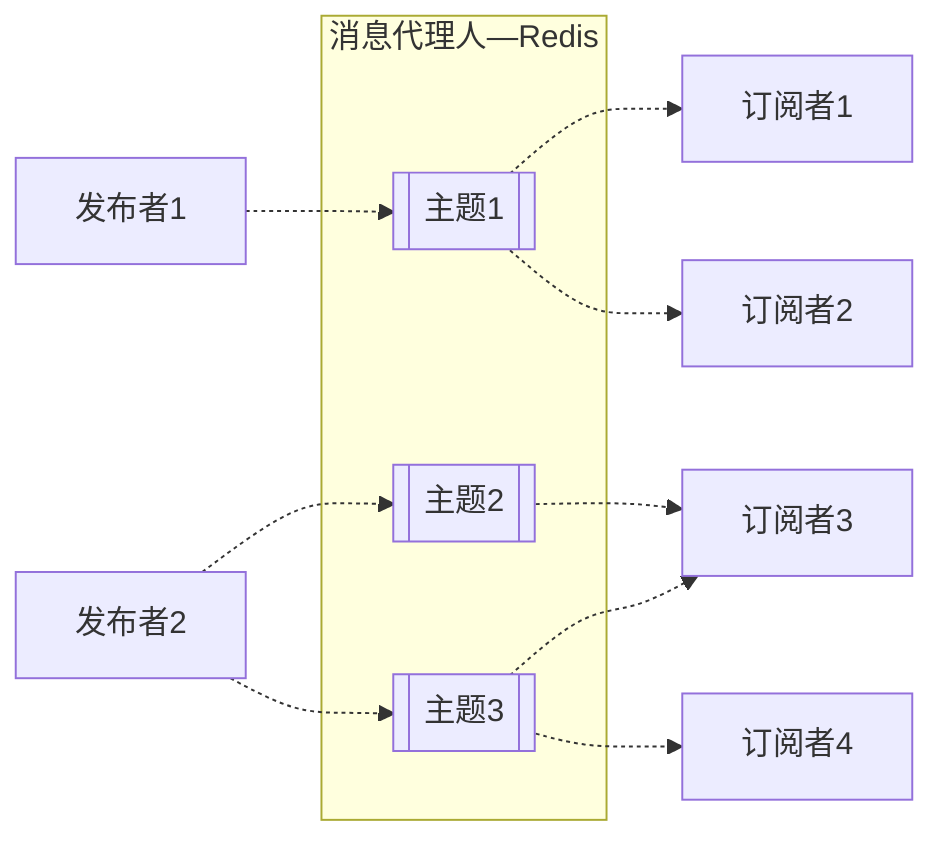
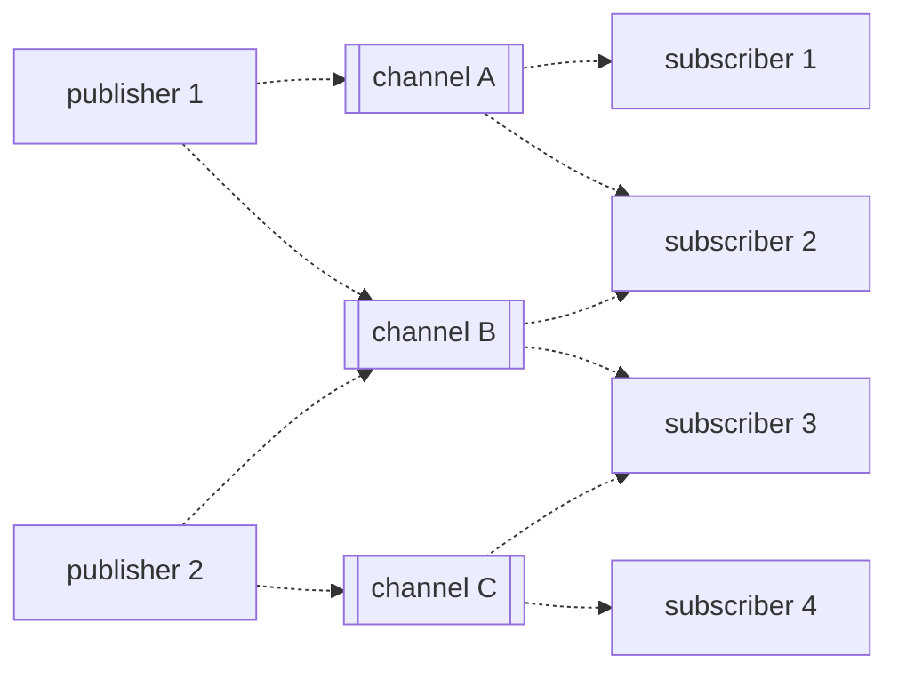

@[TOC]
## 1. 关于Pub/Sub发布订阅
在软件架构中，发布/订阅（Publish–subscribe pattern）指的是一种消息范式：
1. 发布者向消息代理人发布主题(Topic)和消息。
2. 订阅者向消息代理人订阅主题和接收消息。
3. 消息代理人保存发布者、订阅者和主题之间的关系。当有新消息发布时，消息代理人将会把消息转发给相应的订阅者。


发布-订阅系统具有低耦合、可扩展性好等优点。

而Redis的内部设计非常适合于实现发布-订阅系统，因此，发布-订阅功能被当作Redis的一个热点功能被推出。在Redis系统中，发布者和订阅者都是Redis的客户端或者Redis应用程序，而消息代理人为Redis服务器。



## 2. Redis Pub/Sub的基础操作
### 2.1. 基础操作命令
Redis Pub/Sub基础操作的相关命令如下：
* `PUBLISH channel message`：发布者发布消息到指定的频道
* `SUBSCRIBE channel [channel ...]`：客户端订阅指定的频道。
* `UNSUBSCRIBE [channel [channel ...]]`：客户端取消对给定频道的订阅，如果没有指定频道，表示取消对所有频道的订阅。

### 2.2. 操作示例
在示例中，我们需要实现如同所示的操作：



1. 订阅者们订阅指定的频道(以2号订阅者为例)
	```shell
	127.0.0.1:6379> subscribe channelA channelB
	Reading messages... (press Ctrl-C to quit)
	1) "subscribe"
	2) "channelA"
	3) (integer) 1
	1) "subscribe"
	2) "channelB"
	3) (integer) 2
	```
2. 发布者们发布消息到指定的频道（以发布者1为例）
	```shell
	127.0.0.1:6379> publish channelA msg_1
	(integer) 2
	127.0.0.1:6379> publish channelB msg_2
	(integer) 2
	```
	最终结果
	
## 3. 使用模式（pattern）订阅
### 3.1. 使用模式匹配
Redis Pub/Sub 支持使用glob 样式的模式匹配进行订阅，客户端使用模式匹配进行订阅后，所有发送到`频道名称与给定模式匹配`的频道上的消息，都会被客户端接收到。

glob样式举例：
*  `h?llo` subscribes to hello, hallo and hxllo
* `h*llo` subscribes to hllo and heeeello
* `h[ae]llo` subscribes to hello and hallo, but not hillo

使用模式订阅涉及到这两个命令：
* `PSUBSCRIBE pattern [pattern ...]`：让客户端订阅指定模式（pattern）的频道.
* `PUNSUBSCRIBE [pattern [pattern ...]]`：取消客户端对给定模式的频道的订阅，如果没有给出，则取消订阅所有模式。

操作示例：


### 3.2. 模式匹配的消息格式
从示例中我们看到，使用模式匹配订阅的客户端，收到的消息格式是不一样的：
* 消息类型为pmessage
* 第二个元素是匹配的原始模式
* 第三个元素是原始频道的名称
* 最后一个元素是实际的消息

### 3.3. 如果同时匹配了多个呢？
按照上文说的，一个客户端可以订阅多个模式/频道，那么如果一个频道名称和多个模式/频道匹配呢？
比如,一个客户端执行了下面的这两个订阅操作：
```shell
SUBSCRIBE foo
PSUBSCRIBE * f*
```
这时，如果一条消息发送到通道 foo，客户端将收到三条消息：
* 一条message消息
* 一条匹配了模式`*`的pmessage消息
* 一条匹配了模式`f*`的pmessage消息
## 4. 分片 Pub/Sub
> 这部分就不详细介绍了，一般Redis Pub/Sub都是用在比较简单的系统里面，个人觉得应该很少人用到这部分内容。所以就贴一下官网原文做个简单介绍吧。

从 Redis 7.0 开始，引入了分片的发布/订阅（sharded Pub/Sub）功能，其中分片的频道由与分配键到槽的相同算法来分配。分片消息必须发送到拥有被散列到的分片频道槽的节点。集群确保已发布的分片消息转发到分片中的所有节点，因此客户端可以通过连接到负责该槽的主节点或任何副本来订阅分片频道。SSUBSCRIBE、SUNSUBSCRIBE和SPUBLISH用于实现分片的发布/订阅。

分片的发布/订阅有助于在集群模式下扩展发布/订阅的使用。它限制了消息的传播范围在集群的分片内。因此，与全局发布/订阅相比，通过集群总线传递的数据量受到限制，其中每条消息传播到集群中的每个节点。这使用户可以通过添加更多分片来水平扩展发布/订阅的使用。
> 原文：From Redis 7.0, sharded Pub/Sub is introduced in which shard channels are assigned to slots by the same algorithm used to assign keys to slots. A shard message must be sent to a node that owns the slot the shard channel is hashed to. The cluster makes sure the published shard messages are forwarded to all nodes in the shard, so clients can subscribe to a shard channel by connecting to either the master responsible for the slot, or to any of its replicas. SSUBSCRIBE, SUNSUBSCRIBE and SPUBLISH are used to implement sharded Pub/Sub.

Sharded Pub/Sub helps to scale the usage of Pub/Sub in cluster mode. It restricts the propagation of messages to be within the shard of a cluster. Hence, the amount of data passing through the cluster bus is limited in comparison to global Pub/Sub where each message propagates to each node in the cluster. This allows users to horizontally scale the Pub/Sub usage by adding more shards.
## 5. Redis Pub/Sub的一些特性
### 5.1. 消息传递语义Delivery semantics

Redis Pub/Sub的消息传递语义为 **at-most-once**（最多一次）： 消息最多会被传递一次。一旦 Redis 服务器发送了消息，就不会再次发送。如果订阅者无法处理消息（例如，由于错误或网络断开），该消息将永远丢失。

>如果需要更强的传递保证，可以考虑使用Redis Streams流。流中的消息是持久化的，并支持 **at-most-once**至多一次和**at-least-once**至少一次的传递语义。Redis Streams提供了更灵活和可靠的消息传递机制，适用于对消息传递的可靠性要求更高的应用场景。

### 5.2. 推送消息的格式
推送的消息是一个包含三个元素的数组回复（array_reply），其中第一个元素是消息的类型，根据消息类型的不同，后面两个元素代表不同的含义：
* subscribe：意味着我们成功订阅了回复中第二个元素给出的频道。第三个参数代表我们当前订阅的频道数量。
	```shell
	# 订阅频道
	1) "subscribe"
	2) "quene"
	3) (integer) 1
	```
* unsubscribe：意味着我们成功取消了回复中作为第二个元素给出的频道的订阅。第三个参数代表我们当前订阅的频道数量。当最后一个参数为零时，我们不再订阅任何频道，并且客户端可以发出任何类型的 Redis 命令，因为我们处于 Pub/Sub 状态之外。
* message：一位置我们收到了另一个客户端发出的消息。第二个元素是原始通道的名称，第三个参数是实际的消息负载。
	```shell
	# 收到消息
	1) "message"
	2) "quene"
	3) "11111"
	```
### 5.3 推送消息的范围
Pub/Sub（发布/订阅）与键空间没有关系。它被设计为在任何层面都不会干扰键空间，包括数据库编号。Pub/Sub提供了一种独立于键空间操作的消息传递机制，用于实现消息的发布和订阅，与数据库的操作是独立的。
> Pub/Sub has no relation to the key space. It was made to not interfere with it on any level, including database numbers.

比如：在db10上向频道channelA上发布消息，db0上订阅channelA的客户端也能收到消息。

如果需要某种范围界定，可以通道前添加环境名称（testing、staging、product...）。
## 参考文档
* [Redis官网 - Pub/Sub](https://redis.io/docs/interact/pubsub/)
* [发布-订阅系统(Publish/Subscribe System)](https://www.littlewaterdrop.com/static/zh/cs/redis/pub-sub/index.html)
