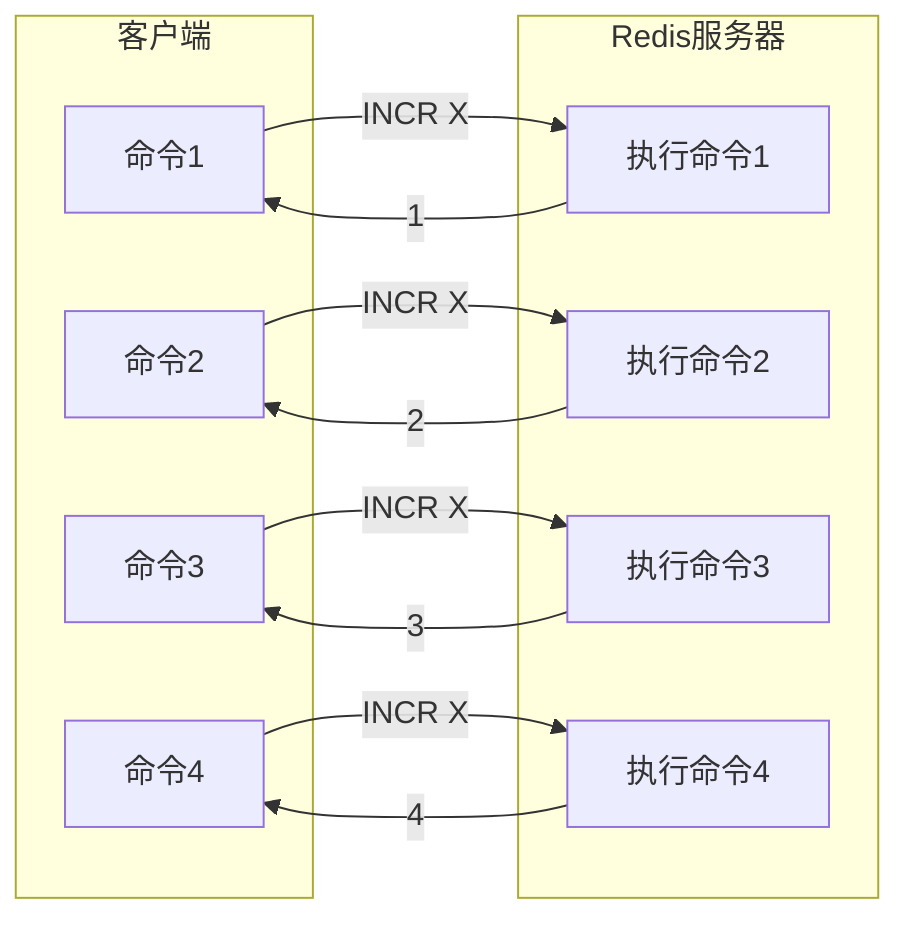
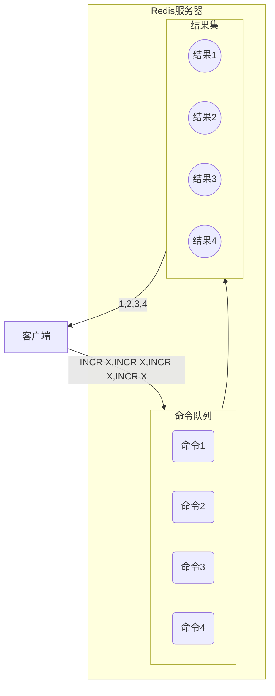

Redis是一个高性能的键值存储数据库，通常用于缓存、会话管理、消息队列等场景。在实际应用中，我们经常需要向Redis发送多个命令。如果逐个发送这些命令，网络延迟会成为性能瓶颈。为了解决这个问题，Redis提供了Pipeline（流水线）功能。


参考官方文档：[Redis Pipeline](https://redis.io/docs/latest/develop/using-commands/pipelining/)


## 1. 请求/响应协议与往返时间RRT

Redis是一个采用客户端-服务器模型和请求/响应协议的TCP服务器。

这意味着请求通常需要以下步骤完成：

1. 客户端向服务器发送查询，然后使用阻塞的方式从套接字中读取服务器应答。
2. 服务器处理客户端发来的命令，然后向客户端返回应答。


比如现在需要执行四条指令，流程图会是这样：




从流程图可以看到，客户端每次发送命令都需要等待服务器响应后才能发送下一个命令，这个过程中的网络往返时间（RTT, Round-Trip Time）。

> 客户端和服务器通过网络链路连接。这种链路可以非常快（环回接口），也可以非常慢（通过互联网建立，两主机之间有许多跳数的连接）。无论网络延迟如何，数据包从客户端到服务器再从服务器返回到客户端，传递回复都需要时间。

显然，当客户端需要连续执行大量请求（例如向同一列表添加多个元素，或填充多个键的数据库）时，这将会影响性能。例如，如果 RTT 时间是 250 毫秒（在互联网上非常慢的链路中），即使服务器能处理每秒 10 万个请求，我们最多只能处理每秒四个请求。

> 如果接口是环回接口，RTT 会短得多，通常为亚毫秒，但即使如此，如果你需要连续多次写入，也很容易积少成多。

## 2. Redis Pipeline流水线技术

请求/应答服务器可以被设计成：即使客户端尚未读取旧的应答，服务器也能处理新的请求。这样就可以直接向服务器发送多个命令，而无需等待应答，最后再一次性获取所有应答。

这就是**Pipeline 流水线技术**，它被广泛使用了数十年。比如许多 POP3协议的实现已经支持此功能，极大加快了从服务器下载新邮件的过程。


Redis从很早就支持了Pipeline流水线技术，它一次性发送多个命令而不需要等待每个命令的应答，来避免上述的性能问题。

> 大多数客户端都支持流水线操作。


使用Pipeline时，上述示例的时序图就变成了这样：




Redis服务器接收到Pipeline请求后：

1. 将所有命令放入一个队列
2. 按顺序执行队列中的命令
3. 将所有命令的执行结果收集起来
4. 一次性将结果返回给客户端

这种方式减少了网络I/O次数，从而提高了整体性能。


Pipelining不仅仅能够降低RRT，实际上它极大的提升了单次执行的操作数。这是因为如果不使用Pipelining，那么每次执行单个命令,从访问数据的结构和服务端产生应答的角度，它的成本是很低的。但是从执行网络IO的角度，它的成本其实是很高的。其中涉及到read()和write()的系统调用，这意味着需要从用户态切换到内核态,而这个上下文的切换成本是巨大的。

当使用Pipeline时，它允许多个命令的读通过一次read()操作，多个命令的应答使用一次write()操作，它允许客户端可以一次发送多条命令，而不等待上一条命令执行的结果。**不仅减少了RTT，同时也减少了IO调用次数（IO调用涉及到用户态到内核态之间的切换），最终提升程序的执行效率与性能。**


## 3. Redis Pipeline示例与性能对比

### 3.1. redis-cli中使用示例

```shell

## 创建 commands.txt 文件
SET key1 value1
GET key2
INCR counter
HSET hash1 field1 value1

## 使用pipeline批量执行
cat commands.txt | redis-cli --pipe
```


### 3.2. go-redis示例与性能对比

为了对比性能，我这里分别用普通模式和pipeline模式来执行1000次命令，比较两者耗时差距。


**普通模式代码：**

```go

func main() {
	// 初始化 redis客户端
	client := redis.NewClient(&redis.Options{
		Addr:     host + ":" + port,
		Password: password,
		DB:       0,
	})

	// 普通模式执行十万次命令
	cmd := client.Set(context.Background(), "counter", 0, 0)
	if cmd.Err() != nil {
		log.Fatalf("set error: %v", cmd.Err())
	}

	startTime := time.Now()
	var incrCmd *redis.IntCmd
	for i := 0; i < 1000; i++ {
		incrCmd = client.Incr(context.Background(), "counter")
		if cmd.Err() != nil {
			log.Fatalf("incr error: %v", cmd.Err())
		}
	}
	log.Printf("普通模式执行十万次命令耗时: %dms,最终结果：%d", time.Now().Sub(startTime)/time.Millisecond, incrCmd.Val())
}

// 2026/01/07 09:58:02 普通模式执行十万次命令耗时: 34s,最终结果：1000
```


**Pipeline模式代码：**

```go
func main() {
	// 初始化 redis客户端
	client := redis.NewClient(&redis.Options{
		Addr:     host + ":" + port,
		Password: password,
		DB:       0,
	})

	// 普通模式执行十万次命令
	cmd := client.Set(context.Background(), "counter", 0, 0)
	if cmd.Err() != nil {
		log.Fatalf("set error: %v", cmd.Err())
	}

	startTime := time.Now()
	pipeline := client.Pipeline()
	for i := 0; i < 1000; i++ {
		pipeline.Incr(context.Background(), "counter")
	}
	cmders, err := pipeline.Exec(context.Background())
	if err != nil {
		log.Fatalf("pipeline error: %v", err)
	}
	val := cmders[len(cmders)-1].(*redis.IntCmd).Val()
	log.Printf("普通模式执行十万次命令耗时: %dms,最终结果：%d", time.Now().Sub(startTime)/time.Millisecond, val)
}

```


**性能对比：**

| 执行次数 | 普通模式耗时 | Pipeline耗时 |
| -------- | ------------ | ------------ |
| 1        | 33ms         | 30ms         |
| 10       | 336ms        | 36ms         |
| 100      | 2939ms       | 32ms         |
| 1000     | 34161ms      | 76ms         |
| 10000    | -            | 490ms        |

* 普通模式下，执行时间基本上等于 `单次执行耗时 * 执行次数`，这很好理解，每次操作独立嘛。

  > 我这里使用的是阿里云服务器，所以网络耗时肯定比局域网长点。

* Pipeline模式下，执行1次和执行100次时间都差不多，因为都只有一次网络交互嘛，这也很好理解。后面随着执行次数越来越多，执行耗时也有增加，这是很正常的：

  * 本地程序处理时间加长（命令多）。
  * 网络处理时间加长（命令多）。
  * Redis命令执行时间加长（命令多）。

## 4. 注意事项

### 4.1. 原子性限制

Pipeline模式只是将客户端发送命令的方式改为发送批量命令，而服务端在处理批量命令的数据流时，仍然是解析出多个单命令并按顺序执行，各个命令相互独立，即服务端仍有可能在该过程中执行其他客户端的命令。如需保证原子性，请使用事务或Lua脚本。

```python
## 这不是原子操作
pipe = r.pipeline()
pipe.incr('counter')
pipe.expire('counter', 100)
pipe.execute()  # 在这两个命令执行之间，其他客户端可能修改counter
```

如果需要原子性操作，应使用MULTI/EXEC事务或Lua脚本。

### 4.2. 内存使用考虑

使用Pipeline处理命令时，客户端会将应答暂时存放在队列里，这会消耗一定的内存。所以如果需要发送大批量的流水线命令，最好分批发送，每个批次包含合理的数量（比如10000个命令）。等收到回复后，在发送后续的一万个命令，以此类推。这样速度几乎相同，但额外使用的内存最多是暂存这一万条命令的响应所需要的内存。

```python
def batch_pipeline_example(r, data_list, batch_size=1000):
    """分批处理Pipeline示例"""
    for i in range(0, len(data_list), batch_size):
        batch = data_list[i:i+batch_size]
        pipe = r.pipeline()
        for item in batch:
            pipe.set(item['key'], item['value'])
        pipe.execute()
```

### 4.3. 错误处理

Pipeline没有事务的特性，若Pipeline执行过程中发生错误，不支持回滚。如果待执行命令的前后存在依赖关系，请勿使用Pipeline。

**说明**

> 某些客户端（例如redis-py）在实现Pipeline时使用事务命令MULTI、EXEC进行伪装，请您在使用过程中关注Pipeline与事务的区别，否则可能会产生报错。

Pipeline中某个命令失败不会影响其他命令的执行，但需要检查返回结果来判断每个命令是否成功。

## 5 适用场景

Pipeline适用于以下场景：

1. **批量数据写入**：如导入大量数据到Redis
2. **批量查询**：如同时获取多个键的值
3. **批量操作**：如同时设置多个键的过期时间
4. **非原子性操作**：不需要保证多个命令的原子性执行


Pipeline不适用于以下场景：

1. **需要原子性的操作**：应该使用MULTI/EXEC事务
2. **命令之间有依赖关系**：后续命令依赖前一个命令的结果
3. **实时性要求极高的操作**：Pipeline会延迟返回结果

