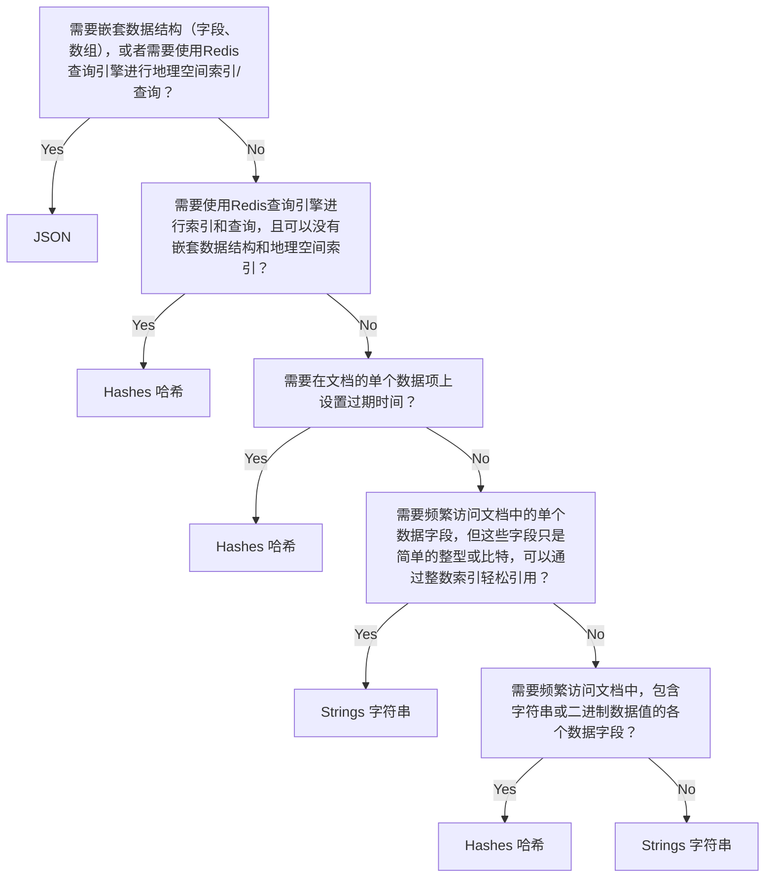
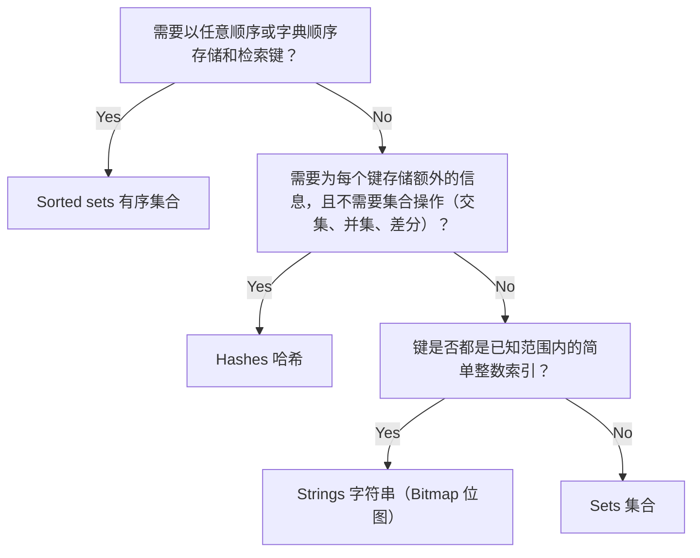
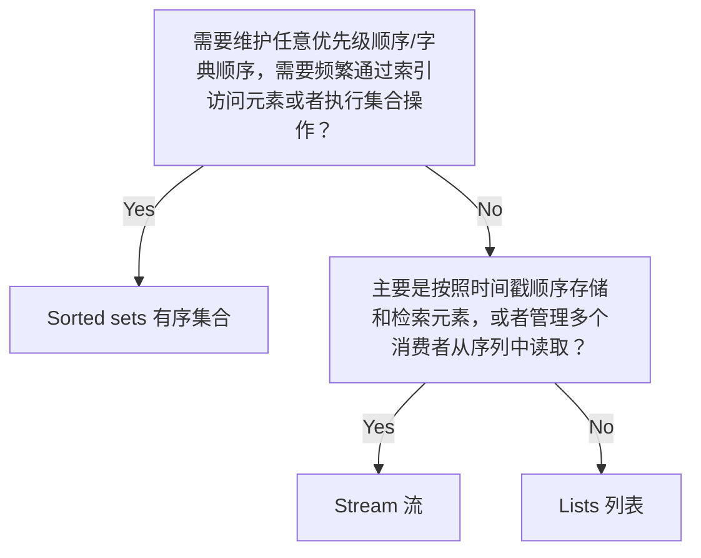

Redis是一个数据结构服务器（data structure server），其核心是提供一系列原生数据类型来帮助你解决各种各样的问题，如缓存、队列、事件处理。

本文第一章节将简要介绍每种数据类型，并提供详细教程和命令参考的链接；第二章节简单将这些数据类型分成专业化类型和通用类型两种；第三章节简单介绍了通用数据类型的特性，以帮助我们选择合适的数据类型。最后章节则讲解了如何选择我们要使用的数据类型。

参考官方文档：[Data-Types](https://redis.io/docs/latest/develop/data-types/)、[Compare-Data-Types](https://redis.io/docs/latest/develop/data-types/compare-data-types/)

## 1. 梳理Redis数据类型

Redis Open Source实现以下的数据类型:

* String 字符串

  字符串是Redis最基本的数据类型，表示一个二进制安全的字节序列。

  * [Overview of Redis strings](https://redis.io/docs/latest/develop/data-types/strings/)
  * [Redis string command reference](https://redis.io/docs/latest/commands/?group=string)

* Hash 哈希

  哈希是一种记录类型，由字段-值对组成的集合。类似于Python的字典、Java的HashMap、Ruby的哈希。

  * [Overview of Redis hashes](https://redis.io/docs/latest/develop/data-types/hashes/)
  * [Redis hashes command reference](https://redis.io/docs/latest/commands/?group=hash)

* List 列表

  列表（list）是按照插入顺序排序的字符串列表。

  * [Overview of Redis lists](https://redis.io/docs/latest/develop/data-types/lists/)
  * [Redis list command reference](https://redis.io/docs/latest/commands/?group=list)

* Set 集合

  集合（set）是无序且不重复的字符串集合。使用 Redis 集合时，你可以在 O(1) 时间内添加、删除并检验存在性（换句话说，无论集合元素数量多少）。

  * [Overview of Redis sets](https://redis.io/docs/latest/develop/data-types/sets/)
  * [Redis set command reference](https://redis.io/docs/latest/commands/?group=set)

* Sorted Set 有序集合

  有序集合（sorted set）是一组唯一成员的集合，按照每个成员的分数进行排序。

  * [Overview of Redis sorted sets](https://redis.io/docs/latest/develop/data-types/sorted-sets/)
  * [Redis sorted set command reference](https://redis.io/docs/latest/commands/?group=sorted-set)

* Vector set 向量集

  向量集是一种专门用于管理高维向量数据的数据类型，在Redis中提供了快速高效的向量相似性搜索能力。向量集针对机器学习、推荐系统和语义搜索等场景进行了优化，每个向量代表多维空间中的一个数据点。向量集支持HNSW（hierarchical navigable small world）算法，允许你根据余弦相似度度量存储、索引和查询向量。对于向量集，Redis 原生支持混合搜索，结合了向量相似度与结构化[滤波器](https://redis.io/docs/latest/develop/data-types/vector-sets/filtered-search/)。

  * [Overview of Redis vector sets](https://redis.io/docs/latest/develop/data-types/vector-sets/)
  * [Redis vector set command reference](https://redis.io/docs/latest/commands/?group=vector_set)

* Stream 流

  Redis流（stream）是一种仅追加日志类型的数据结构，按照发生的顺序记录事件，然后将其联合处理。

  * [Overview of Redis Streams](https://redis.io/docs/latest/develop/data-types/streams/)
  * [Redis Streams command reference](https://redis.io/docs/latest/commands/?group=stream)

* Bitmap 位图

  Redis位图不是一种独立的数据类型，而是基于字符串类型的一组位操作，将字符串视为位向量。由于字符串是二进制安全的，最大长度为512MB（即512 * 1024 * 1024 * 8 = 2^32位），因此适合设置多达2^32个不同的位。

  > 位图就像一个巨大的开关面板，每个位代表一个独立的开关状态（开/关）。例如，可以用位图记录某个月每天的签到情况，31位就能表示整个月的签到状态，非常节省空间。

  * [Overview of Redis bitmaps](https://redis.io/docs/latest/develop/data-types/bitmaps/)
  * [Redis bitmap command reference](https://redis.io/docs/latest/commands/?group=bitmap)

* Bitfield 位域

  Redis位域允许在单个字符串值中高效地编码多个整数值（从1位到63位）。这些值以二进制编码的Redis字符串形式存储。位域支持原子的读取、写入和递增操作，使其成为管理计数器和其他数值的理想选择。

  * [Overview of Redis bitfields](https://redis.io/docs/latest/develop/data-types/bitfields/)
  * The [`BITFIELD`](https://redis.io/docs/latest/commands/bitfield/) command

* Geospatial 地理空间

  Redis地理空间索引适用于在指定地理半径或边界框内查找位置。

  * [Overview of Redis geospatial indexes](https://redis.io/docs/latest/develop/data-types/geospatial/)
  * [Redis geospatial indexes command reference](https://redis.io/docs/latest/commands/?group=geo)

* JSON JSON

  Redis JSON提供结构化的层次式数组和键值对象，这些都与流行的JSON文本文件格式匹配。你可以将JSON文本导入Redis对象，访问、修改和查询单个数据元素。

  * [Overview of Redis JSON](https://redis.io/docs/latest/develop/data-types/json/)
  * [JSON command reference](https://redis.io/docs/latest/commands/?group=json)

* Probabilistic data types 概率数据类型

  这些数据类型让你能够以近似但高效的方式收集和计算统计数据，包括以下类型：

  * HyperLogLog

    Redis HyperLogLog 数据结构提供了一种概率性的方法来估计大集合的基数（即唯一元素的数量）。该实现最多使用12KB内存，标准误差小于1%。

    * [Overview of Redis HyperLogLog](https://redis.io/docs/latest/develop/data-types/probabilistic/hyperloglogs/)
    * [Redis HyperLogLog command reference](https://redis.io/docs/latest/commands/?group=hyperloglog)

  * Bloom filter 布隆过滤器

    布隆过滤器是一种概率性数据结构，用于检查某个元素是否可能存在于集合中。它可以保证不存在的准确性，但对于存在的判断可能会有误报。

    * [Overview of Redis Bloom filters](https://redis.io/docs/latest/develop/data-types/probabilistic/bloom-filter/)
    * [Bloom filter command reference](https://redis.io/docs/latest/commands/?group=bf)

  * Cuckoo filter 布谷鸟过滤器

    布谷鸟过滤器是一种概率性数据结构，用于检查某个元素是否存在于集合中。与布隆过滤器类似，但支持删除操作，并且在某些场景下性能更好。

    * [Overview of Redis Cuckoo filters](https://redis.io/docs/latest/develop/data-types/probabilistic/cuckoo-filter/)
    * [Cuckoo filter command reference](https://redis.io/docs/latest/commands/?group=cf)

  * t-digest

    t-digest 结构用于从数据流中估算百分位数，而无需存储和排序所有数据点。它可以回答诸如"给定值小于多少比例的数据"或"p百分位的值是多少"等问题。

    * [Redis t-digest overview](https://redis.io/docs/latest/develop/data-types/probabilistic/t-digest/)
    * [t-digest command reference](https://redis.io/docs/latest/commands/?group=tdigest)

  * Top-K

    Top-K 数据结构用于估算数据流中出现频率最高的K个元素。它特别适用于检测网络异常和DDoS攻击等场景。

    * [Redis Top-K overview](https://redis.io/docs/latest/develop/data-types/probabilistic/top-k/)
    * [Top-K command reference](https://redis.io/docs/latest/commands/?group=topk)

  * Count-min sketch 

    Count-min sketch 用于估算数据流中元素的出现频率。

    * [Redis Count-min sketch overview](https://redis.io/docs/latest/develop/data-types/probabilistic/count-min-sketch/)
    * [Count-min sketch command reference](https://redis.io/docs/latest/commands/?group=cms)

* Time series 时间序列

  时间序列数据结构允许你存储和查询带时间戳的数据点。

  * [Redis time series overview](https://redis.io/docs/latest/develop/data-types/timeseries/)
  * [Count-min sketch command reference](https://redis.io/docs/latest/commands/?group=timeseries)

## 2. 专业化/通用性

Redis提供的数据类型中，一部分是用于特定目的高度专业化的：

* Geospatial 地理空间：存储带有相关坐标的字符串，用于地理空间查询。

* Vector sets 向量集：存储字符串及其关联的向量数据（以及可选的元数据），用于向量相似性查询。

* Probabilistic data types 概率数据类型：为大型数据集提供近似技术和其他统计数据。

  > 包含HyperLogLog、Bloom filter、Cuckoo filter、t-digest、Top-K、Count-min sketch 

* Time series 时间序列：存储实值数据点及其收集时间。

一部分则更加通用：

* Strings 字符串：存储文本或二进制数据。
* Hashes 哈希：将键值对集合存储在单个键内。
* JSON：存储结构化的层级数组和K-V键值对对象，与流行的JSON文本文件格式相匹配。
* Lists 列表：存储一组有序的简单字符串。
* Sets 集合：存储一组无序且唯一的字符串。
* Sorted sets 有序集合：存储一组唯一的字符串以及其对应的分数。
* Streams 流：存储一系列条目，每个条目包含一组字段-值对。

通用数据类型在功能上有部分重叠，你甚至可以只使用字符串类型加一点小创意，就能模拟他们。但是，每种数据类型在性能、内存占用和功能上存在不同的权衡。

> 专业化数据类型都有其特定的使用场景，一个专业场景下基本上就只能使用对应的专业化数据类型。
>
> 而通用数据类型则更加灵活，一个场景下可能使用数据类型A、B、C、D都能实现。因此在一个业务场景下，选择使用哪种通用数据类型反而是更需要思考的。

## 3. 盘点通用数据类型的特性

在学习如何选择数据类型前，我们需要先简单介绍一下这些通用数据类型的特性。

### 3.1. Strings 字符串

* **结构：**非结构化文本/二进制数据、简单计数器、位集、整数集合。
* **操作：**get, set, append, increment, decrement, bitwise operations.
* **适用场景：**非结构化文档、计数器、标志、位图。

字符串主要用于存储文本或二进制数据块，其内部结构将由你的应用程序管理。不过，它们也支持访问字符串中位区间的槽作，以作为比特集、整数或浮点数使用。

### 3.2. Hashes 哈希

* **结构：**键值对集合
* **操作：**get, set, delete, increment, decrement, query.
* **适用场景：**字段数较少的简单对象。

哈希主要用于存储字段数量较少的对象（非嵌套、不复杂）。不过，实际上哈希中的字段数量并没有真正的限制，所以你可以在应用程序中意多种不同的方式来使用哈希。

哈希的字段值是字符串类型，但Redis提供了将他们作为整数/浮点数处理的命令，并且提供了简单的算术运算操作。

你可以为单个哈希字段设置过期时间，也可以用Redis查询引擎来索引和查询哈希文档。

### 3.3. JSON

* **结构：** 层级数组和与流行的JSON文本文件格式匹配的键值对像。
* **操作：**get, set, update, delete, query.
* **适用场景：**具有多个字段的复杂嵌套对象。

JSON提供了丰富的数据建模功能，包含嵌套字段和数组。你可以使用简单的路径语法访问JSON数据中任意子集的数据。JSON也提供了比哈希更强大、更灵活的查询引擎特性。

### 3.4. Lists 列表

* **结构：**简单的字符串序列
* **操作：**push, pop, get, set, trim.
* **适用场景：** 队列、栈、日志、其他的线性数据结构。

### 3.5. Sets 集合

* **结构：**无序的唯一字符串集合
* **操作：**add, remove, test membership, intersect, union, difference.
* **适用场景：**无关联数据的唯一元素集

集合存储唯一字符串的集合。提供高效的元素检查、添加、移除操作，还支持集合运算，如并集、交集和差分。

### 3.6. Sorted sets 有序集合

* **结构：** 唯一字符串及其对应分数的集合。
* **操作：**add, remove, test membership, range by score or rank.
* **适用场景：**带有分数的唯一元素、有序的集合。

有序结合存储唯一字符串及其对应的分数。针对基于分数的范围查询进行了优化，因此对实现优先队列和其他的有序集合非常有用。

### 3.7. Stream 流

* **结构：** 一系列条目，每个条目包含字段-值对。
* **操作：**add, read, trim.
* **适用场景：**日志数据、时间序列以及其他仅追加结构。

流存储一系列条目，每个条目包含一组字段值对。针对追加新条目和顺序读取做了优化，因此在实现日志数据、时间序列和其他仅追加数据结构时非常有用。还内置支持了消费者组来管理多个读取者，确保至少一次送达。

## 4. 选择数据类型

本章节将探讨每种数据类型在特定任务中的优缺点。

需要注意的是，这些建议都是“经验法则”，而非严格的定论。因为偏好某些数据类型可能存在许多微妙的理由。

### 4.1. Documents 文档

通常使用字符串、哈希或者JSON类型来存储文档数据。

JSON通常对内存和处理的要求更高，其次是哈希，最后是字符串。

建议参考下面的决策树作为你选择最合适数据类型的指南：

### 4.2. Collections 集合

通常使用集合或有序集合来存储集合数据，对于非常简单的集合，甚至可以使用字符串。

他们都可以进行基本的元素测试，但有着不同的额外功能和权衡。有序集合的内存开销和处理需求最高；其次是集合；最后是字符串。

> 注意：如果你需要存储集合或有序集合中键的额外属性，可以使用辅助哈希或JSON对象，其中的字段名与集合中的键匹配。

建议参考下面的决策树作为你选择最合适数据类型的指南：

### 4.3. Sequences 序列

通常使用有序结合、列表、流来存储字符串或二进制数据序列。它们在特定用途上各有优缺点。

建议参考下面的决策树作为你选择最合适数据类型的指南：

