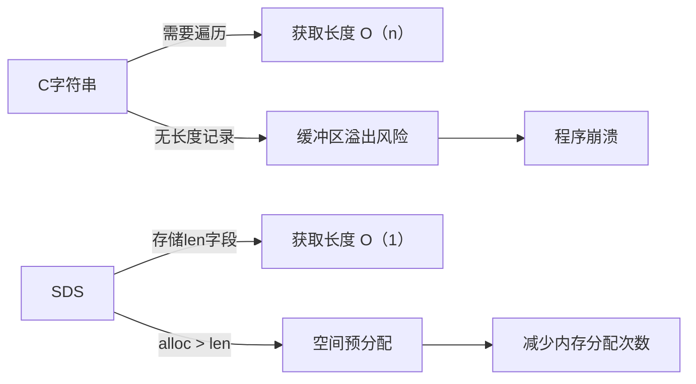

本文详细介绍Redis 字符串类型，包括字符串类型的基础知识、常用命令、内部实现原理。

## 1. 基础知识

参考官方文档：[Redis Strings](https://redis.io/docs/latest/develop/data-types/strings/)

Redis 字符串存储字节序列，包括文本、序列化对象和二进制数组。

> 字符串类型的值可以是各种字符串（包括二进制数据），比如你可以jpeg图片存储在一个字符串类型的值里。

字符串是Redis中最简单的类型，通常用于缓存，也可以用于实现计数器和执行按位操作。


**存储限制与特性：**

- **最大容量**：512 MB
- **二进制安全**：可存储任意二进制数据（区别于 C 字符串的 `\0` 终止）
- **高效操作**：获取字符串长度 `O(1)` 时间复杂度（通过预存长度字段实现）

## 2. 相关命令

Redis 字符串命令列表参考官方文档：[Redis Strings Command](https://redis.io/docs/latest/commands/?group=string)

### 2.1. 命令列表

根据命令功能的不同，可以将字符串相关的命令分成以下几类：

* **获取/设置字符串值**：用于设置/获取指定Key的值。

  * **获取字符串值**
    * `GET`：获取指定键的值。如果键不存在，就返回nil。如果键值不是字符串类型，则会返回错误。
    * `GETDEL`：获取指定键的值，获取成功时同步删除该键。
    * `GETEX`：获取指定键的值，并可以选择设置其过期时间。
    * `GETSET`：原子性地为指定键设置新值，并返回键中存储的旧值（自 Redis 6.2.0 版本起，该命令被视为弃用。）

  * **设置字符串值**
    * `PSETEX`：与SETEX相似，区别在于到期时间以毫秒为单位，而非秒数。（自 Redis 2.6.12 版本起，该命令被视为弃用。）
    * `SET`：为指定的键设置新值。如果键已存在，无论键值类型是什么，都会被覆盖。
    * `SETEX`：为指定的键设置新值，并为其设置指定秒数的过期时间。（自 Redis 2.6.12 版本起，该命令被视为弃用。）
    * `SETNX`：为指定的键设置新值。如果键已存在，则不执行任何操作。（自 Redis 2.6.12 版本起，该命令被视为弃用。）

  * **批量操作**
    * `MGET`：获取指定的多个键的值。
    * `MSET`：为指定的多个键设置新值。
    * `MSETEX`：原子地指定的多个键设置新值，并且可以选择在一个操作中共享过期时间。
    * `MSETNX`：为指定的多个键设置新值，如果任意一个键已存在，则命令不会执行任何操作。

  * **子串操作**
    * `APPEND`：在键值上追加字符串。如果键不存在就自动创建。
    * `SUBSTR`：获取指定键中存储字符串值的子串（通过偏移量指定范围）（自 Redis 2.0.0 版本起，该命令被视为弃用。）
    * `GETRANGE`：获取指定键中存储字符串值的子串（通过偏移量指定范围）。
    * `SETRANGE`：覆盖指定字符串键值的一部分（通过偏移量指定范围）。

  * **其他**
    * `STRLEN`：获取指定字符串键值的长度。
    * `LCS`：实现了最长公共子序列算法。注意，这与最长的通用字符串算法不同，因为字符串中的匹配字符不必是连续的。
    * `DELEX`：基于值或哈希摘要比较，有条件地移除指定键。
    * `DIGEST`：获取指定键中存储值的哈希摘要（十六进制字符串）。键值必须是字符串类型。

* **计数器管理**：将字符串类型用作计数器。

  * `INCR`：将键的整数值加一。如果键不存在，则使用0作为初始值。如果键值不是字符串类型，或者键值包含无法用整数表示的字符串，则会返回错误。
  * `INCRBY`：将键的整数值加一个数字。如果键不存在，则使用0作为初始值。如果键值不是字符串类型，或者键值包含无法用整数表示的字符串，则会返回错误。
  * `INCRBYFLOAT`：将键的浮点型值加一个数字。如果键不存在，则使用0作为初始值。如果键值不是字符串类型，或者键值包含无法用双精度浮点数表示的字符串，则会返回错误。
  * `DECR`：将键的整数值减一。如果键不存在，则使用0作为初始值。
  * `DECRBY`：将键的整数值减一个数字。如果键不存在，则使用0作为初始值。

* **按位运算**：对字符串执行按位操作。

  > 要对字符串进行按位作，请参见[位图数据类型](https://redis.io/docs/latest/develop/data-types/bitmaps/)文档。
  >
  > 本文不去讲解这部分，后续可能会写专门的博客讲解。

### 2.2. 获取/设置字符串值的命令

这一部分命令较多，本文会将这些按照功能分章节讲解。另外，对于上面已经标记弃用的命令，也不会进行详细讲解了。

#### 2.2.1. 设置字符串值

上面提到了四个设置字符串值的命令：`PSETEX`、`SETEX`、`SETNX`、`SET`。

其中前三个都已经被视为弃用，其功能都可以使用`SET`命令参数来实现，因此本文只讲解`SET`命令。


**语法格式：**

```shell
SET key value 
		[NX | XX | IFEQ ifeq-value | IFNE ifne-value | IFDEQ ifdeq-digest | IFDNE ifdne-digest] 				
		[GET] 
		[EX seconds | PX milliseconds | EXAT unix-time-seconds | PXAT unix-time-milliseconds | KEEPTTL]
```

> 这里可能需要解释一下如何理解这个语法格式：
>
> 1. 第一行这种单独写的命令和参数，是必须的。
> 2. 后面`[ ]`中的参数表示是可选的，可选的参数项以`|` 分割。
>    * 同一个`[ ]`中的参数，只能选择0个或1个，不能选择多个。比如不能同时使用NX和XX参数。
>    * 多个`[ ]`中的参数不会互相影响。比如可以同时使用NX和EX参数。

SET命令将指定`key`存储的值设置为`value`。如果`key`已存在，无论其包含何种数据类型，都会被覆盖（过期时间也会被丢弃）。


**可选参数解释：**

* 设置的前提参数
  * NX：只有在指定键不存在时才执行。
  * XX：只有在指定键存在时才执行。
  * IFEQ：只有在当前键值等于指定值时，才设置键值和过期时间。如果键不存在，也不会创建。
  * IFNE：只有在当前键值不等于指定值时，才设置键值和过期时间。如果键不存在，则会创建。
  * IFDEQ：只有在当前键值的哈希摘要等于指定值时，才设置键值和过期时间。如果键不存在，也不会创建。
  * IFDNE：只有在当前键值的哈希摘要不等于指定值时，才设置键值和过期时间。如果键不存在，则会创建。
* GET：返回存储在 key 中的旧字符串，若 key 不存在则返回 nil。如果键存储的值不是字符串，则返回错误并中止 `SET`。
* 过期时间参数：
  * EX：设置指定的到期时间（秒）。
  * PX：设置指定的到期时间（毫秒）。
  * EXAT：设置密钥到期的Unix时间戳（秒）。
  * PXAT：设置密钥到期的Unix时间戳（毫秒）。
  * KEEPTTL：保持键原有的过期时间不变。

**语法历史：**

- 从 Redis 2.6.12 版本开始：增加了 `EX、``PX`、`NX` 和 `XX` 选项。
- 从 Redis 6.0.0 版本开始：添加了 `KEEPTTL` 选项。
- 从 Redis 6.2.0 版本开始：增加了 `GET`、`EXAT` 和 `PXAT` 选项。
- 从 Redis 7.0.0 版本开始：允许 `NX` 和 `GET` 选项一起使用。
- 从 Redis 8.4.0 版本开始：增加了 'IFEQ'、'IFNE'、'IFDEQ'、'IFDNE' 选项。


示例：

```shell
redis> SET mykey "Hello"
"OK"
redis> GET mykey
"Hello"
redis> SET anotherkey "will expire in a minute" EX 60
"OK"
redis> 
```


#### 2.2.2. 获取字符串值

上面提到了四个获取字符串值的命令：`GET`、`GETDEL`、`GETEX`、`GETSET`。

其中`GETSET`已经被视为弃用，本文将不做讲解。

---

**GET 语法格式：**

```shell
GET key
```

GET命令获取指定`key`存储的字符串值。如果`key`不存在，返回nil；如果`key`存储的值不是字符串类型，则会返回错误。

---

**GETDEL 语法格式：**

```shell
GETDEL key
```

与`GET`命令类似，但`GETDEL`会在获取成功时同步删除该键（当且仅当键值类型是字符串时）。

---

**GETEX 语法格式：**

```shell
GETEX key 
	[EX seconds | PX milliseconds | EXAT unix-time-seconds | PXAT unix-time-milliseconds | PERSIST]
```

与`GET`命令类似，但`GETEX`可以选择在获取成功时，为该键设置过期时间。

可选参数如下：

* 过期时间设置
  * EX：设置指定的到期时间（秒）。
  * PX：设置指定的到期时间（毫秒）。
  * EXAT：设置密钥到期的Unix时间戳（秒）。
  * PXAT：设置密钥到期的Unix时间戳（毫秒）。
  * PERSIST：移除密钥的过期时间。

#### 2.2.3. 批量操作

批量操作命令允许一次操作多个键，非常便捷且高效！

---

**MGET 语法格式:**

```shell
MGET key [key ...]
```

`MGET`命令一次获取多个指定`key`所存储的字符串值。

如果指定的`key`列表中，存在key不存在或对应键值不是字符串类型的请求，则对应的应答会是nil，而不会报错。因此该命令不会执行失败。


示例：

```shell
redis> SET key1 "Hello"
"OK"
redis> SET key2 "World"
"OK"
redis> MGET key1 key2 nonexisting
1) "Hello"
2) "World"
3) (nil)
redis>
```


---

**MSET 语法格式:**

```shell
MSET key value [key value ...]
```

`MSET`命令一次性设置多个指定`key`所存储的字符串值，它会使用新值替换旧值，就像普通SET命令一样。

MSET命令是原子的，所以其中指定的键是同时设置的。对客户端来说，不存在部分更新的情况。


示例：

```shell
redis> MSET key1 "Hello" key2 "World"
"OK"
redis> GET key1
"Hello"
redis> GET key2
"World"
```


---

**MSETEX 语法格式:**

```shell
MSETEX numkeys key value 
	[key value ...] 
	[NX | XX] 
	[EX seconds | PX milliseconds | EXAT unix-time-seconds | PXAT unix-time-milliseconds | KEEPTTL]
```

`MSETEX`命令与`MSET`命令类似，但提供了额外的可选参数，用于指定设置操作的前提条件和键的过期时间。

* 必填参数中的`numkeys`表示键值对的个数。

* `MSETEX`命令的可选参数与`SET`命令的可选参数，含义基本相同，这里不再赘述。需要注意的是，`MSETEX`命令的可选参数配置会应用到所有指定的key上。

  > **特别注意：** NX和XX参数是针对所有指定键的，也就是说所有指定的键都不存在（NX） /或者都存在（XX）时才执行。


---

**MSETNX 语法格式:**

```shell
MSETNX key value [key value ...]
```

`MSETNX`命令与`MSET`命令类似，但多了一个执行条件：所有指定的键都不存在时才执行操作。


示例：

```shell
redis> MSETNX key1 "Hello" key2 "there"
(integer) 1
redis> MSETNX key2 "new" key3 "world"
(integer) 0
redis> MGET key1 key2 key3
1) "Hello"
2) "there"
3) (nil)
redis>
```


#### 2.2.4. 子串操作

上面提到了`APPEND`、`SUBSTR`、`GETRANGE`、`SETRANGE`四个子串操作命令。

其中`SUBSTR`已经被视为弃用，因此本文只讲解其他三个命令。

---

**APPEND 语法格式：**

```shell
APPEND key value
```

APPEND命令在指定`key`存储的字符串键值后面追加字符串。如果key不存在，则会自动创建并将其初始值设置为空字符串（这种场景下功能根SET命令一样了）。


示例：

```shell
redis> EXISTS mykey
(integer) 0
redis> APPEND mykey "Hello"
(integer) 5
redis> APPEND mykey " World"
(integer) 11
redis> GET mykey
"Hello World"
redis> 
```


---


**GETRANGE 语法格式：**

```shell
GETRANGE key start end
```

`GETRANGE`命令返回指定key所存储字符串键值的指定范围[start,end]子串。如果偏移量为负数，则表示从字符串末端开始的偏移，比如-1表示最后一个字符串，-2表示倒数第二个字符。

当参数指定的偏移量超出了范围时，会自动将其限制为实际的字符串长度。

示例：

```shell
redis> SET mykey "This is a string"
"OK"
redis> GETRANGE mykey 0 3
"This"
redis> GETRANGE mykey -3 -1
"ing"
redis> GETRANGE mykey 0 -1
"This is a string"
redis> GETRANGE mykey 10 100
"string"
redis> 
```


---

**SETRANGE 语法格式：**

```shell
SETRANGE key offset value
```

`SETRANGE`命令从指定的偏移量开始，使用指定的值来覆盖指定key存储的字符串。

如果偏移量大于当前字符串值的长度，则字符串会填充零字节到足够的长度。

如果key不存在，则会被视为空字符串处理。该命令会确保持有一个足够大的字符串，能够在偏移量处设置值。


基本示例：

```shell
redis>  SET words "hello world"
OK
redis>  SETRANGE words 6 redis
(integer) 11
redis>  GET words
"hello redis"
redis>  SETRANGE words 6 go
(integer) 11
redis>  GET words
"hello godis"
redis>  SETRANGE words 6 lalalalalalala
(integer) 20
redis>  GET words
"hello lalalalalalala"
```


零填充示例：

```shell
redis> get words2 
(nil) # words2 不存在
redis> setrange words2 6 world
(integer) 11
redis> get words2
"\x00\x00\x00\x00\x00\x00world"
```


#### 2.2.5. 其他命令

**STRLEN 语法格式：**

```shell
STRLEN key
```

`STRLEN`命令用于获取指定键对应字符串值的长度（字节为单位）。如果键不存在或键值为空字符串，则返回0。该操作时间复杂度为`O(1)`，因为Redis的SDS（Simple Dynamic String）结构中直接存储了字符串长度。

> - 为什么Redis获取字符串长度是O(1)？因为Redis使用自定义的SDS结构，其中`len`字段记录了当前字符串长度，无需像C字符串那样遍历到\0字符才能确定长度。
> - 这使得`STRLEN`命令非常高效，即使面对大字符串也能快速响应。


示例：

```shell
redis> SET mykey "Hello World"
"OK"
redis> STRLEN mykey
(integer) 11
redis> STRLEN nonexisting
(integer) 0
redis> 
```

---

**LCS 语法格式：**

```shell
LCS key1 key2 [LEN] [IDX] [MINMATCHLEN len] [WITHMATCHLEN]
```

`LCS`（Longest Common Subsequence）命令用于计算两个字符串之间的最长公共子序列。与最长公共子串不同，子序列中的字符不需要连续，只需保持相对顺序。

**可选参数解释：**

- `LEN`：只返回最长公共子序列的长度，而不返回具体的匹配内容。
- `IDX`：返回匹配项在原字符串中的索引位置信息。
- `MINMATCHLEN`：设置匹配片段的最小长度阈值。
- `WITHMATCHLEN`：与`IDX`一起使用时，额外显示每个匹配块的长度。

> - 想象你有两个DNA序列，想找出它们之间最长的共同遗传片段，这些片段在两个序列中出现的顺序相同但不一定连续——这正是LCS要解决的问题。
> - 例如，字符串"ABCDGH"和"AEDFHR"的最长公共子序列为"ADH"，长度为3。

示例：

```shell
redis> SET key1 "ohmytext"
"OK"
redis> SET key2 "mynewtext"
"OK"
redis> LCS key1 key2
"mytext"
redis> LCS key1 key2 LEN
(integer) 6
redis> 
```

---

**DELEX 语法格式：**

```shell
DELEX key [IFEQ ifeq-value | IFNE ifne-value | IFDEQ ifdeq-digest | IFDNE ifdne-digest]
```

`DELEX`（Delete with Existence Check）命令基于条件判断来删除指定键。只有当满足指定条件时，才会执行删除操作。该命令提供了一种安全的删除机制，避免误删数据。

**可选参数解释：**
- `IFEQ`：仅当键的当前值等于指定值时才删除。
- `IFNE`：仅当键的当前值不等于指定值时才删除。
- `IFDEQ`：仅当键的当前值的哈希摘要等于指定摘要时才删除。
- `IFDNE`：仅当键的当前值的哈希摘要不等于指定摘要时才删除。

> - 可以将`DELEX`想象成一个智能保险柜，只有输入正确的密码（条件）才能取出（删除）里面的物品（键值）。
> - 这在分布式系统中特别有用，可以防止多个客户端同时修改同一资源时产生冲突。

示例：

```shell
redis> SET mykey "current_value"
"OK"
redis> DELEX mykey IFEQ "wrong_value"
(nil)
redis> DELEX mykey IFEQ "current_value"
"current_value"
redis> EXISTS mykey
(integer) 0
redis> 
```

---

**DIGEST 语法格式：**

```shell
DIGEST key
```

`DIGEST`命令用于获取指定键中存储值的哈希摘要（SHA1算法生成的40位十六进制字符串）。该命令主要用于快速比较两个键值是否相等，而无需传输完整的值内容。

> - 想象你要验证一份重要文件是否被篡改过，你可以计算它的“指纹”（哈希值），以后每次检查时只需比对指纹即可，无需逐字比对全文。
> - Redis使用SHA1算法生成40位的十六进制字符串作为“指纹”，确保数据完整性校验的高效性。

示例：

```shell
redis> SET mykey "Hello World"
"OK"
redis> DIGEST mykey
"be65a15cd8f9c3ee5757c1c0b2aa493e28eb8d2a"
redis> 
```

### 2.3. 计数器管理

Redis 字符串类型支持将键值用作原子计数器，这些命令在键不存在时会自动初始化为0，非常适合实现页面访问计数、库存管理、限流器等场景。所有计数器操作都是原子的，即使在高并发环境下也能保证准确性。

---

**INCR 语法格式：**

```shell
INCR key
```

`INCR `命令将指定键的整数值加1。如果键不存在，Redis会将其初始值设为0后再执行加1操作。这是最简单的计数器实现方式，适用于每次递增1的场景。


示例：

```shell
redis> SET article:123:views 100
"OK"
redis> INCR article:123:views
(integer) 101
redis> GET article:123:views
"101"
```

---

**INCRBY 语法格式：**

```shell
INCRBY key increment
```

`INCRBY` 命令将指定键的整数值增加给定的增量值（increment）。如果键不存在，Redis会将其初始值设为0后再执行增量操作。这提供了比INCR更灵活的控制，适用于需要不同步长的计数场景。


示例：

```shell
redis> SET article:123:views 100
"OK"
redis> INCRBY article:123:views 5
(integer) 105
redis> GET article:123:views
"105"
```

---

**INCRBYFLOAT 语法格式：**

```shell
INCRBYFLOAT key increment
```

`INCRBYFLOAT` 命令将指定键的浮点数值增加给定的增量值（可以是整数或浮点数）。如果键不存在，Redis会将其初始值设为0后再执行增量操作。这是处理需要小数精度的计数场景的唯一选择。


示例：

```shell
redis> SET temperature 25.0
"OK"
redis> INCRBYFLOAT temperature 0.5
"25.5"
redis> INCRBYFLOAT temperature -1.2
"24.3"
```

---

**DECR 语法格式：**

```shell
DECR key
```

`DECR` 命令将指定键的整数值减1。如果键不存在，Redis会将其初始值设为0后再执行减1操作。这是最简单的递减计数器实现方式，适用于库存减少、倒计时等需要递减计数的场景。


示例：

```shell
redis> SET stock 100
"OK"
redis> DECR stock
(integer) 99
redis> GET stock
"99"
```

---

**DECRBY 语法格式：**

```shell
DECRBY key decrement
```

`DECRBY` 命令将指定键的整数值减少给定的减量值（decrement）。如果键不存在，Redis会将其初始值设为0后再执行减量操作。这提供了比DECR更灵活的控制，适用于需要不同步长的递减场景。


示例：

```shell
redis> SET stock 100
"OK"
redis> DECRBY stock 5
(integer) 95
redis> GET stock
"95"
```

### 2.4. 按位运算（略）

要对字符串进行按位作，请参见[位图数据类型](https://redis.io/docs/latest/develop/data-types/bitmaps/)文档。

本文不去讲解这部分，后续可能会写专门的博客讲解。

## 3. 内部实现原理

建议参考这篇文章：[一个简单的字符串，为什么 Redis 要设计的如此特别 ](https://www.cnblogs.com/lonely-wolf/p/14261486.html)

### 3.1 SDS 结构解析

Redis 使用 **Simple Dynamic String (SDS)** 替代 C 原生字符串，核心结构：

```c
struct __attribute__ ((__packed__)) sdshdr8 {
    uint8_t len;     // 当前长度
    uint8_t alloc;   // 分配的内存总量
    uint8_t flags;   // 类型标识（8/16/32/64位）
    char buf[];      // 柔性数组存储实际数据
};

```

### 3.2 与 C 字符串的对比

| 特性 | C 字符串 | Redis SDS |
|------|----------|-----------|
| 获取长度 | `O(n)` 遍历 | `O(1)` 直接读取 `len` |
| 缓冲区溢出 | 可能发生 | 通过 `alloc` 预分配内存避免 |
| 二进制安全 | 不支持 `0` | 完全支持任意二进制数据 |
| 内存分配 | 每次修改都可能 realloc | 空间预分配策略减少 realloc 次数 |



### 3.3 内存管理机制

- **空间预分配**：当字符串增长时，额外分配 1x~2x 空间
- **惰性释放**：缩短字符串时不立即释放内存，供后续扩展使用
- **类型分级**：根据字符串长度使用不同结构体（sdshdr5/8/16/32/64）
