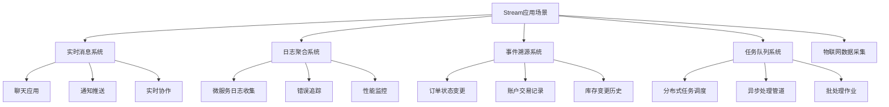

## 1. 类型概述

Redis Stream（流）是一种仅追加的日志型数据结构，专门设计用于处理事件流、消息队列和日志数据。它以时间序列的方式记录事件，每个事件都有一个唯一的标识符，并且支持消费者组（Consumer Groups）来管理多个消费者对同一数据流的读取。

> 💡 **初学者小贴士**
> 
> 可以将Redis Stream想象成一条不断延伸的流水线，生产者不断地在流水线上放置包裹（事件），而消费者则从流水线上取走包裹进行处理。每个包裹都有一个唯一的编号（ID），并且会按照放置的顺序被处理。消费者组就像是多个工人组成的一个团队，他们共同负责处理这条流水线上的所有包裹，确保每个包裹只被处理一次。

### 1.1. 核心特性

* **结构：** 一系列条目，每个条目包含字段-值对
* **操作：** add, read, trim
* **适用场景：** 日志数据、时间序列以及其他仅追加结构
* **底层实现：** 使用Radix Tree（基数树）和Listpacks（压缩列表包）的组合

> Redis Streams的设计受到了Apache Kafka等消息系统的启发，但完全内置于Redis中，提供了类似的功能但更轻量级。Streams是Redis 5.0版本引入的重要新功能，填补了Redis在消息队列领域的空白。

## 2. 命令详解

参考官方文档：[Redis Commands of Stream](https://redis.io/docs/latest/commands/?group=stream)

### 2.1. 命令列表

* 基本操作
  * `XADD`：向流中添加新条目
  * `XTRIM`：修剪流，限制其长度
  * `XDEL`：从流中删除指定ID的条目
  * `XLEN`：获取流的长度
  * `DEL`：删除整个流
* 范围操作
  * `XRANGE`：获取流中指定ID范围内的条目
  * `XREVRANGE`：按逆序获取流中指定ID范围内的条目
  * `XREAD`：从一个或多个流中读取数据
* 消费者组操作
  * `XGROUP CREATE`：创建消费者组
  * `XREADGROUP`：从消费者组中读取数据
  * `XACK`：确认已处理的条目
  * `XPENDING`：查看待处理的条目
  * `XCLAIM`：重新声明待处理的条目
* 其他命令
  * `XINFO`：获取流的相关信息

### 2.2. 基本操作

基本操作命令用于对流进行基础的增删改查操作。

#### 2.2.1. XADD

命令语法：

```shell
XADD key [NOMKSTREAM] [MAXLEN|MINID [= | ~] threshold [LIMIT count]] [* | id] field value [field value ...]
```

向流中添加新条目。

- 返回值：新条目的唯一ID
- 参数说明：
  - `key`：流的键名
  - `*` 或 `id`：自动生成ID或指定ID
  - `MAXLEN` / `MINID`：限制流的大小
  - `NOMKSTREAM`：如果流不存在，不创建新的流

> XADD就像是在日记本上记笔记：每次写下新的内容时，系统会自动给你分配一个页码和行号（ID），确保每条记录都是唯一的。星号(*)表示让Redis自动生成ID，就像让系统自动翻到下一页一样。

示例：

```shell
> XADD mystream * sensor-id 1234 temperature 19.8
"1640995200000-0"
> XADD mystream * sensor-id 1235 temperature 20.1
"1640995200001-0"
```

#### 2.2.2. XTRIM

命令语法：

```shell
XTRIM key MAXLEN [= | ~] threshold [LIMIT count]
```

修剪流，限制其长度。

- 返回值：被修剪的条目数量

示例：

```shell
> XADD mystream * field1 A field2 B field3 C field4 D
"1609040575750-0"
> XTRIM mystream MAXLEN 2
(integer) 0
> XRANGE mystream - +
1) 1) "1609040575750-0"
   2) 1) "field1"
      2) "A"
      3) "field2"
      4) "B"
      5) "field3"
      6) "C"
```

命令语法：

```shell
XTRIM key MINID [= | ~] threshold [LIMIT count]
```

根据最小ID修剪流。

示例：

```shell
> XTRIM mystream MINID 1640995200000-0
(integer) 1
```

> 这些修剪命令通常与XADD的MAXLEN/MINID参数结合使用，以实现自动化的流大小管理。

#### 2.2.3. XDEL

命令语法：

```shell
XDEL key id [id ...]
```

从流中删除指定ID的条目。

- 返回值：成功删除的条目数量
- 注意：这并不会释放内存，只是标记为删除

示例：

```shell
> XADD mystream * sensor-id 1234 temperature 19.8
"1640995200000-0"
> XDEL mystream 1640995200000-0
(integer) 1
> XRANGE mystream - +
(empty array)
```

#### 2.2.4. XLEN

命令语法：

```shell
XLEN key
```

获取流的长度。

- 返回值：流中未被修剪的条目数量

示例：

```shell
> XADD mystream * sensor-id 1234 temperature 19.8
"1640995200000-0"
> XADD mystream * sensor-id 1235 temperature 20.1
"1640995200001-0"
> XLEN mystream
(integer) 2
```

#### 2.2.5. DEL

命令语法：

```shell
DEL key
```

删除整个流。

- 返回值：被删除的键的数量

示例：

```shell
> XADD mystream * sensor-id 1234 temperature 19.8
"1640995200000-0"
> DEL mystream
(integer) 1
> XLEN mystream
(nil)
```

### 2.3. 范围操作

范围操作命令用于获取流中指定范围的条目。

#### 2.3.1. XRANGE

命令语法：

```shell
XRANGE key start end [COUNT count]
```

获取流中指定ID范围内的条目。

- 返回值：指定范围内的条目列表
- ID格式：timestamp-sequence
- 特殊ID：`-`表示最小ID，`+`表示最大ID

> XRANGE就像是查看监控录像：你可以选择从哪个时间点（ID）开始看，看到哪个时间点结束。

示例：

```shell
> XADD mystream * sensor-id 1234 temperature 19.8
"1640995200000-0"
> XADD mystream * sensor-id 1235 temperature 20.1
"1640995200001-0"
> XRANGE mystream - + COUNT 10
1) 1) "1640995200000-0"
   2) 1) "sensor-id"
      2) "1234"
      3) "temperature"
      4) "19.8"
2) 1) "1640995200001-0"
   2) 1) "sensor-id"
      2) "1235"
      3) "temperature"
      4) "20.1"
```

#### 2.3.2. XREVRANGE

命令语法：

```shell
XREVRANGE key end start [COUNT count]
```

按逆序获取流中指定ID范围内的条目。

示例：

```shell
> XADD mystream * sensor-id 1234 temperature 19.8
"1640995200000-0"
> XADD mystream * sensor-id 1235 temperature 20.1
"1640995200001-0"
> XREVRANGE mystream + - COUNT 10
1) 1) "1640995200001-0"
   2) 1) "sensor-id"
      2) "1235"
      3) "temperature"
      4) "20.1"
2) 1) "1640995200000-0"
   2) 1) "sensor-id"
      2) "1234"
      3) "temperature"
      4) "19.8"
```

#### 2.3.3. XREAD

命令语法：

```shell
XREAD [COUNT count] [BLOCK milliseconds] STREAMS key [key ...] id [id ...]
```

从一个或多个流中读取数据。

- 支持阻塞模式，当没有新数据时等待

> XREAD BLOCK则像是实时监控，当你没有画面时，它会一直等待直到有新的画面出现。

示例：

```shell
## 在一个终端执行
> XREAD COUNT 2 STREAMS mystream $
## 从最后读取的位置开始读取最多2个新条目

## 在另一个终端执行
> XADD mystream * sensor-id 1234 temperature 19.8
"1640995200000-0"
> XADD mystream * sensor-id 1235 temperature 20.1
"1640995200001-0"

## 第一个终端将返回
1) "mystream"
2) 1) "1640995200000-0"
   2) 1) "sensor-id"
      2) "1234"
      3) "temperature"
      4) "19.8"
3) 1) "1640995200001-0"
   2) 1) "sensor-id"
      2) "1235"
      3) "temperature"
      4) "20.1"
```

### 2.4. 消费者组操作

消费者组操作命令用于管理多个消费者对同一数据流的读取。

#### 2.4.1. XGROUP CREATE

命令语法：

```shell
XGROUP CREATE key groupname id-or-$ [MKSTREAM] [ENTRIESREAD entries_read]
```

创建消费者组。

- 返回值：OK
- 参数说明：
  - `id-or-$`：指定消费者组从哪个ID开始读取，$表示从最新条目之后开始
  - `MKSTREAM`：如果流不存在，则创建

示例：

```shell
> XADD mystream * sensor-id 1234 temperature 19.8
"1640995200000-0"
> XGROUP CREATE mystream mygroup $
OK
```

#### 2.4.2. XREADGROUP

命令语法：

```shell
XREADGROUP GROUP group consumer [COUNT count] [BLOCK milliseconds] [NOACK] STREAMS key [key ...] id [id ...]
```

从消费者组中读取数据。

- 返回值：分配给该消费者的新条目
- 参数说明：
  - `NOACK`：读取后不立即确认，需要手动XPENDING和XACK

示例：

```shell
## 在一个终端执行
> XREADGROUP GROUP mygroup worker1 COUNT 1 BLOCK 0 STREAMS mystream >

## 在另一个终端执行
> XADD mystream * sensor-id 1234 temperature 19.8
"1640995200000-0"

## 第一个终端将返回
1) "mystream"
2) 1) 1) "1640995200000-0"
      2) 1) "sensor-id"
         2) "1234"
         3) "temperature"
         4) "19.8"
```

#### 2.4.3. XACK

命令语法：

```shell
XACK key group id [id ...]
```

确认已处理的条目。

- 返回值：成功确认的条目数量

示例：

```shell
> XADD mystream * sensor-id 1234 temperature 19.8
"1640995200000-0"
> XGROUP CREATE mystream mygroup $
OK
> XREADGROUP GROUP mygroup worker1 COUNT 1 STREAMS mystream >
1) "mystream"
2) 1) 1) "1640995200000-0"
   2) 1) "sensor-id"
      2) "1234"
      3) "temperature"
      4) "19.8"
> XACK mystream mygroup 1640995200000-0
(integer) 1
```

#### 2.4.4. XPENDING

命令语法：

```shell
XPENDING key group [[IDLE min-idle-time] start end count [consumer]]
```

查看待处理的条目。

- 返回值：待处理条目的详细信息

示例：

```shell
> XADD mystream * sensor-id 1234 temperature 19.8
"1640995200000-0"
> XGROUP CREATE mystream mygroup $
OK
> XREADGROUP GROUP mygroup worker1 COUNT 1 STREAMS mystream >
1) "mystream"
2) 1) 1) "1640995200000-0"
   2) 1) "sensor-id"
      2) "1234"
      3) "temperature"
      4) "19.8"
> XPENDING mystream mygroup - + 10
1) 1) "1640995200000-0"
   2) "worker1"
   3) (integer) 1234
   4) (integer) 1
```

#### 2.4.5. XCLAIM

命令语法：

```shell
XCLAIM key group consumer min-idle-time id [id ...] [IDLE ms] [TIME unix-time-ms] [RETRYCOUNT count] [FORCE] [JUSTID]
```

重新声明待处理的条目。

- 用于处理消费者故障的情况

示例：

```shell
> XADD mystream * sensor-id 1234 temperature 19.8
"1640995200000-0"
> XGROUP CREATE mystream mygroup $
OK
> XREADGROUP GROUP mygroup worker1 COUNT 1 STREAMS mystream >
1) "mystream"
2) 1) 1) "1640995200000-0"
   2) 1) "sensor-id"
      2) "1234"
      3) "temperature"
      4) "19.8"
> XCLAIM mystream mygroup worker2 3600000 1640995200000-0
1) 1) "1640995200000-0"
   2) 1) "sensor-id"
      2) "1234"
      3) "temperature"
      4) "19.8"
```

### 2.5. 其他命令

#### 2.5.1. XINFO

命令语法：

```shell
XINFO [CONSUMERS key groupname] | [GROUPS key] | [STREAM key] | [HELP]
```

获取流的相关信息。

- `XINFO STREAM key`：查看流的基本信息
- `XINFO GROUPS key`：查看流中的所有消费者组
- `XINFO CONSUMERS key groupname`：查看消费者组中的所有消费者

示例：

```shell
> XADD mystream * sensor-id 1234 temperature 19.8
"1640995200000-0"
> XGROUP CREATE mystream mygroup $
OK
> XINFO STREAM mystream
 1) "length"
 2) (integer) 1
 3) "radix-tree-keys"
 4) (integer) 1
 5) "radix-tree-nodes"
 6) (integer) 2
 7) "last-generated-id"
 8) "1640995200000-0"
 9) "groups"
10) (integer) 1
> XINFO GROUPS mystream
1)  1) "name"
    2) "mygroup"
    3) "consumers"
    4) (integer) 1
    5) "pending"
    6) (integer) 0
    7) "last-delivered-id"
    8) "0-0"
> XINFO CONSUMERS mystream mygroup
1)  1) "name"
    2) "worker1"
    3) "pending"
    4) (integer) 0
    5) "idle"
    6) (integer) 12345
```

## 3. Stream的典型应用场景

### 3.1. 实时消息系统

Stream非常适合构建实时消息系统，如聊天应用、通知系统等。

```shell
## 发送消息
XADD chat:room:1 * sender "alice" message "Hello everyone!"
XADD chat:room:1 * sender "bob" message "Hi Alice!"

## 客户端获取历史消息
XRANGE chat:room:1 - + COUNT 50

## 客户端监听新消息
XREAD BLOCK 0 STREAMS chat:room:1 $
```

### 3.2. 日志聚合系统

可以使用Stream收集来自不同服务的日志。

```shell
## 微服务发送日志
XADD service:auth:logs * level "error" message "Login failed" user_id "123"
XADD service:payment:logs * level "info" message "Payment processed" amount 99.99

## 日志分析服务消费日志
XREADGROUP GROUP log_analyzer worker1 STREAMS service:*:logs >
```

### 3.3. 事件溯源系统

Stream是实现事件溯源（Event Sourcing）的理想选择。

```shell
## 订单状态变更事件
XADD order:123:events * type "created" product "iPhone" price 999.99
XADD order:123:events * type "paid" payment_method "credit_card"
XADD order:123:events * type "shipped" tracking_number "ABC123"

## 通过重放事件重建订单状态
XRANGE order:123:events - +
```

> 💡 **初学者小贴士**
> 
> 事件溯源就像是记录一个人的成长日记：不是直接说"这个人现在25岁，是一名软件工程师"，而是记录"这个人出生于..."、"这个人毕业于..."、"这个人入职于..."等一系列事件。通过重放这些事件，你就能重建出当前的状态。

## 4. Stream的性能特点

* **时间复杂度：**
  * 添加条目（XADD）：O(1)
  * 获取范围内的条目（XRANGE/XREVRANGE）：O(log(N)+M)，M为结果集大小
  * 修剪流（XTRIM）：O(M)，M为被修剪的条目数量

* **内存效率：**
  * 使用Listpacks存储数据，对于小条目非常节省内存
  * 基数树提供高效的范围查询能力

* **持久性：**
  * Stream的内容可以被RDB和AOF持久化
  * 确保数据不会因重启而丢失

> 💡 **初学者小贴士**
> 
> Stream的性能就像是在一个有序的档案馆中工作：添加新文件（XADD）非常快，因为只需要放在最后；查找某个时间段内的文件（XRANGE）也很快，因为档案是有组织的；但是整理档案（XTRIM）需要花一些时间清理旧文件。

## 5. Stream使用注意事项

1. **仅追加特性：** Stream是仅追加的数据结构，不能修改已有的条目。如果需要更新数据，应该发送新的事件。

2. **ID生成：** 推荐使用`*`让Redis自动生成ID，这样能保证全局唯一性和单调递增。

3. **消费者组设计：** 合理设计消费者组的数量和消费者数量，避免过度分片导致管理复杂。

4. **内存管理：** 虽然Stream会自动修剪旧数据，但仍需监控内存使用情况，特别是在高吞吐量场景下。

5. **错误处理：** 消费者在处理失败时，应正确处理待确认的条目，避免消息丢失。



## 6. 实战示例：实现一个简单的订单处理系统

```shell
## 1. 创建订单事件流
XADD order:1001:events * type "created" customer "Alice" items 3 total 299.99

## 2. 支付服务监听并处理支付事件
## 支付服务启动时创建消费者组
XGROUP CREATE order:1001:events payment_group $ MKSTREAM

## 支付服务监听新事件
XREADGROUP GROUP payment_group payment_worker STREAMS order:1001:events > BLOCK 0
## 当收到支付事件时...
HSET order:1001 status "paid" paid_at "$(date +%s)"
XADD order:1001:events * type "paid" method "credit_card" transaction_id "txn_123"
XACK order:1001:events payment_group <entry_id>

## 3. 发货服务监听并处理发货事件
## 发货服务创建自己的消费者组
XGROUP CREATE order:1001:events shipping_group $ MKSTREAM

## 发货服务监听新事件
XREADGROUP GROUP shipping_group shipping_worker STREAMS order:1001:events > BLOCK 0
## 当收到发货事件时...
HSET order:1001 status "shipped" shipped_at "$(date +%s)"
XADD order:1001:events * type "shipped" carrier "UPS" tracking "1Z999AA123456789"
XACK order:1001:events shipping_group <entry_id>

## 4. 查询订单完整历史
XRANGE order:1001:events - +
## 返回完整的事件序列
```

这个例子展示了如何使用Stream实现一个基于事件驱动的订单处理系统：每个服务（支付、发货）都作为独立的消费者组监听订单事件流，当收到相关事件时执行业务逻辑并发布新的事件。这种方式实现了服务间的解耦，提高了系统的可扩展性和可靠性。