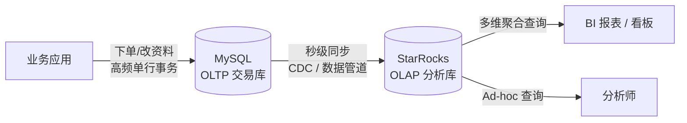
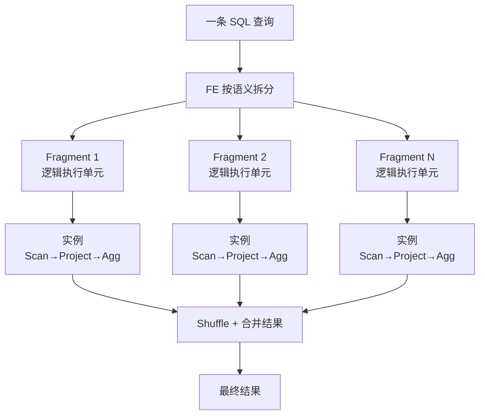
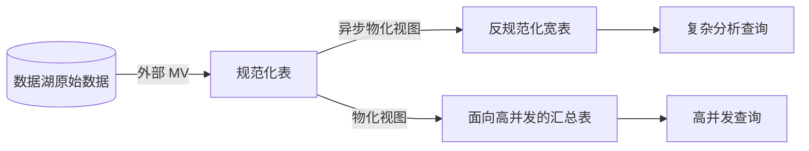
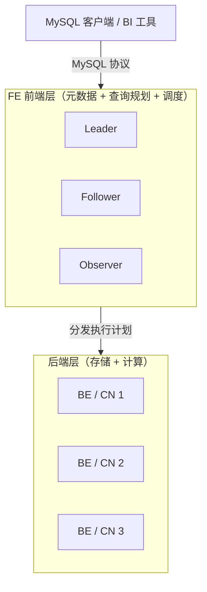
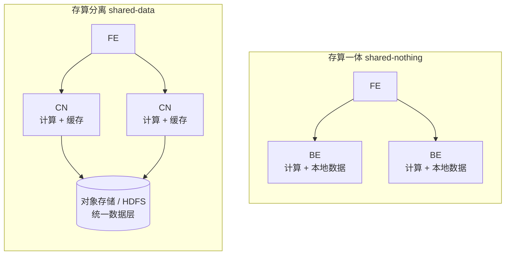
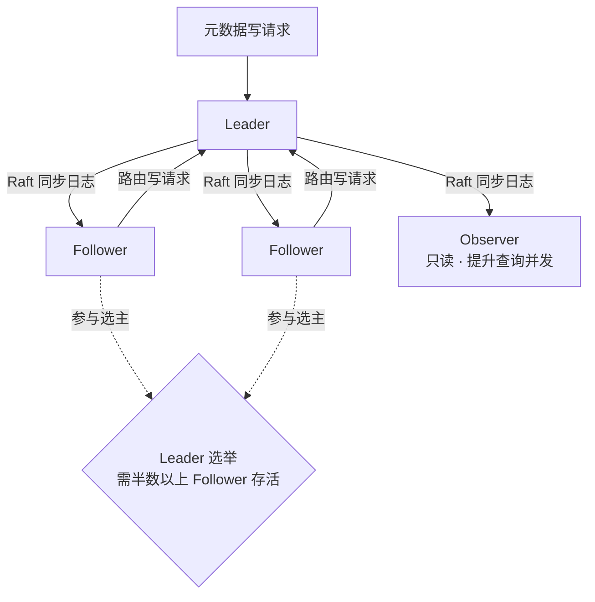
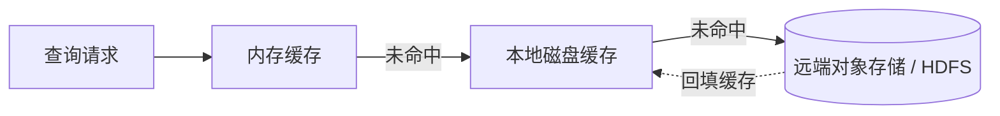
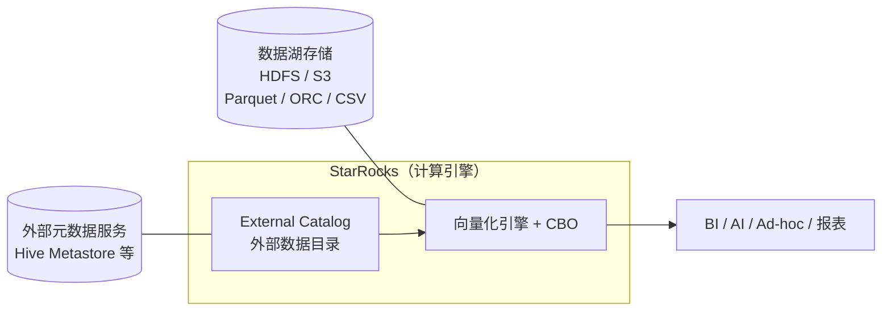

当数据量来到千万、上亿行，你有没有遇到过这样的场景：一条看似简单的「按天、按品类统计销售额」的 SQL，在 MySQL 上要跑几十秒甚至几分钟？这并不是 MySQL 不够好，而是它从设计之初就不是为这类分析查询准备的。StarRocks 正是为了解决这个问题而生——一个新一代、极速的 MPP（大规模并行处理）分析型数据库，能在海量数据规模下支撑亚秒级查询。这篇文章带你从「它是什么、为什么快、长什么样、能干什么」四个角度，建立对 StarRocks 的第一印象。

> 本文内容以 StarRocks 官方文档为基础整理，并结合实际理解做了类比与图解。官方原文见：
>
> - [What is StarRocks?](https://docs.starrocks.io/docs/introduction/)
> - [Architecture](https://docs.starrocks.io/docs/introduction/Architecture/)
> - [Database Features](https://docs.starrocks.io/docs/introduction/Features/)
>
> 版本敏感的内容（具体语法、参数、各特性起始版本）请以你实际部署版本的官方文档为准。

## 1. StarRocks 是什么

### 1.1. 一句话定义

官方对 StarRocks 的定义是：一个新一代、极速的 **MPP（Massively Parallel Processing，大规模并行处理）数据库**，目标是让企业轻松实现**实时分析**，并在大规模数据下提供**亚秒级查询**。

拆开这句话里的关键词，就是理解 StarRocks 的钥匙：

| 关键词 | 含义 | 一句话解释 |
|---|---|---|
| MPP | 大规模并行处理 | 数据被切片打散到多台机器，一个查询由多台机器、多个 CPU 核心并行计算 |
| 极速 / 亚秒级 | sub-second query | 大数据量下聚合查询也能在秒级甚至亚秒级返回 |
| 实时分析 | real-time analytics | 数据可高速写入，并支持实时更新与删除 |

它还有几个重要特性，官方反复强调：

- **兼容 MySQL 协议和标准 SQL**：可以直接用 MySQL 客户端连接，开箱即用地支持 Tableau、Power BI 等主流 BI 工具。
- **不依赖任何外部组件**：是一个自包含的一体化分析平台，部署和运维都更简单，支持高扩展、高可用。
- **实时更新靠主键表（Primary Key table）实现**：事务型（TP）数据库里的数据变更，可以在秒级同步进 StarRocks，构建实时数仓。

### 1.2. 用一个熟悉的参照物理解：和 MySQL 的分工

如果你写过 MySQL，可以用它当锚点。平时对 MySQL 做的事大致分两类：

- **交易操作（OLTP，联机事务处理）**：下单插一行、改资料更新一行、按主键查我的订单。特点是**每次只碰少数几行**，要求快、要事务、要强一致。MySQL 为此而生。
- **分析操作（OLAP，联机分析处理）**：统计「过去 30 天每个品类每天的 GMV」，要**扫描上千万行**，只为算出几百个聚合数字。

当数据量变大，MySQL 跑第二类查询会越来越慢。而 StarRocks 正是为第二类场景而生。在真实的企业架构里，两者往往是这样协作的：



> 关键认知：StarRocks 和 MySQL 不是替代关系，而是**分工**。TP 库扛在线交易，数据再同步到 StarRocks 做分析。协议兼容 ≠ 可以把它当 OLTP 数据库用。

## 2. StarRocks 为什么快

StarRocks 的「快」不是一句空话，而是来自几个具体的工程设计：列式存储、向量化执行、MPP 并行、CBO 优化器、物化视图。下面逐一拆解。

### 2.1. 列式存储（Columnar Storage）

传统 OLTP 数据库（如 MySQL）按**行**存储，一行所有字段挨在一起。而 StarRocks 按**列**存储，同一个字段的所有值连续存放。

```text
行存（MySQL）：按行连续存放，读一行要读它的所有字段
┌───────────────────────────────────────────────┐
│ id=1 │ user=1001 │ amount=59.9 │ category=3 │…│
├───────────────────────────────────────────────┤
│ id=2 │ user=1002 │ amount=20.0 │ category=5 │…│
└───────────────────────────────────────────────┘

列存（StarRocks）：按列连续存放，算 SUM(amount) 只读 amount 这一列
 id       : [1,      2,      3,    …]
 user     : [1001,   1002,   1003, …]
 amount   : [59.9,   20.0,   88.5, …]   ← 只扫这一列
 category : [3,      5,      3,    …]
```

列式存储带来三个直接好处：

- **只读需要的列**：OLAP 查询通常只用到少数几列，列存让你只扫描这些列，大幅减少磁盘 I/O。
- **压缩率更高**：同一列数据类型相同、取值相近，编码和压缩效率远高于行存，降低存储成本。
- **ACID 导入**：存储引擎保证每一次数据导入事务的原子性、一致性、隔离性和持久性——整个导入事务要么全成功要么全失败，并发事务互不影响。

### 2.2. 全向量化执行引擎（Fully Vectorized Engine）

传统数据库一次处理一行（火山模型），而 StarRocks 一次处理**一批数据**（成千上万行打包成一个「向量」）。

- 数据的**存储、内存组织、SQL 算子计算**全部以列式方式进行，充分利用 CPU 缓存。
- 充分利用 CPU 的 **SIMD 指令**：用更少的指令完成更多的数据操作。
- 官方给出的数据：在标准数据集上，向量化让算子整体性能提升 **3～10 倍**。
- 还有「在编码数据上直接计算（Operation on Encoded Data）」等优化，无需解码即可执行算子，查询速度再提升 2 倍以上。

> 一个形象的类比：传统逐行处理像「一粒一粒搬米」，向量化则是「一铲子一铲子铲」——同样的 CPU，干更多的活。

### 2.3. MPP 框架（大规模并行处理）

这是 StarRocks 分布式计算的核心。一个查询请求会被拆成多个可以在多台机器上并行执行的物理计算单元，每台机器用自己独立的 CPU 和内存资源计算自己那一片数据，最后合并结果。

官方描述的拆分链路，可以用下图表示：



- **物理执行单元（fragment instance）是 StarRocks 最小的调度单位**，被调度到各个 BE 上执行。
- 一个逻辑执行单元里可以包含多个算子，比如 Scan（扫描）、Project（投影）、Agg（聚合）。
- 和很多系统用的 **Scatter-Gather 框架**不同：Scatter-Gather 只有 Gather 节点能做最终合并，而 MPP 把数据 shuffle 到多个节点并行合并。对于高基数字段的 Group By、大表 Join 这类复杂查询，MPP 有明显性能优势。
- 随着集群横向扩展，单个查询的性能可以持续提升。

> 类比：一个人数 100 万张票，和 100 个人每人数 1 万张再汇总的区别——后者就是 MPP 的思路。这也是 StarRocks「加机器就能变快」的根源。

### 2.4. 代价优化器 CBO（Cost-Based Optimizer）

多表 Join 查询的性能极难优化：关联的表越多，可能的执行计划越多，选出最优计划是一个 NP-hard 问题。只有足够优秀的优化器才能选出相对最优的执行计划。

- StarRocks 从零设计了一个全新的 CBO，采用类似 **Cascades** 的框架，并深度适配向量化引擎。
- 包含大量优化：CTE 复用、子查询改写、Lateral Join、**Join Reorder（连接重排序）**、分布式 Join 执行策略选择、低基数优化等。
- CBO 完整支持 99 条 TPC-DS SQL 语句。
- 效果：让 StarRocks 在复杂多表 Join 查询上明显快于同类竞品。

> 直观理解：CBO 管「同一条 SQL 怎么执行最快」。你写的 SQL 不变，优化器在背后根据数据的统计信息（每列有多少不同值、数据如何分布）自动挑选最省代价的执行方案。

### 2.5. 智能物化视图（Intelligent Materialized View）

物化视图就是把常用的、昂贵的聚合结果**预先算好存起来**，查询时直接读结果，避免每次重新扫描明细。StarRocks 的物化视图「智能」在两点：

- **自动刷新**：和其他产品需要手动同步基表数据不同，StarRocks 的物化视图会根据基表的数据变化**自动更新**，无需额外维护。
- **自动改写（透明加速）**：如果优化器识别出某个物化视图能加速当前查询，它会**自动改写查询**去利用这个物化视图——你的 SQL 完全不用改。

物化视图还能替代传统的 ETL 建模流程。下图展示了如何用物化视图在 StarRocks 内部完成数据分层：



> 一句话区分 StarRocks 的两大性能利器：**CBO 管「怎么查最快」，物化视图管「提前算好、少查一点」。**

## 3. StarRocks 的架构

官方强调：StarRocks 架构**非常简单**，整个系统只有两类组件——**前端（Frontend，FE）**和**后端（Backend）**。后端又分两种：**BE** 和 **CN（Compute Node）**。它不依赖任何外部组件，节点可以在不停服的情况下横向扩展，并且元数据和业务数据都有副本机制，提升可靠性、避免单点故障（SPOF）。

整体架构可以用下图概括：



### 3.1. 两种架构选择：存算一体 vs 存算分离

StarRocks 支持两种架构，你可以根据需求决定数据存在哪里：

| 架构 | 英文 | 数据存储位置 | 后端节点 | 特点 |
|---|---|---|---|---|
| 存算一体 | shared-nothing | 每个 BE 的本地存储各存一部分数据 | FE + BE | 本地存储，查询延迟低，适合追求极致查询性能 |
| 存算分离 | shared-data | 全部数据在对象存储或 HDFS，CN 本地只有缓存 | FE + CN | 存储便宜、弹性强，计算秒级增删，资源隔离好 |

两种架构的直观对比：



> 存算分离架构从 StarRocks 3.0 开始引入。它把计算和存储解耦，各自独立扩展，特别适合流量有明显波峰波谷、需要弹性伸缩的场景。

### 3.2. FE（Frontend，前端节点）

FE 负责**元数据管理、客户端连接管理、查询计划（Query Planning）和查询调度（Query Scheduling）**。

- 每个 FE 都用 **BDB JE（Berkeley DB Java Edition）** 在内存中维护一份完整的元数据副本，保证所有 FE 对外服务一致。
- FE 有三种角色，通过 **Raft 协议**保证一致性和高可用：

| FE 角色 | 元数据能力 | 是否参与选主 |
|---|---|---|
| Leader | 唯一能**读写**元数据的节点；写请求都路由到它，它更新后用 Raft 同步给其他 FE | 本质上也是 Follower，由 Follower 选举产生 |
| Follower | 只能**读**元数据；重放 Leader 的日志来更新元数据 | 参与选主，选主需要半数以上 Follower 存活 |
| Observer | 只能**读**元数据；重放 Leader 日志 | **不参与**选主，主要用来提升查询并发，不给选主增加压力 |

三种角色的读写与选主关系如下：



> 一个重要细节：数据写入只有在元数据变更同步到**半数以上 Follower** 之后，才算成功。Leader 挂掉时，Follower 会基于 Raft 重新选主。Observer 不参与选主，所以可以放心地增加 Observer 来扛更多并发查询。

### 3.3. BE（Backend，后端节点）—— 存算一体架构

BE 负责**数据存储**和 **SQL 执行**。

- **数据存储**：各个 BE 存储能力对等，FE 按预定规则把数据分发到 BE；BE 对导入的数据做转换、写成所需格式、生成索引。
- **SQL 执行**：FE 把 SQL 解析成逻辑执行计划，再转成能在 BE 上执行的物理执行计划，由**存有目标数据的那个 BE**直接执行。数据就在本地，无需传输和拷贝，因此查询性能很高。

### 3.4. CN（Compute Node，计算节点）—— 存算分离架构

在存算分离架构里，BE 被 **CN** 取代，存储功能卸载到对象存储或 HDFS。

- CN 是**无状态**的计算节点，执行 BE 的全部功能，**唯独不负责数据存储**。
- CN 可以在**秒级**按需增减，且因为存储和计算分离，增减 CN 不需要重新平衡数据。

### 3.5. 存算分离架构里的存储与缓存

- **存储**：支持对象存储（AWS S3、Google GCS、Azure Blob Storage、MinIO 等 S3 兼容存储）和 HDFS。数据文件格式和存算一体一致，组织成 segment 文件，专用于存算分离的表叫**云原生表（cloud-native table）**。
- **缓存**：存算分离会影响查询性能，StarRocks 用**内存 → 本地磁盘 → 远端存储**的多级数据访问体系来缓解：



  - 热数据直接扫缓存、再扫本地磁盘；冷数据从对象存储加载到本地缓存以加速后续查询。
  - 建表时可以开启缓存。开启后数据会同时写本地磁盘和后端对象存储；查询时 CN 先读本地磁盘，没命中再从对象存储取并顺便缓存到本地。

> 对初学者而言，用本地单机（存算一体）起步就足够了。存算分离、CN、对象存储是进阶内容，等理解了基本模型再接触。各特性在两种架构下的起始支持版本不同，使用时务必查阅与你部署版本一致的官方文档。

## 4. StarRocks 能用来做什么（应用场景）

官方把 StarRocks 的能力归纳成四大类场景。理解这四类，就能判断「我手头这个需求该不该用 StarRocks」。

### 4.1. OLAP 多维分析

- **靠什么**：MPP 框架 + 向量化引擎，支持平面表（flat）、星型（star）、雪花（snowflake）等多种 schema。
- **典型用途**：用户行为分析、用户画像与标签分析、高维指标报表、自助看板、业务异常探查、跨主题分析、财务数据分析、系统监控分析。
- 一句话：经典的「多个维度切来切去看数」的分析报表场景。

### 4.2. 实时分析

- **靠什么**：主键表（Primary Key table）+ 秒级数据同步。
- **典型用途**：大促实时分析、物流追踪、金融行业指标计算、直播质量分析、广告投放分析、驾驶舱管理、应用性能管理（APM）。
- 一句话：数据刚产生就要能查到的场景。

### 4.3. 高并发分析

- **靠什么**：高性能数据分布 + 灵活索引 + 智能物化视图。
- **典型用途**：广告主报表分析、零售渠道分析、SaaS 面向用户的分析、多标签页看板。
- 一句话：**很多用户同时查**（面向 C 端或大量 B 端用户），而不是少数几个分析师内部用。

### 4.4. 统一分析

- **靠什么**：一套系统覆盖多种场景 + 湖仓一体。
- 两层含义：
  - **降低总拥有成本（TCO）**：一个系统干多种分析活，减少系统复杂度和维护成本。
  - **湖仓统一**：延迟敏感、高并发的查询跑在 StarRocks 内表；数据湖里的数据通过**外部 Catalog / 外部表**直接访问，无需迁移数据。

### 4.5. 数据湖分析

作为上面「统一分析」的延伸，StarRocks 还能作为计算引擎，直接分析数据湖中的数据，而无需把数据搬进来：



- 支持 Apache Hive、Apache Iceberg、Apache Hudi、Delta Lake 等。
- 核心能力是**外部 Catalog（External Catalog）**：它充当到外部元数据服务（metastore）的连接，让你无需迁移数据就能查询外部数据源。
- 分工：StarRocks 负责计算和分析，数据湖负责数据的存储、组织和维护；StarRocks 用向量化引擎和 CBO 显著提升数据湖分析性能。

> 判断口诀：**要多维切片 → 场景 1；要数据新鲜 → 场景 2；要扛高并发 → 场景 3；要一套系统管湖和仓 → 场景 4 / 5。**

## 5. 开源与社区

- **开源协议**：Apache 2.0，代码托管在 [StarRocks GitHub 仓库](https://github.com/StarRocks/starrocks)。
- **社区**：官方提供 Slack 频道（提问与交流）、StarRocks.io 博客（社区动态）、LinkedIn（新特性与活动更新）。

## 6. 结语

StarRocks 的设计哲学可以用一句话概括：**用简单的架构，解决复杂的实时分析问题**。它只有 FE 和后端两类组件，却通过列式存储、向量化执行、MPP 并行、CBO 优化器和智能物化视图这一套组合拳，把大规模数据下的分析查询做到了亚秒级；它兼容 MySQL 协议、不依赖外部组件，让上手和运维都足够平滑；它既能管好自己的内表，又能通过外部 Catalog 把数据湖纳入统一分析。

理解了这些第一印象，再回到最初那个问题——「一条 `SELECT ... GROUP BY ...` 从客户端发出到返回结果，中间经过了哪些组件、做了哪些优化？」——你已经能说出答案的轮廓：FE 负责解析与规划，把查询拆成并行的 fragment，调度到各个 BE/CN 上，用列存只读必要的列、用向量化批量计算、用 CBO 选出最优路径，最后 shuffle 合并出结果。至于每一步的细节，就是后续文章要展开的旅程了。
